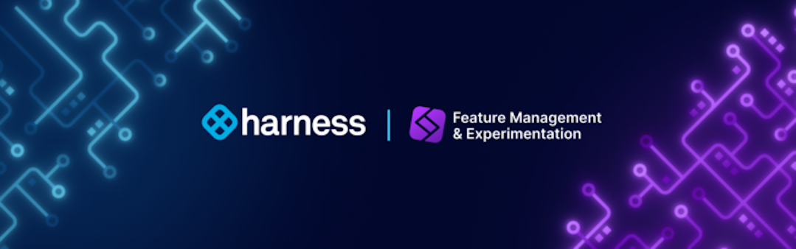

  <button hidden style={{borderRadius:'8px', border:'1px', fontFamily:'Courier New', fontWeight:'800', textAlign:'left'}}> help.split.io link: https://help.split.io/hc/en-us/articles/360016583411-Videos-Product-overview   ✘ images still hosted on help.split.io </button>

Harness Feature Management & Experimentation (FME) combines capabilities for feature delivery and control with built-in tools for measurement and learning. FME connects insightful data to every feature release, eliminates hesitation from the software development process, and supports modern practices like continuous delivery and progressive delivery.

### Architected for performance, security, and resilience

Harness FME is built on a global feature flag and data processing architecture that serves 50 billion daily feature flags to over 2 billion end users around the globe.

* **Performance:** FME streaming architecture pushes changes to its SDKs in milliseconds.
* **Security:** The SDKs evaluate feature flags locally, so customer data is never sent over the internet.
* **Resilience:** Our SaaS app, data platform, and API span multiple data centers. Plus, our SDKs cache locally to handle any network interruptions.

Our stateless architecture scales to millions of users with no degradation in performance. FME SDKs reside in your frontend, backend, and mobile apps where they make feature flags and targeting decisions locally, without the need to send private user data outside your app for evaluation.

## FME features

### Feature flags
Feature flags turn on and off features to specific users or segments. You can tailor access to beta testers and early adopters based on individual IDs, attributes, dependencies, or percentages. Gradually target users little by little to limit the blast radius of your releases.

### Release monitoring
Release monitoring detects the impact of each feature on system performance and user behavior, starting with the earliest stage of a gradual rollout. With detection and triage done at the flag level, you can ship more often and with greater confidence.

### Experimentation
Experimentation centralizes notifications for metric impacts, review periods, and change requests, empowering your team with actionable data to make rapid, precise, data-driven decisions.

## Harness platform

If you're new to Harness, review the [Harness platform onboarding guide](/docs/platform/get-started/onboarding-guide) and [Harness platform key concepts](/docs/platform/get-started/key-concepts).

## Get started with FME

Some resources to get started with FME:

* [What's supported?](./../whats-supported.md)
* [Onboarding guide](./onboarding-guide.md)
* [Key concepts](./key-concepts/)