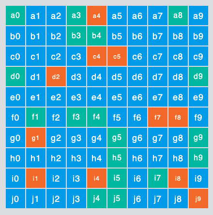
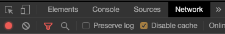

## Overview

The Split Boxes demo is a tool to help users understand the interaction between rules and the impact of various features. It’s a simple visualization that allows you to see the impact of individually targeting, custom attribution, limit exposure, and dynamic configuration.

## Using the Boxes Demo

Each box represents a user ID.



* You can individually target using the cell location, such as b8 or j5.
* You can also create a segment that includes any of the available values.
* You can create targeting rules using the attributes **row**, **col**, or **account**;
  
  * _row_ and _col_ use letters and numbers respectively, usually with "is in list" as the matcher.
  * Valid account names include: Nike, Apple, LinkedIn, Best Buy, Google, Microsoft, Pinterest, Dell, Slack, Zoom, Samsung, and Disney.

* You can modify the configuration of the treatments by updating any of the values. The `font_size` expects standard HTML sizes such as medium, large, x-large, etc.

## Setting up the Boxes Demo

There are three files attached:

* The HTML contains the SDK and can be run locally or on a server.
* You need to provide the browser API key for the Split environment where you will update the rollout plan.
* You also need to provide the feature flag name. These are entered as variables in the HTML:

   ```html
   <script>
   var splitAPIKey = "";
   var splitName = "";
   </script>
   ```

   * The Boxes_split.txt file contains an example baseline definition of the feature flag.
   * The feature flag can be created automatically using the `CreateBoxSplit.sh` script, which uses the Split Admin REST API and the `jq` tool. Run the script with this command line to create the feature flag and add definitions:
   
   ```css
   CreateBoxSplit [Project Name] [Environment Name] [Traffic Type] [Split Name] [Admin API_KEY]
   ```

   Example:

   ```sql
   CreateBoxSplit Default Production user front_end_choose_boxes 9enxxxxxxxxxxxxxxxxxxxxxx
   ```

In Chrome, to see feature flag changes immediately, disable cache in the Network tab of the Developer Tools.



## Downloads

| File                                                      | Size      | Notes                             |
| --------------------------------------------------------- | --------- | --------------------------------- |
| [CreateBoxSplit.sh.zip](.././static/create-box-split.sh.zip) | 1 KB      |                                   |
| [Boxes\_split.txt](.././static/boxes-split.txt)              | 658 Bytes | *Right-click > Save Link As...* |
| [Boxes.htm](.././static/boxes.htm)                           | 8 KB      | *Right-click > Save Link As...* |


