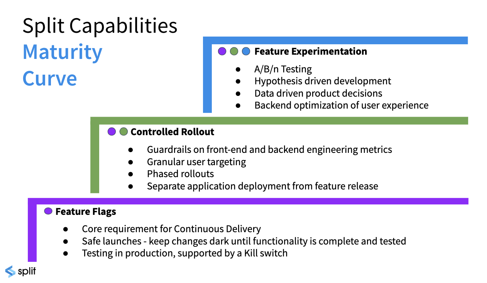
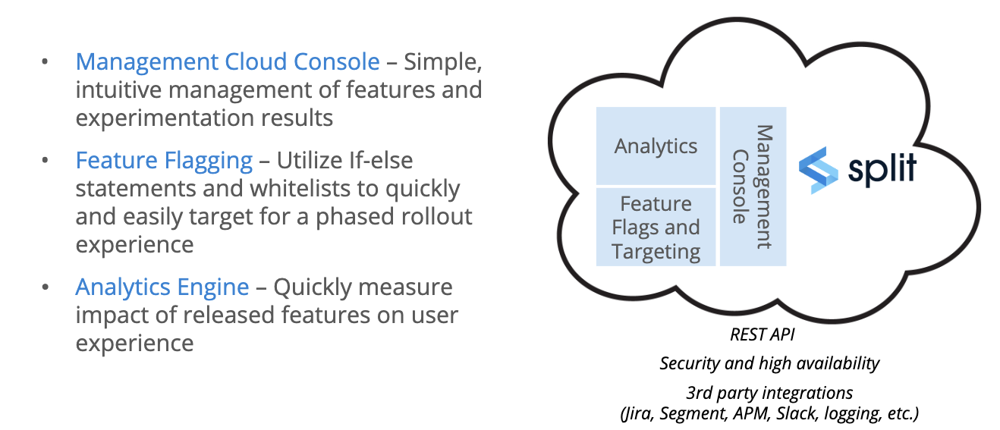
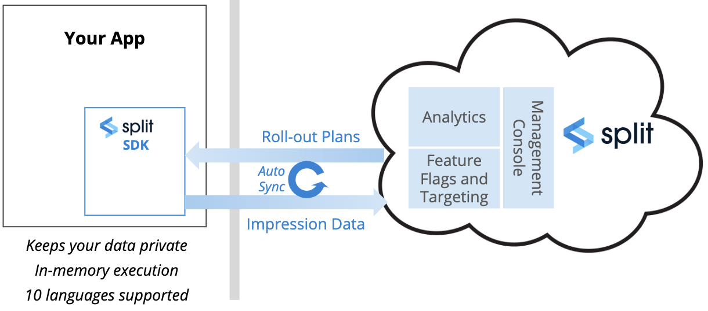
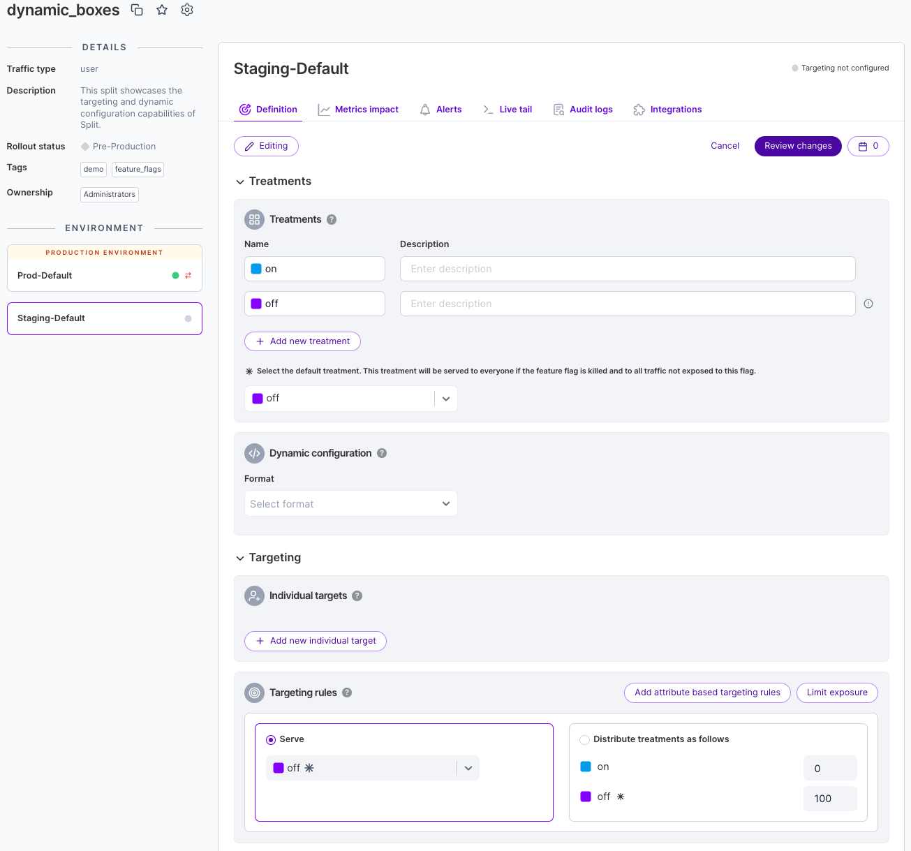
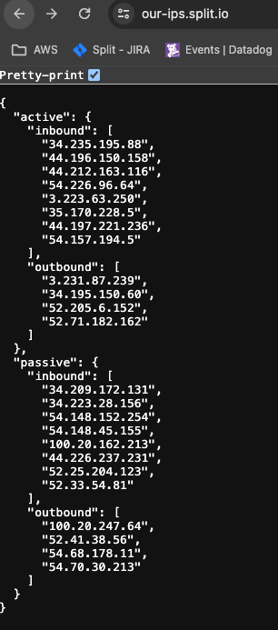

Harness Feature Management & Experimentation (FME) combines capabilities for feature delivery and control with built-in tools for measurement and learning. FME connects insightful data to every feature release and supports modern practices like continuous delivery and progressive delivery.

### Architected for performance, security, and resilience

Harness FME is built on a global feature flag and data processing architecture that serves 50 billion daily feature flags to over 2 billion end users around the globe.

* **Performance:** FME streaming architecture pushes changes to its SDKs in milliseconds.
* **Security:** The SDKs evaluate feature flags locally, so customer data is never sent over the internet.
* **Resilience:** Our SaaS app, data platform, and API span multiple data centers. Plus, our SDKs cache locally to handle any network interruptions.

Our stateless architecture scales to millions of users with no degradation in performance. FME SDKs reside in your frontend, backend, and mobile apps where they make feature flags and targeting decisions locally, without the need to send private user data outside your app for evaluation.

## Maturity curve

Let’s start with a bit of context. FME is a product decisions platform for engineering and product teams to rapidly and safely deliver valuable software to customers. FME provides a unified feature flags and experimentation solution that is built for teams of any size to make data-driven decisions.

Feature flags form the basis of the platform, driving the risk out of continuous delivery and streamlining the development process. Flags allow you to assess application stability before customers are exposed to a feature, and a framework for Agile teams to release faster with less risk, including a kill switch to shut down a feature within seconds.  

Functional and performance issues are mission critical concerns for any application.  Key engineering metrics such as API response and page load time can be impacted by each feature. Split correlates relevant engineering KPIs back to the feature changes that are impacting them. While granular user targeting supports robust phased rollout plans.

So, you can release faster, but what does it matter if you are not releasing value? Experimentation provides development teams with a direct link to the customer for unprecedented feedback. Split’s real-time analytics engine measures the impact of feature changes on business outcomes.  

As we move up the maturity curve, teams can quickly iterate and refine functionality to deliver innovation faster and increase time to value. 

## Architecture and data flow 

Before we dive into the product, let’s spend a moment looking at the architecture and data flow. The management console is where the user interacts with the Split platform.  There’s also an API that allows you to automate many of the actions a user might take. 

Behind the UI are the feature flagging functionality and analytics engine, which combine to capture and evaluate user impressions, and correlate those to business value.

In addition, the platform is built with security and high availability in mind, along with third-party integrations to better leverage Split within your environment.

Let’s look at the data flow in a little more detail. Split provides implementation options to meet your requirements. By far, the most common is to install the Split SDK in your application, whether using JavaScript, IOS or Android on the front end or any of the most common back end platforms. 

When feature flags are created, the rollout plans are sent to the SDK, where they are cached, and automatically kept up to date as changes are made.

Because Split is a self-contained decisioning engine installed in your application, any data you use to target, even if personal data, is kept private and never sent to Split, or anywhere outside of your environment.

In addition, because evaluations are executed in memory, Split is lightning fast, eliminating the potential negative impact on the performance of your application.

When the evaluation is made whether or not to expose a feature to the user, the impressions are returned to Split along with the information necessary to track who’s seen what.

We can also correlate impression data with any events you track that occur in your application to, perhaps, understand how a feature impacts page load time, or if it’s having the desired business impact.

## Feature flag objects

Before taking a quick tour of the application let’s review a few key terms. The environment dashboard, which is central dashboard for navigating within the application, is where we’ll start when we look at the platform.

There are 3 primary objects in the platform: a **feature flag** is the main object, encompassing the definition of the feature flag, the rollout plan and where ongoing changes are managed.

The second object is called a **segment**, which is a list of IDs used for targeting. For example, you might put a set of users into a beta list and then you can easily target all the beta users by just using that segment. You can expand that list with additional segments, essentially testing in production. Entitlements are another common use of segments.

Finally, **metrics** represent how you combine impressions from feature flags with events from your application, allowing you to measure the efficacy and impact of features. 

Environments usually reflect your software development lifecycle, such as dev, QA, staging, and production. We can filter feature flags in a variety of ways, such as traffic received, active vs. killed and last updated. We can filter by traffic type, which we’ll cover in the video on creating a feature flag, and tags, such as backend or university.

Let’s take a look at the UI for feature flags. We can narrow the left nav bar, which gives us the option to pin the list of feature flags. As you can see, it's an intuitive, forms-based interface. 

We can choose this feature flag, which is rolling out a new feature for doing course registrations. At the moment, there are two treatments, either you get the new feature, or you don’t, in this case based on a random 50/50 flag targeting setup of all users. Otherwise, the feature is dark.

Segments allow us to create groups of users or accounts. For example, as we just saw, a list of beta schools. I might also create a list for entitlements, such as an early access group, or QA teams for pre-production testing.

Metrics allow you to take events, such as a user completing an action, in this case approving a grade, or a page load time, or a registration, and associating those events with an impression: was the user exposed to the feature. 

The goal is to determine if we are getting the desired outcome for specific features. Did registrations increase, or page load times decrease?

## Comparing FME metrics with other tools

Most companies have a variety of tools to count and track user visits and interactions on their web and mobile applications. While it can be helpful to compare the numbers between, say, Split and Google Analytics, it is not unusual or unexpected that the numbers are different. 

There can be a number of reasons for this:

import Tabs from '@theme/Tabs';
import TabItem from '@theme/TabItem';

<Tabs queryString="tab-number">
<TabItem value="1" label="Sampling and configuration settings">

* **Sampling**: Tools such as Google Analytics sample data in common configurations, sending a representative subset of the data instead of the entire data set. This obviously results in a potentially dramatic difference in what you see when comparing numbers. Google Analytics will warn you if you the data is being sampled. You can configure the precision/speed ratio or reduce the timeframe over which data is sampled to avoid it all together.

* **Filtering**: Many tools allow you to set filtering criteria to include or exclude specific traffic, perhaps blocking internal traffic, spam, bots, excluding time ranges or IP addresses, etc. Make sure to use the same filtering logic across all tools, or at least account for the differences.

* **Time Zones and Time Windows**: Some analytics tools use the the user's location while others may default to UTC or some other time zone. This affects the day boundary for reports. Also, the start time of an experiment may not coincide neatly with the output from another tool. Make sure you are looking at the same window of time when comparing data.

</TabItem>
<TabItem value="2" label="Attribution and exclusion">

Because different attribution logic is used by various tools, it's not uncommon for values of a similar metric to vary by 10-15%. It's important to understand how things like omni-channel conversions are handled. For example, a user may get an impression/treatment on one device, perhaps an ad on a phone, and then convert (or perform some other tracked action) from a browser.

When experimenting, Split will [exclude users](/docs/feature-management-experimentation/experimentation/experiment-results/viewing-experiment-results/metric-details-and-trends/#sample-population) from results under certain circumstances. For example, a user that switches targeting rules more than once within the same version of an experiment. This is not a usual circumstance and the number of users excluded for these reasons may be small, but there are cases where the design of a test could cause many users to be excluded because of changing targeting rules more than once.

For more information about Split's attribution logic and how it's handled when users change treatments and/or rules within a version, see [Attribution and exclusion](/docs/feature-management-experimentation/release-monitoring/attribution-and-exclusion/).

</TabItem>
<TabItem value="3" label="Browsers and mobile devices">

Implementation on the browser or mobile device can impact the collection of data. This is exacerbated by the relative lack of control over user interaction. Abruptly closing a browser window or a mobile app can impede data from being captured.

Also, content blockers are becoming more common as users seek to avoid ads and more attention is placed on privacy concerns. These blockers can impact a wide range of client-side trackers, not just ads. Depending on what's blocked, they could cause the results computed by various analytic tools to differ.

### Server-side feature flags

One way to mitigate the issues posed by the lack of control on the client side, and create greater consistency in the user experience, is to move feature flags to a back end service for evaluation. For more information, see [Moving feature flags to a service](/docs/feature-management-experimentation/sdks-and-infrastructure#using-a-service-for-feature-flags).

Moving feature flags to the back-end may exacerbate the difference in counts if content blockers come into play since client-side content blocking doesn't impact server-side flags. 

When using the JavaScript or mobile SDKs, configuration options (like in the [JavaScript SDK](/docs/feature-management-experimentation/sdks-and-infrastructure/client-side-sdks/javascript-sdk/#configuration)) can be tuned to ensure you'll capture the greatest possible number of impressions and/or events. In particular, the `RefreshRate` can have a significant impact when lowered.

### Why are my impression counts different or missing?

If you notice that the number of visitors, impressions, or events in Split differs from other tools, or some impressions are missing, here are some common causes and how to address them:

* [Block traffic until the SDK is ready](/docs/feature-management-experimentation/sdks-and-infrastructure#block-traffic-until-the-sdk-is-ready): Ensure your application waits for the Split SDK to initialize before sending traffic, to avoid losing impression data.
* [Impressions not showing in Split](/docs/feature-management-experimentation/sdks-and-infrastructure/troubleshooting#impressions-not-showing-in-harness-fme): Check your implementation for any issues that may prevent impressions from being recorded correctly.
* [JavaScript SDK on slow networks](/docs/feature-management-experimentation/sdks-and-infrastructure/client-side-sdks/javascript-sdk#why-does-the-javascript-sdk-return-not-ready-status-on-slow-networks): On slow network connections, the SDK may not send impressions in a timely manner. Consider strategies to mitigate network latency.
* [Always getting control treatments](/docs/feature-management-experimentation/sdks-and-infrastructure/troubleshooting#always-getting-control-treatments-from-gettreatment): Receiving only control treatments can indicate targeting or configuration problems affecting impression counts.

</TabItem>
</Tabs>

Split has robust data pipelines and attribution logic. If you do find a mismatch in numbers that is greater than the expected variance between tools, we're happy to work with you to troubleshoot the discrepancy. Contact [Harness Support](/docs/feature-management-experimentation/fme-support) or send an email to help@split.io.

## FME features

### Feature management

Manage feature flag scheduling, flag sets, and flag lifecycles. Feature flags turn on features to specific users or segments. You can tailor access to beta testers and early adopters based on individual IDs, attributes, dependencies, or percentages. Gradually increase the rollout percentage to limit the blast radius of your releases.

In [this book](https://www.harness.io/resources/feature-flags-best-practices), Split CTO Pato Echague and Pete Hodgson explain how to implement feature-flagged software successfully, and offer some tips to developers on how to configure and manage a growing set of feature flags within your product, maintain them over time, manage infrastructure migrations, and more.

### Release monitoring

Release monitoring detects the impact of each feature on system performance and user behavior, starting with the earliest stage of a gradual rollout. With detection and triage done at the flag level, you can ship more often and with greater confidence.

### Experimentation

Experimentation provides customizable, centralized, and self-serve A/B testing, empowering your team with actionable data to make rapid, trusted, data-driven decisions.

## Harness platform

If you're new to Harness, review the [Harness platform onboarding guide](/docs/platform/get-started/onboarding-guide) and [Harness platform key concepts](/docs/platform/get-started/key-concepts).

## Get started with Harness FME

### Create an account or join an account

We assume you’ve created an account already, but if not, [sign up](https://www.split.io/signup/). If your team has an account, an admin can invite you from the users page in admin settings.

### Understand accounts and projects

When you sign up you are sent a link to create an account. We utilize your company name as the account name. This can be changed later in your account's admin settings.

Within this account, you can create multiple projects. Your company should have one account in Split but can have multiple projects within that account. When you first create your account, you'll have one project named Default. This project has two environments and one traffic type underneath it. You can rename and edit these environments and traffic types as well as add more.

Projects allow you to separately manage your feature flags and experiments across your different business units, product lines, and/or applications. Each project in Split has its own separate set of environments, SDK API keys, feature flags, segments, metrics, and event types.

For more information about projects, see [Projects](/docs/feature-management-experimentation/management-and-administration/account-settings/projects/).

### Understand environments, traffic types, and API keys

Environments allow you to manage your feature flags throughout your development lifecycle — from local development to staging and production. When you first create your account, your project is provided with two environments. These two environments are named staging and production, and can be re-named. For more information about environments, see [Environments](/docs/feature-management-experimentation/management-and-administration/fme-settings/environments).

Each environment is automatically set up with its own API keys. Use these API keys to connect the Split SDK to a specific environment. If you are setting Split up with a server side SDK, be sure to use the server API key type. If you are setting Split up in the browser or on a mobile client, be sure to use the browser API key type. If you are interested in using Split’s public API, create an admin API key type. For more information about API keys, see [API keys](/docs/feature-management-experimentation/management-and-administration/account-settings/api-keys).

Use traffic types to easily identify the customer traffic you are splitting. A traffic type is a particular identifier type for any hierarchy of your customer base. Traffic types in Split are customizable and can be any key you choose to send to Split, i.e. a user ID, team ID, IP address, browser ID, etc. Essentially, any internal database key you're using to track what "customer" means to you. When you first create your account, your project has one traffic type - user - but you can easily create additional like guest or anonymous. For more information about traffic types, see [Traffic types](/docs/feature-management-experimentation/management-and-administration/fme-settings/traffic-types).

### Testing with feature flags

Feature flags can be integrated into a variety of testing strategies across the software development lifecycle. In quality assurance and engineering workflows, they support unit, smoke, regression, sanity, and end-to-end testing, along with lifecycle testing, usability testing (moderated, unmoderated, think-aloud, remote), A/B testing, benchmark testing, and accessibility checks. 

* **[Smoke testing](https://www.harness.io/blog/differences-between-smoke-testing-and-sanity-testing)**: A quick validation that critical functionality works before deeper testing begins.
* **[Regression testing](https://www.harness.io/blog/comparing-smoke-tests-to-regression-tests)**: Ensures recent changes haven’t broken existing functionality.
* **[Sanity testing](https://www.harness.io/blog/differences-between-smoke-testing-and-sanity-testing)**: A fast check that recent fixes or updates didn’t disrupt core features.

Teams can also use localhost mode to validate flag behavior in isolation or as part of CI pipelines, and apply flags in both shift-left and shift-right practices. 

For guidance on incorporating feature flags into these workflows, see [Creating Unit Tests for Code Using FME SDKs](/docs/feature-management-experimentation/api/unit-tests) and [Using Test Automation in QA](/docs/feature-management-experimentation/api/test-automation).

## Setup 

This section walks you through setting up your Split instance, installing the Split SDK, and creating your first feature flag to release rapidly and safely with feature flags and measure impact with experimentation. 

To start using Harness FME:

1. [Install the SDK and set up your account](/docs/feature-management-experimentation/getting-started/overview/install-the-sdk)

   * Learn how to install FME SDKs to control feature flags in your application.
   * Learn how to manage and maintain your Harness FME account and users.

1. [Create a feature flag and target users](/docs/feature-management-experimentation/getting-started/overview/create-a-feature-flag)

   * Feature flagging & configuration: Understand how to target your customers using Harness FME's feature flags.

1. [Send event data](/docs/feature-management-experimentation/getting-started/overview/send-event-data)

   * Send event data to track usage and behavior in Harness FME.

1. [Create a metric, monitor, and measure impact](/docs/feature-management-experimentation/getting-started/overview/create-a-metric)

   * Monitoring & experiment: Measure impact and make data-driven decisions with experimentation.

### Allow Harness FME traffic through your network

If you use a proxy or firewall and need to allow communication between your internal systems and Split’s cloud platform, add the following URLs and IPs to your allowlist:

* [SDK traffic](https://sdk.split.io): [Fastly IPs](https://api.fastly.com/public-ip-list) are used for SDK traffic.
* [REST API](https://api.split.io/)
* [Impressions, events, and SDK metrics](https://events.split.io)
* WebSocket streaming: https://auth.split.io and https://streaming.split.io
* [CDN](https://cdn.split.io)
* [Telemetry](https://telemetry.split.io)

If you have on-premise systems that need to integrate with Split—such as a webhook service—you may need IP addresses for outbound Split service connections. You can find those at https://our-ips.split.io/.

:::info
You’ll see entries marked “Active” (primary region) and “Passive” (secondary region), and traffic types labeled “Inbound” or “Outbound.” 

This list may change in the event of a failover, so we recommend subscribing to Split's [Status Page](https://status.split.io/) for updates.
:::

#### Email invites

Split uses a third-party provider, SendGrid, to send user invitations. If your spam blocker prevents these from being delivered, allow the following IP address: `168.245.9.60`.

## Further Reading

Additional documentation, blog blog links, and articles:

- [Testing Redesigned Data Pipelines with Split](https://www.harness.io/blog/testing-pipelines-split)
- [Understanding Different Types of Usability Testing](https://www.harness.io/blog/types-of-usability-testing)
- [Differences Between Smoke Testing and Sanity Testing](https://www.harness.io/blog/differences-between-smoke-testing-and-sanity-testing#feature-flags-and-their-role-in-testing)