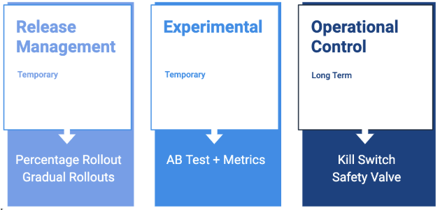
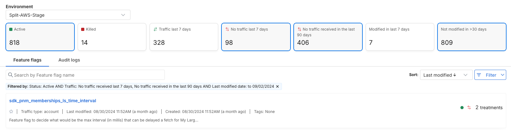

## Overview

As you scale utilization, it becomes increasingly important to have a strategy for how to best  clean up feature flags.  This should be a consideration from the very first feature flag you create.

When creating new feature flags, there are a variety of reasons for placing a change or new feature behind a feature flag. 

## Feature flag types

The three main types of flags to consider are the following:

* **Release Management** feature flags:

  - Example: "I want to expose a feature flag to a subset of my traffic that meet a certain criterion (location, age, plan type)" 
  - Example: "I want to safely do a progressive or gradual rollout for a potentially high impact feature, expose to 10% at first then gradually increase".
* **Experimental** feature flags: 
  - Example: "I want to learn if the new version of an existing feature, or an entirely new feature, has a positive or negative impact on my business metrics".
* **Operational Control** feature flags:
  - Example: "If this feature were to have an issue, it could potentially impact revenue or conversions, I want the ability to quickly revert back to the previous steady-state".

## Retire a feature flag

Now that you have feature flags in production, what are the indicators you might establish for when to retire a flag?

* Feature flags that have not been modified within the past 30 days are eligible for retirement. 
* Feature flags that have received no traffic in the last 7 days are eligible for retirement. 
* Metrics show that you the feature flag has proven the feature should be rolled out to everyone or removed from code = eligible for retirement. 

To surface the feature flags that fall into the first two criteria, within the **Environments** tab in your Split dashboard, you have the option to filter by; 

* Active feature flags
* Killed feature flags
* Feature flags that have received traffic in the last 7 days 
* Feature flags that have received no traffic in the last 7 days 
* Feature flags that have seen no traffic at all 
* Feature flags that have been modified in the last 7 days 
* Feature flags that have not been modified in the last 30 days

:::tip For Consistency 
Before removing a feature flag from code, ensure that everyone in the population is receiving the same intended treatment, essentially rolled out to 100%.
:::

## Integrate cleanup tasks into your project process

* As part of the project within the existing Jira ticket (or the feature tracking tool of your choice), you can create a subtask for retiring the feature flag with a specific due date or time period.
* There could also be a subtask within the ticket that states a mandatory feature flag review/kill date.
* Schedule a recurring cadence for the team to review and retire eligible feature flags.
* Adopt a process to add a retire tag on the feature flag once the rollout or experiment is complete.