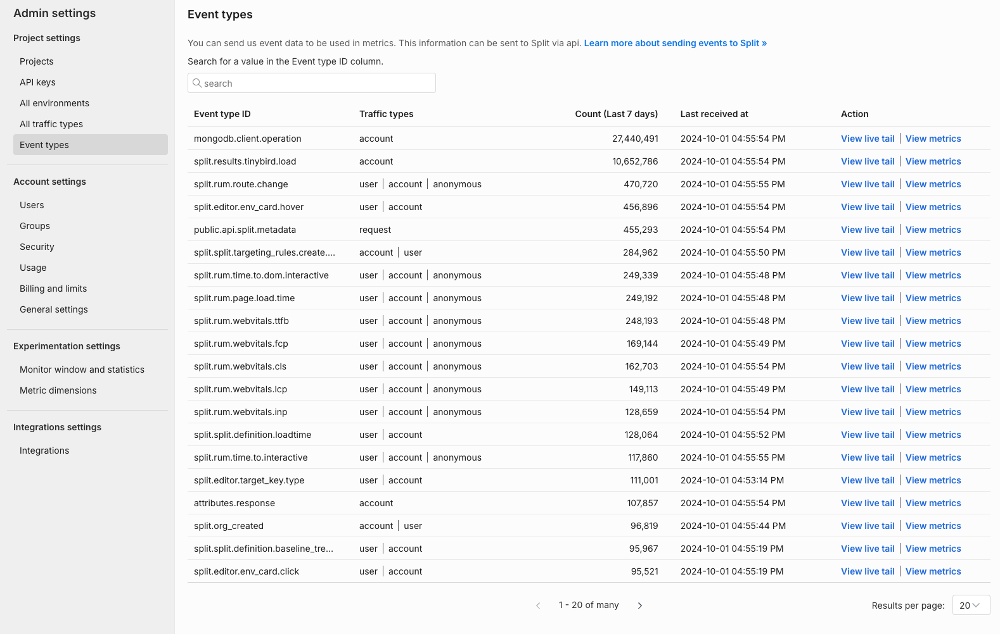

## Overview

Measure the impact of your feature rollout on your customer experience by sending Split event data and calculating metrics based on those events. Events allow you to record any actions your users perform and experiences your users encounter, such as response times or errors.

Event data can be sent to Split in one of four ways:

* Install Split's [RUM Agent](/docs/feature-management-experimentation/sdks-and-infrastructure/client-side-agents/android-rum-agent) or [Split Suite](/docs/feature-management-experimentation/sdks-and-infrastructure/client-side-suites/android-suite) which will auto-collect performance event data when installed in a client-side application
* Call Split's SDK `track` method (example below) to explicitly add instrumentation code to your application to record events
* Post a JSON body to Split's [Events API](https://docs.split.io/reference/introduction#events-overview) to ingest events data from existing sources
* Split integrations with [Segment](/docs/feature-management-experimentation/integrations/segment), [mParticle](/docs/feature-management-experimentation/integrations/mparticle), [Sentry](/docs/feature-management-experimentation/integrations/sentry), [Amazon S3](/docs/feature-management-experimentation/integrations/amazon-s3), or [Google Analytics](/docs/feature-management-experimentation/integrations/google-analytics) to ingest events data from existing sources

Below is an example of calling the track method of the SDK in JavaScript. See links above for the API and integration routes.

```javascript
// parameters
var queued = client.track('TRAFFIC_TYPE', 'EVENT_TYPE'), eventValue);
// Example
var queued = client.track('user', 'page_load_time', 83.334)
```

Learn more in the track section of each SDK reference guide ([JavaScript example](/docs/feature-management-experimentation/sdks-and-infrastructure/client-side-sdks/javascript-sdk#track)).

To help verify that events are being received by Split, from the left navigation pane, click the user's initials at the bottom, select **Admin settings**, and click **Event types**.



You can see event types and a stream of events per event type. For more information about events, see [Events](/docs/feature-management-experimentation/release-monitoring/events/).