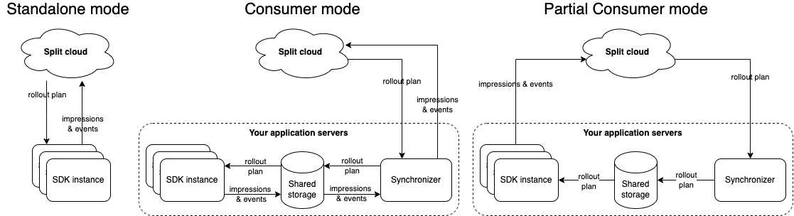

import Tabs from '@theme/Tabs';
import TabItem from '@theme/TabItem';

This guide provides detailed information about our JavaScript Browser SDK, which is built on top of our JS SDK core modules but optimized for web browsers.

The library exports a `slim` (default) and a `full` entry point in UMD, CommonJS, and ES module formats, which allows you to import and use the SDK. The `slim` entry point has less features by default, resulting in a smaller footprint. At the moment, the `full` entry point only differs from the `slim` entry point by including a [Fetch API polyfill](#language-support), but more features might be added in the future.

Both entry points share the same pluggable API that you can use to include more functionality optionally and keep your bundle leaner.

All of our SDKs are open source. Go to our [JavaScript Browser SDK GitHub repository](https://github.com/splitio/javascript-browser-client) to see the source code.

:::info[Migrating from Browser SDK v0.x to Browser SDK v1.x]
Refer to this [migration guide](https://github.com/splitio/javascript-browser-client/blob/development/MIGRATION-GUIDE.md) for complete information on updating to v1.x.
:::

:::info[Migrating JavaScript SDK to JavaScript Browser SDK]
Refer to the [**Browser SDK migration guide**](/docs/feature-management-experimentation/sdks-and-infrastructure/examples/browser-sdk-migration) if you are already using our [JavaScript SDK](/docs/feature-management-experimentation/sdks-and-infrastructure/client-side-sdks/javascript-sdk) and want to migrate to JavaScript Browser SDK to take advantage of ES modules tree-shaking in your Web application project.
:::

## Language support

The JavaScript Browser SDK supports all major browsers. While the library was built to support ES5 syntax, it depends on native support for ES6 `Promise`, `Map` and `Set` objects, and therefore, you need to **polyfill** them if they are not available in your target browsers.

You must polyfill Fetch Web API if it is not available in your target browsers and you are importing the SDK from the slim entry point. For more information, refer to the [Import the SDK into your project](#1-import-the-sdk-into-your-project) section of this guide. The `full` entry point doesn't require it.

If you're looking for possible polyfill options, check [es6-promise](https://github.com/stefanpenner/es6-promise), [es6-map](https://github.com/medikoo/es6-map) and [es6-set](https://github.com/medikoo/es6-set) for Promise, Map and Set polyfills respectively. For Fetch Web API, we recommend the lightweight [unfetch](https://unpkg.com/unfetch@latest/polyfill/index.js) or [whatwg-fetch](https://cdn.jsdelivr.net/npm/whatwg-fetch@latest/dist/fetch.umd.min.js).

:::tip[Rule-based segments support]
Rule-based segments are supported in SDK versions 1.3.0 and above. No changes are required to your SDK implementation, but updating to a supported version is required to ensure compatibility.

Older SDK versions will return the control treatment for flags using rule-based segments and log an impression with a special label for unsupported targeting rules.
:::

## Initialization

Set up FME in your code base with the following two steps:

### 1. Import the SDK into your project

You can import the SDK into your project using either of the two methods below, NPM or our bundled option which we host through our CDN.

You can take advantage of both `slim` and `full` entry points when using NPM as you decide what to import. However, on the already bundled option, the code included is static, so we expose a different bundle for each entry point. The `slim` version includes all the key functionality of the SDK and the full one includes every available pluggable module, for example, the logger or the *InlocalStorage* module.

<Tabs>
<TabItem value="NPM package (recommended)">

```bash
npm install --save @splitsoftware/splitio-browserjs
```

</TabItem>
<TabItem value="CDN bundles">

```html
<!-- Choose the preferred script tag, you don't need both -->

<!-- Slim build, smaller footprint -->
<script src="//cdn.split.io/sdk/split-browser-1.2.0.min.js"></script>

<!-- Full build, bigger footprint but all modules are exposed and usable,
including fetch polyfill -->
<script src="//cdn.split.io/sdk/split-browser-1.2.0.full.min.js"></script>
```

</TabItem>
</Tabs>

### 2. Instantiate the SDK and create a new SDK factory client

<Tabs>
<TabItem value="JavaScript (using CDN)">

```javascript
// Instantiate the SDK. CDN exposes a splitio object globally with a reference to
// the SplitFactory (as well as any extra modules)

var factory = splitio.SplitFactory({
  core: {
    authorizationKey: 'YOUR_SDK_KEY',
    // key represents your internal user id, or the account id that
    // the user belongs to.
    // This could also be a cookie you generate for anonymous users
    key: 'key'
  }
});

// And get the client instance you'll use
var client = factory.client();
```

</TabItem>
<TabItem value="JavaScript (using CommonJS)">

```javascript
var SplitFactory = require('@splitsoftware/splitio-browserjs').SplitFactory;

// Or you can import the SplitFactory from the full entry point,
var SplitFactory = require('@splitsoftware/splitio-browserjs/full').SplitFactory;

// Instantiate the SDK
var factory = SplitFactory({
  core: {
    authorizationKey: 'YOUR_SDK_KEY',
    // key represents your internal user id, or the account id that
    // the user belongs to.
    // This could also be a cookie you generate for anonymous users
    key: 'key'
  }
});

// And get the client instance you'll use
var client = factory.client();
```

</TabItem>
<TabItem value="TypeScript (using ES modules)">

```typescript
import { SplitFactory } from '@splitsoftware/splitio-browserjs';

// Or you can import the SplitFactory from the full entry point,
import { SplitFactory } from '@splitsoftware/splitio-browserjs/full';

// Instantiate the SDK
const factory: SplitIO.IBrowserSDK = SplitFactory({
  core: {
    authorizationKey: 'YOUR_SDK_KEY',
    // key represents your internal user id, or the account id that
    // the user belongs to.
    // This could also be a cookie you generate for anonymous users
    key: 'key'
  }
});

// And get the client instance you'll use
const client: SplitIO.IBrowserClient = factory.client();
```

</TabItem>
</Tabs>

:::info[Notice for TypeScript]
With the SDK package on NPM, you get the SplitIO namespace, which contains useful types and interfaces for you to use.

Feel free to dive into the declaration files if IntelliSense is not enough.
:::

We recommend instantiating the SDK factory once as a singleton and reusing it throughout your application.

Configure the SDK with the SDK key for the FME environment that you would like to access. In legacy Split (app.split.io) the SDK key is found on your Admin settings page, in the API keys section. Select a client-side SDK API key. This is a special type of API token with limited privileges for use in browsers or mobile clients. See [API keys](/docs/feature-management-experimentation/management-and-administration/account-settings/api-keys) to learn more.

## Using the SDK

### Basic use

When the SDK is instantiated, it starts background tasks to update an in-memory cache with small amounts of data fetched from Harness servers. This process can take up to a few hundred milliseconds depending on the size of data. If the SDK is asked to evaluate which treatment to show to a customer for a specific feature flag while its in this intermediate state, it may not have the data necessary to run the evaluation. In this case, the SDK does not fail, rather, it returns [the control treatment](/docs/feature-management-experimentation/feature-management/setup/control-treatment).

To make sure the SDK is properly loaded before asking it for a treatment, block until the SDK is ready, as shown below. We set the client to listen for the `SDK_READY` event triggered by the SDK before asking for an evaluation.

After the `SDK_READY` event fires, you can use the `getTreatment` method to return the proper treatment based on the `FEATURE_FLAG_NAME` and the `key` variables you passed when instantiating the SDK.

Then use an if-else-if block as shown below and insert the code for the different treatments that you defined in Harness FME. Remember the final else branch in your code to handle the client returning control.

<Tabs groupId="java-type-script">
<TabItem value="JavaScript">

```javascript
client.on(client.Event.SDK_READY, function() {
  var treatment = client.getTreatment('FEATURE_FLAG_NAME');

  if (treatment == "on") {
      // insert code here to show on treatment
  } else if (treatment == "off") {
      // insert code here to show off treatment
  } else {
      // insert your control treatment code here
  }
});
```

</TabItem>
<TabItem value="TypeScript">

```typescript
client.on(client.Event.SDK_READY, function() {
  const treatment: SplitIO.Treatment = client.getTreatment('FEATURE_FLAG_NAME');

  if (treatment == "on") {
      // insert code here to show on treatment
  } else if (treatment == "off") {
      // insert code here to show off treatment
  } else {
      // insert your control treatment code here
  }
});
```

</TabItem>
</Tabs>

### Attribute syntax

To [target based on custom attributes](/docs/feature-management-experimentation/feature-management/targeting/target-with-custom-attributes), the SDK's `getTreatment` method needs to be passed an attribute map at runtime.

In the example below, we are rolling out a feature flag to users. The provided attributes `plan_type`, `registered_date`, `permissions`, `paying_customer`, and `deal_size` are passed to the `getTreatment` call. These attributes are compared and evaluated against the attributes used in the rollout plan as defined in Harness FME to decide whether to show the `on` or `off` treatment to this account.

The `getTreatment` method has a number of variations that are described below. Each of these additionally has a variation that takes an attributes argument, which can defines attributes of the following types: strings, numbers, dates, booleans, and sets. The proper data type and syntax for each are:

* **Strings:** Use type String.
* **Numbers:** Use type Number.
* **Dates:** Use type Date and express the value in `milliseconds since epoch`. <br />**Note:** Milliseconds since epoch is expressed in UTC. If your date or date-time combination is in a different timezone, first convert it to UTC, then transform it to milliseconds since epoch.
* **Booleans:** Use type Boolean.
* **Sets:** Use type Array.

<Tabs groupId="java-type-script">
<TabItem value="JavaScript">

```javascript
var attributes = {
  // date attributes are handled as `millis since epoch`
  registered_date: new Date('YYYY-MM-DDTHH:mm:ss.sssZ').getTime(),
  // this string will be compared against a list called `plan_type`
  plan_type: 'growth',
  // this number will be compared agains a const value called `deal_size`
  deal_size: 10000,
  // this boolean will be compared against a const value called `paying_customer`
  paying_customer: true,
  // this array will be compared against a set called `permissions`
  permissions: ["read", "write"]
};

var treatment = client.getTreatment('FEATURE_FLAG_NAME', attributes);

if (treatment === 'on') {
  // insert on code here
} else if (treatment === 'off') {
  // insert off code here
} else {
  // insert control code here
}
```

</TabItem>
<TabItem value="TypeScript">

```typescript
const attributes: SplitIO.Attributes = {
  // date attributes are handled as `millis since epoch`
  registered_date: new Date('YYYY-MM-DDTHH:mm:ss.sssZ').getTime(),
  // this string will be compared against a list called `plan_type`
  plan_type: 'growth',
  // this number will be compared agains a const value called `deal_size`
  deal_size: 10000,
  // this array will be compared against a set called `permissions`
  permissions: [‘read’, ‘write’]
};

const treatment: SplitIO.Treatment = client.getTreatment('FEATURE_FLAG_NAME', attributes);

if (treatment === 'on') {
  // insert on code here
} else if (treatment === 'off') {
  // insert off code here
} else {
  // insert control code here
}
```

</TabItem>
</Tabs>

You can pass your attributes in exactly this way to the `client.getTreatments` method.

### Binding attributes to the client

Attributes can optionally be bound to the client at any time during the SDK lifecycle. These attributes are stored in memory and used in every evaluation to avoid the need to keep the attribute set accessible through the whole app. When an evaluation is called, the attributes provided (if any) at evaluation time are combined with the ones that are already loaded into the SDK memory, with the ones provided at function execution time taking precedence. This enables those attributes to be overridden or hidden for specific evaluations.

An attribute is considered valid if it follows one of the types listed below:
- String
- Number
- Boolean
- Array

The SDK validates these before storing them and if there are invalid or missing values, possibly indicating an issue, the methods return the boolean `false` and do not update any value.

To use these methods, refer to the example below:

```javascript title="JavaScript"
var attributes = {
  registered_date: new Date('YYYY-MM-DDTHH:mm:ss.sssZ').getTime(),
  plan_type: 'growth',
  deal_size: 10000,
  paying_customer: true,
  permissions: ["read", "write"]
};

// set attributes returns true unless there is an issue storing it
var result = client.setAttributes(attributes);

// set one attribute and returns true unless there is an issue storing it
var result = client.setAttribute('paying_customer', false);

// Get an attribute
var plan_type = client.getAttribute('plan_type');

// Get all attributes
var stored_attributes = client.getAttributes();

// Remove an attribute
var result = client.removeAttribute('permissions');

// Remove all attributes
var result = client.clearAttributes();
```

### Multiple evaluations at once

In some instances, you may want to evaluate treatments for multiple feature flags at once. Use the different variations of `getTreatments` from the SDK factory client to do this.
* `getTreatments`: Pass a list of the feature flag names you want treatments for.
* `getTreatmentsByFlagSet`: Evaluate all flags that are part of the provided set name and are cached on the SDK instance.
* `getTreatmentsByFlagSets`: Evaluate all flags that are part of the provided set names and are cached on the SDK instance.

<Tabs groupId="java-type-script">
<TabItem value="JavaScript">

```javascript
// Getting treatments by feature flag names
var flagNames = ['FEATURE_FLAG_NAME_1', 'FEATURE_FLAG_NAME_2'];
var treatments = client.getTreatments(flagNames);

// Getting treatments by set
treatments = client.getTreatmentsByFlagSet('frontend');

// Getting treatments for the union of multiple sets
var flagSets = ['frontend', 'client_side'];
treatments = client.getTreatmentsByFlagSets(flagSets);

// treatments have the following form:
// {
//   FEATURE_FLAG_NAME_1: 'on',
//   FEATURE_FLAG_NAME_2: 'visa'
// }
```

</TabItem>
<TabItem value="TypeScript">

```typescript
// Getting treatments by feature flag names
const flagNames = ['FEATURE_FLAG_NAME_1', 'FEATURE_FLAG_NAME_2'];
let treatments: SplitIO.Treatments = client.getTreatments(flagNames);

// Getting treatments by set
treatments = client.getTreatmentsByFlagSet('frontend');

// Getting treatments for the union of multiple sets
const flagSets = ['frontend', 'client_side'];
treatments = client.getTreatmentsByFlagSets(flagSets);

// treatments have the following form:
// {
//   FEATURE_FLAG_NAME_1: 'on',
//   FEATURE_FLAG_NAME_2: 'visa'
// }
```

</TabItem>
</Tabs>

### Get treatments with configurations

To [leverage dynamic configurations with your treatments](/docs/feature-management-experimentation/feature-management/setup/dynamic-configurations), you should use the `getTreatmentWithConfig` method.

This method will return an object with the structure below:

```typescript title="TypeScript"
type TreatmentResult = {
  treatment: string,
  config: string | null
};
```

As you can see from the object structure, the config is a stringified version of the configuration JSON defined in Harness FME. If there is no configuration defined for a treatment, the SDK returns `null` for the config parameter. This method takes the exact same set of arguments as the standard `getTreatment` method. See below for examples on proper usage:

<Tabs groupId="java-type-script">
<TabItem value="JavaScript">

```javascript
var treatmentResult = client.getTreatmentWithConfig('FEATURE_FLAG_NAME', attributes);
var configs = JSON.parse(treatmentResult.config);
var treatment = treatmentResult.treatment;

if (treatment === 'on') {
  // insert on code here and use configs here as necessary
} else if (treatment === 'off') {
  // insert off code here and use configs here as necessary
} else {
  // insert control code here
}
```

</TabItem>
<TabItem value="TypeScript">

```typescript
const treatmentResult: SplitIO.TreatmentWithConfig = client.getTreatmentWithConfig('FEATURE_FLAG_NAME', attributes);
const configs = JSON.parse(treatmentResult.config);
const treatment = treatmentResult.treatment;

if (treatment === 'on') {
  // insert on code here and use configs here as necessary
} else if (treatment === 'off') {
  // insert off code here and use configs here as necessary
} else {
  // insert control code here
}
```

</TabItem>
</Tabs>

If you need to get multiple evaluations at once, you can also use the `getTreatmentsWithConfig` methods. These methods take the exact same arguments as the [getTreatments](#multiple-evaluations-at-once) methods but return a mapping of feature flag names to TreatmentResults instead of strings. Example usage below:

<Tabs groupId="java-type-script">
<TabItem value="JavaScript">

```javascript
// Getting treatments by feature flag names
var flagNames = ['FEATURE_FLAG_NAME_1', 'FEATURE_FLAG_NAME_2'];
var treatmentResults = client.getTreatmentsWithConfig(flagNames);

// Getting treatments by set
treatmentResults = client.getTreatmentsWithConfigByFlagSet('frontend');

// Getting treatments for the union of multiple sets
var flagSets = ['frontend', 'client_side'];
treatmentResults = client.getTreatmentsWithConfigByFlagSets(flagSets);

// treatmentResults will have the following form:
// {
//   FEATURE_FLAG_NAME_1: {treatment: 'on',
//                  config: "{ 'color' : 'red'}}",
//   FEATURE_FLAG_NAME_2: {treatment: 'v2',
//                  config: "{ 'copy' : 'better copy'}}",
// }
```

</TabItem>
<TabItem value="TypeScript">

```typescript
// Getting treatments by feature flag names
const flagNames = ['FEATURE_FLAG_NAME_1', 'FEATURE_FLAG_NAME_2'];
let treatmentResults: SplitIO.TreatmentsWithConfig = client.getTreatmentsWithConfig(flagNames);

// Getting treatments by set
treatmentResults = client.getTreatmentsWithConfigByFlagSet('frontend');

// Getting treatments for the union of multiple sets
const flagSets = ['frontend', 'client_side'];
treatmentResults = client.getTreatmentsWithConfigByFlagSets(flagSets);

// treatmentResults will have the following form:
// {
//   FEATURE_FLAG_NAME_1: {treatment: 'on',
//                  config: "{ 'color' : 'red'}}",
//   FEATURE_FLAG_NAME_2: {treatment: 'v2',
//                  config: "{ 'copy' : 'better copy'}}",
// }
```

</TabItem>
</Tabs>

### Append properties to impressions

[Impressions](/docs/feature-management-experimentation/feature-management/monitoring-analysis/impressions) are generated by the SDK each time a `getTreatment` method is called. These impressions are periodically sent back to Harness servers for feature monitoring and experimentation.

You can append properties to an impression by passing an object of key-value pairs to the `getTreatment` method. These properties are then included in the impression sent by the SDK and can provide useful context to the impression data.

Three types of properties are supported: strings, numbers, and booleans.

<Tabs groupId="java-type-script">
<TabItem value="JavaScript">

```javascript
const evaluationOptions = {
  properties: { 
    package: "premium", 
    admin: true, 
    discount: 50 
  }
};

const treatment = client.getTreatment('FEATURE_FLAG_NAME', undefined, evaluationOptions);
```

</TabItem>
<TabItem value="TypeScript">

```typescript
const evaluationOptions: SplitIO.EvaluationOptions = {
  properties: { 
    package: "premium", 
    admin: true, 
    discount: 50 
  }
};

const treatment: string = client.getTreatment('FEATURE_FLAG_NAME', undefined, evaluationOptions);
```

</TabItem>
</Tabs>

### Shutdown

Call the `client.destroy()` method before letting a process using the SDK exit, as this method gracefully shuts down the SDK by stopping all background threads, clearing caches, closing connections, and flushing the remaining unpublished impressions.

<Tabs groupId="java-type-script">
<TabItem value="JavaScript">

```javascript
// You can just destroy and remove the variable reference and move on:
user_client.destroy();
user_client = null;

// destroy() returns a promise, so if you want to, for example,
// navigate to another page without losing impressions, you
// can do that once the promise resolves.
user_client.destroy().then(function() {
  user_client = null;

  document.location.replace('another_page');
});
```

</TabItem>
</Tabs>

After `destroy()` is called and finishes, any subsequent invocations to `getTreatment`/`getTreatments` or manager methods result in `control` or empty list, respectively.

:::warning[Important!]
A call to the `destroy()` method also destroys the factory object. When creating new client instance, first create a new factory instance.
:::

## Track

Use the `track` method to record any actions your customers perform. Each action is known as an `event` and corresponds to an `event type`. Calling `track` through one of our SDKs or via the API is the first step to getting experimentation data into Harness FME and allows you to measure the impact of your feature flags on your users’ actions and metrics. [Learn more about using track events](/docs/feature-management-experimentation/release-monitoring/events/).

In the examples below, you can see that the `.track()` method can take up to four arguments. The proper data type and syntax for each are:

* **TRAFFIC_TYPE:** The traffic type of the key in the track call. The expected data type is **String**. You can only pass values that match the names of [traffic types](/docs/feature-management-experimentation/management-and-administration/fme-settings/traffic-types/) that you have defined Harness FME.
* **EVENT_TYPE:** The event type that this event should correspond to. The expected data type is **String**. Full requirements on this argument are:
     * Contains 63 characters or fewer.
     * Starts with a letter or number.
     * Contains only letters, numbers, hyphen, underscore, or period.
     * This is the regular expression we use to validate the value: `[a-zA-Z0-9][-_\.a-zA-Z0-9]{0,62}`
* **VALUE:** (Optional) The value to be used in creating the metric. This field can be sent in as null or 0 if you intend to purely use the count function when creating a metric. The expected data type is **Integer** or **Float**.
* **PROPERTIES:** (Optional) An object of key value pairs that can be used to filter your metrics. Learn more about event property capture in the [Events](/docs/feature-management-experimentation/release-monitoring/events/#event-properties) guide. FME currently supports three types of properties: strings, numbers, and booleans.

The `track` method returns a boolean value of `true` or `false` to indicate whether or not the SDK was able to successfully queue the event to be sent back to Harness servers on the next event post. The SDK returns `false` if the current queue size is equal to the config set by `eventsQueueSize` or if an incorrect input to the `track` method has been provided.

In the case that a bad input has been provided, you can read more about our [SDK's expected behavior](/docs/feature-management-experimentation/release-monitoring/events/).

<Tabs groupId="java-type-script">
<TabItem value="JavaScript">

```javascript
// The expected parameters are:
var queued = client.track('TRAFFIC_TYPE', 'EVENT_TYPE', eventValue, { properties });

// Example with both a value and properties
var properties = { package : "premium", admin : true, discount : 50 };
var queued = client.track('user', 'page_load_time', 83.334, properties);

// Example with only properties
var properties = { package : "premium", admin : true, discount : 50 };
var queued = client.track('user', 'page_load_time', null, properties);
```

</TabItem>
<TabItem value="TypeScript">

```typescript
// The expected parameters are:
const queued: boolean = client.track('TRAFFIC_TYPE', 'EVENT_TYPE', eventValue, , { properties });

// Example with both a value and properties
const properties: SplitIO.Properties = { package: "premium", admin: true, discount: 50 };
const queued: boolean = client.track('user', 'page_load_time', 83.334, properties);

// Example with only properties
const properties = { package: "premium", admin: true, discount: 50 };
const queued = client.track('user', 'page_load_time', null, properties);
```

</TabItem>
</Tabs>

## Configuration

The SDK has a number of knobs for configuring performance. Each knob is tuned to a reasonable default. However, you can override the value while instantiating the SDK. The parameters available for configuration are shown below.

| **Configuration** | **Description** | **Default value** |
| --- | --- | --- |
| core.labelsEnabled | Enable impression labels from being sent to Harness FME servers. Labels may contain sensitive information. | true |
| startup.readyTimeout | Maximum amount of time in seconds to wait before firing the `SDK_READY_TIMED_OUT` event | 10 |
| startup.requestTimeoutBeforeReady | The SDK has two main endpoints it uses /splitChanges and /mySegments that it hits to get ready. This config sets how long (in seconds) the SDK will wait for each request it makes as part of getting ready. | 5 |
| startup.retriesOnFailureBeforeReady | How many retries on /splitChanges and /mySegments we will do while getting the SDK ready | 1 |
| startup.eventsFirstPushWindow | Use to set a specific timer (expressed in seconds) for the first push of events, starting on SDK initialization. | 10 |
| scheduler.featuresRefreshRate | The SDK polls Harness servers for changes to feature rollout plans. This parameter controls this polling period in seconds. | 60 |
| scheduler.segmentsRefreshRate | The SDK polls Harness servers for changes to segment definitions. This parameter controls this polling period in seconds. | 60 |
| scheduler.impressionsRefreshRate | The SDK sends information on who got what treatment at what time back to Harness servers to power analytics. This parameter controls how often this data is sent to Harness servers. The parameter should be in seconds. | 300 |
| scheduler.impressionsQueueSize | The max amount of impressions we queue. If the queue is full, the SDK flushes the impressions and resets the timer. | 30000 |
| scheduler.eventsPushRate | The SDK sends tracked events to Harness servers. This setting controls that flushing rate in seconds. | 60 |
| scheduler.eventsQueueSize | The max amount of events we queue. If the queue is full, the SDK flushes the events and resets the timer. | 500 |
| scheduler.telemetryRefreshRate | The SDK caches diagnostic data that it periodically sends to Harness servers. This configuration controls how frequently this data is sent back to Harness servers (in seconds). | 3600 seconds (1 hour) |
| sync.splitFilters | Filter specific feature flags to be synced and evaluated by the SDK. This is formed by a type string property and a list of string values for the given criteria. Using the types 'bySet' (recommended, flag sets are available in all tiers) or 'byName', pass an array of strings defining the query. If empty or unset, all feature flags are downloaded by the SDK. | [] |
| sync.impressionsMode | This configuration defines how impressions (decisioning events) are queued on the SDK. Supported modes are OPTIMIZED, NONE, and DEBUG. In OPTIMIZED mode, only unique impressions are queued and posted to Harness; this is the recommended mode for experimentation use cases. In NONE mode, no impression is tracked in Harness FME and only minimum viable data to support usage stats is, so never use this mode if you are experimenting with that instance impressions. Use NONE when you want to optimize for feature flagging only use cases and reduce impressions network and storage load. In DEBUG mode, ALL impressions are queued and sent to Harness; this is useful for validations. This mode doesn't impact the impression listener which receives all generated impressions locally. | `OPTIMIZED` |
| sync.enabled | Controls the SDK continuous synchronization flags. When `true`, a running SDK processes rollout plan updates performed in Harness FME (default). When `false`, it fetches all data upon init, which ensures a consistent experience during a user session and optimizes resources when these updates are not consumed by the app. | true |
| sync.requestOptions.getHeaderOverrides | A callback function that can be used to override the Authentication header or append new headers to the SDK's HTTP(S) requests. | undefined |
| storage | Pluggable storage instance to be used by the SDK as a complement to in memory storage. Only supported option today is `InLocalStorage`. Read more [here](#configuring-localstorage-cache-for-the-sdk). | In memory storage |
| debug | Either a boolean flag, string log level or logger instance for activating SDK logs. See [logging](#logging) for details. | false |
| streamingEnabled | Boolean flag to enable the streaming service as default synchronization mechanism. In the event of an issue with streaming, the SDK will fallback to the polling mechanism. If false, the SDK will poll for changes as usual without attempting to use streaming. | true |
| userConsent | User consent status used to control the tracking of events and impressions. Possible values are `GRANTED`, `DECLINED`, and `UNKNOWN`. See [User consent](#user-consent) for details. | `GRANTED` |

To set each of the parameters defined above, use the following syntax:

<Tabs groupId="java-type-script">
<TabItem value="JavaScript">

```javascript
var sdk = SplitFactory({
  startup: {
    readyTimeout:            10, // 10 sec
    eventsFirstPushWindow:   10  // 10 sec
  },
  core: {
    authorizationKey: 'YOUR_SDK_KEY',
    key: 'YOUR_KEY'
  },
  scheduler: {
    featuresRefreshRate:      5, // 5 sec
    segmentsRefreshRate:     60, // 60 sec
    impressionsRefreshRate: 300, // 300 sec
    impressionsQueueSize: 30000, // 30000 items
    eventsPushRate:          60, // 60 sec
    eventsQueueSize:        500, // 500 items
    telemetryRefreshRate:  3600  // 1 hour
  },
  sync: {
    splitFilters: [{
      type: 'bySet',
      values: ['frontend']
    }],
    impressionsMode: 'OPTIMIZED'
  },
  debug: false
});
```

</TabItem>
<TabItem value="TypeScript">

```typescript
const sdk: SplitIO.IBrowserSDK = SplitFactory({
  startup: {
    readyTimeout:            10, // 10 sec
    eventsFirstPushWindow:   10  // 10 sec
  },
  core: {
    authorizationKey: 'YOUR_SDK_KEY',
    key: 'YOUR_KEY'
  },
  scheduler: {
    featuresRefreshRate:      5, // 5 sec
    segmentsRefreshRate:     60, // 60 sec
    impressionsRefreshRate: 300, // 300 sec
    impressionsQueueSize: 30000, // 30000 items
    eventsPushRate:          60, // 60 sec
    eventsQueueSize:        500, // 500 items
    telemetryRefreshRate:  3600  // 1 hour
  },
  sync: {
    splitFilters: [{
      type: 'bySet',
      values: ['frontend']
    }],
    impressionsMode: 'OPTIMIZED'
  },
  debug: false
});
```

</TabItem>
</Tabs>

### Configuring LocalStorage cache for the SDK

To use the pluggable `InLocalStorage` option of the SDK and be able to cache flags for subsequent loads in the same browser, you need to pass it to the SDK config on its `storage` option.

This `InLocalStorage` function accepts an optional object with options described below:

| **Configuration** | **Description** | **Default value** |
| --- | --- | --- |
| prefix | An optional prefix for your data, to avoid collisions. This prefix is prepended to the existing "SPLITIO" localStorage prefix. | `SPLITIO` |
| expirationDays | Number of days before cached data expires if it was not updated. If cache expires, it is cleared when the SDK is initialized. | 10 |
| clearOnInit | When set to `true`, the SDK clears the cached data on initialization unless it was cleared within the last 24 hours. This 24-hour window is not configurable. If the cache is cleared (whether due to expiration or `clearOnInit`), both the 24-hour period and the `expirationDays` period are reset. | false |

These pluggable caches are always available on NPM, but if using the CDN you need the full bundle. Refer to the [Import the SDK into your project](#1-import-the-sdk-into-your-project) section for more information.

<Tabs>
<TabItem value="With full bundle from CDN">

```javascript
var factory = window.splitio.SplitFactory({
  core: {
    authorizationKey: 'YOUR_SDK_KEY',
    key: 'key'
  },
  // Same as SplitFactory, InLocalStorage is exposed on the global splitio object
  storage: window.splitio.InLocalStorage({
    prefix: 'MY_PREFIX',
    expirationDays: 10,
    clearOnInit: false
  })
});

// Now use the SDK as usual
var client = factory.client();
```

</TabItem>
<TabItem value="With NPM package">

```javascript
import { SplitFactory, InLocalStorage } from '@splitsoftware/splitio-browserjs';

const factory: SplitIO.IBrowserSDK = SplitFactory({
  core: {
    authorizationKey: 'YOUR_SDK_KEY',
    key: 'key'
  },
  storage: InLocalStorage({
    prefix: 'MY_PREFIX'
  })
});

// Now use the SDK as usual
const client = factory.client();
```

</TabItem>
</Tabs>

## Localhost mode

For testing, a developer can put code behind feature flags on their development machine without the SDK requiring network connectivity. To achieve this, the SDK can be started in **localhost** mode (aka off-the-grid or offline mode). In this mode, the SDK neither polls nor updates Harness servers. Instead, it uses an in-memory data structure to determine what treatments to show to the logged in customer for each of the features.

Define the feature flags you want to use in the `features` object map. All `getTreatment` calls for a feature flag now only return the one treatment (and config, if defined) that you have defined in the map.
Any feature that is not provided in the `features` map returns the [control treatment](/docs/feature-management-experimentation/feature-management/setup/control-treatment) if the SDK was asked to evaluate them.

You can use the additional configuration parameters below when instantiating the SDK in `localhost` mode.

| **Configuration** | **Description** | **Default value** |
| --- | --- | --- |
| scheduler.offlineRefreshRate | The refresh interval for the mocked features treatments. | 15 |
| features | A fixed mapping of which treatment to show for our mocked features. | {} <br />By default we have no mocked features. |

To use the SDK in localhost mode, replace the SDK key on `authorizationKey` property with `'localhost'`, as shown in the example below. Note that you can define in the `features` object a feature flag name and its treatment directly or use a map to define both a treatment and a dynamic configuration.

If you define just a string as the value for a feature flag name, any config returned by our SDKs are always null. If you use a map, we return the specified treatment and the specified config (which can also be null).

<Tabs groupId="java-type-script">
<TabItem value="JavaScript" label="JavaScript (using CDN bundle)">

```javascript
<script src="//cdn.split.io/sdk/split-browser-1.2.0.full.min.js"></script>

var sdk = splitio.SplitFactory({
  core: {
    authorizationKey: 'localhost'
  },
  features: {
    'reporting_v2': 'on', // example with just a string value for the treatment
    'billing_updates': { treatment: 'visa', config: '{ "color": "blue" }' }, // example of a defined config
    'show_status_bar': { treatment: 'off', config: null } // example of a null config
 },
  scheduler: {
    offlineRefreshRate: 15 // 15 sec
  }
});

var client = sdk.client();

// The following code will be evaluated once the engine finishes the initialization
client.on(client.Event.SDK_READY, function() {
  // The sentence below will return 'on'
  var t1 = client.getTreatment('reporting_v2')
  // The sentence below will return an object with the structure of: {treatment:'visa',config:'{ "color":"blue" }'}
  var t2 = client.getTreatmentWithConfig('billing_updates')
  // The sentence below will return 'control' because that feature does not exist
  var t3 = client.getTreatmentWithConfig('navigation_bar_changes')
});
```

</TabItem>
<TabItem value="TypeScript" label="TypeScript (using ES modules)">

```typescript
import { SplitFactory } from '@splitsoftware/splitio-browserjs';

const sdk: SplitIO.IBrowserSDK = SplitFactory({
  core: {
    authorizationKey: 'localhost'
  },
  features: {
    'reporting_v2': 'on', // example with just a string value for the treatment
    'billing_updates': { treatment: 'visa', config: '{ "color": "blue"}' } // example of a defined config
    'show_status_bar': { treatment: 'off', config: null } // example of a null config
  },
  scheduler: {
    offlineRefreshRate: 15 // 15 sec
  }
});

const client: SplitIO.IBrowserClient = sdk.client();

// The following code will be evaluated once the engine finishes the initialization
client.on(client.Event.SDK_READY, () => {
  // The sentence below will return 'on'
  const t1: SplitIO.Treatment = client.getTreatment('reporting_v2');
  // The sentence below will return an object with the structure of: {treatment:'visa',config:'{ "color":"blue" }'
  const t2: SplitIO.Treatment = client.getTreatmentWithConfig('billing_updates');
  // The sentence below will return 'control' because that feature does not exist
  const t3: SplitIO.Treatment = client.getTreatmentWithConfig('navigation_bar_changes');
});
```

</TabItem>
</Tabs>

You can then change the feature flags as necessary for your testing, by mutating the properties of the `features` object you've provided. The SDK simulates polling for changes every `offlineRefreshRate` seconds, and will emit an `SDK_UPDATE` event if the mocked features have changed.

```javascript title="JavaScript"
// The SDK keeps a reference to the `features` object map, so you can mutate the object as follows to emit SDK_UPDATE events:
config.features['reporting_v2'] = 'off'; // update reporting_v2
config.features['reporting_v3'] = 'off'; // add reporting_v3
delete config.features['reporting_v2']; // delete reporting_v2

// In case you need to update the whole mock object, you can replace the internal reference from the factory:
factory.settings.features = { 'reporting_v3': 'off' };

// But don't do it on the passed configuration, as the SDK will not reference the new object:
config.features = { 'reporting_v3': 'off' }; // Will not emit SDK_UPDATE
```

## Manager

Use the Split Manager to get a list of features available to the SDK factory client. To instantiate a Manager in your code base, use the same factory that you used for your client:

<Tabs groupId="java-type-script">
<TabItem value="JavaScript">

```javascript
var factory = SplitFactory({
  core: {
    authorizationKey: 'YOUR_SDK_KEY',
    key: 'key'
  }
});

var manager = factory.manager();

manager.once(manager.Event.SDK_READY, function() {
  // Once it's ready, use the manager
});
```

</TabItem>
<TabItem value="TypeScript">

```typescript
const factory: SplitIO.IBrowserSDK = SplitFactory({
  core: {
    authorizationKey: 'YOUR_SDK_KEY',
    key: 'key'
  }
});

const manager: SplitIO.IManager = factory.manager();

manager.once(manager.Event.SDK_READY, function() {
  // Once it's ready, use the manager
});
```

</TabItem>
</Tabs>

The Manager has the following methods available:

<Tabs groupId="java-type-script">
<TabItem value="JavaScript">

```javascript
/**
 * Returns the feature flag registered within the SDK that matches this name.
 *
 * @return SplitView or null.
 */
var splitView = manager.split('name-of-feature-flag');

/**
 * Retrieves all the feature flags that are currently registered within the SDK.
 *
 * returns a List of SplitViews.
 */
var splitViewsList = manager.splits();

/**
 * Returns the names of all feature flags registered within the SDK.
 *
 * @return a List of Strings of the features' names.
 */
var splitNamesList = manager.names();
```

</TabItem>
<TabItem value="TypeScript">

```typescript
/**
 * Returns the feature flag registered within the SDK that matches this name.
 *
 * @return SplitView or null.
 */
const splitView: SplitIO.SplitView = manager.split('name-of-feature-flag');

/**
 * Retrieves all the feature flags that are currently registered within the SDK.
 *
 * returns a List of SplitViews.
 */
const splitViewsList: SplitIO.SplitViews = manager.splits();

/**
 * Returns the names of all feature flags registered within the SDK.
 *
 * @return a List of Strings of the features' names.
 */
const splitNamesList: SplitIO.SplitNames = manager.names();
```

</TabItem>
</Tabs>

The `SplitView` object referenced above has the following structure:

```typescript title="TypeScript"
type SplitView = {
  name: string,
  trafficType: string,
  killed: boolean,
  treatments: Array<string>,
  changeNumber: number,
  configs: {
    [treatmentName: string]: string
  },
  defaultTreatment: string,
  sets: Array<string>,
  impressionsDisabled: boolean
}
```

## Listener

FME SDKs send impression data back to Harness servers periodically and as a result of evaluating feature flags. To additionally send this information to a location of your choice, define and attach an *impression listener*. For that purpose, the SDK's configurations have a parameter called `impressionListener` where an implementation of `ImpressionListener` could be added. This implementation **must** define the `logImpression` method and it receives data in the following schema.

| **Name** | **Type** | **Description** |
| --- | --- | --- |
| impression | Object | Impression object that has the feature, key, treatment, label, etc. |
| attributes | Object | A map of attributes passed to `getTreatment`/`getTreatments` (if any). |
| sdkLanguageVersion | String| The version of the SDK. In this case the language is `browserjs` plus the version currently running. |

:::info[Note]
There are two additional keys on this object, `ip` and `hostname`. They are not captured on the client side but kept for consistency.
:::

## Implement custom impression listener

The following is an example of how to implement a custom impression listener:

<Tabs groupId="java-type-script">
<TabItem value="JavaScript">

```javascript
function logImpression(impressionData) {
  // do something with the impression data.
}

var factory = SplitFactory({
  core: {
    authorizationKey: 'YOUR_SDK_KEY',
    key: 'key'
  },
  impressionListener: {
    logImpression: logImpression
  }
});
```

</TabItem>
<TabItem value="TypeScript">

```typescript
class MyImprListener implements SplitIO.IImpressionListener {
  logImpression(impressionData: SplitIO.ImpressionData) {
    // do something with impressionData
  }
}

const factory: SplitIO.IBrowserSDK = SplitFactory({
  core: {
    authorizationKey: 'YOUR_SDK_KEY',
    key: 'key'
  },
  impressionListener: {
    logImpression: new MyImprListener()
  }
});
```

</TabItem>
</Tabs>

An impression listener is called asynchronously from the corresponding evaluation, but is almost immediate.

Even though the SDK does not fail if there is an exception in the listener, do not block the call stack.

## Logging

To trim as many bits as possible from the user application builds, we divided the logger in implementations that contain the log messages for each log level: `ErrorLogger`, `WarnLogger`, `InfoLogger`, and `DebugLogger`. Higher log level options contain the messages for the lower ones, with DebugLogger containing them all. To enable descriptive SDK logging, you need to plug in a logger instance as shown below:

<Tabs groupId="java-type-script">
<TabItem value="JavaScript" label="Logger instance (JavaScript)">

```javascript
var splitio = require('@splitsoftware/splitio-browserjs');

var sdk = splitio.SplitFactory({
  core: {
    authorizationKey: 'YOUR_SDK_KEY',
    key: 'key'
  },
  debug: splitio.DebugLogger() // other options are `InfoLogger`, `WarnLogger` and `ErrorLogger`
});
```

</TabItem>
<TabItem value="TypeScript" label="Logger instance (TypeScript)">

```javascript
import { SplitFactory, DebugLogger } from '@splitsoftware/splitio-browserjs';

const sdk: SplitIO.IBrowserSDK = SplitFactory({
  core: {
    authorizationKey: 'YOUR_SDK_KEY',
    key: 'key'
  },
  debug: DebugLogger() // other options are `InfoLogger`, `WarnLogger` and `ErrorLogger`
});
```

</TabItem>
<TabItem value="Logger instance (UMD build)">

```javascript
var sdk = splitio.SplitFactory({
  core: {
    authorizationKey: 'YOUR_SDK_KEY',
    key: 'key'
  },
  debug: splitio.DebugLogger() // Only the full UMD bundle includes `DebugLogger`, `InfoLogger`, `WarnLogger` and `ErrorLogger` modules in the `splitio` namespace.
});
```

</TabItem>
</Tabs>

You can also enable the SDK logging via a boolean or log level value as `debug` settings, and change it dynamically by calling the SDK Logger API. However, in any case where the proper logger instance is not plugged in, instead of a human readable message, you'll get a code and optionally some params for the log itself. While these logs would be enough for the Harness FME support team, if you find yourself in a scenario where you need to parse this information, you can check the constant files in our javascript-commons repository (where you have tags per version if needed) under the [logger folder](https://github.com/splitio/javascript-commons/blob/master/src/logger/).

<Tabs groupId="java-type-script">
<TabItem value="JavaScript" label="Logger API (JavaScript)">

```javascript
var splitio = require('@splitsoftware/splitio-browserjs');

var sdk = splitio.SplitFactory({
  core: {
    authorizationKey: 'YOUR_SDK_KEY',
    key: 'key'
  },
  debug: true // other options are 'ERROR', 'WARN', 'INFO' and 'DEBUG
});

// Or you can use the Logger API methods which have an immediate effect.
sdk.Logger.setLogLevel('WARN'); // Acceptable values are: 'DEBUG', 'INFO', 'WARN', 'ERROR', 'NONE'
sdk.Logger.enable(); // equivalent to `setLogLevel('DEBUG')`
sdk.Logger.disable(); // equivalent to `setLogLevel('NONE')`
```

</TabItem>
<TabItem value="TypeScript" label="Logger API (TypeScript)">

```javascript
import { SplitFactory } from '@splitsoftware/splitio-browserjs';

const sdk: SplitIO.IBrowserSDK = SplitFactory({
  core: {
    authorizationKey: 'YOUR_SDK_KEY',
    key: 'key'
  },
  debug: true // other options are 'ERROR', 'WARN', 'INFO' and 'DEBUG
});

// Or you can use the Logger API methods which have an immediate effect.
sdk.Logger.setLogLevel('WARN'); // Acceptable values are: 'DEBUG', 'INFO', 'WARN', 'ERROR', 'NONE'
sdk.Logger.enable(); // equivalent to `setLogLevel('DEBUG')`
sdk.Logger.disable(); // equivalent to `setLogLevel('NONE')`
```

</TabItem>
</Tabs>

SDK logging can also be globally enabled via a localStorage value by opening your DevTools console and typing the following:

```javascript title="Enable logging from browser console"
// Acceptable values are 'DEBUG', 'INFO', 'WARN', 'ERROR' and 'NONE'
// Other acceptable values are 'on', 'enable' and 'enabled', which are equivalent to 'DEBUG' log level
localStorage.splitio_debug = 'on' <enter>

```

## Advanced use cases

This section describes advanced use cases and features provided by the SDK.

### Instantiate multiple SDK clients

FME supports the ability to release based on multiple traffic types. For example, with traffic types, you can release to `users` in one feature flag and `accounts` in another. If you are unfamiliar with using multiple traffic types, refer to the [Traffic type guide](/docs/feature-management-experimentation/management-and-administration/fme-settings/traffic-types/) for more information.

Each SDK factory client is tied to one specific customer ID at a time, so if you need to roll out feature flags by different traffic types, instantiate multiple SDK clients, one for each traffic type. For example, you may want to roll out the feature `user-poll` by `users` and the feature `account-permissioning` by `accounts`.

You can do this with the example below:

<Tabs groupId="java-type-script">
<TabItem value="JavaScript">

```javascript
var factory = SplitFactory({
  core: {
    authorizationKey: 'YOUR_SDK_KEY',
    key: 'CUSTOMER_ACCOUNT_ID',
    // Instantiate the sdk once and provide the ID for one of the
    // traffic types that you plan to release to. It doesn't
    // matter which you pick to start off with.
  },
});

// now when you call factory.client(), the sdk creates a client
// using the Account ID and traffic type name (if any)
// you passed in during the factory creation.
var account_client = factory.client();

// to create another client for a User instead, just pass in a User ID

// This is only valid after at least one client has been initialized.
var user_client = factory.client('CUSTOMER_USER_ID');

// check treatment for user-poll and CUSTOMER_USER_ID
var user_poll_treatment = user_client.getTreatment('user-poll');

// check treatment for account-permissioning and CUSTOMER_ACCOUNT_ID
var account_permissioning_treatment = account_client.getTreatment('account-permissioning');

// track events for accounts
user_client.track('account', 'PAGELOAD', 7.86);

// or track events for users
account_client.track('user', 'ACCOUNT_CREATED');
```

</TabItem>
<TabItem value="TypeScript">

```typescript
const sdk: SplitIO.IBrowserSDK = SplitFactory({
  core: {
    authorizationKey: 'YOUR_SDK_KEY',
    key: 'CUSTOMER_ACCOUNT_ID'
    // instantiate the sdk once and provide the ID for one of the
    // traffic types that you plan to release to. It doesn't
    // matter which you pick to start off with.
  },
});

// now when you call sdk.client(), the sdk will create a client
// using the Account ID you passed in during the factory creation.
const account_client: SplitIO.IBrowserClient = factory.client();

// to create another client for a User instead, just pass in a
// User ID to the sdk.client() method. This is only valid after
// at least one client has been initialized.
const user_client: SplitIO.IBrowserClient =
  factory.client('CUSTOMER_USER_ID');

// check treatment for user-poll and CUSTOMER_USER_ID
const user_poll_treatment: SplitIO.Treatment =
  user_client.getTreatment('user-poll');

// check treatment for account-permissioning and CUSTOMER_ACCOUNT_ID
const account_permissioning_treatment: SplitIO.Treatment =
  account_client.getTreatment('account-permissioning');

// track events for accounts
user_client.track('account', 'PAGELOAD', 7.86);

// or track events for users
account_client.track('user', 'ACCOUNT_CREATED');
```

</TabItem>
</Tabs>

:::info[Number of SDK instances]
While the SDK does not put any limitations on the number of instances that can be created, we strongly recommend keeping the number of SDKs down to **one** or **two**.
:::

### Subscribe to events

You can listen for four different events from the SDK.

* `SDK_READY_FROM_CACHE`. This event fires once the SDK is ready to evaluate treatments using a version of your rollout plan cached in localStorage from a previous session (which might be stale). If there is data in localStorage, this event fires almost immediately, since access to localStorage is fast; otherwise, it doesn't fire.
* `SDK_READY`. This event fires once the SDK is ready to evaluate treatments using the most up-to-date version of your rollout plan, downloaded from Harness servers.
* `SDK_READY_TIMED_OUT`. This event fires if there is no cached version of your rollout plan cached in localStorage, and the SDK could not download the data from Harness servers within the time specified by the `readyTimeout` configuration parameter. This event does not indicate that the SDK initialization was interrupted.  The SDK continues downloading the rollout plan and fires the `SDK_READY` event when finished.  This delayed `SDK_READY` event may happen with slow connections or large rollout plans with many feature flags, segments, or dynamic configurations.
* `SDK_UPDATE`. This event fires whenever your rollout plan is changed. Listen for this event to refresh your app whenever a feature flag or segment is changed in Harness FME.

The syntax to listen for each event is shown below:

<Tabs groupId="java-type-script">
<TabItem value="JavaScript">

```javascript
function whenReady() {
  var treatment = client.getTreatment('FEATURE_FLAG_NAME');
  if (treatment === 'on') {
    // insert on code
  } else if (treatment === 'off') {
    // insert off code
  } else {
    // insert control code (usually the same as default treatment)
  }
}
client.once(client.Event.SDK_READY, function () {
  // the client is ready to evaluate treatments according to the latest feature flag definitions
});

client.once(client.Event.SDK_READY_TIMED_OUT, function () {
  // this callback will be called after the set timeout period has elapsed if and only if the client
  // is not ready for that time. You can still call getTreatment()
  // but it could return CONTROL.
});

client.on(client.Event.SDK_UPDATE, function () {
  // fired each time the client state changes.
  // For example, when a feature flag or a segment changes.
  console.log('The SDK has been updated!');
});

// This event fires only using the LocalStorage option and if there's FME data stored in the browser.
client.once(client.Event.SDK_READY_FROM_CACHE, function () {
  // Fired after the SDK could confirm the presence of the FME data.
  // This event fires really quickly, since there's no actual fetching of information.
  // Keep in mind that data might be stale, this is NOT a replacement of SDK_READY.
});
```

</TabItem>
<TabItem value="TypeScript">

```typescript
function whenReady() {
  const treatment: SplitIO.Treatment = client.getTreatment('FEATURE_FLAG_NAME');

  if (treatment === 'on') {
    // insert on code
  } else if (treatment === 'off') {
    // insert off code
  } else {
    // insert control code (usually the same as default treatment)
  }
}

// the client is ready for start making evaluations with your data
client.once(client.Event.SDK_READY, whenReady);

client.once(client.Event.SDK_READY_TIMED_OUT, () => {
  // This callback will be called after `readyTimeout` seconds (10 seconds by default)
  // if and only if the client is not ready for that time. 
  // You can still call `getTreatment()` but it could return `CONTROL`.
});

client.on(client.Event.SDK_UPDATE, () => {
  // Fired each time the client state changes.
  // For example, when a feature flag or a segment changes.
  console.log('The SDK has been updated!');
});

// This event fires only using the LocalStorage option and if there's FME data stored in the browser.
client.once(client.Event.SDK_READY_FROM_CACHE, function () {
  // Fired after the SDK could confirm the presence of the FME data.
  // This event fires really quickly, since there's no actual fetching of information.
  // Keep in mind that data might be stale, this is NOT a replacement of SDK_READY.
});
```

</TabItem>
</Tabs>

### Sharing state with a pluggable storage

By default, the SDK fetches the feature flags and segments it needs to compute treatments from Harness FME servers, and stores it in its cache. As a result, this makes it easy to get set up with Harness FME by instantiating the SDK, waiting for the `SDK_READY` event, and starting to use it. This default execution mode, called standalone mode, is appropriate for mobile and Web apps running on the client-side. However, in a stateless environment, like many serverless or edge computing solutions, this model could lead to some performance implications.

Unlike a Web app or a traditional server process, code running in a stateless environment generally has a lifecycle that is much shorter because it is associated to the lifetime of a single HTTP request/response cycle. Therefore, for each incoming HTTP request, the code must instantiate the SDK and wait until it fetches its state before evaluating, which impacts the response latency. Also, the pricing model of serverless providers usually depends on the average duration of your code and the outgoing HTTP requests.

To optimize latency, externalize the state of the SDK in a data storage available on the same infrastructure where SDKs are instantiated and instruct the SDKs to "consume" data from that storage instead of fetching it from Harness FME servers. This is known as consumer mode, which has two variants, *consumer* and *partial consumer*, as illustrated in the following diagram.



#### Synchronizing FME data on your storage

As illustrated in the previous diagram, running the SDK in consumer mode requires an additional component for synchronizing the FME data in your storage, which is known as [Synchronizer](/docs/feature-management-experimentation/sdks-and-infrastructure/optional-infra/split-synchronizer).

#### Consumer modes

In *consumer* and *partial consumer* modes, the SDK evaluates treatments by retrieving rollout plans from a shared data storage.

The difference between each mode is in how generated impressions and events are handled:
* In consumer mode, the SDK uses the shared storage to store impressions and events, instead of submitting them directly to Harness FME servers. The synchronizer is in charge of submitting this data to Harness FME.
* In partial consumer mode, the SDK behaves as in standalone mode, submitting events and impressions to Harness FME servers. In this mode, [configuration parameters](#configuration) that affects how events and impressions are submitted, such as changing a push rate or the events queue size, change the behavior of the SDK.

To instantiate an SDK working as consumer, set two configs on the root of the configuration object, `mode` and `storage`. Set `mode` with the mode of choice, either `'consumer'` or `'consumer_partial'`. Then set `storage` to a valid **storage wrapper** which is the adapter used to connect to the data storage.

The following shows how to configure and get treatments for a SDK instance in consumer or partial consumer mode:

<Tabs groupId="java-type-script">
<TabItem value="JavaScript">

```javascript
import { SplitFactory, PluggableStorage } from '@splitsoftware/splitio-browserjs';

var config = {
  mode: 'consumer', // Changing the mode to 'consumer' or 'consumer_partial' here
  core: {
    authorizationKey: '<your-api-key>',
    key: 'key'
  },

  // Using the PluggableStorage function, to create an storage instance
  // with a given a storage wrapper that the SDK should talk to
  storage: PluggableStorage({
    // Wrapper objects must implement a special interface
    wrapper: MyWrapper,
    // Optional prefix to prevent any kind of data collision using
    // the same storage with multiple SDKs with different SDK keys
    prefix: 'prefix'
  })
};

var factory = SplitFactory(config);
var client = factory.client();

// Unlike standalone mode, since the storage can by async the SDK will execute its operations asynchronously and
// instead of just returning a treatment as string, it returns a Promise that will be resolved to the treatment value.

// There are two main options to call getTreatments and extract the treatment. One is the async/await syntax:
var treatment = await client.getTreatment('my-feature-comming-from-storage');

// and the other option is just using the returned promise
client.getTreatment('my-feature-comming-from-storage')
  .then(treatment => {
    // do something with the treatment
  });

// Same as in standalone mode, you can listen to the SDK events to make sure it's ready before calling for evaluations:

client.once(client.Event.SDK_READY, function () {
  // Depending on the wrapper implementation, this callback will be called immediately or once the connection with the underlying storage is stablished.
  // It is recommended to wait for this event before using the SDK. Otherwise the evaluation treatment might be 'control'.
});

client.once(client.Event.SDK_READY_TIMED_OUT, function () {
  // This callback will be called after the seconds set at the `startup.readyTimeout` config parameter,
  // if and only if the SDK_READY event was not emitted for that time.
});
```

</TabItem>
</Tabs>

You can write your own custom storage wrapper for the SDK factory client by extending the IPluggableStorageWrapper interface.

#### Storage wrapper examples

We currently maintain storage wrappers for the following technologies:

- **Cloudflare Durable Objects**: The Durable Object wrapper is available as part of a [template](https://github.com/splitio/cloudflare-workers-template) to help you kick-start a [Cloudflare Workers](https://developers.cloudflare.com/workers/) project. In addition to providing the wrapper, the template demonstrates the basic setup of the SDK and Synchronizer.

- **Vercel Edge Config**: The wrapper is available as an [NPM package](https://npmjs.com/package/@splitsoftware/vercel-integration-utils) and wraps the [Edge Config](https://vercel.com/docs/storage/edge-config) data store. This wrapper is used with the [FME Integration for Vercel](https://vercel.com/integrations/split). Adding the FME integration to a Vercel project sets up the synchronization of the Edge Config data store. See the [Vercel FME integration guide](/docs/feature-management-experimentation/integrations/vercel) for more information about the integration setup.

### User consent

The SDK allows you to disable the tracking of events and impressions until user consent is explicitly granted or declined.

The `userConsent` configuration parameter lets you set the initial consent status of the SDK instance, and the factory method `UserConsent.setStatus(boolean)` lets you grant (enable) or decline (disable) dynamic data tracking.

There are three possible initial states:
 * `'GRANTED'`: The user grants consent for tracking events and impressions. The SDK sends them to Harness FME servers. This is the default value if `userConsent` param is not defined.
 * `'DECLINED'`: The user declines consent for tracking events and impressions. The SDK does not send them to Harness FME servers.
 * `'UNKNOWN'`: The user neither grants nor declines consent for tracking events and impressions. The SDK tracks them in its internal storage, and eventually either sends them or not if the consent status is updated to `'GRANTED'` or `'DECLINED'` respectively.

The status can be updated at any time with the `UserConsent.setStatus` factory method.

Working with user consent is demonstrated below.

```javascript title="User consent: Initial config, getter and setter"
var factory = SplitFactory({
  core: {
    authorizationKey: 'YOUR_SDK_KEY',
    key: 'key'
  },
  // Overwrites the initial consent status of the factory instance, which is 'GRANTED' by default.
  // 'UNKNOWN' status represents that the user has neither granted nor declined consent for tracking data,
  // so the SDK will locally track data but not send it to Harness FME servers until consent is changed to 'GRANTED'.
  userConsent: 'UNKNOWN'
});

// `getStatus` method returns the current consent status.
factory.UserConsent.getStatus() === factory.UserConsent.Status.UNKNOWN;

// `setStatus` method lets you update the factory consent status at any time.
// Pass `true` for 'GRANTED' and `false` for 'DECLINED'.
factory.UserConsent.setStatus(true); // Consent status changed from 'UNKNOWN' to 'GRANTED'. Data will be sent to Harness FME servers.
factory.UserConsent.getStatus() === factory.UserConsent.Status.GRANTED;

factory.UserConsent.setStatus(false); // Consent status changed from 'GRANTED' to 'DECLINED'. Data will not be sent to Harness FME servers.
factory.UserConsent.getStatus() === factory.UserConsent.Status.DECLINED;
```

## Example apps

The following are example applications detailing how to configure and instantiate the JavaScript Browser SDK on commonly used platforms.

* [Basic HTML](https://github.com/splitio/example-javascript-client)
