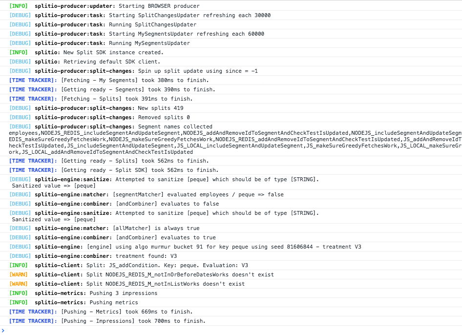

import Tabs from '@theme/Tabs';
import TabItem from '@theme/TabItem';

This guide provides detailed information about our JavaScript SDK. All of our SDKs are open source. Go to our [JavaScript SDK GitHub repository](https://github.com/splitio/javascript-client) to see the source code.

:::info[Migrating from v10.x to v11.x]
When upgrading, consider that the traffic type is no longer configured for the SDK factory client, and must be sent on the `client.track()` method call instead.

Refer to the [migration guide](https://github.com/splitio/javascript-client/blob/development/MIGRATION-GUIDE.md) for complete information on upgrading to v11.x.
:::

## Language support

The JavaScript SDK supports all major browsers. While the library was built to support ES5 syntax, it depends on native support for ES6 `Promise`, `Map`, and `Set` objects, and therefore, you need to **polyfill** them if they are not available in your target browsers.

If you're looking for possible polyfill options, check [es6-promise](https://github.com/stefanpenner/es6-promise), [es6-map](https://github.com/medikoo/es6-map) and [es6-set](https://github.com/medikoo/es6-set) for Promise, Map and Set polyfills respectively.

:::tip[Rule-based segments support]
Rule-based segments are supported in SDK versions 11.4.0 and above. No changes are required to your SDK implementation, but updating to a supported version is required to ensure compatibility.

Older SDK versions will return the control treatment for flags using rule-based segments and log an impression with a special label for unsupported targeting rules.
:::

## Initialization
 
Set up FME in your code base with two simple steps.

### 1. Import the SDK into your project

You can import the SDK into your project using either of the three methods below.

<Tabs>
<TabItem value="NPM (recommended)">

```bash
npm install --save @splitsoftware/splitio
```

</TabItem>
<TabItem value="CDN bundle">

```html
<script src="//cdn.split.io/sdk/split-11.2.0.min.js"></script>

```

</TabItem>
</Tabs>

### 2. Instantiate the SDK and create a new SDK factory client

<Tabs>
<TabItem value="JavaScript (using CDN)">

```javascript
// Instantiate the SDK. CDN will expose splitio globally 
var factory = splitio({ 
  core: {
    authorizationKey: 'YOUR_SDK_KEY',
    // key represents your internal user id, or the account id that 
    // the user belongs to. 
    // This could also be a cookie you generate for anonymous users
    key: 'key'
  }
});
 
// And get the client instance you'll use
var client = factory.client();
```

</TabItem>
<TabItem value="JavaScript">

```javascript
var SplitFactory = require('@splitsoftware/splitio').SplitFactory;
 
// Instantiate the SDK
var factory = SplitFactory({ 
  core: {
    authorizationKey: 'YOUR_SDK_KEY',
    // key represents your internal user id, or the account id that 
    // the user belongs to. 
    // This could also be a cookie you generate for anonymous users
    key: 'key'
  }
});
 
// And get the client instance you'll use
var client = factory.client();
```

</TabItem>
<TabItem value="TypeScript">

```javascript
// Use the import let = require syntax on TS.
import { SplitFactory } from '@splitsoftware/splitio';
 
// Instantiate the SDK
const factory: SplitIO.IBrowserSDK = SplitFactory({ 
  core: {
    authorizationKey: 'YOUR_SDK_KEY',
    key: 'key'
  },
  startup: {
    readyTimeout: 1.5 // 1.5 sec
  }
});
 
// And get the client instance you'll use
const client: SplitIO.IBrowserClient = factory.client();
```

</TabItem>
</Tabs>

:::warning[Updating to v10 for NPM version]
If you are using the CDN package or Bower, no changes are needed on your current code.
We changed our module system to ES modules and now we are exposing an object with a `SplitFactory` property. That property points to the same factory function that we were returning in the previous versions. Refer to the snippet above to see the code.
:::

:::info[Notice for TypeScript]
With the SDK package on NPM, you get the SplitIO namespace, which contains useful types and interfaces for you to use.

Feel free to dive into the declaration files if IntelliSense is not enough.
:::

We recommend instantiating the SDK factory once as a singleton and reusing it throughout your application.

Configure the SDK with the SDK key for the FME environment that you would like to access. In legacy Split (app.split.io) the SDK key is found on your Admin settings page, in the API keys section. Select a client-side SDK API key. This is a special type of API token with limited privileges for use in browsers or mobile clients.  See [API keys](/docs/feature-management-experimentation/management-and-administration/account-settings/api-keys) to learn more.


## Using the SDK
 
### Basic use

When the SDK is instantiated, it starts background tasks to update an in-memory cache with small amounts of data fetched from Harness servers. This process can take up to a few hundred milliseconds, depending on the size of data. If the SDK is asked to evaluate which treatment to show to a customer for a specific feature flag while it's in this intermediate state, it may not have the data necessary to run the evaluation. In this case, the SDK does not fail, rather, it returns the [control treatment](/docs/feature-management-experimentation/feature-management/setup/control-treatment). 

To make sure the SDK properly loads before asking it for a treatment, block until the SDK is ready, as shown below. We set the client to listen for the `SDK_READY` event triggered by the SDK before asking for an evaluation. 

After the `SDK_READY` event fires, you can use the `getTreatment` method to return the proper treatment based on the feature flag name and the key you passed when instantiating the SDK. Then use an if-else-if block as shown below and insert the code for the different treatments that you defined in Harness FME. Remember the final else branch in your code to handle the client returning control.

<Tabs groupId="java-type-script">
<TabItem value="JavaScript">

```javascript
client.on(client.Event.SDK_READY, function() {
  var treatment = client.getTreatment('FEATURE_FLAG_NAME');
 
  if (treatment == "on") {
      // insert code here to show on treatment
  } else if (treatment == "off") {
      // insert code here to show off treatment
  } else {
      // insert your control treatment code here
  }
});
```

</TabItem>
<TabItem value="TypeScript">

```javascript
client.on(client.Event.SDK_READY, function() {
  const treatment: SplitIO.Treatment = client.getTreatment('FEATURE_FLAG_NAME');
 
  if (treatment == "on") {
      // insert code here to show on treatment
  } else if (treatment == "off") {
      // insert code here to show off treatment
  } else {
      // insert your control treatment code here
  }
});
```

</TabItem>
</Tabs>

### Attribute syntax 

To [target based on custom attributes](/docs/feature-management-experimentation/feature-management/targeting/target-with-custom-attributes), the SDK's `getTreatment` method needs to be passed an attribute map at runtime.

In the example below, we are rolling out a feature to users. The provided attributes `plan_type`, `registered_date`, `permissions`, `paying_customer`, and `deal_size` are passed to the `getTreatment` call. These attributes are compared and evaluated against the attributes used in the rollout plan as defined in Harness FME to decide whether to show the `on` or `off` treatment to this account.

The `getTreatment` method has a number of variations that are described below. Each of these additionally has a variation that takes an attributes argument, which can defines attributes of the following types: strings, numbers, dates, booleans, and sets. The proper data type and syntax for each are:

* **Strings:** Use type String.
* **Numbers:** Use type Number.
* **Dates:** Use type Date and express the value in `milliseconds since epoch`. <br />**Note:** Milliseconds since epoch is expressed in UTC. If your date or date-time combination is in a different timezone, first convert it to UTC, then transform it to milliseconds since epoch.
* **Booleans:** Use type Boolean.
* **Sets:** Use type Array.

<Tabs groupId="java-type-script">
<TabItem value="JavaScript">

```javascript
var attributes = {
  // date attributes are handled as `millis since epoch`
  registered_date: new Date('YYYY-MM-DDTHH:mm:ss.sssZ').getTime(),
  // this string will be compared against a list called `plan_type`
  plan_type: 'growth',
  // this number will be compared against a const value called `deal_size`
  deal_size: 10000,
  // this boolean will be compared against a const value called `paying_customer`
  paying_customer: true,
  // this array will be compared against a set called `permissions`
  permissions: ["read", "write"]
};
 
var treatment = client.getTreatment('FEATURE_FLAG_NAME', attributes);
 
if (treatment === 'on') {
  // insert on code here
} else if (treatment === 'off') {
  // insert off code here
} else {
  // insert control code here
}
```

</TabItem>
<TabItem value="TypeScript">

```javascript
const attributes: SplitIO.Attributes = {
  // date attributes are handled as `millis since epoch`
  registered_date: new Date('YYYY-MM-DDTHH:mm:ss.sssZ').getTime(),
  // this string will be compared against a list called `plan_type`
  plan_type: 'growth',
  // this number will be compared against a const value called `deal_size`
  deal_size: 10000,
  // this array will be compared against a set called `permissions`
  permissions: [‘read’, ‘write’]
};
 
const treatment: SplitIO.Treatment = client.getTreatment('FEATURE_FLAG_NAME', attributes);
 
if (treatment === 'on') {
  // insert on code here
} else if (treatment === 'off') {
  // insert off code here
} else {
  // insert control code here
}
```

</TabItem>
</Tabs>

You can pass your attributes in exactly this way to the `client.getTreatments` method.

### Binding attributes to the client

Attributes can optionally be bound to the client at any time during the SDK lifecycle. These attributes are stored in memory and used in every evaluation to avoid the need to keep the attribute set accessible through the whole app. When an evaluation is called, the attributes provided (if any) at evaluation time are combined with the ones that are already loaded into the SDK memory, with the ones provided at function execution time taking precedence. This enables those attributes to be overridden or hidden for specific evaluations.

An attribute is considered valid if it follows one of the types listed below:
- String
- Number
- Boolean
- Array

The SDK validates these before storing them and if there are invalid or missing values, possibly indicating an issue, the methods return the boolean `false` and do not update any value.

To use these methods, refer to the example below:

```javascript title="JavaScript"
var attributes = {
  registered_date: new Date('YYYY-MM-DDTHH:mm:ss.sssZ').getTime(),
  plan_type: 'growth',
  deal_size: 10000,
  paying_customer: true,
  permissions: ["read", "write"]
};

// set attributes returns true unless there is an issue storing it
var result = client.setAttributes(attributes);

// set one attribute and returns true unless there is an issue storing it
var result = client.setAttribute('paying_customer', false);

// Get an attribute
var plan_type = client.getAttribute('plan_type');

// Get all attributes
var stored_attributes = client.getAttributes();

// Remove an attribute
var result = client.removeAttribute('permissions');

// Remove all attributes
var result = client.clearAttributes();

```

### Multiple evaluations at once

In some instances, you may want to evaluate treatments for multiple feature flags at once. Use the different variations of `getTreatments` from the SDK factory client to do this.
* `getTreatments`: Pass a list of the feature flag names you want treatments for.
* `getTreatmentsByFlagSet`: Evaluate all flags that are part of the provided set name and are cached on the SDK instance.
* `getTreatmentsByFlagSets`: Evaluate all flags that are part of the provided set names and are cached on the SDK instance.

<Tabs groupId="java-type-script">
<TabItem value="JavaScript">

```javascript
// Getting treatments by feature flag names
var flagNames = ['FEATURE_FLAG_NAME_1', 'FEATURE_FLAG_NAME_2'];
var treatments = client.getTreatments(flagNames);

// Getting treatments by set
treatments = client.getTreatmentsByFlagSet('frontend');

// Getting treatments for the union of multiple sets
var flagSets = ['frontend', 'client_side'];
treatments = client.getTreatmentsByFlagSets(flagSets);

// treatments have the following form:
// {
//   FEATURE_FLAG_NAME_1: 'on',
//   FEATURE_FLAG_NAME_2: 'visa'
// }
```

</TabItem>
<TabItem value="TypeScript">

```javascript
// Getting treatments by feature flag names
const flagNames = ['FEATURE_FLAG_NAME_1', 'FEATURE_FLAG_NAME_2'];
let treatments: SplitIO.Treatments = client.getTreatments(flagNames);

// Getting treatments by set
treatments = client.getTreatmentsByFlagSet('frontend');

// Getting treatments for the union of multiple sets
const flagSets = ['frontend', 'client_side'];
treatments = client.getTreatmentsByFlagSets(flagSets);

// treatments have the following form:
// {
//   FEATURE_FLAG_NAME_1: 'on',
//   FEATURE_FLAG_NAME_2: 'visa'
// }
```

</TabItem>
</Tabs>

### Get Treatments with Configurations

To [leverage dynamic configurations with your treatments](/docs/feature-management-experimentation/feature-management/setup/dynamic-configurations), use the `getTreatmentWithConfig` method.

This method returns an object with the structure below:

<Tabs groupId="java-type-script">
<TabItem value="JavaScript">

```javascript
var TreatmentResult = {
  String treatment;
  String config; // or null if there is no config for the treatment
}
```

</TabItem>
<TabItem value="TypeScript">

```javascript
type TreatmentResult = {
  treatment: string,
  config: string | null
};
```

</TabItem>
</Tabs>

As you can see from the object structure, the config is a stringified version of the configuration JSON defined in Harness FME. If there is no configuration defined for a treatment, the SDK returns `null` for the config parameter.

This method takes the exact same set of arguments as the standard `getTreatment` method. Refer to the examples below for proper usage:

<Tabs groupId="java-type-script">
<TabItem value="JavaScript">

```javascript
var treatmentResult = client.getTreatmentWithConfig('FEATURE_FLAG_NAME', attributes);
var configs = JSON.parse(treatmentResult.config);
var treatment = treatmentResult.treatment;
 
if (treatment === 'on') {
  // insert on code here and use configs here as necessary
} else if (treatment === 'off') {
  // insert off code here and use configs here as necessary
} else {
  // insert control code here
}
```

</TabItem>
<TabItem value="TypeScript">

```javascript
const treatmentResult: SplitIO.TreatmentWithConfig = client.getTreatmentWithConfig('FEATURE_FLAG_NAME', attributes);
const configs = JSON.parse(treatmentResult.config);
const treatment = treatmentResult.treatment;

if (treatment === 'on') {
  // insert on code here and use configs here as necessary
} else if (treatment === 'off') {
  // insert off code here and use configs here as necessary
} else {
  // insert control code here
}
```

</TabItem>
</Tabs>

If you need to get multiple evaluations at once, you can also use the `getTreatmentsWithConfig` methods. These methods take the exact same arguments as the [getTreatments](#multiple-evaluations-at-once) methods but return a mapping of feature flag names to TreatmentResults instead of strings. Example usage below:

<Tabs groupId="java-type-script">
<TabItem value="JavaScript">

```javascript
// Getting treatments by feature flag names
var featureFlagNames = ['FEATURE_FLAG_NAME_1', 'FEATURE_FLAG_NAME_2'];
 
var treatmentResults = client.getTreatmentsWithConfig(featureFlagNames);

// Getting treatments by set
treatmentResults = client.getTreatmentsWithConfigByFlagSet('frontend');

// Getting treatments for the union of multiple sets
var flagSets = ['frontend', 'client_side'];
treatmentResults = client.getTreatmentsWithConfigByFlagSets(flagSets);

// treatmentResults will have the following form: 
// {
//   FEATURE_FLAG_NAME_1: {treatment: 'on',
//                  config: "{ 'color' : 'red'}}",
//   FEATURE_FLAG_NAME_2: {treatment: 'v2',
//                  config: "{ 'copy' : 'better copy'}}",
// }
```

</TabItem>
<TabItem value="TypeScript">

```javascript
// Getting treatments by feature flag names
const featureFlagNames = ['FEATURE_FLAG_NAME_1', 'FEATURE_FLAG_NAME_2'];
 
let treatmentResults: SplitIO.TreatmentsWithConfig = client.getTreatmentsWithConfig(featureFlagNames);

// Getting treatments by set
treatmentResults = client.getTreatmentsWithConfigByFlagSet('frontend');

// Getting treatments for the union of multiple sets
const flagSets = ['frontend', 'client_side'];
treatmentResults = client.getTreatmentsWithConfigByFlagSets(flagSets);

// treatmentResults will have the following form: 
// {
//   FEATURE_FLAG_NAME_1: {treatment: 'on',
//                  config: "{ 'color' : 'red'}}",
//   FEATURE_FLAG_NAME_2: {treatment: 'v2',
//                  config: "{ 'copy' : 'better copy'}}",
// }
```

</TabItem>
</Tabs>

### Append properties to impressions

[Impressions](/docs/feature-management-experimentation/feature-management/monitoring-analysis/impressions) are generated by the SDK each time a `getTreatment` method is called. These impressions are periodically sent back to Harness servers for feature monitoring and experimentation.

You can append properties to an impression by passing an object of key-value pairs to the `getTreatment` method. These properties are then included in the impression sent by the SDK and can provide useful context to the impression data.

Three types of properties are supported: strings, numbers, and booleans.

<Tabs groupId="java-type-script">
<TabItem value="JavaScript">

```javascript
const evaluationOptions = {
  properties: { 
    package: "premium", 
    admin: true, 
    discount: 50 
  }
};

const treatment = client.getTreatment('FEATURE_FLAG_NAME', undefined, evaluationOptions);
```

</TabItem>
<TabItem value="TypeScript">

```typescript
const evaluationOptions: SplitIO.EvaluationOptions = {
  properties: { 
    package: "premium", 
    admin: true, 
    discount: 50 
  }
};

const treatment: string = client.getTreatment('FEATURE_FLAG_NAME', undefined, evaluationOptions);
```

</TabItem>
</Tabs>

### Shutdown

Call the `client.destroy()` method before letting a process using the SDK exit, as this method gracefully shuts down the SDK by stopping all background threads, clearing caches, closing connections, and flushing the remaining unpublished impressions. 

```javascript title="JavaScript"
// You can just destroy and remove the variable reference and move on:
user_client.destroy();
user_client = null;
 
// destroy() returns a promise, so if you want to, for example,
// navigate to another page without losing impressions, you 
// can do that once the promise resolves.
user_client.destroy().then(function() {
  user_client = null;

  document.location.replace('another_page');
});
```

After `destroy()` is called and finishes, any subsequent invocations to `getTreatment`/`getTreatments` or manager methods result in `control` or empty list, respectively.

:::warning[Important!]
A call to the `destroy()` method also destroys the factory object. When creating new client instance, first create a new factory instance.
:::

## Track

Use the `track` method to record any actions your customers perform. Each action is known as an `event` and corresponds to an `event type`. Calling `track` through one of our SDKs or via the API is the first step to getting experimentation data into Harness FME and allows you to measure the impact of your features on your users’ actions and metrics.

Learn more about [tracking events](/docs/feature-management-experimentation/release-monitoring/events/). 

In the examples below you can see that the `.track()` method can take up to four arguments. The proper data type and syntax for each are: 

* **TRAFFIC_TYPE:** The traffic type of the key in the track call. The expected data type is **String**. You can only pass values that match the names of [traffic types](/docs/feature-management-experimentation/management-and-administration/fme-settings/traffic-types/) that you have defined Harness FME.
* **EVENT_TYPE:** The event type that this event should correspond to. The expected data type is **String**. Full requirements on this argument are:
     * Contains 63 characters or fewer.
     * Starts with a letter or number.
     * Contains only letters, numbers, hyphen, underscore, or period. 
     * This is the regular expression we use to validate the value: `[a-zA-Z0-9][-_\.a-zA-Z0-9]{0,62}`
* **VALUE:** (Optional) The value to be used in creating the metric. This field can be sent in as null or 0 if you intend to purely use the count function when creating a metric. The expected data type is **Integer** or **Float**.
* **PROPERTIES:** (Optional) An object of key value pairs that can be used to filter your metrics. Learn more about event property capture in the [Events](/docs/feature-management-experimentation/release-monitoring/events/#event-properties) guide. FME currently supports three types of properties: strings, numbers, and booleans.

The `track` method returns a boolean value of `true` or `false` to indicate whether or not the SDK was able to successfully queue the event to be sent back to Harness servers on the next event post. The SDK will return `false` if the current queue size is equal to the config set by `eventsQueueSize` or if an incorrect input to the `track` method has been provided.

In the case that a bad input has been provided, you can read more about our SDK's expected behavior [here](/docs/feature-management-experimentation/release-monitoring/events/). 

<Tabs groupId="java-type-script">
<TabItem value="JavaScript">

```javascript
// Example with both a value and properties
var properties = { package: "premium", admin: true, discount: 50 };
var queued = client.track('user', 'page_load_time', 83.334, properties);

// Example with only properties
var properties = { package: "premium", admin: true, discount: 50 };
var queued = client.track('user', 'page_load_time', null, properties);
```

</TabItem>
<TabItem value="TypeScript">

```typescript
// Example with both a value and properties
const properties: SplitIO.Properties = { package: "premium", admin: true, discount: 50 };
const queued: boolean = client.track('user', 'page_load_time', 83.334, properties);

// Example with only properties
const properties = { package: "premium", admin: true, discount: 50 };
const queued = client.track('user', 'page_load_time', null, properties);
```

</TabItem>
</Tabs>

## Configuration

The SDK has a number of knobs for configuring performance. Each knob is tuned to a reasonable default. However, you can override the value while instantiating the SDK. The parameters available for configuration are shown below.

| **Configuration** | **Description** | **Default value** |
| --- | --- | --- |
| core.labelsEnabled | Enable impression labels from being sent to Harness servers. Labels may contain sensitive information. | true |
| startup.readyTimeout | Maximum amount of time in seconds to wait before firing the `SDK_READY_TIMED_OUT` event | 10 |
| startup.requestTimeoutBeforeReady | The SDK has two main endpoints it uses /splitChanges and /mySegments that it hits to get ready. This config sets how long (in seconds) the SDK waits for each request it makes as part of getting ready. | 5 |
| startup.retriesOnFailureBeforeReady | How many retries on /splitChanges and /mySegments we do while getting the SDK ready | 1 |
| startup.eventsFirstPushWindow | Use to set a specific timer (expressed in seconds) for the first push of events, starting on SDK initialization. | 10 |
| scheduler.featuresRefreshRate | The SDK polls Harness servers for changes to feature rollout plans. This parameter controls this polling period in seconds. | 60 |
| scheduler.segmentsRefreshRate | The SDK polls Harness servers for changes to segment definitions. This parameter controls this polling period in seconds. | 60 |
| scheduler.impressionsRefreshRate | The SDK sends information on who got what treatment at what time back to Harness servers to power analytics. This parameter controls how often this data is sent to Harness servers. The parameter should be in seconds. | 300 |
| scheduler.impressionsQueueSize | The max amount of impressions we queue. If the queue is full, the SDK flushes the impressions and resets the timer. | 30000 |
| scheduler.eventsPushRate | The SDK sends tracked events to Harness servers. This setting controls that flushing rate in seconds. | 60 |
| scheduler.eventsQueueSize | The max amount of events we queue. If the queue is full, the SDK flushes the events and resets the timer. | 500 |
| scheduler.telemetryRefreshRate | The SDK caches diagnostic data that it periodically sends to Harness servers. This configuration controls how frequently this data is sent back to Harness servers (in seconds). | 3600 seconds (1 hour) |
| sync.splitFilters | Filter specific feature flags to be synced and evaluated by the SDK. This is formed by a type string property and a list of string values for the given criteria. Using the types 'bySet' (recommended, flag sets are available in all tiers) or 'byName', pass an array of strings defining the query. If empty or unset, all feature flags are downloaded by the SDK. | [] |
| sync.impressionsMode | This configuration defines how impressions (decisioning events) are queued on the SDK. Supported modes are OPTIMIZED, NONE, and DEBUG. In OPTIMIZED mode, only unique impressions are queued and posted to Harness; this is the recommended mode for experimentation use cases. In NONE mode, no impression is tracked in Harness FME and only minimum viable data to support usage stats is, so never use this mode if you are experimenting with that instance impressions. Use NONE when you want to optimize for feature flagging only use cases and reduce impressions network and storage load. In DEBUG mode, ALL impressions are queued and sent to Harness; this is useful for validations. This mode doesn't impact the impression listener which receives all generated impressions locally. | `OPTIMIZED` |
| sync.enabled | Controls the SDK continuous synchronization flags. When `true`, a running SDK processes rollout plan updates performed in Harness FME (default). When `false`, it fetches all data from the Harness FME servers only upon init, which ensures a consistent experience during a user session and optimizes resources when these updates are not consumed by the app. | true |
| sync.requestOptions.getHeaderOverrides | A callback function that can be used to override the Authentication header or append new headers to the SDK's HTTP(S) requests. | undefined |
| storage.type | Storage type to be used by the SDK. Possible values are `MEMORY` and `LOCALSTORAGE`. | `MEMORY` |
| storage.prefix | Only applies to the `LOCALSTORAGE` storage type. An optional prefix for your data to avoid collisions. This prefix is prepended to the existing "SPLITIO" localStorage prefix. | `SPLITIO` |
| storage.expirationDays | Only applies to the `LOCALSTORAGE` storage type. Number of days before cached data expires if it was not updated. If cache expires, it is cleared when the SDK is initialized. | 10 |
| storage.clearOnInit | Only applies to the `LOCALSTORAGE` storage type. When set to `true`, the SDK clears the cached data on initialization unless it was cleared within the last 24 hours. This 24-hour window is not configurable. If the cache is cleared (whether due to expiration or `clearOnInit`), both the 24-hour period and the `expirationDays` period are reset. | false |
| debug | Either a boolean flag or log level string ('ERROR', 'WARN', 'INFO', or 'DEBUG'). See [logging](#logging) for details. | false |
| streamingEnabled | Boolean flag to enable the streaming service as default synchronization mechanism. In the event of an issue with streaming, the SDK falls back to the polling mechanism. If false, the SDK polls for changes as usual without attempting to use streaming. | true |
| userConsent | User consent status used to control the tracking of events and impressions. Possible values are `GRANTED`, `DECLINED`, and `UNKNOWN`. See [User consent](#user-consent) for details. | `GRANTED` |

To set each of the parameters defined above, use the following syntax:

<Tabs groupId="java-type-script">
<TabItem value="JavaScript">

```javascript
var sdk = SplitFactory({
  startup: {
    requestTimeoutBeforeReady:     5, // 5 sec
    retriesOnFailureBeforeReady:   1, // 1 sec
    readyTimeout:                 10, // 10 sec
    eventsFirstPushWindow:        10  // 10 sec
  },
  core: {
    authorizationKey: 'YOUR_SDK_KEY',
    key: 'USER_ID'
  },
  scheduler: {
    featuresRefreshRate:      5, // 5 sec 
    segmentsRefreshRate:     60, // 60 sec 
    impressionsRefreshRate: 300, // 300 sec
    impressionsQueueSize: 30000, // 30000 items
    eventsPushRate:          60, // 60 sec
    eventsQueueSize:        500, // 500 items
    telemetryRefreshRate:  3600  // 1 hour
  },
  sync: {
    splitFilters: [{
      type: 'bySet',
      values: ['frontend']
    }],
    impressionsMode: 'NONE'
  },
  storage: {
    type: 'LOCALSTORAGE',
    prefix: 'MYPREFIX',
    expirationDays: 10,
    clearOnInit: false
  },
  streamingEnabled: true,
  debug: false
});
```

</TabItem>
<TabItem value="TypeScript">

```javascript
const sdk: SplitIO.IBrowserSDK = SplitFactory({
  startup: {
    requestTimeoutBeforeReady:     5, // 5 sec
    retriesOnFailureBeforeReady:   1, // 1 sec
    readyTimeout:                 10, // 10 sec
    eventsFirstPushWindow:        10  // 10 sec
  },
  core: {
    authorizationKey: 'YOUR_SDK_KEY',
    key: 'USER_ID'
  },
  scheduler: {
    featuresRefreshRate:      5, // 5 sec 
    segmentsRefreshRate:     60, // 60 sec 
    impressionsRefreshRate: 300, // 300 sec
    impressionsQueueSize: 30000, // 30000 items
    eventsPushRate:          60, // 60 sec
    eventsQueueSize:        500, // 500 items
    telemetryRefreshRate:  3600  // 1 hour
  },
  sync: {
    splitFilters: [{
      type: 'bySet',
      values: ['frontend']
    }],
    impressionsMode: 'NONE'
  },
  storage: {
    type: 'LOCALSTORAGE',
    prefix: 'MYPREFIX',
    expirationDays: 10,
    clearOnInit: false
  },
  streamingEnabled: true,
  debug: false
});
```

</TabItem>
</Tabs>

## Localhost mode

For testing, a developer can put code behind feature flags on their development machine without the SDK requiring network connectivity. To achieve this, the SDK can be started in **localhost** mode (aka off-the-grid or offline mode). In this mode, the SDK neither polls nor updates Harness servers. Instead, it uses an in-memory data structure to determine what treatments to show to the logged in customer for each of the features.

When instantiating the SDK in localhost mode, your `authorizationKey` is `localhost`. Define the feature flags you want to use in the `features` object map. All `getTreatment` calls for a feature flag now only return the one treatment (and config, if defined) that you have defined in the map.

Any feature that is not provided in the `features` map returns the [control treatment](/docs/feature-management-experimentation/feature-management/setup/control-treatment) if the SDK was asked to evaluate them.

You can use the additional configuration parameters below when instantiating the SDK in `localhost` mode.

| **Configuration** | **Description** | **Default value** |
| --- | --- | --- |
| scheduler.offlineRefreshRate | The refresh interval for the mocked features treatments. | 15 |
| features | A fixed mapping of which treatment to show for our mocked features. | {} <br />By default we have no mocked features. |

To use the SDK in localhost mode, replace the SDK key on `authorizationKey` property with `'localhost'`, as shown in the example below. Note that you can define in the `features` object a feature flag name and its treatment directly or use a map to define both a treatment and a dynamic configuration.

If you define just a string as the value for a feature flag name, any config returned by our SDKs are always null. If you use a map, we return the specified treatment and the specified config (which can also be null).


<Tabs groupId="java-type-script">
<TabItem value="JavaScript" label="JavaScript (using CDN)">

```javascript
var sdk = splitio({
  core: {
    authorizationKey: 'localhost',
    key: 'CUSTOMER_ID'
  },
  features: {
    'reporting_v2': 'on', // example with just a string value for the treatment
    'billing_updates': { treatment: 'visa', config: '{ "color": "blue" }' }, // example of a defined config
    'show_status_bar': { treatment: 'off', config: null } // example of a null config
  },
  scheduler: {
    offlineRefreshRate: 15 // 15 sec
  }
});

var client = sdk.client();

// The following code will be evaluated once the engine finishes the initialization
client.on(client.Event.SDK_READY, function() {
  // The sentence below will return 'on'
  var t1 = client.getTreatment('reporting_v2')
  // The sentence below will return an object with the structure of: {treatment:'visa',config:'{ "color":"blue" }'}
  var t2 = client.getTreatmentWithConfig('billing_updates')
  // The sentence below will return 'control' because that feature does not exist
  var t3 = client.getTreatmentWithConfig('navigation_bar_changes')
});

// The following code will be evaluated only if using the LocalStorage option as storage type. 
// The only difference with the production mode is that the event is always emitted in localhost mode, 
// since the SDK can evaluate using the features provided by your `features` config object.
client.on(client.Event.SDK_READY_FROM_CACHE, function() {
  // The sentence below will return 'on'
  var t1 = client.getTreatment('reporting_v2') 
}
```

</TabItem>
<TabItem value="TypeScript">

```javascript
const sdk: SplitIO.IBrowserSDK = SplitFactory({
  core: {
    authorizationKey: 'localhost',
    key: 'CUSTOMER_ID'
  },
  features: {
    'reporting_v2': 'on', // example with just a string value for the treatment
    'billing_updates': { treatment: 'visa', config: '{ "color": "blue"}' } // example of a defined config
    'show_status_bar': { treatment: 'off', config: null } // example of a null config
  },
  scheduler: {
    offlineRefreshRate: 15 // 15 sec
  }
});

const client: SplitIO.IBrowserClient = sdk.client();

// The following code will be evaluated once the engine finishes the initialization
client.on(client.Event.SDK_READY, () => {
  // The sentence below will return 'on'
  const t1: SplitIO.Treatment = client.getTreatment('reporting_v2');
  // The sentence below will return an object with the structure of: {treatment:'visa',config:'{ "color":"blue" }'
  const t2: SplitIO.Treatment = client.getTreatmentWithConfig('billing_updates');
  // The sentence below will return 'control' because that feature does not exist
  const t3: SplitIO.Treatment = client.getTreatmentWithConfig('navigation_bar_changes');
});

// The following code will be evaluated only if using the LocalStorage option as storage type. 
// The only difference with the production mode is that the event is always emitted in localhost mode, 
// since the SDK can evaluate using the features provided by your `features` config object.
client.on(client.Event.SDK_READY_FROM_CACHE, () => {
  // The sentence below will return 'on'
  const t1: SplitIO.Treatment = client.getTreatment('reporting_v2') 
}
```

</TabItem>
</Tabs>

You can then change the feature flags as necessary for your testing, by mutating the properties of the `features` object you've provided. The SDK simulates polling for changes every `offlineRefreshRate` seconds, and will emit an `SDK_UPDATE` event if the mocked features have changed.

<Tabs groupId="java-type-script">
<TabItem value="JavaScript">

```javascript
// The SDK keeps a reference to the `features` object map, so you can mutate the object as follows to emit SDK_UPDATE events:
config.features['reporting_v2'] = 'off'; // update reporting_v2
config.features['reporting_v3'] = 'off'; // add reporting_v3
delete config.features['reporting_v2']; // delete reporting_v2

// In case you need to update the whole mock object, you can replace the internal reference from the factory:
factory.settings.features = { 'reporting_v3': 'off' };

// But don't do it on the passed configuration, as the SDK will not reference the new object:
config.features = { 'reporting_v3': 'off' }; // Will not emit SDK_UPDATE
```

</TabItem>
</Tabs>

### Localhost mode limitations and Allowlist workaround

JavaScript, React, Redux, and Browser SDKs use the `features` configuration parameter to set feature flags and treatment names when running in localhost mode. However, this mode does not support adding Allowlist keys within the `features` property, unlike the YAML file structure used in server-side SDKs.

To mimic the behavior of allowing specific keys to receive certain treatments, you can define multiple feature flag sets keyed by your user identifier and select the appropriate set dynamically. This approach lets you flip treatments based on the key, effectively simulating an Allowlist.

For example:

```javascript
const myFeatures = {
  agus: {
    flag1: 'on',
    flag2: 'off'
  },
  sanjay: {
    flag1: 'off',
    flag2: 'on'
  },
  default: {
    flag1: 'off',
    flag2: 'off'
  }
};

const config = {
  core: {
    authorizationKey: 'localhost',
    key: myKey
  },
  features: myFeatures[myKey] || myFeatures['default'],
  startup: {
    readyTimeout: 5, // 5 seconds
    retriesOnFailureBeforeReady: 3 // 3 retries
  }
};
```

This approach provides a simple way to control feature flag treatments per user key while running your application locally.

## Manager

Use the Split manager to get a list of features available to the SDK factory client. To instantiate a Manager in your code base, use the same factory that you used for your client.

<Tabs groupId="java-type-script">
<TabItem value="JavaScript">

```javascript
var factory = SplitFactory({ 
  core: {
    authorizationKey: 'YOUR_SDK_KEY',
    key: 'key'
  }
});
 
var manager = factory.manager();

manager.once(manager.Event.SDK_READY, function() {
  // Once it's ready, use the manager
});
```

</TabItem>
<TabItem value="TypeScript">

```javascript
const factory: SplitIO.IBrowserSDK = SplitFactory({ 
  core: {
    authorizationKey: 'YOUR_SDK_KEY',
    key: 'key'
  }
});
 
const manager: SplitIO.IManager = factory.manager();

manager.once(manager.Event.SDK_READY, function() {
  // Once it's ready, use the manager
});
```

</TabItem>
</Tabs>

The Manager then has the following methods available:

<Tabs groupId="java-type-script">
<TabItem value="JavaScript">

```javascript
/**
 * Returns the feature flag registered within the SDK that matches this name.
 *
 * @return SplitView or null.
 */
var splitView = manager.split('name-of-feature-flag');
 
/**
 * Retrieves all the feature flags that are currently registered within the SDK.
 *
 * returns a List of SplitViews.
 */
var splitViewsList = manager.splits();
 
/** 
 * Returns the names of all features flags registered within the SDK.
 *
 * @return a List of Strings of the features' names.
 */
var splitNamesList = manager.names();
```

</TabItem>
<TabItem value="TypeScript">

```javascript
/**
 * Returns the feature flag registered within the SDK that matches this name.
 *
 * @return SplitView or null.
 */
const splitView: SplitIO.SplitView = manager.split('name-of-feature-flag');
 
/**
 * Retrieves all the feature flags that are currently registered within the SDK.
 *
 * returns a List of SplitViews.
 */
const splitViewsList: SplitIO.SplitViews = manager.splits();
 
/** 
 * Returns the names of all features flags registered within the SDK.
 *
 * @return a List of Strings of the features' names.
 */
const splitNamesList: SplitIO.SplitNames = manager.names();
```

</TabItem>
</Tabs>

The `SplitView` object referenced above has the following structure:

```typescript title="TypeScript"
type SplitView = {
  name: string,
  trafficType: string,
  killed: boolean,
  treatments: Array<string>,
  changeNumber: number,
  configs: {
    [treatmentName: string]: string
  },
  defaultTreatment: string,
  sets: Array<string>,
  impressionsDisabled: boolean
}
```

## Listener
 
FME SDKs send impression data back to Harness servers periodically and as a result of evaluating feature flags. To additionally send this information to a location of your choice, define and attach an *impression listener*. For that purpose, the SDK's configurations have a parameter called `impressionListener` where an implementation of `ImpressionListener` could be added. This implementation **must** define the `logImpression` method and it receives data in the following schema.

| **Name** | **Type** | **Description** |
| --- | --- | --- | 
| impression | Object | Impression object that has the feature, key, treatment, label, etc. |
| attributes | Object | A map of attributes passed to `getTreatment`/`getTreatments` (if any). |
| sdkLanguageVersion | String| The version of the SDK. In this case the language is `javascript` plus the version currently running. |

:::info[Note]
There are two additional keys on this object, `ip` and `hostname`. They are not used on the browser.
:::

## Implement custom impression listener

The following is an example of how to implement a custom impression listener:
 
<Tabs groupId="java-type-script">
<TabItem value="JavaScript">

```javascript
function logImpression(impressionData) {
  // do something with the impression data.
}
 
var factory = SplitFactory({ 
  core: {
    authorizationKey: 'YOUR_SDK_KEY',
    key: 'key'
  },
  impressionListener: {
    logImpression: logImpression
  }
});
```

</TabItem>
<TabItem value="TypeScript">

```javascript
class MyImprListener implements SplitIO.IImpressionListener {
  logImpression(impressionData: SplitIO.ImpressionData) {
    // do something with impressionData
  }
}
 
const factory: SplitIO.IBrowserSDK = SplitFactory({ 
  core: {
    authorizationKey: 'YOUR_SDK_KEY',
    key: 'key'
  },
  impressionListener: {
    logImpression: new MyImprListener()
  }
});
```

</TabItem>
</Tabs>

An impression listener is called asynchronously from the corresponding evaluation, but is almost immediate. 

Even though the SDK does not fail, if there is an exception in the listener, do not block the call stack.

## Content Security Policy (CSP)

The Content Security Policy (CSP) can be enabled on a site that uses the JavaScript SDK. CSP is a security standard to prevent cross-site scripting (XSS) and other code injection attacks.

To allow the JavaScript SDK, you can use the `nonce` keyword to permit inline scripts securely:

1. Configure your server to send a response header like this (with your own random nonce value): `Content-Security-Policy: script-src 'self' cdn.split.io 'nonce-swfT4W3546RtDw4';`.
1. Add the matching nonce attribute to the script tag that uses the SDK:
   
   ```html
   <script nonce="swfT4W3546RtDw4">
   // Your SDK code here
   </script>
   ```
   
   Make sure the nonce value in the header and script tag match exactly. The nonce should be randomly generated per request for security.

## Logging

To enable SDK logging in the browser, open your DevTools console and type the following:

```javascript title="Enable logging from browser console"
// Acceptable values are 'DEBUG', 'INFO', 'WARN', 'ERROR' and 'NONE'
// Other acceptable values are 'on', 'enable' and 'enabled', which are equivalent to 'DEBUG' log level
localStorage.splitio_debug = 'on' <enter>

```

Reload the browser to start seeing the logs.

Beginning with v9.2.0 of the SDK, you can also enable the logging via SDK settings and programmatically by calling the Logger API.

<Tabs groupId="java-type-script">
<TabItem value="JavaScript" label="Logger API (JavaScript)">

```javascript
var SplitFactory = require('@splitsoftware/splitio').SplitFactory;
 
var sdk = SplitFactory({
  core: {
    authorizationKey: 'YOUR_SDK_KEY',
    key: 'key'
  },
  debug: true // Debug boolean option can be passed on settings
  // It takes precedence over the localStorage flag.
});
 
// Or you can use the Logger API which two methods, enable and disable.
// Calling this methods will have an immediate effect.
sdk.Logger.enable();
sdk.Logger.disable();

// You can also set the log level programatically after v10.4.0
// Acceptable values are: 'DEBUG', 'INFO', 'WARN', 'ERROR', 'NONE'.
// 'DEBUG' is equivalent to `enable` method.
// 'NONE' is equivalent to `disable` method.
sdk.Logger.setLogLevel('WARN');
```

</TabItem>
<TabItem value="TypeScript" label="Logger API (TypeScript)">

```javascript
import { SplitFactory } from '@splitsoftware/splitio';
 
const sdk: SplitIO.IBrowserSDK = SplitFactory({ 
  core: {
    authorizationKey: 'YOUR_SDK_KEY',
    key: 'key'
  },
  debug: true // Debug boolean option can be passed on settings.
  // It takes precedence over the localStorage flag.
});

// Or you can use the Logger API which two methods, enable and disable.
// Calling this methods will have an immediate effect.
sdk.Logger.enable();
sdk.Logger.disable();

// You can also set the log level programatically after v10.4.0
// Acceptable values are: 'DEBUG', 'INFO', 'WARN', 'ERROR', 'NONE'.
// 'DEBUG' is equivalent to `enable` method.
// 'NONE' is equivalent to `disable` method.
sdk.Logger.setLogLevel('WARN');
```

</TabItem>
</Tabs>

Example output is shown below. 



:::info[Note]
For more information on using the logging framework in SDK versions prior to 9.2, refer to [https://github.com/visionmedia/debug](https://github.com/visionmedia/debug).
:::

## Advanced use cases

This section describes advanced use cases and features provided by the SDK.

### Instantiate multiple SDK clients
 
Each JavaScript SDK factory client is tied to one specific customer and traffic type at a time (for example, `user`, `account`, `organization`). This enhances performance and reduces data cached within the SDK.

FME supports the ability to release based on multiple traffic types. With traffic types, you can release to `users` in one feature flag and `accounts` in another. If you are unfamiliar with using multiple traffic types, refer to [Traffic types](/docs/feature-management-experimentation/management-and-administration/fme-settings/traffic-types/) for more information.

If you need to roll out features by different traffic types, instantiate multiple SDK clients, one for each traffic type. For example, you may want to roll out the feature `user-poll` by `users` and the feature `account-permissioning` by `accounts`. You can do this with the example below:
 
<Tabs groupId="java-type-script">
<TabItem value="JavaScript">

```javascript
var factory = SplitFactory({
  core: {
    authorizationKey: 'YOUR_SDK_KEY',
    key: 'CUSTOMER_ACCOUNT_ID',
    // Instantiate the sdk once and provide the ID for one of the
    // traffic types that you plan to release to. It doesn't
    // matter which you pick to start off with.
  },
});
 
// now when you call factory.client(), the sdk will create a client
// using the Account ID you passed in during the factory creation.
var account_client = factory.client();
 
// to create another client for a User traffic type instead,
// just pass in a User ID to the factory.client() method.
// This is only valid after at least one client has been initialized.
var user_client = factory.client('CUSTOMER_USER_ID'); 
 
// check treatment for user-poll and CUSTOMER_USER_ID
var user_poll_treatment = user_client.getTreatment('user-poll');
 
// check treatment for account-permissioning and CUSTOMER_ACCOUNT_ID
var account_permissioning_treatment = account_client.getTreatment('account-permissioning');
 
// track events for user traffic type
user_client.track('user', 'PAGELOAD', 7.86);
 
// or track events for account traffic type
account_client.track('account', 'ACCOUNT_CREATED');
```

</TabItem>
<TabItem value="TypeScript">

```javascript
const sdk: SplitIO.IBrowserSDK = SplitFactory({
  core: {
    authorizationKey: 'YOUR_SDK_KEY',
    key: 'CUSTOMER_ACCOUNT_ID' 
    // instantiate the sdk once and provide the ID for one of the
    // traffic types that you plan to release to. It doesn't
    // matter which you pick to start off with. 
  },
});
 
// now when you call sdk.client(), the sdk will create a client
// using the Account ID you passed in during the factory creation.
const account_client: SplitIO.IBrowserClient = factory.client();
 
// to create another client for a User instead, just pass in a
// User ID to the sdk.client() method. This is only valid after 
// at least one client has been initialized.
const user_client: SplitIO.IBrowserClient =
  factory.client('CUSTOMER_USER_ID'); 
 
// check treatment for user-poll and CUSTOMER_USER_ID
const user_poll_treatment: SplitIO.Treatment =
  user_client.getTreatment('user-poll');
 
// check treatment for account-permissioning and CUSTOMER_ACCOUNT_ID
const account_permissioning_treatment: SplitIO.Treatment =
  account_client.getTreatment('account-permissioning');
```

</TabItem>
</Tabs>

:::info[Number of SDK instances]
While the SDK does not put any limitations on the number of instances that can be created, we strongly recommend keeping the number of SDKs down to **one** or **two**.
:::

### Subscribe to events
 
You can listen for four different events from the SDK.

* `SDK_READY_FROM_CACHE`. This event fires once the SDK is ready to evaluate treatments using a version of your rollout plan cached in localStorage from a previous session (which might be stale). If there is data in localStorage, this event fires almost immediately, since access to localStorage is fast; otherwise, it doesn't fire.
* `SDK_READY`. This event fires once the SDK is ready to evaluate treatments using the most up-to-date version of your rollout plan, downloaded from Harness servers.
* `SDK_READY_TIMED_OUT`. This event fires if there is no cached version of your rollout plan cached in localStorage, and the SDK could not download the data from Harness servers within the time specified by the `readyTimeout` configuration parameter. This event does not indicate that the SDK initialization was interrupted.  The SDK continues downloading the rollout plan and fires the `SDK_READY` event when finished. This delayed `SDK_READY` event may happen with slow connections or large rollout plans with many feature flags, segments, or dynamic configurations.
* `SDK_UPDATE`. This event fires whenever your rollout plan is changed. Listen for this event to refresh your app whenever a feature flag or segment is changed in Harness FME.

The syntax to listen for each event is shown below:

<Tabs groupId="java-type-script">
<TabItem value="JavaScript">

```javascript
function whenReady() {
  var treatment = client.getTreatment('FEATURE_FLAG_NAME');
 
  if (treatment === 'on') {
    // insert on code
  } else if (treatment === 'off') {
    // insert off code
  } else {
    // insert control code (usually the same as default treatment)
  }
}
 
// the client is ready to evaluate treatments according to the latest flag definitions
client.once(client.Event.SDK_READY, whenReady);
 
client.once(client.Event.SDK_READY_TIMED_OUT, function () {
  // this callback will be called after the amount of time defined by startup.readyTimeout if and only if the client
  // is not ready in that time. You can still call getTreatment() 
  // but it could return CONTROL.
});
 
client.on(client.Event.SDK_UPDATE, function () {
  // fired each time the client state changes. 
  // For example, when a feature flag or segment changes.
  console.log('The SDK has been updated!');
});

// This event only fires using the LocalStorage option and if there's FME data stored in the browser.
client.once(client.Event.SDK_READY_FROM_CACHE, function () {
  // Fired after the SDK could confirm the presence of the FME data.
  // This event fires really quickly, since there's no actual fetching of information.
  // Keep in mind that data might be stale, this is NOT a replacement of SDK_READY.
});
```

</TabItem>
<TabItem value="TypeScript">

```javascript
function whenReady() {
  const treatment: SplitIO.Treatment = client.getTreatment('FEATURE_FLAG_NAME');
 
  if (treatment === 'on') {
    // insert on code
  } else if (treatment === 'off') {
    // insert off code
  } else {
    // insert control code (usually the same as default treatment)
  }
}
 
// the client is ready for start making evaluations with your data
client.once(client.Event.SDK_READY, whenReady);
 
client.once(client.Event.SDK_READY_TIMED_OUT, () => {
  // this callback is called after 1.5 seconds if and only if the client
  // is not ready for that time. You can still call getTreatment() 
  // but it could return CONTROL.
});
 
client.on(client.Event.SDK_UPDATE, () => {
  // fired each time the client state change. 
  // For example, when a feature flag or segment changes.
  console.log('The SDK has been updated!');
});

// This event only fires using the LocalStorage option and if there's FME data stored in the browser.
client.once(client.Event.SDK_READY_FROM_CACHE, function () {
  // Fired after the SDK could confirm the presence of the FME data.
  // This event fires really quickly, since there's no actual fetching of information.
  // Keep in mind that data might be stale, this is NOT a replacement of SDK_READY.
});
```

</TabItem>
</Tabs>

### User consent

The SDK allows you to disable the tracking of events and impressions until user consent is explicitly granted or declined.

The `userConsent` configuration parameter lets you set the initial consent status of the SDK instance, and the factory method `UserConsent.setStatus(boolean)` lets you grant (enable) or decline (disable) dynamic data tracking.

There are three possible initial states:
 * `'GRANTED'`: The user grants consent for tracking events and impressions. The SDK sends them to Harness FME servers. This is the default value if `userConsent` param is not defined.
 * `'DECLINED'`: The user declines consent for tracking events and impressions. The SDK does not send them to Harness FME servers.
 * `'UNKNOWN'`: The user neither grants nor declines consent for tracking events and impressions. The SDK tracks them in its internal storage, and eventually either sends them or not if the consent status is updated to `'GRANTED'` or `'DECLINED'` respectively.

The status can be updated at any time with the `UserConsent.setStatus` factory method.

Working with user consent is demonstrated below.

```javascript title="User consent: Initial config, getter and setter"
var factory = SplitFactory({
  core: {
    authorizationKey: 'YOUR_SDK_KEY',
    key: 'key'
  },
  // Overwrites the initial consent status of the factory instance, which is 'GRANTED' by default.
  // 'UNKNOWN' status represents that the user has neither granted nor declined consent for tracking data, 
  // so the SDK will locally track data but not send it to Harness FME servers until consent is changed to 'GRANTED'.
  userConsent: 'UNKNOWN'
});

// `getStatus` method returns the current consent status.
factory.UserConsent.getStatus() === factory.UserConsent.Status.UNKNOWN;

// `setStatus` method lets you update the factory consent status at any time.
// Pass `true` for 'GRANTED' and `false` for 'DECLINED'.
factory.UserConsent.setStatus(true); // Consent status changed from 'UNKNOWN' to 'GRANTED'. Data will be sent to Harness FME servers.
factory.UserConsent.getStatus() === factory.UserConsent.Status.GRANTED;

factory.UserConsent.setStatus(false); // Consent status changed from 'GRANTED' to 'DECLINED'. Data will not be sent to Harness FME servers.
factory.UserConsent.getStatus() === factory.UserConsent.Status.DECLINED;
```

### Integrate with `react-ga` (Google Analytics)

To integrate the JavaScript SDK with the `react-ga` library, a common wrapper for Google Analytics in React applications, you can configure the JavaScript SDK with the `GOOGLE_ANALYTICS_TO_SPLIT` integration and use the `plugin.require` method from `react-ga` to load the Split plugin.

For example:

```js
// Adding trafficType and integrations parameters in Split config:
const sdkConfig = {
   core: {
      authorizationKey: 'SDK API KEY',
      key: 'react-guy',
      trafficType: 'account'
   },
   debug: true,
   integrations: [{
      type: 'GOOGLE_ANALYTICS_TO_SPLIT'
   }]
};

// Initializing ReactGA
ReactGA.initialize('UA-xxxxxxxx-1');
ReactGA.plugin.require('splitTracker');
ReactGA.pageview(window.location.pathname);
```

## Example apps

The following example applications detail how to configure and instantiate the JavaScript SDK on commonly used platforms:

* [Basic HTML](https://github.com/splitio/example-javascript-client)
* [AngularJS](https://github.com/splitio/angularjs-sdk-examples)

## Troubleshooting

### User IDs Being Double Bucketed (SDK_READY_TIMED_OUT Event Issue)

Using the JavaScript SDK, some percentage of User IDs are double bucketed: the same User ID is processed in the Control block, and at a later call in an actual treatment block.

One possible root cause is that the JavaScript SDK engine completes fetching treatments after the `requestTimeoutBeforeReady` or `readyTimeout` parameter expires, firing the browser event `SDK_READY_TIMED_OUT`.

This tends to happen for mobile users with slow internet connections.

If the JavaScript code does not properly handle this event—for example, if it only raises an error and exits:

```javascript
var client = SdkFactory.client();
this.clientReady = new Promise(function(resolve, reject) {
  client.once(client.Event.SDK_READY, function() {
    resolve();
  });
  client.once(client.Event.SDK_READY_TIMED_OUT, function() {
    reject(new Error("Client SDK Ready Timed Out"));
  });
});
```

There are two possible events:

* If the `SDK_READY` event comes first, the promise resolves, and everything works as expected.
* If the `SDK_READY_TIMED_OUT` event comes first, the promise rejects and remains rejected, meaning that any `.catch()` attached will always be called—even if the SDK eventually becomes ready later.

If you add a `.catch()` that does not return or throw an error, the wrapper code might continue executing as if the SDK is ready, even when it is not. For example:

```javascript
this.clientReady.catch(() => {}).then(() => {
});
```

Here, the `.catch()` swallows the error without returning or throwing, causing the promise chain to appear "recovered." This can cause code to run prematurely against an SDK that isn’t ready.

Even if the `SDK_READY_TIMED_OUT` event fires, the SDK might become ready a few milliseconds later and emit the `SDK_READY` event. You should handle these events only when you actually want to respond to them.

1. Allow the SDK to retry fetching treatments a couple of times before giving up, increasing the chance the SDK becomes ready within the timeout:

   ```javascript
   startup: {
   requestTimeoutBeforeReady: 5,    // 5 seconds
   readyTimeout: 5,                 // 5 seconds
   retriesOnFailureBeforeReady: 2,  // 2 retries
   }
   ```

1. Configure the SDK to store `Splits` and `mySegments` data in the browser’s `LOCALSTORAGE`. This caches data between page loads and reduces fetch time on subsequent page visits, making the SDK ready faster:

   ```javascript
   storage: {
   type: 'LOCALSTORAGE',
   prefix: 'MYPREFIX'
   },
   ```

   Use a custom prefix to prevent data collision across projects.

For more information, see the [API reference documentation](https://docs.split.io/docs/javascript-sdk-overview#section-configuration).
### CORS Error in streaming call when running the SDK in a Service Worker

When running the JavaScript SDK inside a Service Worker, the SDK’s streaming HTTP call to `streaming.split.io` can be blocked by the browser’s CORS policy.

A Service Worker acts as a proxy between the browser and the network, intercepting requests and optionally redirecting them to a cache. While this enables offline access, it also means requests (such as the SDK’s Server-Sent Events (SSE) stream) must be explicitly handled in the Service Worker.

If SSE requests are not correctly handled (for example, when adding cache-control headers without accounting for SSE), the streaming connection between the SDK and Split’s backend can fail due to CORS restrictions.

To properly handle SSE streaming connections, add logic to your Service Worker’s `fetch` event listener that detects SSE requests and allows them through.

```javascript
self.addEventListener('fetch', event => {
  const { headers, url } = event.request;
  const isSSERequest = headers.get('Accept') === 'text/event-stream';

  // Only process SSE connections
  if (!isSSERequest) return;

  const sseHeaders = {
    'content-type': 'text/event-stream',
    'Transfer-Encoding': 'chunked',
    'Connection': 'keep-alive',
  };

  const sseChunkData = (data, event, retry, id) =>
    Object.entries({ event, id, data, retry })
      .filter(([, value]) => ![undefined, null].includes(value))
      .map(([key, value]) => `${key}: ${value}`)
      .join('\n') + '\n\n';

  const serverConnections = {};
  const getServerConnection = url => {
    if (!serverConnections[url]) serverConnections[url] = new EventSource(url);
    return serverConnections[url];
  };

  const onServerMessage = (controller, { data, type, retry, lastEventId }) => {
    const responseText = sseChunkData(data, type, retry, lastEventId);
    const responseData = Uint8Array.from(responseText, x => x.charCodeAt(0));
    controller.enqueue(responseData);
  };

  const stream = new ReadableStream({
    start: controller => getServerConnection(url).onmessage = onServerMessage.bind(null, controller)
  });

  const response = new Response(stream, { headers: sseHeaders });
  event.respondWith(response);
});
```

:::tip
If a default handler is set to `NetworkFirst` (`setDefaultHandler(new NetworkFirst());`), it can prevent the event listener from firing. Removing the default handler resolves this.
:::

Alternatively, you can explicitly bypass certain requests in your `fetch` event listener:

```javascript
self.addEventListener('fetch', event => {
// no caching for chrome-extensions
    if (event.request.url.startsWith('chrome-extension:')) {
        return false;
    }
// prevent header striping errors from workbox strategies for EventSource types
    if (event.request.url.includes('streaming.split.io')) {
        return false;
    }
// prevent non-cacheable post requests
    if (event.request.method != 'GET') {
        return false;
    }
// all others, use NetworkFirst workbox strategies
    if (strategies) {
        const networkFirst = new strategies.NetworkFirst();
        event.respondWith(networkFirst.handle({ request: event.request }));
    }
});
```

### SDK_READY event not triggering

When using: 

```javascript
client.on(client.Event.SDK_READY, function() {
    var treatment = client.getTreatment("SPLIT_NAME");
    console.log("Treatment = " + treatment);
});
```

sometimes, the code never runs, even though no errors are shown in the SDK error log.

This is because the `SDK_READY` event fires only once. If your event listener is attached after the event has already fired, it will never trigger.

Instead of relying solely on the event, use the built-in Promise:

```js
client.ready().then(() => {
    var treatment = client.getTreatment("SPLIT_NAME");
    console.log("Treatment = " + treatment);
});
```

This works at any time after SDK initialization.

### "Shared Client not supported by the storage mechanism. Create isolated instances instead" error

When testing the JavaScript SDK browser mode using Jest, it fails with the following error:

```
Shared Client not supported by the storage mechanism. Create isolated instances in stead
```

When using Jest for testing applications, Jest runs in Node.js by default, and Node.js does not support shared clients, which is why it detects the storage does not have that function. It is not possible to overwrite that method from the outside.

You can instruct Jest to explicitly resolve to browser by setting the config in Jest options. For example, when using the `package.json` file, we can add the flag:

```json
{
   "name": "MYAPP",
   "version": "X.X.X",
   ....
   "jest": {
      "browser": true
   }
   ...
}
```

For more information, see the [official Jest documentation](https://jestjs.io/docs/configuration#browser-boolean).

### Building JavaScript SDK using polymer-cli causes error: ENOENT: no such file or directory

Using the following environment:

* `@polymer/polymer`: 3.1.0
* `polymer-cli`: 1.9.6

Steps to reproduce:

1. Install the SDK: `npm i @splitsoftware/splitio@10.6.0`.
1. Import via ES module: 
   
   ```js
   import { SplitFactory } from '@splitsoftware/splitio';
   ```

1. Run `polymer build`.

You encounter the following error: 

```swift
Error: ENOENT: no such file or directory, open '/Users/[USER_NAME]/projects/[PROJECT_NAME]/frontend/events'
```

Polymer's build process differs from bundlers like webpack. It attempts to load the Node.js path of the SDK, which requires the `events` module, a Node core module unavailable in browser environments.

The SDK package contains both Node and browser versions with:

```json
{
  "main": "./node.js",
  "browser": "./browser.js"
}
```

While Node.js uses the `main` field (`node.js`), bundlers are instructed to use the browser-specific code (`browser.js`). Polymer’s build does not respect this configuration, leading to the error.

If you plan to implement the JavaScript SDK in both server and browser modes with Polymer, ensure your build configuration properly sets the `browser` and `main` fields to the corresponding JavaScript files to load the correct version.

### Why does the JavaScript SDK return Not Ready status on slow networks?

When using the JavaScript SDK in a browser, the SDK status often remains as **Not Ready** when users are on a slow network connection (e.g., 3G).

The SDK takes longer to fetch feature flags and segment data from Harness FME servers over slow networks. This delay can cause the SDK to fall back to control treatments since it has not yet completed initialization.

Increase the `startup.readyTimeout` and `startup.requestTimeoutBeforeReady` values to ensure they cover the time needed to fetch FME definitions on slower networks.

1. Measure the fetch duration on a slow network (e.g., using Chrome DevTools to simulate 3G).
1. Enable SDK debug logging in the browser console:
   ```js
   localStorage.splitio_debug = 'on';
   ```

1. Reload the page and look for the debug line:

   ```
   [TIME TRACKER]: [Fetching - Splits] took xxxx ms to finish
   ```

   Where `xxxx` is the fetch duration in milliseconds.

1. Set the `requestTimeoutBeforeReady` and `readyTimeout` in your SDK initialization to a value higher than the fetch duration, for example:

   ```js
   const sdk = SplitFactory({
      startup: {
        requestTimeoutBeforeReady: 5000, // 5 seconds
        readyTimeout: 5000
      }
    });
   ```

1. To reduce network usage, enable local caching of the FME definition by specifying storage when initializing the SDK:

   ```js
   const sdk = SplitFactory({
      storage: {
        type: 'LOCALSTORAGE',
        prefix: 'MYPREFIX'
      },
      // other config ...
    });
   ```

This configuration ensures the SDK does not have to fetch definitions on every page load, improving readiness on slow or unstable networks.

### Why does the JavaScript URL return HTTP 404 error?

When using the JavaScript SDK, the following URL request generates a 404 error:

```perl
GET https://sdk.split.io/api/mySegments/ 404
```

The URL is missing the required key ID (also known as customer ID). For example, if the key ID is 8879, the URL should be:

```perl
GET https://sdk.split.io/api/mySegments/8879
```

Ensure you specify the key or customer ID correctly in the SDK factory initialization and when fetching the client object, for example:

```js
var factory = splitio({ 
  core: {
    authorizationKey: 'YOUR_API_KEY',
    key: 'CUSTOMER_ID',
    trafficType: 'TRAFFIC_TYPE'
  }
});

var user_client = factory.client('CUSTOMER_ID', 'TRAFFIC_TYPE');
```

This correctly appends the key ID to the URL and prevents the 404 error.
