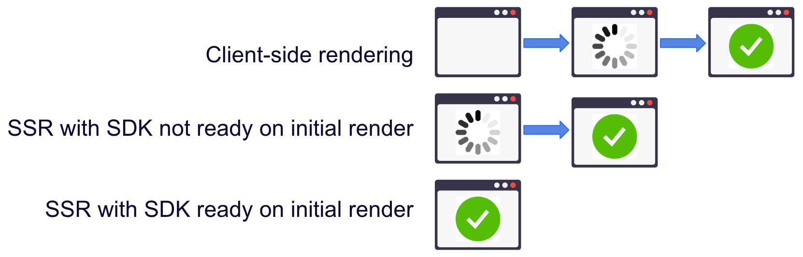

import Tabs from '@theme/Tabs';
import TabItem from '@theme/TabItem';

This guide provides detailed information about our React SDK. This library is built on top of our regular [JavaScript SDK](/docs/feature-management-experimentation/sdks-and-infrastructure/client-side-sdks/javascript-sdk) to ease the integration in React applications by providing a set of components and custom hooks based on the React Hooks API, so you can interact with the underneath SDK and work towards any use cases. All of our SDKs are open source. Go to our [React SDK GitHub repository](https://github.com/splitio/react-client) to see the source code.

:::info[Migrating from v1.x to v2.x]
Refer to the [migration guide](https://github.com/splitio/react-client/blob/development/MIGRATION-GUIDE.md) for information on upgrading to v2.x.
:::

:::info[Deprecated HOCs & components]
High-Order-Components (`withSplitFactory`, `withSplitClient`, and `withSplitTreatments`) and components that accept a render function as child component (`SplitTreatments` and `SplitClient`) have been deprecated and might be removed in a future major release.

The deprecation is intended to simplify the API and discourage using old patterns (HOCs and render props) in favor of the *hook* alternatives, to take advantage of React optimizations.

Although these components are still working, we recommend migrating to the `SplitFactoryProvider` component and library hooks. Refer to the [migration guide](https://github.com/splitio/react-client/blob/development/MIGRATION-GUIDE.md#migrating-to-react-sdk-v200) for more details.
:::

## Language support

The Harness FME React SDK requires React 16.8.0 or above, since it uses the **React Hooks API** introduced in that version.

The SDK supports all major web browsers. It was built to support ES5 syntax but it depends on native support for ES6 `Promise`, `Map`, and `Set` objects, so these objects need to be **polyfilled** if they are not available in your target browsers, like IE 11.

If you're looking for possible polyfill options, check [es6-promise](https://github.com/stefanpenner/es6-promise), [es6-map](https://github.com/medikoo/es6-map) and [es6-set](https://github.com/medikoo/es6-set) for `Promise`, `Map` and `Set` polyfills respectively.

:::tip[Rule-based segments support]
Rule-based segments are supported in SDK versions 2.3.0 and above. No changes are required to your SDK implementation, but updating to a supported version is required to ensure compatibility.

Older SDK versions will return the control treatment for flags using rule-based segments and log an impression with a special label for unsupported targeting rules.
:::

## Initialization

Set up FME in your code base in two steps.

### 1. Import the SDK into your project

You can import the SDK into your project using one of the following three methods:

<Tabs>
<TabItem value="NPM (recommended)">

```bash
npm install --save @splitsoftware/splitio-react
```

</TabItem>
<TabItem value="Yarn">

```bash
yarn add @splitsoftware/splitio-react
```

</TabItem>
<TabItem value="CDN bundle">

```html
<!-- Don't forget to include React script tags before the SDK. More details at https://reactjs.org/docs/add-react-to-a-website.html#step-2-add-the-script-tags  -->
<script src="//cdn.split.io/sdk/splitio-react-2.4.0.min.js"></script>

```

</TabItem>
</Tabs>

### 2. Instantiate the SDK and create a new SDK factory client

The code examples below show how to instantiate the SDK. The code creates a SDK factory, which begins downloading your rollout plan so you can evaluate feature flags, and creates a client.

<Tabs>
<TabItem value="JavaScript (using CDN)">

```javascript
// CDN will expose the library globally with the "splitio" variable. Use the options that work best with your code.
const { SplitFactoryProvider } = window.splitio;

// Create the config for the SDK factory.
const sdkConfig = {
  core: {
    authorizationKey: 'YOUR_CLIENT_SIDE_SDK_KEY',
    // key represents your internal user id, or the account id that
    // the user belongs to.
    // This could also be a cookie you generate for anonymous users.
    key: 'key'
  }
};

// Using the SplitFactoryProvider component, MyApp component and all its descendants have access to the SDK functionality.
const App = () => (
  <SplitFactoryProvider config={sdkConfig} >
    <MyApp />
  </SplitFactoryProvider>
);
```

</TabItem>
<TabItem value="JavaScript">

```javascript
// The npm package exposes the different components and functions of the library as named exports.
const { SplitFactoryProvider } = require('@splitsoftware/splitio-react');

// Create the config for the SDK factory.
const sdkConfig = {
  core: {
    authorizationKey: 'YOUR_CLIENT_SIDE_SDK_KEY',
    // key represents your internal user id, or the account id that
    // the user belongs to.
    // This could also be a cookie you generate for anonymous users.
    key: 'key'
  }
};

// Using the SplitFactoryProvider component, MyApp component and all its descendants have access to the SDK functionality.
const App = () => (
  <SplitFactoryProvider config={sdkConfig} >
    <MyApp />
  </SplitFactoryProvider>
);
```

</TabItem>
<TabItem value="TypeScript">

```javascript
// The npm package exposes the different components and functions of the library as named exports.
import { SplitFactoryProvider } from '@splitsoftware/splitio-react';

// Create the config for the SDK factory.
const sdkConfig: SplitIO.IBrowserSettings = {
  core: {
    authorizationKey: 'YOUR_CLIENT_SIDE_SDK_KEY',
    // key represents your internal user id, or the account id that
    // the user belongs to.
    // This could also be a cookie you generate for anonymous users.
    key: 'key'
  }
};

// Using the SplitFactoryProvider component, MyApp component and all its descendants have access to the SDK functionality.
const App: React.ComponentType = () => (
  <SplitFactoryProvider config={sdkConfig} >
    <MyApp />
  </SplitFactoryProvider>
);
```

</TabItem>
</Tabs>

**For more flexibility** as we wanted to support most use cases, the `SplitFactoryProvider` component can receive the factory already instantiated for our React SDK to use it. If you're using the JavaScript SDK already, it is recommended that you follow the Singleton Pattern and keep only one instance of the factory at all times, which you can provide to the React SDK following the approach shown below.

You could access the JavasScript SDK factory function through the `SplitFactory` named export of the React SDK too, which points to the original JavaScript SDK function so you don't need to import two different Split packages.

**Note that you shouldn't mix the two options**. Either provide a config or a factory instance. If both are provided, config will be ignored and you'll get a warning log.

When using the **`config`** prop, the `SplitFactoryProvider` component automatically instantiates and shuts down the SDK factory when the component is mounted and unmounted respectively.

Therefore, you should use the `config` prop for simpler setups where you know that the component [state in the render tree](https://react.dev/learn/preserving-and-resetting-state) will not reset, i.e., it will not be unmounted and mounted again (for instance, when you have a single `SplitFactoryProvider` component in the root or near the root of your app). Otherwise, a new factory instance will be created (if you pass a new `config` object) or the factory will be re-initialized (if you pass a reference to the same `config` object and the component is mounted again).

When using the **`factory`** prop, the `SplitFactoryProvider` component doesn't shut down the SDK automatically. You should handle the [shutdown](/docs/feature-management-experimentation/sdks-and-infrastructure/client-side-sdks/javascript-sdk#shutdown) yourself.

You can use it for more complex setups. For example, when you need to use the `SplitFactoryProvider` component in different parts of your app, or when the `SplitFactoryProvider` is nested in a component that might be unmounted and mounted again, for example in a tabbed view, or a micro-frontend architecture. In these cases, you can create the factory instance as a global variable, and pass it down to the `SplitFactoryProvider` components.

```javascript title="TypeScript"
// The npm package exposes the different components and functions of the library as named exports.
// If you were using the bundle via CDN, it'll be at `window.splitio.SplitFactory`
import { SplitFactory, SplitFactoryProvider } from '@splitsoftware/splitio-react';

// Create the SDK factory object with your custom settings, using the re-exported function.
const factory: SplitIO.IBrowserSDK = SplitFactory({
  core: {
    authorizationKey: 'YOUR_CLIENT_SIDE_SDK_KEY',
    key: 'key'
  },
  ...
});

// Using the SplitFactoryProvider component, MyApp component and all it's descendants will have access to the SDK functionality using the provided factory.
const App: React.ComponentType = () => (
  <SplitFactoryProvider factory={factory} >
    <MyApp />
  </SplitFactoryProvider>
);
```

:::info[Notice for TypeScript]
With the SDK package on NPM, you get the SplitIO namespace, which contains useful types and interfaces for you to use.

Feel free to dive into the declaration files if IntelliSense is not enough!
:::

We recommend instantiating the SDK factory once as a singleton and reusing it throughout your application.

Configure the SDK with the SDK key for the FME environment that you would like to access. In legacy Split (app.split.io) the SDK key is found on your Admin settings page, in the API keys section. Select a client-side SDK API key. This is a special type of API token with limited privileges for use in browsers or mobile clients.  See [API keys](/docs/feature-management-experimentation/management-and-administration/account-settings/api-keys) to learn more.

## Using the SDK

### Get treatments with configurations

When the SDK is instantiated, it kicks off background tasks to update an in-memory cache with small amounts of data fetched from Harness servers. This process can take up to a few hundred milliseconds depending on the size of data. If the SDK is asked to evaluate which treatment to show to a customer for a specific feature flag while its in this intermediate state, it may not have the data necessary to run the evaluation. In this case, the SDK does not fail, rather, it returns [the control treatment](/docs/feature-management-experimentation/feature-management/setup/control-treatment).

To make sure the SDK is properly loaded before asking it for a treatment, block until the SDK is ready, as shown below. We provide the `isReady` boolean prop based on the client that will be used by the component. Internally we listen for the `SDK_READY` event triggered by given SDK factory client to set the value of `isReady`.

After the `isReady` prop is set to true, you can use the SDK. The `useSplitTreatments` hook returns the proper treatments based on the `names` prop value passed to it and the `core.key` value you passed in the config when instantiating the SDK. Then use the `treatments` property to access the treatment values as well as the corresponding [dynamic configurations](/docs/feature-management-experimentation/feature-management/setup/dynamic-configurations) that you defined in Harness FME. Remember to handle the client returning control as a safeguard.

Similarly to the vanilla JS SDK, React SDK supports the ability to evaluate flags based on cached content when using [LOCALSTORAGE](/docs/feature-management-experimentation/sdks-and-infrastructure/client-side-sdks/javascript-sdk#configuration) as storage type. In this case, the `isReadyFromCache` prop will change to true almost instantly since access to the cache is synchronous, allowing you to consume flags earlier on components that are critical to your UI. Keep in mind that the data might be stale until `isReady` prop is true. Read more [below](#subscribe-to-events-and-changes).

<Tabs>
<TabItem value="With useSplitTreatments hook">

```javascript
import { useSplitTreatments } from '@splitsoftware/splitio-react';
import MyComponentV1 from './MyComponentV1';
import MyComponentV2 from './MyComponentV2';

const featureName = 'FEATURE_FLAG_NAME';

function renderContent(treatmentWithConfig, props) {
  const { treatment, config } = treatmentWithConfig;

  if (treatment === 'on') return (<MyComponentV2 config={config} {...props} />);

  return (<MyComponentV1 config={config} {...props} />);
}

/**
 * This is another way to write a toggler with a function component that uses hooks.
 **/
function MyComponentToggle (props) {

  // evaluate feature flags with the `useSplitTreatments` hook
  const { treatments, isReady } = useSplitTreatments({ names: [featureName] });

  return isReady ?
    renderContent(treatments[featureName], props) : // Use the treatments and configs.
    <Spinner />; // Render a spinner if the SDK is not ready yet.
}

export default MyComponentToggle;
```

</TabItem>
<TabItem value="With SplitTreatments component (deprecated)">

```javascript
import { SplitTreatments } from '@splitsoftware/splitio-react';
import MyComponentV1 from './MyComponentV1';
import MyComponentV2 from './MyComponentV2';

const featureName = 'FEATURE_FLAG_NAME';

/**
 * This is one way to write a toggler component, which might be convenient for code cleanup afterwards
 * as you remove both toggle and legacy component, then wire the version you'll keep.
 * But it's not the only way to use the treatments. Always follow the pattern that works best for you!
 **/
export default class MyComponentToggle extends React.Component {

  renderContent(treatmentWithConfig) {
    const { treatment, config } = treatmentWithConfig;

    if (treatment === 'on') return (<MyComponentV2 config={config} {...this.props} />);

    return (<MyComponentV1 config={config} {...this.props} />);
  }

  render() {
    return (
      <SplitTreatments names={[featureName]} >
        {({ treatments, isReady }) => { // Passes down a TreatmentsWithConfig object and SplitContext properties like the boolean `isReady` flag.
          return isReady ?
            this.renderContent(treatments[featureName]) : // Use the treatments and configs.
            <Spinner />; // Render a spinner if the SDK is not ready yet. You can do what you want with this boolean.
        }}
      </SplitTreatments>
    );
  }
}
```

</TabItem>
</Tabs>

The treatments property/value returned by this library has the following shape:

```javascript title="TypeScript"
type TreatmentWithConfig = {
  treatment: string,
  config: string | null
};

type TreatmentsWithConfig = {
  [featureName: string]: TreatmentWithConfig
};
```

As you can see from the object structure, the config will be a stringified version of the configuration JSON defined in Harness FME. If there is no configuration defined for a treatment, the SDK returns `null` for the config parameter.

In some instances, you may want to evaluate treatments for multiple feature flags at once using flag sets. In that case, you can use the `useSplitTreatments` hook with the `flagSets` property rather than the `names` property. Like `names`, the `flagSets` property is an array of strings, each one corresponding to a different flag set name.

<Tabs>
<TabItem value="Flag sets with useSplitTreatments hook">

```javascript
import { useSplitTreatments } from '@splitsoftware/splitio-react';
import MyComponentV1 from './MyComponentV1';
import MyComponentV2 from './MyComponentV2';

const flagSets = ['frontend', 'client_side'];
const featureName = 'FEATURE_FLAG_NAME';

function renderContent(treatmentWithConfig, props) {
  const { treatment, config } = treatmentWithConfig;

  if (treatment === 'on') return (<MyComponentV2 config={config} {...props} />);

  return (<MyComponentV1 config={config} {...props} />);
}

function MyComponentToggle (props) {

  const { treatments, isReady } = useSplitTreatments({ flagSets: flagSets });

  return isReady ?
    // If your flag sets are not properly configured, `treatments` might be an empty object
    // or it might not contain the feature flags you expect.
    renderContent(treatments[featureName] || { treatment: 'control' }, props) :
    <Spinner />;
}

export default MyComponentToggle;
```

</TabItem>
<TabItem value="Flag sets with SplitTreatments component (deprecated)">

```javascript
import { SplitTreatments } from '@splitsoftware/splitio-react';
import MyComponentV1 from './MyComponentV1';
import MyComponentV2 from './MyComponentV2';

const flagSets = ['frontend', 'client_side'];
const featureName = 'FEATURE_FLAG_NAME';

export default class MyComponentToggle extends React.Component {

  renderContent(treatmentWithConfig) {
    const { treatment, config } = treatmentWithConfig;

    if (treatment === 'on') return (<MyComponentV2 config={config} {...this.props} />);

    return (<MyComponentV1 config={config} {...this.props} />);
  }

  render() {
    return (
      <SplitTreatments flagSets={flagSets} >
        {({ treatments, isReady }) => {
          return isReady ?
            // If your flag sets are not properly configured, `treatments` might be an empty object
            // or it might not contain the feature flags you expect.
            this.renderContent(treatments[featureName] || { treatment: 'control' }) :
            <Spinner />;
        }}
      </SplitTreatments>
    );
  }
}
```

</TabItem>
</Tabs>

### Attribute syntax

To [target based on custom attributes](/docs/feature-management-experimentation/feature-management/targeting/target-with-custom-attributes), the SDK needs to be passed an attribute map at runtime. In the example below, we are rolling out a feature flag to users. The provided attributes `plan_type`, `registered_date`, `permissions`, `paying_customer`, and `deal_size` are passed to the underlying `getTreatmentsWithConfig` or `getTreatmentsWithConfigByFlagSets` call, whether you are evaluating using the `names` or `flagSets` property respectively. These attributes are compared and evaluated against the attributes used in the rollout plan as defined in Harness FME to decide whether to show the `on` or `off` treatment to this account. The SDK supports five types of attributes: strings, numbers, dates, booleans, and sets. The proper data type and syntax for each are:

* **Strings:** Use type String.
* **Numbers:** Use type Number.
* **Dates: ** Use type Date and express the value in `milliseconds since epoch`. <br />*Note:* Milliseconds since epoch is expressed in UTC. If your date or date-time combination is in a different timezone, first convert it to UTC, then transform it to milliseconds since epoch.
* **Booleans:** Use type Boolean.
* **Sets:** Use type Array.

<Tabs groupId="java-type-script">
<TabItem value="JavaScript">

```javascript
const attributes = {
  // date attributes are handled as `millis since epoch`
  registered_date: new Date('YYYY-MM-DDTHH:mm:ss.sssZ').getTime(),
  // this string will be compared against a list called `plan_type`
  plan_type: 'growth',
  // this number will be compared agains a const value called `deal_size`
  deal_size: 10000,
  // this boolean will be compared against a const value called `paying_customer`
  paying_customer: true,
  // this array will be compared against a set called `permissions`
  permissions: ['read', 'write']
};

const ComponentWithTreatments = () => {
  const { treatments, isReady } = useSplitTreatments({ names: [featureName], attributes: attributes });

  const treatment = treatments[featureName].treatment;

  return isReady ?
    treatment === 'on' ?
      <OnComponent /> :
      <OffComponent />:
    <LoadingComponent />
};
```

</TabItem>
<TabItem value="TypeScript">

```javascript
const attributes: SplitIO.Attributes = {
  // date attributes are handled as `millis since epoch`
  registered_date: new Date('YYYY-MM-DDTHH:mm:ss.sssZ').getTime(),
  // this string will be compared against a list called `plan_type`
  plan_type: 'growth',
  // this number will be compared agains a const value called `deal_size`
  deal_size: 10000,
  // this boolean will be compared against a const value called `paying_customer`
  paying_customer: true,
  // this array will be compared against a set called `permissions`
  permissions: ['read', 'write']
};

const ComponentWithTreatments = () => {
  const { treatments, isReady } = useSplitTreatments({ names: [featureName], attributes: attributes });

  const treatment: SplitIO.Treatment = treatments[featureName].treatment;

  return isReady ?
    treatment === 'on' ?
      <OnComponent /> :
      <OffComponent />:
    <LoadingComponent />
};
```

</TabItem>
</Tabs>

### Binding attributes to the client

Attributes can optionally be bound to the `useSplitClient` hook or the `SplitFactoryProvider` component via props. These attributes are stored in memory and used in every evaluation to avoid the need to keep the attribute set accessible through the whole app. When an evaluation is called, for example, with the `useSplitTreatments` hook, the attributes provided (if any) at evaluation time are combined with the ones that are already loaded into the SDK memory, with the ones provided at evaluation time taking precedence. This enables those attributes to be overridden or hidden for specific evaluations.

An attribute is considered valid if it follows one of the types listed below:
- String
- Number
- Boolean
- Array

The SDK validates these before storing them and if there are invalid or missing values, possibly indicating an issue, the storing is not performed.

To use these methods, refer to the example below:

<Tabs>
<TabItem value="Using the hooks">

```javascript
import { SplitFactoryProvider, useSplitClient, useSplitTreatments } from '@splitsoftware/splitio-react';

// Assuming this is how the user setup the factory:
const sdkConfig = {
  core: {
    authorizationKey: 'YOUR_CLIENT_SIDE_SDK_KEY',
    key: 'nicolas@user'
  }
};
// These are the attributes bound to the main client, for key 'nicolas@user'
const userAttributes = {
  permissions: ["read", "write"]
};
// These are the attributes bound to a secondary client, for key 'nicolas@account'
const accountAttributes = {
  permissions: "read"
};
// The are additional attributes for the evaluation
const treatmentAttributes = {
  deal_size: 10000
};

const App = () => (
  <SplitFactoryProvider config={sdkConfig} attributes={userAttributes}>
    <MyComponent accountId='nicolas@account' />
  </SplitFactoryProvider>
);

function MyComponent(props) {

  /*
   * Using the main client bound to the key passed in the config for evaluations
   * and the attributes received on SplitFactoryProvider attributes prop.
   */
  const { isReady, treatments } = useSplitTreatments({ names: ['USER_FEATURE_FLAG_NAME'], attributes: treatmentAttributes });
  // Do something with the treatments for the 'nicolas@user' key.
  // This evaluation combines SplitFactoryProvider component attributes with the ones provided to the useSplitTreatments hook.
  // Then it evaluates with attributes = { permissions: ["read", "write"], deal_size: 10000 }

  // You can retrieve clients for as many keys as you need, although it's not recommended to create more than you absolutely need to.
  // Keep in mind that if it is the first time you retrieve a client, it might not be ready yet.
  const { client: accountClient, isReady } = useSplitClient({ splitKey: this.props.accountId, attributes: accountAttributes });

  if (isReady) {
    // `accountClient` is ready to evaluate treatments as usual. To see more information about the client API, refer to the docs for JavaScript SDK.
    // In this evaluation, `treatmentAttributes`` are combined with `accountAttributes`
    const accountTreatments = accountClient.getTreatments(['ACCOUNT_FEATURE_FLAG_NAME', 'ACCOUNT_FEATURE_FLAG_NAME_2'], treatmentAttributes);

    // Do something with the treatments for the accountId key.
    // This evaluation is for another client, so factory attributes stored in main client will not be taking part.
    // This evaluation combines `treatmentAttributes` with `accountAttributes`.
    // The evaluation attributes are { permissions: "read", deal_size: 10000 }
    return (<div>{...}</div>);
  } else {
    // `accountClient` is not ready
    return (<div>{...}</div>);
  }

}
```

</TabItem>
<TabItem value="Using SplitClient component (deprecated)">

```javascript
import { SplitFactoryProvider, SplitClient, SplitTreatments } from '@splitsoftware/splitio-react';

// Assuming this is how the user setup the factory:
const sdkConfig = {
  core: {
    authorizationKey: 'YOUR_CLIENT_SIDE_SDK_KEY',
    key: 'nicolas@user'
  }
};
// These are the attributes bound to the main client, for key 'nicolas@user'
const userAttributes = {
  permissions: ["read", "write"]
};
// These are the attributes bound to a secondary client, for key 'nicolas@account'
const accountAttributes = {
  permissions: "read"
};
// The are additional attributes for the evaluation
const treatmentAttributes = {
  deal_size: 10000
};

const App = () => (
  <SplitFactoryProvider config={sdkConfig} attributes={userAttributes}>
    <MyComponent accountId='nicolas@account' />
  </SplitFactoryProvider>
);

class MyComponent extends React.Component {

  render() {
    return (
      <div>
        {
         /*
          * Using SplitTreatments as a descendant of the SplitFactoryProvider with no SplitClient wrapping it, uses the main client
          * bound to the key passed in the config for evaluations and the attributes received on SplitFactoryProvider attributes prop.
          */
        }
        <SplitTreatments names={['USER_FEATURE_FLAG_NAME']} attributes={treatmentAttributes}>
          {({ isReady, treatments }) => {
              // Do something with the treatments for the 'nicolas@user' key.
              // This evaluation combines SplitFactoryProvider component attributes with the ones on the SplitTreatments component.
              // Then it evaluates with attributes = { permissions: ["read", "write"], deal_size: 10000 }
          }}
        </SplitTreatments>
        {
         /*
          * To use another client, use the SplitClient component. Keep in mind that
          * this client might not be ready yet if it's just being created and still downloading segments
          * for the new key. Use the `isReady` property to check that.
          */
        }
        <SplitClient splitKey={this.props.accountId} attributes={accountAttributes} >
          <SplitTreatments names={['ACCOUNT_FEATURE_FLAG_NAME', 'ACCOUNT_FEATURE_FLAG_NAME_2']} attributes={treatmentAttributes} >
            {({ isReady, treatments }) => {
                // Do something with the treatments for the accountId key.
                // This evaluation is for another client, so attributes stored in main client will not be taking part.
                // This evaluation combines `treatmentAttributes` with `accountAttributes`.
                // The evaluation attributes are { permissions: "read", deal_size: 10000 }
            }}
          </SplitTreatments>
        </SplitClient>
      </div>
    );
  }
}
```

</TabItem>
</Tabs>

### Append properties to impressions

[Impressions](/docs/feature-management-experimentation/feature-management/monitoring-analysis/impressions) are generated by the SDK each time an evaluation is done using the `useSplitTreatments` hook. These impressions are periodically sent back to Harness servers for feature monitoring and experimentation.

You can append properties to an impression by passing an object of key-value pairs to the `useSplitTreatments` hook. These properties are then included in the impression sent by the SDK and can provide useful context to the impression data.

Three types of properties are supported: strings, numbers, and booleans.

<Tabs groupId="java-type-script">
<TabItem value="JavaScript">

```javascript
const properties = {
  package: "premium",
  admin: true,
  discount: 50
};

const MyComponent = () => {
  const { treatments, isReady, ... } = useSplitTreatments({ names: [featureName], properties: properties });

  return (...);
};
```

</TabItem>
<TabItem value="TypeScript">

```typescript
const properties: SplitIO.Properties = {
  package: "premium",
  admin: true,
  discount: 50
};

const MyComponent = () => {
  const { treatments, isReady, ... } = useSplitTreatments({ names: [featureName], properties: properties });

  return (...);
};
```

</TabItem>
</Tabs>

### Shutdown

If the `SplitFactoryProvider` component is created with a `config` prop, then the component automatically instantiates and shuts down the SDK factory when the component is mounted and unmounted respectively. Otherwise, if the component is created by passing an SDK factory via the `factory` prop, you should handle the [shutdown](/docs/feature-management-experimentation/sdks-and-infrastructure/client-side-sdks/javascript-sdk#shutdown) yourself.

## Track

Use the `useTrack` hook to record any actions your customers perform. Each action is known as an `event` and corresponds to an `event type`. Tracking events through one of our SDKs or via the API is the first step to getting experimentation data into Harness FME and allows you to measure the impact of your features on your users' actions and metrics.

Learn more about using [tracking events](/docs/feature-management-experimentation/release-monitoring/events/) in Harness FME.

To track events, you must follow two steps:
1. Retrieve the client's `track` method, which is available through the `useTrack` hook or the `useSplitClient` hook.
2. Execute the `track` method call, passing in the traffic type and event info as arguments.

In the examples below, you can see that tracking events can take up to four arguments. The proper data type and syntax for each are:

* **TRAFFIC_TYPE:** The traffic type of the key in the track call. The expected data type is **String**. You can only pass values that match the names of [traffic types](/docs/feature-management-experimentation/management-and-administration/fme-settings/traffic-types/) that you have defined Harness FME.
* **EVENT_TYPE:** The event type that this event should correspond to. The expected data type is **String**. Full requirements on this argument are:
     * Contains 63 characters or fewer.
     * Starts with a letter or number.
     * Contains only letters, numbers, hyphen, underscore, or period.
     * This is the regular expression we use to validate the value: `[a-zA-Z0-9][-_\.a-zA-Z0-9]{0,62}`
* **VALUE:** (Optional) The value to be used in creating the metric. This field can be sent in as null or 0 if you intend to purely use the count function when creating a metric. The expected data type is **Integer** or **Float**.
* **PROPERTIES:** (Optional) An object of key value pairs that can be used to filter your metrics. Learn more about event property capture in the [Events](/docs/feature-management-experimentation/release-monitoring/events/#event-properties) guide. FME currently supports three types of properties: strings, numbers, and booleans.

The `track` method returns a boolean value of `true` or `false` to indicate whether or not the SDK was able to successfully queue the event to be sent back to Harness servers on the next event post. The SDK returns `false` if the current queue size is equal to the config set by `eventsQueueSize` config or if an incorrect input has been provided.

In case a bad input is provided, you can read more about our [SDK's expected behavior](/docs/feature-management-experimentation/release-monitoring/events/).

Remember that:
- You must follow [React Hook rules](https://react.dev/reference/rules/rules-of-hooks) when using the `useTrack` or `useSplitClient` hooks, i.e., they must be invoked at the top level of your component or in custom hooks.
- The client's `track` method doesn't require the client to be ready, but it implies a side effect. Therefore, it should be invoked [outside the component render phase](https://react.dev/reference/rules/components-and-hooks-must-be-pure#side-effects-must-run-outside-of-render), such as in a `useEffect` hook or an event handler.

<Tabs>
<TabItem value="useTrack hook">

```javascript
import { useTrack } from '@splitsoftware/splitio-react';

function MyComponent() {
  // With the useTrack hook you can get access to the regular .track() method of the default client.
  const track = useTrack();

  // If you need to track events for a different key or just want to make sure you're tracking for the right key.
  const otherTrack = useTrack('key');

  // Here's what the track function signature looks like:
  // track(trafficType: string, eventType: string, value?: number, properties?: Properties): boolean;

  // Track events into an effect or an event handler to make sure they're not tracked on every render.
  useEffect(() => {
    // Now you can track your events by passing at least the traffic type and the event type.
    let queued = track('user', 'logged_in');

    // Example with both a value and properties
    const properties = { package : "premium", admin : true, discount : 50 };
    queued = track('user', 'page_load_time', 83.334, properties);

    // If the event doesn't have a value but do have properties, skip the value by passing it null.
    queued = track('user', 'logged_in', null, properties);
  }, []);

  return <button onClick={() => track('user', 'login_click')}>Login</button>
}
```

</TabItem>
<TabItem value="useSplitClient hook">

```typescript
import { useTrack } from '@splitsoftware/splitio-react';

function MyComponent() {
  // With the useSplitClient hook you can get access to the default client and its .track() method
  const defaultClient = useSplitClient().client;

  // If you need to track events for a different key or just want to make sure you're tracking for the right key
  const otherClient = useSplitClient({ splitKey: 'key' });

  // Track events into an effect or an event handler to make sure they're not tracked on every render.
  useEffect(() => {
    // Now you can track your events by passing at least the traffic type and the event type.
    let queued: boolean = client.track('user', 'logged_in');

    // Example with both a value and properties
    const properties: SplitIO.Properties = { package : "premium", admin : true, discount : 50 };
    queued = client.track('user', 'page_load_time', 83.334, properties);

    // If the event doesn't have a value but does have properties, skip the value by passing it null.
    queued = client.track('user', 'logged_in', null, properties);
  }, []);

  return <button onClick={() => client.track('user', 'login_click')}>Login</button>
}
```

</TabItem>
</Tabs>

## Configuration

The SDK has a number of knobs for configuring performance. Each knob is tuned to a reasonable default. However, you can override the value while providing the config to the `SplitFactoryProvider` as shown in the Initialization section of this doc. To learn about the available configuration options, go to the [JavaScript SDK Configuration section](/docs/feature-management-experimentation/sdks-and-infrastructure/client-side-sdks/javascript-sdk#configuration).

## Localhost mode

For testing, a developer can put code behind feature flags on their development machine without the SDK requiring network connectivity. To do this, start the SDK in **localhost** mode (also called off-the-grid mode). In this mode, the SDK neither polls or updates from Harness servers. Instead, it uses an in-memory data structure to determine what treatments to show to the logged in customer for each of the features.

When instantiating the SDK in localhost mode, your `authorizationKey` is `"localhost"`. Define the feature flags you want to use in the `features` object map. All `useSplitTreatments` calls for a feature flag return the treatment (and config, if defined) that you have defined in the map. You can then change the treatment as necessary for your testing. If you want to update a treatment or a config, or to add or remove feature flags from the mock cache, update the properties of the `features` object you've provided. The SDK simulates polling for changes and updates from the `features` object. Do not assign a new object to the `features` property because the SDK has a reference to the original object and will not detect the change.

Any feature that is not provided in the `features` map returns the [control treatment](/docs/feature-management-experimentation/feature-management/setup/control-treatment) if the SDK is asked to evaluate them. Use the following additional configuration parameters when instantiating the SDK in `localhost` mode:

| **Configuration** | **Description** | **Default value** |
| --- | --- | --- |
| scheduler.offlineRefreshRate | The refresh interval for the mocked features treatments. | 15 |
| features | A fixed mapping of which treatment to show for our mocked features. | {} <br />By default we have no mocked features. |

To use the SDK in localhost mode, replace the SDK Key with "localhost", as shown in the following test examples. Note that you can define the object between a feature flag name and treatment directly or use a map to define both a treatment and a dynamic configuration.

If you define just a string as the value for a feature flag name, the config returned by the SDK is null. If you use a map, we return the specified treatment and the specified config, which can also be null.

<Tabs>
<TabItem value="Jest test with React Testing Library">

```javascript
import React from "react";
// React testing library: https://www.npmjs.com/package/@testing-library/react
import { render, waitFor } from "@testing-library/react";
import { SplitFactoryProvider, useSplitTreatments } from "@splitsoftware/splitio-react";

const config = {
  core: {
    authorizationKey: 'localhost',
    key: 'user_id'
  },
  features: {
    'reporting_v2': 'on', // example with just a string value for the treatment
    'billing_updates': { treatment: 'visa', config: '{ "color": "blue" }' }, // example of a defined config
    'show_status_bar': { treatment: 'off', config: null } // example of a null config
  }
};

const MyComponent = () => {
  const { isReady, treatments } = useSplitTreatments({ names=['reporting_v2'] });

  return <div>{`${isReady ? 'SDK ready.' : 'SDK not ready.'} Feature flag reporting_v2 is ${treatments['reporting_v2'].treatment}`}</div>;
}

const MyApp = () => {
  return (
    <SplitFactoryProvider config={config} >
      <MyComponent />
    </SplitFactoryProvider>
  );
};

describe('MyApp', () => {
  test('renders the correct treatment', async () => {
    const { getByText, findByText } = render(<MyApp/>);

    // On the initial rendered output, the SDK is not ready. So treatment values are control.
    expect(getByText('SDK not ready. Feature flag reporting_v2 is control')).toBeTruthy();

    // In localhost mode, the SDK is ready and the component re-rendered with the mocked treatment on next event-loop tick.
    // So we use `findByText` to wait for the component to update.
    expect(await findByText('SDK ready. Feature flag reporting_v2 is on')).toBeTruthy();

    // `waitFor` (https://testing-library.com/docs/dom-testing-library/api-async/#waitfor) can also be used:
    expect(await waitFor(() => getByText('SDK ready. Feature flag reporting_v2 is on')));
  });
});
```

</TabItem>
<TabItem value="Jest test with Enzyme">

```javascript
import React from 'react';
// Enzyme testing utility: https://www.npmjs.com/package/enzyme
import { mount } from 'enzyme';
import { SplitFactoryProvider, useSplitTreatments } from '@splitsoftware/splitio-react';

const config = {
  core: {
    authorizationKey: 'localhost',
    key: 'user_id'
  },
  features: {
    'reporting_v2': 'on', // example with just a string value for the treatment
    'billing_updates': { treatment: 'visa', config: '{ "color": "blue" }' }, // example of a defined config
    'show_status_bar': { treatment: 'off', config: null } // example of a null config
  }
};

const MyComponent = () => {
  const { isReady, treatments } = useSplitTreatments({ names=['reporting_v2'] });

  return <div>{`${isReady ? 'SDK ready.' : 'SDK not ready.'} Feature flag reporting_v2 is ${treatments['reporting_v2'].treatment}`}</div>;
}

const MyApp = () => {
  return (
    <SplitFactoryProvider config={config} >
      <MyComponent />
    </SplitFactoryProvider>
  );
};

describe('MyApp', () => {
  test('renders the correct treatment', (done) => {
    const wrapper = mount(<MyApp/>);

    // On the initial rendered output, the SDK is not ready. So treatment values are control.
    expect(wrapper.html().includes('SDK not ready. Feature flag reporting_v2 is control')).toBeTruthy();

    // In localhost mode, the SDK is ready and the component re-rendered with the mocked treatment on next event-loop tick.
    // So we call `wrapper.update()` in a timeout callback to re-render the component.
    setTimeout(() => {
      wrapper.update();
      expect(wrapper.html().includes('SDK ready. Feature flag reporting_v2 is on')).toBeTruthy();

      done();
    }, 0);
  });
});
```

</TabItem>
<TabItem value="Jest test with React Test Renderer">

```javascript
import React from 'react';
// React Test Renderer: https://reactjs.org/docs/test-renderer.html
import { create } from 'react-test-renderer';
import { SplitFactoryProvider, useSplitTreatments } from '@splitsoftware/splitio-react';

const config = {
  core: {
    authorizationKey: 'localhost',
    key: 'user_id'
  },
  features: {
    'reporting_v2': 'on', // example with just a string value for the treatment
    'billing_updates': { treatment: 'visa', config: '{ "color": "blue" }' }, // example of a defined config
    'show_status_bar': { treatment: 'off', config: null } // example of a null config
  }
};

const MyComponent = () => {
  const { isReady, treatments } = useSplitTreatments({ names=['reporting_v2'] });

  return <div>{`${isReady ? 'SDK ready.' : 'SDK not ready.'} Feature flag reporting_v2 is ${treatments['reporting_v2'].treatment}`}</div>;
}

const MyApp = () => {
  return (
    <SplitFactoryProvider config={config} >
      <MyComponent />
    </SplitFactoryProvider>
  );
};

describe('MyApp', () => {
  test('renders the correct treatment', (done) => {
    const root = create(<MyApp/>);

    // On the initial rendered output, the SDK is not ready. So treatment values are control.
    expect(root.toJSON().children[0]).toEqual('SDK not ready. Feature flag reporting_v2 is control');

    // In localhost mode, the SDK is ready and the component re-rendered with the mocked treatment on next event-loop tick.
    // So we call `root.update` in a timeout callback to re-render the component.
    setTimeout(() => {
      root.update(<MyApp/>);
      expect(root.toJSON().children[0]).toEqual('SDK ready. Feature flag reporting_v2 is on');

      done();
    }, 0);
  });
});
```

</TabItem>
</Tabs>

## Manager

Use the Split manager to get a list of features available to the SDK factory client. To access the Manager in your code base, use the `useSplitManager` hook.

<Tabs groupId="java-type-script">
<TabItem value="JavaScript">

```javascript
import { useSplitManager } from '@splitsoftware/splitio-react';

const { manager, isReady } = useSplitManager();

// Make sure the SDK is ready to return Split's data from the manager object
if (isReady) {
  // Manager is ready to be used.
  const flagNames = manager.names();
}
```

</TabItem>
<TabItem value="TypeScript">

```javascript
import { useSplitManager } from '@splitsoftware/splitio-react';

const { manager, isReady } = useSplitManager();

// Make sure the SDK is ready to return Split's data from the manager object
if (isReady) {
  // Manager is ready to be used.
  const flagNames: SplitIO.SplitNames = manager.names();
}
```

</TabItem>
</Tabs>

To find all the details on the Manager available methods, see the [JavaScript SDK Manager section](/docs/feature-management-experimentation/sdks-and-infrastructure/client-side-sdks/javascript-sdk#manager).

## Listener

FME SDKs send impression data back to Harness servers periodically and as a result of evaluating feature flags. To additionally send this information to a location of your choice, define and attach an *impression listener*. For that purpose, the SDK's configurations have a parameter called `impressionListener` where an implementation of `ImpressionListener` could be added. This implementation **must** define the `logImpression` method and it receives data in the following schema.

| **Name** | **Type** | **Description** |
| --- | --- | --- |
| impression |  | Object | Impression object that has the feature, key, treatment, label, etc. |
| attributes | Object | A map of attributes used on the evaluation (if any). |
| sdkLanguageVersion | String| The version of the SDK. In this case the language is `react` plus the version of the underlying SDK. |

:::info[Note]
There are two additional keys on this object, `ip` and `hostname`. They are not used on the browser.
:::

## Implement custom impression listener

The following is an example of how to implement a custom impression listener:

<Tabs groupId="java-type-script">
<TabItem value="JavaScript">

```javascript
import { SplitFactoryProvider } from '@splitsoftware/splitio-react';

function logImpression(impressionData) {
  // do something with the impression data.
}

// Create the config for the SDK factory.
const sdkConfig = {
  core: {
    authorizationKey: 'YOUR_CLIENT_SIDE_SDK_KEY',
    key: 'key'
  },
  impressionListener: {
    logImpression: logImpression
  }
});

// Using the SplitFactoryProvider component.
const App = () => (
  <SplitFactoryProvider config={sdkConfig} >
    <MyApp />
  </SplitFactoryProvider>
);
```

</TabItem>
<TabItem value="TypeScript">

```javascript
import { SplitFactoryProvider } from '@splitsoftware/splitio-react';

class MyImprListener implements SplitIO.IImpressionListener {
  logImpression(impressionData: SplitIO.ImpressionData) {
    // do something with impressionData
  }
}

// Create the config for the SDK factory.
const sdkConfig = {
  core: {
    authorizationKey: 'YOUR_CLIENT_SIDE_SDK_KEY',
    key: 'key'
  },
  impressionListener: {
    logImpression: new MyImprListener()
  }
});

// Using the SplitFactoryProvider component.
const App: React.ComponentType = () => (
  <SplitFactoryProvider config={sdkConfig} >
    <MyApp />
  </SplitFactoryProvider>
);
```

</TabItem>
</Tabs>

An impression listener is called asynchronously from the corresponding evaluation, but is almost immediate.

Even though the SDK does not fail if there is an exception in the listener, do not block the call stack.

## Logging

To enable SDK logging in the browser, see how the [SDK Logging](/docs/feature-management-experimentation/sdks-and-infrastructure/client-side-sdks/javascript-sdk#logging) works.

This library own logger is not configurable yet, but will be very soon!

## Advanced use cases

This section describes advanced use cases and features provided by the SDK.

### Instantiate multiple SDK clients

Each JavaScript SDK factory client is tied to one specific customer ID at a time which usually belongs to one traffic type (for example, `user`, `account`, `organization`). This enhances performance and reduces data cached within the SDK.

FME supports the ability to release based on multiple traffic types. With traffic types, you can release to `users` in one feature flag and `accounts` in another. If you are unfamiliar with using multiple traffic types, you can learn more [here](/docs/feature-management-experimentation/management-and-administration/fme-settings/traffic-types/).

If you need to roll out feature flags by different traffic types, instantiate multiple SDK clients, one for each traffic type. For example, you may want to roll out the feature `user-poll` by `users` and the feature `account-permissioning` by `accounts`. You can do this by retrieving different clients using the `useSplitClient` hook.

See some examples below:

<Tabs>
<TabItem value="Using the hooks">

```javascript
import { SplitFactoryProvider, useSplitClient } from '@splitsoftware/splitio-react';

// Assuming this is how we setup the factory:
const sdkConfig = {
  core: {
    authorizationKey: 'YOUR_CLIENT_SIDE_SDK_KEY',
    key: 'nicolas@split'
  }
};

const App = () => (
  <SplitFactoryProvider config={sdkConfig} >
    <MyComponentWithFlags accountId='nicolas@account' />
  </SplitFactoryProvider>
);

// An example of how you can access a different SDK factory client to track events or evaluate flags in a function component with `useSplitClient` hook.
function MyComponentWithFlags(props) {

  // Calling useSplitClient with no `splitKey` parameter returns the client on the Split context.
  // In this case the main client associated with the key 'nicolas@split' provided on initialization.
  const { client: inContextClient } = useSplitClient();

  // If client was already instantiated, it is just a getter like in the regular JS SDK.
  const { client: myUserClient } = useSplitClient({ splitKey: 'nicolas@split' });

  console.log(inContextClient === myUserClient); // logs "true"

  // You can retrieve clients for as many keys as you need, although not recommended to create more than you absolutely need to.
  // Keep in mind that if it is the first time you retrieve a client, it might not be ready yet.
  const { client: accountClient, isReady: isReadyAccountClient } = useSplitClient({ splitKey: this.props.accountId });

  if (isReadyAccountClient) {
    // `accountClient` is ready to evaluate treatments as usual. To see more information about the client API go to the docs for JavaScript SDK.
    const accountTreatments = accountClient.getTreatments(['ACCOUNT_FEATURE_FLAG_NAME', 'ACCOUNT_FEATURE_FLAG_NAME_2']);

    return (<div>{...}</div>);
  } else {
    // `accountClient` is not ready
    return (<div>{...}</div>);
  }

}
```

</TabItem>
<TabItem value="Using SplitClient component (deprecated)">

```javascript
import { SplitFactoryProvider, SplitClient } from '@splitsoftware/splitio-react';

// Assuming this is how we setup the factory:
const sdkConfig = {
  core: {
    authorizationKey: 'YOUR_CLIENT_SIDE_SDK_KEY',
    key: 'nicolas@split'
  }
};

const App = () => (
  <SplitFactoryProvider config={sdkConfig} >
    <MyComponentWithFlags accountId='nicolas@account' />
  </SplitFactoryProvider>
);

class MyComponentWithFlags extends React.Component {

  // See how you can use the component to evaluate for multiple clients in your templates.
  render() {
    return (
      <div>
        {
          /*
          * Using SplitTreatments as a descendant of the SplitFactoryProvider with no SplitClient wrapping it,
          * uses the main client bound to the key passed in the config for evaluations.
          * In this case the used key for evaluations is 'nicolas@split'.
          */
        }
        <SplitTreatments names={['USER_FEATURE_FLAG_NAME']} >
          {({ isReady, treatments }) => {
              // Do something with the treatments for the user traffic type.
          }}
        </SplitTreatments>
        {
          /*
          * To use another client, you can use the SplitClient component. Keep in mind that
          * this client might not be ready yet if it's just being created and still downloading segments
          * for the new key, but you can use the isReady property to block until ready.
          */
        }
        <SplitClient splitKey={this.props.accountId}  >
          <SplitTreatments names={['ACCOUNT_FEATURE_FLAG_NAME', 'ACCOUNT_FEATURE_FLAG_NAME_2']} >
            {({ isReady, treatments }) => {
                // Do something with the treatments for the account traffic type.
            }}
          </SplitTreatments>
        </SplitClient>
      </div>
    );
  }
}
```

</TabItem>
</Tabs>

:::info[Number of SDK instances]
While the SDK does not put any limitations on the number of instances that can be created, we strongly recommend keeping the number of SDKs down to **one** or **two**.
:::

### Subscribe to events

The underlying JavaScript SDK has four different events:

* `SDK_READY_FROM_CACHE`. This event fires if you are using the `LOCALSTORAGE` storage type and the SDK is ready to evaluate treatments using a version of your rollout plan cached from a previous session, which may be stale. By default, the `localStorage` API is used to cache the rollout plan (see [Configuration](#configuration) for more information). If data is cached, this event fires almost immediately since access to `localStorage` is fast; otherwise, it doesn't fire.
* `SDK_READY`. This event fires once the SDK is ready to evaluate treatments using the most up-to-date version of your rollout plan, downloaded from Harness servers.
* `SDK_READY_TIMED_OUT`. This event fires if the SDK could not download the data from Harness servers within the time specified by the `readyTimeout` configuration parameter. This event does not indicate that the SDK initialization was interrupted. The SDK continues downloading the rollout plan and fires the `SDK_READY` event when finished. This delayed `SDK_READY` event may happen with slow connections or large rollout plans with many feature flags, segments, or dynamic configurations.
* `SDK_UPDATE`. This event fires whenever your rollout plan is changed. Listen for this event to refresh your app whenever a feature flag or segment is changed in Harness FME.

While you could potentially access the JavaScript SDK factory client from the Split context and track this yourself, this is not trivial. The `useSplitClient` and `useSplitTreatments` hooks accept four optional boolean parameters to trigger the re-render of the component. If the parameters are set to `true` (which is the default), the component re-renders when an `SDK_READY`, `SDK_READY_FROM_CACHE`, `SDK_UPDATE` or `SDK_READY_TIMED_OUT` event fires, and you can take action if you desire to do so.

* For `SDK_READY`, you can set the `updateOnSdkReady` parameter.
* For `SDK_READY_FROM_CACHE`, you can set the `updateOnSdkReadyFromCache` parameter.
* For `SDK_READY_TIMED_OUT`, you can set the `updateOnSdkTimedout` parameter.
* For `SDK_UPDATE`, you can set the `updateOnSdkUpdate` parameter.

The default value for all these parameters is `true`.

The `useSplitClient` and `useSplitTreatments` hooks return the SDK factory client and treatment evaluations respectively, together with a set of **status properties** to conditionally render the component.

These properties consist of the following:

- `isReady`: a boolean indicating if the `SDK_READY` event was triggered.
- `isReadyFromCache`: a boolean indicating if the `SDK_READY_FROM_CACHE` event was triggered.
- `hasTimedout`: a boolean indicating if the `SDK_READY_TIMED_OUT` event was triggered.
- `isTimedout`: a boolean indicating if the `SDK_READY_TIMED_OUT` event was triggered and the SDK is not ready to be consumed. Formally, `isTimedout` is equivalent to `hasTimeout && !isReady`.
- `lastUpdate`: timestamp of the last listened event.

Find an example below:

<Tabs>
<TabItem value="Hooks">

```javascript
function MyApp() {
  // Evaluates feature flags for the main client bound to the key passed in the factory config.
  const { treatments, isReady, isReadyFromCache, hasTimedout, lastUpdate } = useSplitTreatments({ names: ['USER_FEATURE_FLAG_NAME'] });

  // But we can evaluate at a per client basis, and choose when to trigger a re-render.
  // For example, the accountId we only want to update on SDK_READY and SDK_READY_TIMED_OUT. Not on SDK_READY_FROM_CACHE or SDK_UPDATE.
  const { treatments: accountTreatments, isReady: isReadyAccount, hasTimedout: hasTimedoutAccount } = useSplitTreatments({
    names: ['ACCOUNT_FEATURE_FLAG_NAME', 'ACCOUNT_FEATURE_FLAG_NAME_2'],
    splitKey: accountId,
    updateOnSdkReadyFromCache: false, // true by default
    updateOnSdkUpdate: false // true by default
  });

  return (
    <div>
      {
        // Do something with the treatments for the main key
      }
      {
        // Do something with the treatments for the account key
      }
    </div>
  );
};

const App = () => (
  <SplitFactoryProvider config={sdkConfig} >
    <MyApp />
  </SplitFactoryProvider>
);
```

</TabItem>
<TabItem value="Components & HOCs (deprecated)">

```javascript
function MyApp({ isReady, isReadyFromCache, isTimedout, hasTimedout, lastUpdate, factory, client }) {
  return (
    <div>
      <SplitTreatments names={['USER_FEATURE_FLAG_NAME']} >
        {
          // Do something with the treatments for the user key defined in the config.
        }
      </SplitTreatments>

      { /* But we can override that setup at a per client basis, so the account one we only want to
         * update on SDK_READY and SDK_READY_TIMED_OUT */ }
      <SplitClient splitKey={accountId} updateOnSdkReadyFromCache={false} updateOnSdkUpdate={false} >
        <SplitTreatments
          names={['ACCOUNT_FEATURE_FLAG_NAME', 'ACCOUNT_FEATURE_FLAG_NAME_2']}
          updateOnSdkReadyFromCache={false} updateOnSdkUpdate={false}
        >
          {({ isReady, isReadyFromCache, isTimedout, hasTimedout, lastUpdate, treatments }) => {
            // Do something with the treatments for the `accountId` key.
          }}
        </SplitTreatments>
      </SplitClient>
    </div>
  );
};

const App = () => (
  /* Here MyApp function component is passed as a render prop component and not as a React element like <MyApp>.
   * MyApp is called with the SplitContext object as param, which contains the SDK factory, client and status properties.
   * As a child of the SplitClient component, it is called on SDK_READY, SDK_READY_FROM_CACHE,
   * and SDK_UPDATE events, but not on SDK_READY_TIMED_OUT since the `updateOnSdkTimedout` prop is false.
   */
  <SplitFactoryProvider config={sdkConfig}  >
    <SplitClient updateOnSdkTimedout={false} >
      {MyApp}
    </SplitClient>
  </SplitFactoryProvider>
);
```

</TabItem>
</Tabs>

Default values for `updateOnSdk<Event>` options can be overwritten at the `SplitFactoryProvider` component level, and will apply to all child components.

```javascript title="Hooks"
const App = () => (
  <SplitFactoryProvider
    config={sdkConfig}
    updateOnSdkUpdate={false} // overwrite default value for `updateOnSdkUpdate` option to `false` for all child components
  >
    <MyApp />
  </SplitFactoryProvider>
);
```

You can also access the `SplitContext` directly in your components for checking the readiness state of the client. Via the React [`useContext`](https://react.dev/reference/react/useContext) function, you can access the value of the `SplitContext` as shown below:

<Tabs groupId="java-type-script">
<TabItem value="JavaScript">

```javascript
import { useContext } from 'react';
import { SplitContext } from "@splitsoftware/splitio-react";

const MyComponent = () => {
  const { isReady, isTimedout } = useContext(SplitContext);
  return isReady || isTimedout ?
    <MyFeature /> :
    <Loading />
}
```

</TabItem>
<TabItem value="TypeScript">

```typescript
import { useContext } from 'react';
import { SplitContext, ISplitContextValues } from "@splitsoftware/splitio-react";

const MyComponent: React.ComponentType = () => {
  const { isReady, isTimedout }: ISplitContextValues = useContext(SplitContext);
  return isReady || isTimedout ?
    <MyFeature /> :
    <Loading />
}
```

</TabItem>
</Tabs>

The `SplitContext` value object has the following structure:

<Tabs>
<TabItem value="JavaScript/TypeScript">

```typescript
interface SplitContextValue {
  factory: SplitIO.IBrowserSDK,
  client: SplitIO.IBrowserClient,
  isReady: boolean,
  isReadyFromCache: boolean,
  hasTimeout: boolean,
  isTimedout: boolean,
  isDestroyed: boolean,
  lastUpdate: number,
}
```

</TabItem>
</Tabs>

The `SplitContext` exposes the internal factory and client instances of JavaScript SDK which is used underneath. While the React SDK should enable most use cases when using React, you might be in a situation where you must use the SDK factory functionality directly, for example, to manage [User Consent](#user-consent) and [Logging](#logging) configurations. We discourage direct use of these instances unless necessary.

### User consent

The SDK factory allows you to disable the tracking of events and impressions until user consent is explicitly granted or declined. To learn how to configure this feature, refer to the [JavaScript SDK User consent section](/docs/feature-management-experimentation/sdks-and-infrastructure/client-side-sdks/javascript-sdk#user-consent).

### Server-Side Rendering

The SDK follows the rules of React and supports running its components on the server side.

When running the SDK server side, use the `config` prop of the `SplitFactoryProvider` and leave the `factory` prop unassigned. This ensures the HTML rendered on the server matches the initial client render and prevents memory leaks by avoiding a new SDK instance per request.

By default, the `SplitFactoryProvider` creates an SDK instance that isn't ready on the initial render. You can pass an optional `initialRolloutPlan` object in the SDK configuration to initialize it with a predefined rollout plan.

This way, there are two options for server-side rendering:

- With the SDK not ready on the initial render (default behavior)
- With the SDK ready on the initial render (using the `initialRolloutPlan` option)



#### SDK not ready on initial render

If you don't provide an `initialRolloutPlan` in the configuration, the SDK clients start in an unready state during the initial component render. In this state, status properties like `isReady` are `false`, and `useSplitTreatments` returns `'control'`.

Afterwards, the `SplitFactoryProvider` effect initializes the SDK factory. This factory becomes ready on the client side in a subsequent render but does not initialize on the server side.

Code examples:

<Tabs>
<TabItem value="Vanilla SSR">

```javascript
// App.jsx
const SDK_CONFIG = {
  core: {
    authorizationKey: 'YOUR_CLIENT_SIDE_SDK_KEY',
    key: 'YOUR_TRAFFIC_KEY',
  }
};

export const App = () => {
  return (
    <SplitFactoryProvider config={SDK_CONFIG} >
      <MyComponentWithFeatureFlags />
    </SplitFactoryProvider>
  )
};

// server.jsx
import { renderToString } from 'react-dom/server';
import { App } from './App';

app.use('/', (request, response) => {
  const reactHtml = renderToString(<App />);
  response.send(`
    <!DOCTYPE html>
    <html>
      <head><title>My App</title></head>
      <body><div id="root">${reactHtml}</div></body>
    </html>
    <script src="/client.js" async=""></script>
  `);
});

// client.jsx, bundled into client.js
import { hydrateRoot } from 'react-dom/client';
import { App } from './App'

const domNode = document.getElementById('root');
const root = hydrateRoot(domNode, <App />);
```

</TabItem>
<TabItem value="Next.js using Pages Router">

```javascript
// pages/index.jsx
export const getServerSideProps = (async () => {
  ...
  const sdkConfig = {
    core: {
      authorizationKey: 'YOUR_CLIENT_SIDE_SDK_KEY',
      key: 'YOUR_TRAFFIC_KEY',
    }
  }
  return { props: { sdkConfig, ... } }
});

export default function Page(props) {
  return (
    <SplitFactoryProvider config={props.sdkConfig} >
      <MyComponentWithFeatureFlags />
    </SplitFactoryProvider>
  );
};
```

</TabItem>
<TabItem value="Next.js using App Router (v13+)">

```javascript
// SDK components are traditional "Client" components, so you need to use the 'use client' directive to nest with Server components
// https://nextjs.org/docs/app/building-your-application/rendering/client-components

// app/providers.jsx
'use client'

import { SplitFactoryProvider } from '@splitsoftware/splitio-react';

export default function Providers({ children }) {
  const [sdkConfig] = React.useState(() => {
    return {
      core: {
        authorizationKey: 'YOUR_CLIENT_SIDE_SDK_KEY',
        key: 'YOUR_TRAFFIC_KEY',
      }
    }
  });

  return (
    <SplitFactoryProvider config={sdkConfig}>{children}</SplitFactoryProvider>
  );
};

// app/layout.jsx
import Providers from './providers';

export default function RootLayout({ children }) {
  return (
    <html lang='en'>
      <head />
      <body>
        <Providers>{children}</Providers>
      </body>
    </html>
  );
};

// app/page.jsx
import { MyComponentWithFeatureFlags } from './MyComponentWithFeatureFlags';

export default async function Page() {
  // Any additional server-side data you need to pass to your components
  const props = await fetchData();

  return (
    <MyComponentWithFeatureFlags {...props} />
  );
}

// app/MyComponentWithFeatureFlags.jsx
'use client'

import { useSplitTreatments } from '@splitsoftware/splitio-react';

const FEATURE_FLAG_NAME = 'test_split';

export const MyComponentWithFeatureFlags = (props) => {
  const { treatments, isReady } = useSplitTreatments({ names: [FEATURE_FLAG_NAME] });

  return isReady ?
    treatments[FEATURE_FLAG_NAME].treatment === 'on' ?
      <OnComponent {...props} /> :
      <OffComponent {...props} /> :
    <Loading {...props} />
};
```

</TabItem>
</Tabs>

#### SDK ready from cache on initial render

When you provide an `initialRolloutPlan` in the configuration, the SDK clients becomes **ready from cache** immediately, including the initial component tree render.

In this state, the `isReadyFromCache` status property is `true` and `useSplitTreatments` returns treatments based on the feature flag definitions in the `initialRolloutPlan`.

To get the rollout plan snapshot and pass it to the SDK via `initialRolloutPlan`, follow these steps:

1. Extract the rollout plan snapshot using the Node.js SDK factory's `getRolloutPlan` method.
2. Create the SDK configuration object with the `initialRolloutPlan` option.
3. Serialize and inject the SDK configuration object into the rendered HTML. You can do this manually (see the "Vanilla SSR" example below) or use framework-specific methods, like Next.js's `getServerSideProps` function (see the "Next.js using Pages Router" example below).
4. Pass the SDK configuration object to the `SplitFactoryProvider` component.

Code examples:

<Tabs>
<TabItem value="Vanilla SSR">

```javascript
// MyComponentWithFeatureFlags.jsx
import { useSplitTreatments } from '@splitsoftware/splitio-react';

const FEATURE_FLAG_NAME = 'test_split';

export const MyComponentWithFeatureFlags = () => {
  const { treatments, isReady, isReadyFromCache } = useSplitTreatments({ names: [FEATURE_FLAG_NAME] });

  return isReady || isReadyFromCache ?
    treatments[FEATURE_FLAG_NAME].treatment === 'on' ?
      <OnComponent /> :
      <OffComponent /> :
    <Loading />
};

// App.jsx
import { SplitFactoryProvider } from '@splitsoftware/splitio-react';
import { MyComponentWithFeatureFlags } from './MyComponentWithFeatureFlags';

export const App = ({sdkConfig}) => {
  return (
    <SplitFactoryProvider config={sdkConfig} >
      <MyComponentWithFeatureFlags />
    </SplitFactoryProvider>
  )
};

// server.jsx
import { renderToString } from 'react-dom/server';
import { App } from './App';
import { SplitFactory } from '@splitsoftware/splitio';

const serverSideSdk = SplitFactory({
  core: {
    authorizationKey: 'YOUR_SERVER_SIDE_SDK_KEY'
  }
});

app.use('/', (request, response) => {
  const trafficKey = request.query.trafficKey;
  const sdkConfig = {
    core: {
      // In this example, traffic key is provided via a request query parameter
      key: trafficKey,
      authorizationKey: 'YOUR_CLIENT_SIDE_SDK_KEY'
    },
    // Calling `getRolloutPlan` with the configuration traffic key to include its segment memberships
    initialRolloutPlan: serverSideSdk.getRolloutPlan({ keys: [trafficKey] })
  };

  const reactHtml = renderToString(<App sdkConfig={sdkConfig} />);
  response.send(`
    <!DOCTYPE html>
    <html>
      <script>
        // Inject the SDK configuration properly sanitized to prevent cross-site scripting (XSS) attacks or code injections
        window.SDK_CONFIG = ${JSON.stringify(sdkConfig).replace(/</g, '\\u003c')}
      </script>
      <head><title>My App</title></head>
      <body><div id="root">${reactHtml}</div></body>
    </html>
    <script src="/client.js" async=""></script>
  `);
});

// client.jsx, bundled into client.js
import { hydrateRoot } from 'react-dom/client';
import { App } from './App'

const domNode = document.getElementById('root');

// pass window.SDK_CONFIG
const root = hydrateRoot(domNode, <App sdkConfig={window.SDK_CONFIG} />);
```

</TabItem>
<TabItem value="Next.js using Pages Router">

```javascript
// pages/index.jsx
import { SplitFactoryProvider } from '@splitsoftware/splitio-react'
import { SplitFactory } from '@splitsoftware/splitio';

let serverSideSdk;

export const getServerSideProps = (async (request) => {
  if (!serverSideSdk) {
    serverSideSdk = SplitFactory({
      core: {
        authorizationKey: 'YOUR_SERVER_SIDE_SDK_KEY'
      }
    })
  }

  await serverSideSdk.client().ready();

  const trafficKey = request.query.trafficKey;
  const sdkConfig = {
    core: {
      // In this example, traffic key is provided via a request query parameter
      key: trafficKey,
      authorizationKey: 'YOUR_CLIENT_SIDE_SDK_KEY',
    },
    // Calling `getRolloutPlan` with the configuration traffic key to include its segment memberships
    initialRolloutPlan: serverSideSdk.getRolloutPlan({ keys: [trafficKey] });
  }
  return { props: { sdkConfig, ... } }
});

export default function Page(props) {
  return (
    <SplitFactoryProvider config={props.sdkConfig} >
      <MyComponentWithFeatureFlags />
    </SplitFactoryProvider>
  );
};
```

</TabItem>
<TabItem value="Next.js using App Router (v13+)">

```javascript
// SDK components are traditional "Client" components, so you need to use the 'use client' directive to nest with Server components
// https://nextjs.org/docs/app/building-your-application/rendering/client-components

// app/providers.jsx
'use client'

import { SplitFactoryProvider } from '@splitsoftware/splitio-react';

export default function Providers({ children, sdkConfig }) {
  return (
    <SplitFactoryProvider config={sdkConfig}>{children}</SplitFactoryProvider>
  );
};

// app/layout.jsx
import { SplitFactory } from '@splitsoftware/splitio';
import { cookies } from 'next/headers';
import Providers from './providers';

// In this example, traffic key is provided via a cookie
const cookieStore = cookies();
let serverSideSdk;

async function getClientSideConfig() {
  if (!serverSideSdk) {
    serverSideSdk = SplitFactory({
      core: {
        authorizationKey: 'YOUR_SERVER_SIDE_SDK_KEY'
      }
    })
  }

  await serverSideSdk.client().ready();

  const trafficKey = cookieStore.get('trafficKey')?.value || 'anonymous';

  return {
    core: {
      key: trafficKey,
      authorizationKey: 'YOUR_CLIENT_SIDE_SDK_KEY',
    },
    // Calling `getRolloutPlan` with the configuration traffic key to include its segment memberships
    initialRolloutPlan: serverSideSdk.getRolloutPlan({ keys: [trafficKey] })
  }
}

export default async function RootLayout({ children }) {
  const sdkConfig = await getClientSideConfig();

  return (
    <html lang='en'>
      <head />
      <body>
        <Providers sdkConfig={sdkConfig} >{children}</Providers>
      </body>
    </html>
  );
};

// app/page.jsx
import { MyComponentWithFeatureFlags } from './MyComponentWithFeatureFlags';

export default async function Page() {
  // Any additional server-side data you need to pass to your components
  const props = await fetchData();

  return (
    <MyComponentWithFeatureFlags {...props} />
  );
}

// app/MyComponentWithFeatureFlags.jsx
'use client'

import { useSplitTreatments } from '@splitsoftware/splitio-react';

const FEATURE_FLAG_NAME = 'test_split';

export const MyComponentWithFeatureFlags = (props) => {
  const { treatments, isReady, isReadyFromCache } = useSplitTreatments({ names: [FEATURE_FLAG_NAME] });

  return isReady || isReadyFromCache ?
    treatments[FEATURE_FLAG_NAME].treatment === 'on' ?
      <OnComponent {...props} /> :
      <OffComponent {...props} /> :
    <Loading {...props} />
};
```

</TabItem>
</Tabs>

### Usage with the React Native SDK

The React SDK can be used in React Native applications by combining it with the React Native SDK. For that, you need to instantiate a factory with the React Native SDK and pass it to the React SDK `SplitFactoryProvider` component. The React SDK will use the factory to create the client and evaluate the feature flags.

<Tabs groupId="java-type-script">
<TabItem value="JavaScript">

```javascript
import { SplitFactory } from '@splitsoftware/splitio-react-native';
import { SplitFactoryProvider } from '@splitsoftware/splitio-react';

const reactNativeFactory = SplitFactory({
  core: {
    authorizationKey: 'YOUR_CLIENT_SIDE_SDK_KEY',
    key: 'key'
  },
  ...
});

// Using the SplitFactoryProvider component, MyApp component and all it's descendants will have access to the SDK functionality using the provided React Native SDK factory.
const App = () => (
  <SplitFactoryProvider factory={reactNativeFactory} >
    <MyApp />
  </SplitFactoryProvider>
);
```

</TabItem>
</Tabs>

### Using the React SDK outside of components

While the React SDK provides convenient React components and hooks, you can also access feature flag treatments directly through JavaScript code.

Since the React SDK is built on top of the JavaScript SDK core, it supports all objects and functions provided by it.

```javascript
import { SplitFactory } from "@splitsoftware/splitio-react";

const splitFactory = SplitFactory({
  core: {
    authorizationKey: 'YOUR_CLIENT_SIDE_SDK_KEY',
    key: 'key'
  }
});

// Create a new client object
const client = splitFactory.client("userId");
const treatment = client.getTreatment("splitName");
```

## Example apps

The following are example applications showing how you can integrate the React SDK into your code.

* [React single-page-app example](https://github.com/splitio/react-sdk-examples/tree/master/single-page-app)
* [React server-side rendering example](https://github.com/splitio/react-sdk-examples/tree/master/server-side-rendering)
* [React single-page app with TypeScript example](https://github.com/splitio/react-typescript-sdk-examples)

## Troubleshooting

### Handling traffic keys that aren’t available at initial render

On initial client-side render in React, the user traffic key (used for flag targeting) might not yet be available, for example, if the user hasn’t logged in yet.

The React SDK’s `SplitFactoryProvider` initializes the underlying JS SDK factory with a traffic key immediately, so you need a way to handle a missing or “dummy” key at first, and then update it once the user logs in.

The React SDK supports multiple clients sharing the same factory but with different traffic keys. The recommended approach is to configure the SDK initially with a dummy key. Once the real traffic key becomes available (e.g., after login), initialize a second client object with the real key.

Starting with React SDK v2.0.0, you can specify the `splitKey` prop in hooks (`useSplitTreatments`, `useTrack`, `useSplitClient`) and in the `<SplitClient>` component. If `splitKey` is omitted, it defaults to the key provided in the factory config.

For example, passing down the `splitKey` prop:

```javascript
import { useState, useEffect } from 'react';
import { SplitFactoryProvider, useSplitTreatments } from '@splitsoftware/splitio-react';

const SDK_CONFIG = {
   core: {
      authorizationKey: 'YOUR-SDK-CLIENT-SIDE-KEY',
      key: getAnonymousId(),
   }
}

const FEATURE_FLAG_NAME = 'test_split';

// Prop drilling `splitKey` to child components
function MyComponent({ splitKey }) {
  const { treatments, isReady } = useSplitTreatments({ names: [FEATURE_FLAG_NAME], splitKey });

  return isReady ?
    <p>Treatment for user '{splitKey}' in {FEATURE_FLAG_NAME} is: {treatments[FEATURE_FLAG_NAME].treatment}</p> :
    <p>loading...</p>; // Render a spinner if the SDK client for `splitKey` is not ready yet
}

function App() {
  // Using 'anonymous' as initial userId
  const [userId, setUserId] = useState(SDK_CONFIG.core.key);

  // Update userId to 'logged-in-user' after 3 seconds
  useEffect(() => {
    setTimeout(() => { setUserId('logged-in-user'); }, 3000);
  }, [])

  return (
    <SplitFactoryProvider config={SDK_CONFIG}>
      <MyComponent splitKey={userId} />
    </SplitFactoryProvider>
  );
}

export default App;
```

Or preventing prop drilling of `splitKey`:

```javascript
import { useState, useEffect } from 'react';
import { SplitFactoryProvider, SplitClient, useSplitTreatments } from '@splitsoftware/splitio-react';

const SDK_CONFIG = {
   core: {
      authorizationKey: 'YOUR-CLIENT-SIDE-SDK-KEY',
      key: getAnonymousId(),
   }
}

const FEATURE_FLAG_NAME = 'test_split';

function MyComponent() {
  const { treatments, isReady, client } = useSplitTreatments({ names: [FEATURE_FLAG_NAME] });

  return isReady ?
    <p>Treatment for user '{client.key}' in {FEATURE_FLAG_NAME} is: {treatments[FEATURE_FLAG_NAME].treatment}</p> :
    <p>loading...</p>; // Render a spinner if the SDK client for `userId` is not ready yet
}

function App() {
  // Using 'anonymous' as initial userId
  const [userId, setUserId] = useState(SDK_CONFIG.core.key);

  // Update userId to 'logged-in-user' after 3 seconds
  useEffect(() => {
    setTimeout(() => { setUserId('logged-in-user'); }, 3000);
  }, [])

  return (
    <SplitFactoryProvider config={SDK_CONFIG}>
      <SplitClient splitKey={userId}>
        <MyComponent />
      </SplitClient>
    </SplitFactoryProvider>
  );
}

export default App;
```

An equivalent JavaScript SDK example:

```javascript
import { SplitFactory } from '@splitsoftware/splitio';

/* On initial load of a client-side application */
const SDK_CONFIG = {
   core: {
      authorizationKey: 'YOUR-SDK-CLIENT-SIDE-KEY',
      key: getAnonymousId()
   }
}

const factory = SplitFactory(SDK_CONFIG);

const client = factory.client();

// Attach a callback to run when the client with 'anonymous' key is ready
client.on(client.Events.SDK_READY, doSomething);

// When you get a new user id, for instance, the id of a logged user
const loggedClient = factory.client('logged-in-user');

// Attach a callback to run when the client with 'logged-in-user' key is ready
loggedClient.on(loggedClient.Events.SDK_READY, doSomething);
```