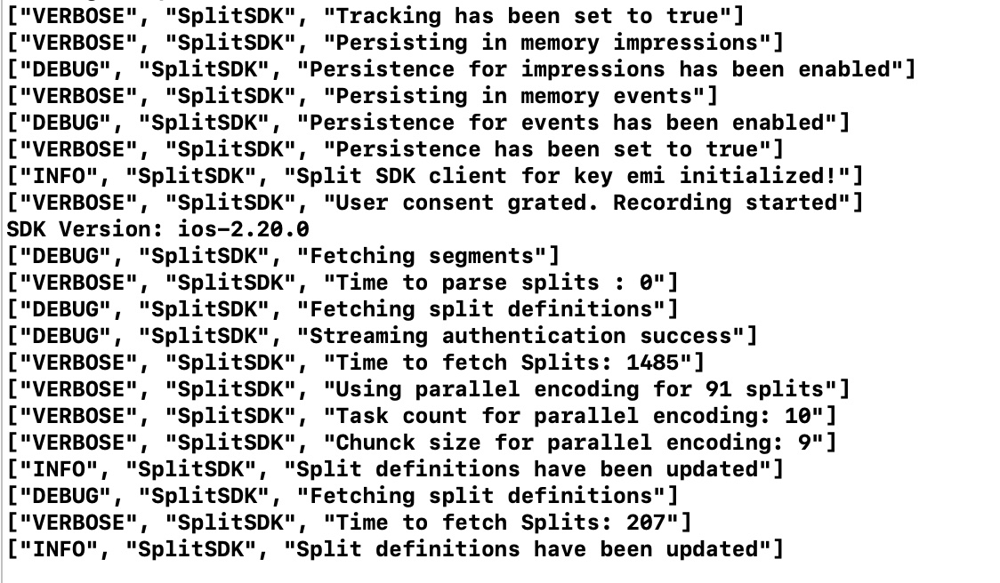

<p>
  <button hidden style={{borderRadius:'8px', border:'1px', fontFamily:'Courier New', fontWeight:'800', textAlign:'left'}}> help.split.io link: https://help.split.io/hc/en-us/articles/26408115004429-iOS-Suite </button>
</p>

This guide provides detailed information about our iOS Suite, an SDK designed to leverage the full power of FME. The iOS Suite is built on top of the [iOS SDK](/docs/feature-management-experimentation/sdks-and-infrastructure/client-side-sdks/ios-sdk) and the [iOS RUM Agent](/docs/feature-management-experimentation/sdks-and-infrastructure/client-side-agents/ios-rum-agent), offering a unified solution, optimized for iOS development.

The Suite provides the all-encompassing essential programming interface for working with your FME feature flags, as well as capabilities for automatically tracking performance measurements and user events. Code currently using iOS SDK or iOS RUM Agent can be easily upgraded to iOS Suite, which is designed as a drop-in replacement.

## Language support

This library is designed for iOS applications written in Swift and is compatible with iOS versions 12 and later.

## Initialization

Set up FME in your code base with the following two steps:

### 1. Import the Suite into your project

Add the Harness FME SDK, RUM agent, and Suite into your project using Swift Package Manager by adding the following package dependencies:

- [iOS SDK] (https://github.com/splitio/ios-client), latest version `3.3.0`
- [iOS RUM](https://github.com/splitio/ios-rum), latest version `0.4.0`
- [iOS Suite](https://github.com/splitio/ios-suite), latest version `2.2.0`

:::info[Important!]
When not using the last version of the SDK Suite, it is important to take into account the compatibility matrix below.
:::

| Suite | SDK | RUM |
|----------|----------|----------|
| 1.0.0    | 2.24.6   | 0.3.0   |
| 1.1.0    | 2.24.7   | 0.4.0   |
| 1.2.0    | 2.25.0   | 0.4.0   |
| 1.3.0    | 2.26.1   | 0.4.0   |
| 2.0.0    | 3.0.0   | 0.4.0   |
| 2.0.1    | 3.0.0   | 0.4.0   |
| 2.1.0    | 3.2.0   | 0.4.0   |
| 2.2.0    | 3.3.0   | 0.4.0   |

Then import the Suite in your code.

```swift title="Swift"
import iOSSplitSuite
```

### 2. Instantiate the Suite and create a new SDK client

In your code, instantiate the Suite client as shown below.

```swift title="Swift"
// Create default Suite configuration
let config = SplitSuiteConfig()

// SDK key
let sdkKey = "YOUR_SDK_KEY"
let matchingKey = Key(matchingKey: "key")

// Create Suite
let suite = SplitSuite.builder()
    .apiKey(sdkKey)
    .key(matchingKey)
    .config(config).build()

// Get Suite client instance
let client = suite?.client;
```

:::info[Important]
If you are upgrading from FME's iOS RUM Agent to iOS Suite and you have setup or config information for the iOS RUM Agent in the `SplitRumAgent-Info.plist`, then this information will be overridden by the Suite initialization. That is why we recommended that you remove this information from that file when upgrading.
:::

When the Suite is instantiated, it starts synchronizing feature flag and segment definitions from Harness servers, and also starts collecting performance and user events for the configured key and its optional traffic type (which if not set, defaults to `'user'`).

We recommend instantiating the Suite once as a singleton and reusing it throughout your application.

Configure the Suite with the SDK key for the FME environment that you would like to access. In legacy Split (app.split.io) the SDK key is found on your Admin settings page, in the API keys section. Select a client-side SDK API key. This is a special type of API token with limited privileges for use in browsers or mobile clients.  See [API keys](/docs/feature-management-experimentation/management-and-administration/account-settings/api-keys) to learn more.

## Using the Suite

### Basic use

When the Suite is instantiated, it starts background tasks to update an in-memory cache with small amounts of data fetched from Harness servers. This process can take up to a few hundred milliseconds depending on the size of the data. If the Suite is asked to evaluate which treatment to show to a user for a specific feature flag while in this intermediate state, it may not have the data necessary to run the evaluation. In this case, the Suite does not fail, rather, it returns [the control treatment](/docs/feature-management-experimentation/feature-management/control-treatment).

To make sure the Suite is properly loaded before asking it for a treatment, block until the Suite is ready, as shown below. We set the client to listen for the `SDK_READY` event triggered by the Suite before asking for an evaluation.

After the `SDK_READY` event fires, you can use the `getTreatment` method to return the proper treatment based on the `FEATURE_FLAG_NAME` and the `key` variables you passed when instantiating the Suite.

You can use an if-else statement as shown below and insert the code for the different treatments that you defined in Harness FME. Remember to handle the client returning control, for example, in the final else statement.

```swift title="Swift"
client?.on(event: SplitEvent.sdkReady) {
  // Evaluate feature flag
  let treatment = client?.getTreatment("FEATURE_FLAG_NAME")

  if treatment == "on" {
      // insert code here to show on treatment
  } else if treatment == "off" {
      // insert code here to show off treatment
  } else {
      // insert your control treatment code here
  }
}
```

### Attribute syntax

To [target based on custom attributes](/docs/feature-management-experimentation/feature-management/target-with-custom-attributes), the Suite's `getTreatment` method needs to be passed an attribute map at runtime.

In the example below, we are rolling out a feature flag to users. The provided attributes `plan_type`, `registered_date`, `permissions`, `paying_customer`, and `deal_size` are passed to the `getTreatment` call. These attributes are compared and evaluated against the attributes used in the rollout plan as defined in Harness FME to decide whether to show the `on` or `off` treatment to this account.

The `getTreatment` method has a number of variations that are described below. Each of these additionally has a variation that takes an attributes argument, which can defines attributes of the following types: strings, numbers, dates, booleans, and sets. The proper data type and syntax for each are:

* **Strings:** Use type `String`.
* **Numbers:** Use type `Int64`.
* **Dates:** Use the value `TimeInterval`. For instance, the value for the `registered_date` attribute below is `Date().timeIntervalSince1970`, which is a `TimeInterval` value.
* **Booleans:** Use type `Bool`.
* **Sets:** Use type `[String]`.

```swift title="Swift"
var attributes: [String:Any] = [:]

attributes["plan_type"] = "growth"
attributes["registered_date"] = Date().timeIntervalSince1970
attributes["deal_size"] = 1000
attributes["paying_customer"] = true
let perms: [String] = ["read", "write"];
attributes["permissions"] = perms

// See client initialization above
let treatment = client?.getTreatment("FEATURE_FLAG_NAME", attributes: attributes)

if treatment == "on" {
    // insert code here to show on treatment
} else if treatment == "off" {
    // insert code here to show off treatment
} else {
    // insert your control treatment code here
}
```

You can pass your attributes in exactly this way to the `client.getTreatments` method.

### Binding attributes to the client

Attributes can be bound to the client at any time during the Suite lifecycle. These attributes will be stored in memory and used in every evaluation to avoid the need for keeping the attribute set accessible through the whole app. These attributes can be cached into the persistent caching mechanism of the Suite making them available for future sessions, as well as part of the SDK_READY_FROM_CACHE flow by setting the `persistentAttributesEnabled` to true. No need to wait for your attributes to be loaded at every session before evaluating flags that use them. 

When an evaluation is called, the attributes provided (if any) at evaluation time are combined with the ones already loaded into the Suite memory, with the ones provided at function execution time take precedence, enabling for those attributes to be overridden or hidden for specific evaluations. 

An attribute is considered valid if it follows one of the types listed below:
- String
- Number
- Boolean
- Array

The Suite validates these before storing them and if there are invalid or missing values, possibly indicating an issue, the methods return the boolean `false` and do not update any value.

The snippet below shows how to update these attributes:

```swift title="Swift"
// Prepare a Map with several attributes
var attributes: [String:Any] = [:]
attributes["plan_type"] = "growth"
attributes["registered_date"] = Date().timeIntervalSince1970
attributes["deal_size"] = 1000

// Now set these on the client
let result = client.setAttributes(attributes)

// Set one attribute
let result = client.setAttribute(name: "registered_date", value: Date().timeIntervalSince1970)

// Get an attribute
let result = client.getAttribute(name: "registered_date")

// Get all attributes
let result = client.getAttributes()

// Remove an attribute
let result = client.removeAttribute(name: "deal_size")

// Remove all attributes
let result = client.clearAttributes()
```

### Multiple evaluations at once

In some instances, you may want to evaluate treatments for multiple feature flags at once. Use the different variations of `getTreatments` method of the SDK client to do this.
* `getTreatments`: Pass a list of the feature flag names you want treatments for.
* `getTreatmentsByFlagSet`: Evaluate all flags that are part of the provided set name and are cached on the Suite instance.
* `getTreatmentsByFlagSets`: Evaluate all flags that are part of the provided set names and are cached on the Suite instance.

```swift title="Swift"
// Assuming client is an instance of a class that has these methods
let featureFlagNames = ["FEATURE_FLAG_NAME_1", "FEATURE_FLAG_NAME_2"]
let treatments = client.getTreatments(splits: featureFlagNames, attributes: nil)

let treatmentsByFlagSet = client.getTreatmentsByFlagSet("frontend", attributes: nil)

let flagSets = ["frontend", "client_side"]
let treatmentsByFlagSets = client.getTreatmentsByFlagSets(flagSets, attributes: nil)

// Treatments will have the following form:
// [
//   "FEATURE_FLAG_NAME_1": "on",
//   "FEATURE_FLAG_NAME_2": "visa"
// ]

// Treatments will have the following form:
// [
//   "FEATURE_FLAG_NAME_1": "on",
//   "FEATURE_FLAG_NAME_2": "visa"
// ]
```

### Get treatments with configurations

To [leverage dynamic configurations with your treatments](/docs/feature-management-experimentation/feature-management/dynamic-configurations), use the `getTreatmentWithConfig` method. This method returns an object containing the treatment and associated configuration.

The config element is a stringified version of the configuration JSON defined in Harness FME. If there is no configuration defined for a treatment, the `result.config` property will be `nil`.

This method takes the exact same set of arguments as the standard `getTreatment` method. See below for examples on proper usage:

```swift title="Swift"
let result = client.getTreatmentWithConfig("new_boxes", attributes: attributes)
let config = try? JSONSerialization.jsonObject(with: result.config.data(using: .utf8)!, options: []) as? [String: Any]
let treatment = result.treatment
```
If you need to get multiple evaluations at once, you can also use `getTreatmentsWithConfig` methods. These methods take the exact same arguments as the [`getTreatments`](#multiple-evaluations-at-once) methods but return a mapping of feature flag names to results instead of strings. Refer to the example below.

```swift title="Swift"
let featureFlagList = ["FEATURE_FLAG_NAME_1", "FEATURE_FLAG_NAME_2", "FEATURE_FLAG_NAME_3"]
let treatments = client?.getTreatmentsWithConfig(splits: featureFlagList, attributes: nil)

let treatmentsByFlagSet = client.getTreatmentsWithConfigByFlagSet("frontend", attributes: nil)

let flagSets = ["frontend", "client_side"]
let treatmentsByFlagSets = client.getTreatmentsWithConfigByFlagSets(flagSets, attributes: nil)

// treatments will have the following form:
// {
//   "FEATURE_FLAG_NAME_1": { "treatment": "on", "config": "{ \"color\":\"red\" }"},
//   "FEATURE_FLAG_NAME_2": { "treatment": "visa", "config": "{ \"color\":\"red\" }"}
// }
```

### Append properties to impressions

[Impressions](/docs/feature-management-experimentation/feature-management/impressions) are generated by the SDK each time a `getTreatment` method is called. These impressions are periodically sent back to Harness for feature monitoring and experimentation.

You can append properties to an impression by passing an object of key-value pairs to the `getTreatment` method. These properties are then included in the impression sent by the SDK and can provide useful context to the impression data.

Three types of properties are supported: strings, numbers, and booleans.

```swift title="Swift"

let evaluationOptions: EvaluationOptions = EvaluationOptions(
    properties: [
        "package": "premium",
        "admin": true,
        "discount": 50
    ]
)

let treatment = getTreatment("FEATURE_FLAG_NAME", attributes: nil, evaluationOptions: evaluationOptions)
```

### Track

Tracking events is the first step to getting experimentation data into Harness FME and allows you to measure the impact of your feature flags on your users' actions and metrics. See the [Events](/docs/feature-management-experimentation/release-monitoring/events/) documentation for more information.

The Suite automatically collects some RUM metrics and sends them to Harness FME. Specifically, crashes, ANRs and app start time (see [Default events](/docs/feature-management-experimentation/sdks-and-infrastructure/client-side-agents/ios-rum-agent#default-events-and-properties)) are automatically collected by the Suite. Learn more about these and other events in the [iOS RUM Agent](/docs/feature-management-experimentation/sdks-and-infrastructure/client-side-agents/ios-rum-agent#events) documentation.

To track custom events, you can use the `client.track()` method or the `suite.track()` method. Both methods are demonstrated in the code examples below.

The `client.track()` method sends events **_for the identity configured on the client instance_**. This `track` method can take up to four arguments. The proper data type and syntax for each are:

* **TRAFFIC_TYPE:** The traffic type of the key in the track call. The expected data type is `String`. You can only pass values that match the names of [traffic types](/docs/feature-management-experimentation/management-and-administration/fme-settings/traffic-types/) that you have defined in Harness FME.
* **EVENT_TYPE:** The event type that this event should correspond to. The expected data type is `String`. Full requirements on this argument are:
     * Contains 63 characters or fewer.
     * Starts with a letter or number.
     * Contains only letters, numbers, hyphen, underscore, or period.
     * This is the regular expression we use to validate the value: `[a-zA-Z0-9][-_\.a-zA-Z0-9]{0,62}`.
* **VALUE:** (Optional) The value used in creating the metric. This field can be sent in as nil or 0 if you intend to only use the count function when creating a metric. The expected data type is `Double`.
* **PROPERTIES:** (Optional) An object of key value pairs that can be used to filter your metrics. Learn more about event property capture in the [Events](/docs/feature-management-experimentation/release-monitoring/events/#event-properties) guide. FME currently supports three types of properties: strings, numbers, and booleans.

The `suite.track()` method sends events **_for all the identities_** configured on all instances of the Suite clients. For those clients that have not been configured with a traffic type, this `track` method uses the default traffic type `user`. This `track` method can take up to three of the four arguments described above: `EVENT_TYPE`, `VALUE`, and `PROPERTIES`.

Tracking per identity using `client.track()`:

```swift title="Swift"
let client = factory.client

// Expected parameteres are
let resp = client.track(trafficType: "TRAFFIC_TYPE", eventType: "EVENT-TYPE", , value: VALUE, properties: PROPERTIES)

// Example with both a value and properties
let properties: [String:Any] = ["package": "premium", "discount": 50, "admin": true]
let resp = client?.track(trafficType: "user", eventType: "page_load_time", value: 83.334, properties: properties))

// Example with only properties
let properties: [String:Any] = ["package": "premium", "discount": 50, "admin": true]
let resp = client?.track(trafficType: "user", eventType: "EVENT-TYPE", properties: properties)

```

Tracking for all identities using `suite.track()`:

```swift title="Swift"
// If you would like to send an event but you've already defined the traffic type in the config of the suite
let resp = suite.track(eventType: "EVENT-TYPE", value: nil, properties: nil)
// Example 
let resp = suite.track(eventType: "page_load_time", value: nil, properties: nil)

// If you would like to associate a value to an event and you've already defined the traffic type in the config of the suite
let resp = suite.track(eventType: "EVENT-TYPE", value: VALUE, properties: nil)
// Example
let resp = suite.track(eventType: "page_load_time", value: 83.334, properties: nil)

// If you would like to associate properties to an event and you've already defined the traffic type in the config of the suite
let resp = suite.track(eventType: "EVENT-TYPE", properties: PROPERTIES)
// Example
let properties: [String:Any] = ["package": "premium", "discount": 50, "admin": true]
let resp = suite.track(eventType: "page_load_time", proerties: properties)

```

The `track` method returns a boolean value of `true` or `false` to indicate whether or not the SDK was able to successfully queue the event sent back to Harness servers on the next event post. The SDK returns `false` if the current queue size is equal to the config set by `eventsQueueSize` or if an incorrect input to the `track` method is provided.

### Shutdown

Before letting your app shut down, call `destroy()` as it gracefully shuts down the Suite by stopping all background threads, clearing caches, closing connections, and flushing the remaining unpublished impressions and events.

```swift title="Swift"
client?.destroy()
```

Also, this method has a completion closure which can be used to run some code after destroy is executed. For instance, the following snippet waits until destroy has finished to continue execution:
```swift title="Swift"
let semaphore = DispatchSemaphore(value: 0)
client?.destroy(completion: {
    _ = semaphore.signal()
})
semaphore.wait()
```

After `destroy()` is called, any subsequent invocations to the `client.getTreatment()` or `manager` methods result in `control` or an empty list respectively.

:::warning[Important!]
A call to the `destroy()` method also destroys the factory object. When creating new client instance, first create a new factory instance.
:::

## Configuration

The Suite has a number of settings for configuring performance, and each setting is set to a reasonable default. You can override the settings when instantiating the Suite. The available configuration settings are shown below in separate tables for those settings that affect feature flagging, those that affect the Suite RUM agent, and those that affect both.

Feature flagging parameters:

| **Configuration** | **Description** | **Default value** |
| --- | --- | --- |
| featuresRefreshRate | The Suite polls Harness servers for changes to feature flags at this rate (in seconds). | 3600 seconds (1 hour) |
| segmentsRefreshRate | The Suite polls Harness servers for changes to segments at this rate (in seconds). | 1800 seconds (30 minutes) |
| impressionRefreshRate | The treatment log captures which customer saw what treatment (on, off, etc.) at what time. This log is periodically flushed back to Harness servers. This configuration controls how quickly the cache expires after a write (in seconds). | 1800 seconds (30 minutes) |
| impressionsQueueSize | Default queue size for impressions. | 30K |
| eventsPushRate | When using `.track`, how often the events queue is flushed to Harness servers. | 1800 seconds|
| eventsPerPush | Maximum size of the batch to push events. | 2000 |
| eventsFirstPushWindow | Amount of time to wait for the first flush. | 10 seconds |
| eventsQueueSize | When using `.track`, the number of **events** to be kept in memory. | 10000 |
| trafficType | (optional) The default traffic type for events tracked using the `track` method. If not specified, every `track` call should specify a traffic type. | not set |
| telemetryRefreshRate | The Suite caches diagnostic data that it periodically sends to Harness servers. This configuration controls how frequently this data is sent back to Harness servers (in seconds). | 3600 seconds (1 hour) |
| logLevel | Enables logging according to the level specified. Options are `NONE`, `VERBOSE`, `DEBUG`, `INFO`, `WARNING`, and `ERROR`. | `NONE` |
| synchronizeInBackground | Activates synchronization when application host is in background. | `false` |
| streamingEnabled | Boolean flag to enable the streaming service as default synchronization mechanism when in foreground. In the event of an issue with streaming, the Suite falls back to the polling mechanism. If false, the Suite polls for changes as usual without attempting to use streaming. | `true` |
| sync | Optional SyncConfig instance. Use it to filter specific feature flags to be synced and evaluated by the Suite. These filters can be created with the `SplitFilter::bySet` static function (recommended, flag sets are available in all tiers), or `SplitFilter::byName` static function, and appended to this config using the `SyncConfig` builder. If not set or empty, all feature flags are downloaded by the Suite. | `nil` |
| offlineRefreshRate | The Suite periodically reloads the localhost mocked feature flags at this given rate in seconds. This can be turned off by setting it to -1 instead of a positive number. | -1 (off) |
| sdkReadyTimeOut | Amount of time in milliseconds to wait before notifying a timeout. | -1 (not set) |
| persistentAttributesEnabled | Enables saving attributes on persistent cache which is loaded as part of the SDK_READY_FROM_CACHE flow. All functions that mutate the stored attributes map affect the persistent cache.| `false` |
| syncEnabled | Controls the Suite continuous synchronization flags. When `true`, a running Suite processes rollout plan updates performed in Harness FME (default). When `false`, it fetches all data upon init, which ensures a consistent experience during a user session and optimizes resources when these updates are not consumed by the app. | `true` |
| userConsent | User consent status used to control the tracking of events and impressions. Possible values are `GRANTED`, `DECLINED`, and `UNKNOWN`. See the [User consent](#user-consent) section for details. | `GRANTED` |
| encryptionEnabled | Enables or disables encryption for cached data. | `false` |
| httpsAuthenticator | If set, the Suite uses it to authenticate network requests. To set this value, an implementation of SplitHttpAuthenticator must be provided. | `nil` |
| prefix | Allows to use a prefix when naming the Suite storage. Use this when using multiple `SplitFactory` instances with the same SDK key. | `nil` |
| certificatePinningConfig | If set, enables certificate pinning for the given domains. For details, see the [Certificate pinning](#certificate-pinning) section below. | null |
| rolloutCacheConfiguration | Specifies how long rollout data is kept in local storage before expiring. | null |

Suite RUM agent parameters:

| **Configuration** | **Description** | **Default value** |
| --- | --- | --- |
| prefix | Optional prefix to append to the `eventTypeId` of the events sent to Harness by the Suite RUM agent. For example, if you set the prefix to 'my-app', the event type 'error' will be sent as 'my-app.error'. | `nil` |

Shared parameters:

| **Configuration** | **Description** | **Default value** |
| --- | --- | --- |
| logLevel | Enables logging according to the level specified. Options are `NONE`, `VERBOSE`, `DEBUG`, `INFO`, `WARNING`, `ERROR`, and `ASSERT`. | `NONE` |

To set each of the parameters defined above, use the following syntax:
```swift title="Swift"
import Split

// Your SDK key
let sdkKey: String = "YOUR_SDK_KEY"

//User Key
let key: Key = Key(matchingKey: "key")

// Rollout Cache Configuration
let rolloutCacheConfig = RolloutCacheConfiguration.builder()
    .set(clearOnInit: true)
    .set(expirationDays: 5) // Override the default expiration of 10 days
    .build()

//Split Configuration
let config = SplitClientConfig()
config.impressionRefreshRate = 30
config.isDebugModeEnabled = false
config.rolloutCacheConfiguration = rolloutCacheConfig

let syncConfig = SyncConfig.builder()
    .addSplitFilter(SplitFilter.bySet(["frontend"]))
    .build()
config.sync = syncConfig

//Split Factory
let builder = DefaultSplitFactoryBuilder()
let factory =
builder.setApiKey(sdkKey).setKey(key).setConfig(config).build()

//Split Client
let client = factory?.client
```

### Configure cache behavior

The SDK stores rollout data locally to speed up initialization and support offline behavior. By default, the cache expires after 10 days. You can override this or force clear the cache on Suite initialization.

The minimum value for cache expiration is 1 day. Any lower value will revert to the default of 10 days. Even if you enable the option to clear the cache on initialization, the Suite will only clear it once per day to avoid excessive network usage.

You can configure cache behavior using the `rolloutCacheConfiguration` setting:

```swift
let rolloutCacheConfig = RolloutCacheConfiguration.builder()
    .set(clearOnInit: true)
    .set(expirationDays: 5) // Override the default expiration of 10 days
    .build()
```

- `expirationDays`: Number of days to keep cached data before it is considered expired. Default: 10 days.
- `clearOnInit`: If set to `true`, clears previously stored rollout data when the SDK initializes. Default: `false`.

## Localhost mode

For testing, a developer can put code behind feature flags on their development machine without the Suite requiring network connectivity. To achieve this, you can start the Suite in **localhost** mode (aka, off-the-grid mode). In this mode, the Suite neither polls or updates Harness servers. Instead, it uses an in-memory data structure to determine what treatments to show to the logged in customer for each of the feature flags. To use the Suite in localhost mode, replace the SDK Key with `localhost`, as shown in the example below.

The format for defining the definitions is as follows:

```yaml title="YAML"
- my_feature:
    treatment: "on"
    keys: "key"
    config: "{\"desc\" : \"this applies only to ON treatment\"}"
- some_other_feature:
    treatment: "off"
- my_feature:
    treatment: "off"
- other_feature:
    treatment: "off"
    keys: ["key_1", "key_2"]
    config: "{\"desc\" : \"this overrides multiple keys and returns off treatment for those keys\"}"
```

In the example above, we have four entries:

 * The first entry defines that for feature flag `my_feature`, the key `key` returns the treatment `on` and the `on` treatment is tied to the configuration `{"desc" : "this applies only to ON treatment"}`.
 * The second entry defines that the feature flag `some_other_feature` always returns the `off` treatment and no configuration.
 * The third entry defines that `my_feature` always returns `off` for all keys that don't match another entry (in this case, any key other than `key`).
 * The fourth entry shows an example on how to override a treatment for a set of keys.

In this mode, the SDK Suite loads the yaml file from a resource bundle file at the assets' project `src/main/assets/splits.yaml`.

```swift title="Swift"
// SDK key must be "localhost"
let apiKey: String = "localhost"
let key: Key = Key(matchingKey: "key")
let config = SplitClientConfig()
config.splitFile = "localhost.yaml"
let builder = DefaultSplitFactoryBuilder()
self.factory =
builder.setApiKey("localhost").setKey(key).setConfig(config).build()
```

If `SplitClientConfig.splitFile` is not set, the Suite maintains backward compatibility by trying to load the legacy file (.splits), now deprecated. In this mode, the Suite loads a local file called *localhost.splits* which has the following line format:

FEATURE_FLAG_NAME TREATMENT

You can update feature flag definitions programmatically by using the `updateLocalhost` method, as shown below.

```swift title="Swift"
// SDK key must be "localhost"
let apiKey: String = "localhost"
let key: Key = Key(matchingKey: "key")
let config = SplitClientConfig()
let builder = DefaultSplitFactoryBuilder()
self.factory = builder.setApiKey("localhost").setKey(key).setConfig(config).build()

// SplitLocalhostDataSource protocol declares the updating methods
if guard let datasource = self.factory as? SplitLocalhostDataSource else { return }

// Yalm file content
datasource.updateLocalhost(yaml: yaml_content)

// Split file content
datasource.updateLocalhost(splits: splits_content)
```

Additionally, you can include comments in the file by starting a line with the ## character.

A sample *localhost.splits* file:

```bash title="Shell"
 ## This line is a comment
 ## Following line has feature flag = FEATURE_ONE and treatment = ON
 FEATURE_ONE ON
 FEATURE_TWO OFF
 ## Previous line has feature flag = FEATURE_TWO, treatment = OFF
```

By enabling debug mode, the *localhost* file location is logged to the console, so it's possible to open the file in a text editor when working on the simulator. When using the device to run the app, the file can be modified by overwriting the app's bundle from the **Device and Simulators** tool.

## Manager

Use the Split Manager to get a list of feature flags available to the SDK client.

To instantiate a Manager in your code base, use the same factory that you used for your client.

```swift title="Swift"
let apiKey: String = "YOUR_API_KEY"
let key: Key = Key(matchingKey: "key")
let config = SplitClientConfig()
let builder = DefaultSplitFactoryBuilder()
let factory =
builder.setApiKey(apiKey).setKey(key).setConfig(config).build()
let manager = factory?.manager
```

The Manager then has the following properties and methods available.

```swift title="Swift"
/**
 * Retrieves the feature flags that are currently registered with the
 * Suite.
 *
 * @return an array of SplitView or empty.
 */
var splits: [SplitView] { get }

/**
 * Returns the names of feature flags registered with the Suite.
 *
 * @return an array of String (feature flag names) or empty
 */
var splitNames: [String] { get }

/**
 * Returns the feature flag registered with the Suite of this name.
 *
 * @return SplitView or nil
 */
func split(featureName: String) -> SplitView?
```

The `SplitView` class referenced above has the following structure.

```swift title="Swift"
public class SplitView: NSObject, Codable {

    @objc public var name: String?
    @objc public var trafficType: String?
    @objc public var defaultTreatment: String?
    public var killed: Bool?
    @objc public var isKilled: Bool {
        return killed ?? false
    }
    @objc public var treatments: [String]?
    @objc public var sets: [String]?
    public var changeNumber: Int64?

    @objc public var changeNum: NSNumber? {
        return changeNumber as NSNumber?
    }
    @objc public var configs: [String: String]?

}
```

## Listener

The FME SDK Suite sends impression data back to Harness servers periodically and as a result of evaluating feature flags. To additionally send this information to a location of your choice, define and attach an *impression handler*.

The Suite sends the generated impressions to the impression handler right away. As a result, be careful while implementing handling logic to avoid blocking the main thread. Generally speaking, you should create a separate thread to handle incoming impressions. Refer to the snippet below.

```swift title="Swift"
let config = SplitClientConfig()
config.impressionListener = { impression in
        // Do some work on main thread
        DispatchQueue.global().async {
            // Do some async work (use this most of the time!)
        }
}  

let key: Key = Key(matchingKey: "key")
let builder = DefaultSplitFactoryBuilder()
let factory =
builder.setApiKey(apiKey).setKey(key).setConfig(config).build()
let client = factory?.client
```

In regards with the data available here, refer to the `impression` objects interface and description of each field below.

```swift title="Swift"
  feature: String?
  keyName: String?
  treatment: String?
  time: Int64?
  changeNumber: Int64?
  label: String?
  bucketingKey: String?
  attributes: [String: Any]?
```

| **Name** | **Type** | **Description** |
| --- | --- | --- | 
| keyName | String? | Key which is evaluated. |
| bucketingKey | String? | Key which is used for bucketing, if provided. |
| feature | String? | Feature flag which is evaluated. |
| treatment | String? | Treatment that is returned. |
| time | Int64? | Timestamp of when the impression is generated. |
| label | String? | Targeting rule in the definition that matched resulting in the treatment being returned. |
| changeNumber | Int64? | Date and time of the last change to the targeting rule that the Suite used when it served the treatment. This can be used to help understand when a change made to a feature flag got picked up by the Suite, and whether one of the Suite instances is not picking up changes. |
| attributes | [String: Any]? | A map of attributes passed to `getTreatment`/`getTreatments`, if any. |

## Flush

The flush() method sends the data stored in memory (impressions and events) to Harness FME servers and clears the successfully posted data. If a connection issue is experienced, the data will be sent on the next attempt.

```swift title="Swift"
client.flush()
```

## Background synchronization

Background synchronization is available for devices having iOS 13+.
To enable this feature, just follow the next 4 steps:

1. Enable _[Background Mode Fetch](https://developer.apple.com/documentation/watchkit/background_execution/enabling_background_sessions)_ capability for your app.
2. Add the SDK Suite background sync task identifier *io.split.bg-sync.task* to the Permitted background task scheduler identifiers section of the Info.plist .
3. Set the config flag _synchronizeInBackground_ to true .

```swift title="Swift"
let config = SplitClientConfig()
config.synchronizeInBackground = true

...
```

4. Schedule the background sync during app startup. e.g., _application(\_:didFinishLaunchingWithOptions:)_

```swift title="Swift"
SplitBgSynchronizer.shared.schedule()

...
```

:::warning[Important!]
Due to an iOS limitation for background fetch capability, only one task identifier is allowed for that purpose. If there is already a current background fetch identifier registered, background sync may not work.
:::

## Logging

To enable logging, the `logLevel` setting is available in `SplitClientConfig` class:

```swift title="Setup logs"
// This setting type is `SplitLogLevel`. 
// The available values are .verbose, .debug, .info, .warning, .error and .none
  let config = SplitClientConfig() 
  config.logLevel = .verbose

  ...
```

The following shows example output:



## Advanced use cases

This section describes advanced use cases and features provided by the Suite.

### Instantiate multiple Suite clients

FME SDK Suite supports the ability to create multiple clients, one for each user ID. For example, if you need to roll out feature flags for different user IDs, you can instantiate multiple clients, one for each ID. You can then evaluate flags for each ID using the corresponding client. You can do this as shown in the example below:

```swift title="Swift"
// Create factory
let key = Key(matchingKey: "anonymous_user")
let config = SplitClientConfig()
let factory = DefaultSplitFactoryBuilder().setApiKey(authorizationKey)
    .setKey(key)
    .setConfig(config).build()

// Now when you call factory.client, the Suite will create a client
// using the anonymous_user key
// you passed in during the factory creation
let anonymousClient = factory.client

// To create another client for a user instead, pass in a User ID
let userClient = factory.client(matchingKey: "user_id")

// Add events handler for each client to be notified when Suite is ready
anonymousClient.on(event: SplitEvent.sdkReady, execute: {
  // anonymousClient is ready to evaluate
  // Check treatment for anonymous users
  let accountPermissioningTreatment = anonymousClient.getTreatment("some_feature_flag")
})

userClient.on(event: SplitEvent.sdkReady, execute: {
  // userClient is ready to evaluate
  // Check treatment for the feature flag and user_id
  let userPollTreatment = userClient.getTreatment("some_feature_flag")
})
```

:::info[Number of Suite instances]
While the Suite does not put any limitations on the number of `SplitFactory` instances that you can create, we strongly recommend keeping the number of Suite factory instances down to **one** or **two**.
:::

### Subscribe to events

You can listen for four different events from the Suite.

* `sdkReadyFromCache`: This event fires once the Suite is ready to evaluate treatments using a locally cached version of your rollout plan from a previous session (which might be stale). If there is data in the cache, this event fires almost immediately, since access to the cache is fast; otherwise, it doesn't fire.
* ` sdkReady`: This event fires once the Suite is ready to evaluate treatments using the most up-to-date version of your rollout plan, downloaded from Harness servers.
* ` sdkReadyTimedOut`: This event fires if there is no cached version of your rollout plan in disk cache, and the Suite could not fully download the data from Harness servers within the time specified by the `sdkReadyTimeOut` property of the `SplitClientConfig` object. This event does not indicate that the Suite initialization was interrupted. The Suite continues downloading the rollout plan and fires the `sdkReady` event when finished.  This delayed `sdkReady` event may happen with slow connections or large rollout plans with many feature flags, segments, or dynamic configurations.
* `sdkUpdated`: This event fires whenever your rollout plan is changed. Listen for this event to refresh your app whenever a feature flag or segment is changed in Harness FME.

FME SDK Suite event handling is done through the `on(event:execute:)` function, which receives a closure as an event handler. The code within the closure is executed on the main thread. For that reason, running code in the background must be done explicitly.

The syntax to listen for an event is shown below.

```swift title="Swift"
...
let client = factory.client

client.on(event: SplitEvent.sdkReady, execute: {
    // The client is ready to evaluate treatments according to the latest feature flag definitions
    // Do some stuff on main thread
})

// Or
client.on(event: SplitEvent.sdkReadyTimedOut) {
  // This callback will be called if and only if the client is configured with ready timeout and
  // is not ready for that time or if the API key is wrong. 
  // You can still call getTreatment() but it could return CONTROL.

  // Do some stuff on main thread
}

client.on(event: SplitEvent.sdkReadyFromCache) {
  // Fired after the Suite confirms the presence of the FME data.
  // This event fires quickly, since there's no actual fetching of information.
  // Keep in mind that data might be stale, this is NOT a replacement of sdkReady.

  // Do some stuff on main thread
}

client.on(event: SplitEvent.sdkUpdated) {
  // fired each time the client state change. 
  // For example, when a feature flag or segment changes.

  // Do some stuff on main thread
}

...
```

### RUM agent configuration

The Suite handles the setup of its RUM agent using the same SDK key. Configurations for [Logging](#logging) and [Identities](#instantiate-multiple-clients) are also shared with the Suite's RUM agent.

You can further configure the RUM agent by passing a `SplitSuiteConfig` object instead of `SplitClientConfig`. 

```swift title="Swift"
// Optionally create feature flagging configuration
let sdkConfig = SplitClientConfig()
sdkConfig.logLevel = .verbose
sdkConfig.trafficType = "custom" 
        
// Specify a prefix for the Suite events
let suiteConfig = SplitSuiteConfig().prefix("new.v7")

// Instantiate the Suite passing in the SplitSuiteConfiguration
let suite = DefaultSplitSuite
        .builder()
        .setApiKey("YOUR_SDK_KEY")
        .setKey(Key(matchingKey: "key"))
        .setConfig(sdkConfig) // This methods is overloaded
        .setConfig(suiteConfig).build()
```

### User consent

By default the Suite will send events to Harness FME servers, but you can disable this behavior until user consent is explicitly granted.

The `userConsent` configuration parameter lets you set the initial consent status of the Suite, and the `suite.setUserConsent(boolean)` method lets you grant (enable) or decline (disable) dynamic event tracking.

There are three possible initial states:
 * `'GRANTED'`: The user grants consent for tracking events and impressions. The SDK sends them to Harness FME servers. This is the default value if `userConsent` param is not defined.
 * `'DECLINED'`: The user declines consent for tracking events and impressions. The SDK does not send them to Harness FME servers.
 * `'UNKNOWN'`: The user neither grants nor declines consent for tracking events and impressions. The SDK tracks them in its internal storage, and eventually either sends them or not if the consent status is updated to `'GRANTED'` or `'DECLINED'` respectively.

The status can be updated at any time with the `setUserConsent` factory method.

Working with user consent is demonstrated below.

```swift title="User consent: Initial config, getter and setter"
  // Overwrites the initial consent status of the Suite instance, which is 'GRANTED' by default.
  // 'UNKNOWN' status represents that the user has neither granted nor declined consent for tracking data, 
  // so the Suite locally tracks data but not send it to Harness FME servers until consent is changed to 'GRANTED'.
  let sdkConfig = SplitClientConfig()
  sdkConfig.userConsent = .unknown

  // SDK key
  let sdkKey = "YOUR_SDK_KEY"
  let matchingKey = Key(matchingKey: "key")

  // Create Suite
  let suite = SplitSuite.builder()
    .apiKey(sdkKey)
    .key(matchingKey)
    .config(sdkConfig).build()

  // Changed User Consent status to 'GRANTED'. Data will be sent to Harness FME servers.
  suite.setUserConsent(enabled: true);
  // Changed User Consent status to 'DECLINED'. Data will not be sent to Harness FME servers.
  suite.setUserConsent(enabled: false);

  // The 'getUserConsent' method returns User Consent status.
  // We expose the constants for customer checks and tracking.
  if (suite.userConsent == UserConsent.declined) {
      print("USER CONSENT DECLINED");
  }
  if (suite.userConsent == UserConsent.granted) {
      print("USER CONSENT GRANTED");
  }
  if (suite.userConsent == UserConsent.unknown) {
      print("USER CONSENT UNKNOWN");
  }
```

### Certificate pinning

The SDK allows you to constrain the certificates that the SDK trusts, using one of the following techniques:

1. Pin a certificate's `SubjectPublicKeyInfo`, by providing the public key as a ___base64 SHA-256___ hash or a ___base64 SHA-1___ hash.
2. Pin a certificate's entire certificate chain (the root, all intermediate, and the leaf certificate), by providing the certificate chain as a .der file.

Each pin corresponds to a host. For subdomains, you can optionally use wildcards, where `*` will match one subdomain (e.g. `*.example.com`), and `**` will match any number of subdomains (e.g `**.example.com`).

You can optionally configure a handler to execute on certificate validation failure for a host.

To set the SDK to require pinned certificates for specific hosts, add the `CertificatePinningConfig` object to `SplitClientConfig`, as shown below.

```swift title="Swift"
// Define pins for certificate pinning
let certBuilder = CertificatePinningConfig.builder()

// Provide a base 64 SHA-256 hash
certBuilder.addPin(host: "www.example1.com", hashKey: "sha256/7HIpactkIAq2Y49orFOOQKurWxmmSFZhBCoQYcRhJ3Y=")

// Provide a certificate file name. This file has to be added to the bundle.
certBuilder.addPin(host: "www.example2.com", certificateName: "certificate.der")

// Set a failure handler
certBuilder.certificatePinningConfig { host in
  print("Failed validation for host \(host)")
}

// Set the CertificatePinningConfig property for the SDK client configuration
let config = SplitClientConfig()
config.certificatePinningConfig = certBuilder.build()
// you can add other configuration properties here

...
```
