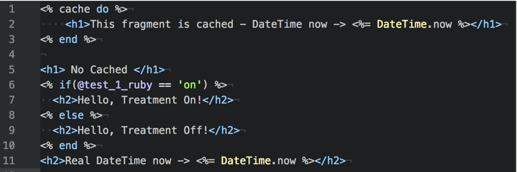

## Overview

This demo application explores how to integrate the Ruby SDK with a Rails application that uses full page caching. The environment includes:

- Rails 5.0.7  
- Puma 3.12.0 (standalone)  
- Ruby 2.2.2-p95  

The Ruby SDK is initialized as described in the [API reference documentation](/docs/feature-management-experimentation/sdks-and-infrastructure/server-side-sdks/ruby-sdk#configuration), typically in `config/initializers/split_client.rb`:

```ruby
factory = SplitIoClient::SplitFactoryBuilder.build('YOUR_API_KEY')
Rails.configuration.split_client = factory.client
```

Rails' [full page caching](https://guides.rubyonrails.org/caching_with_rails.html#page-caching) works by storing the fully rendered HTML page and serving it directly, bypassing template rendering on subsequent requests. While this significantly improves performance, it creates challenges when combined with Split’s feature flag treatments, especially on pages that require user-specific behavior or authentication.

Since the first user’s treatment is cached and served to all subsequent users, this can result in incorrect treatment display.

## Using Ruby SDK with Caching

### Action Caching

[Action caching](https://guides.rubyonrails.org/caching_with_rails.html#action-caching) enables selective caching of controller actions. Refactoring the app to query feature flag treatments in a non-cached action (for example, the `index` action), while caching other actions that display treatment-dependent content, ensures that treatment logic executes per user request.


This approach involves adding the `actionpack-action_caching` gem and configuring caching to only cover safe-to-cache actions. 


It balances improved performance with the need for dynamic content, so users receive the correct feature flag treatments.


When the application was run, it loaded and called the SDK just once, then started showing the cached action.


In the browser:


For example:

* The `index` action is excluded from caching to force treatment evaluation on each request.
* Other actions that display content based on treatments can be cached safely.

### Fragment Caching

[Fragment caching](https://guides.rubyonrails.org/caching_with_rails.html#fragment-caching) focuses on caching only static portions of a page, while dynamic sections (such as those dependent on feature flag treatments) are rendered fresh on every request.




Rails has built-in support for fragment caching, which can be used to cache parts of views that do not vary between users. We updated the previous view to show a cached fragment along with a non-cached one that is recreated on each request.


This approach improves cache efficiency without compromising personalized user experiences.

For example:

* Cache static fragments of the page (headers, footers, navigation).
* Keep dynamic content that relies on Split treatments uncached.

By using action caching or fragment caching, Rails applications can maintain the performance benefits of caching while ensuring that feature flag treatments delivered via the Ruby SDK are accurate and user-specific. This approach avoids serving stale or incorrect treatment data to users, preserving personalized feature flag functionality.