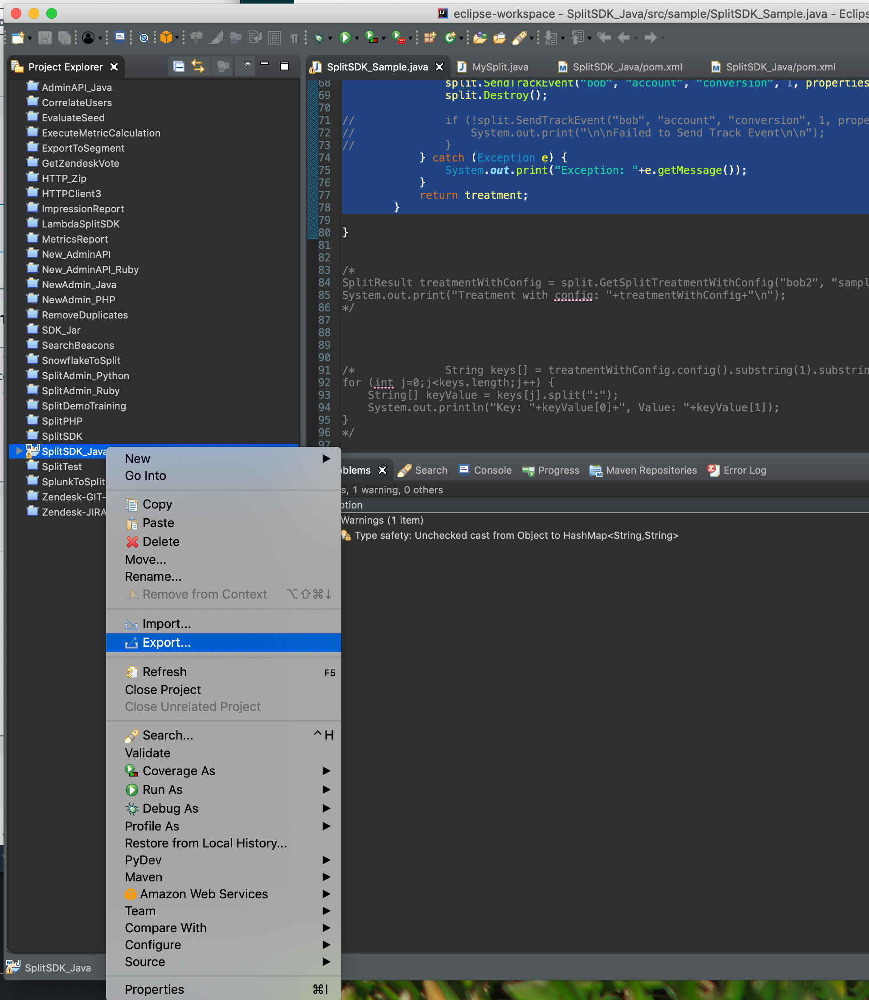
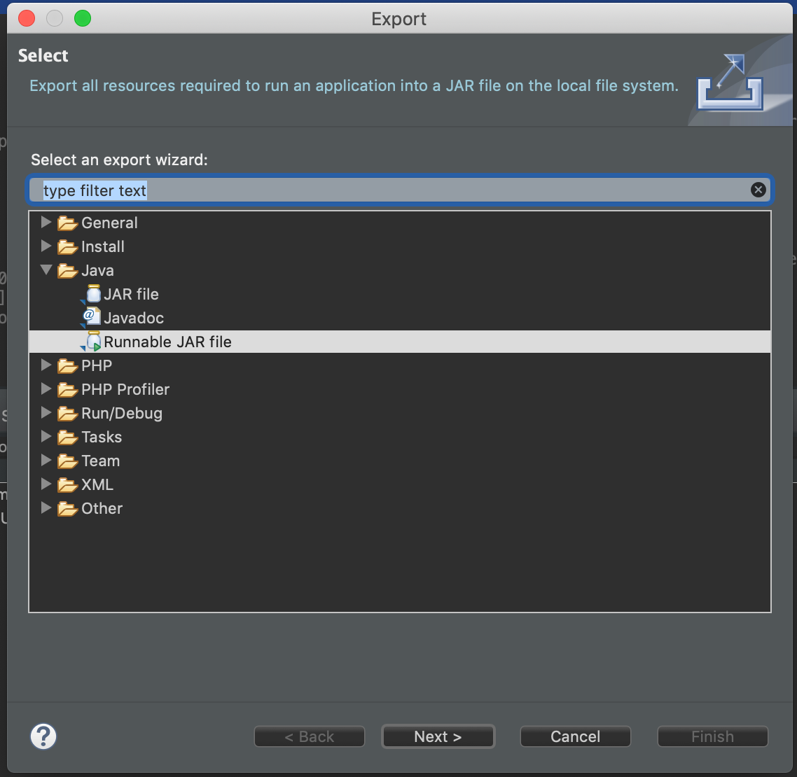
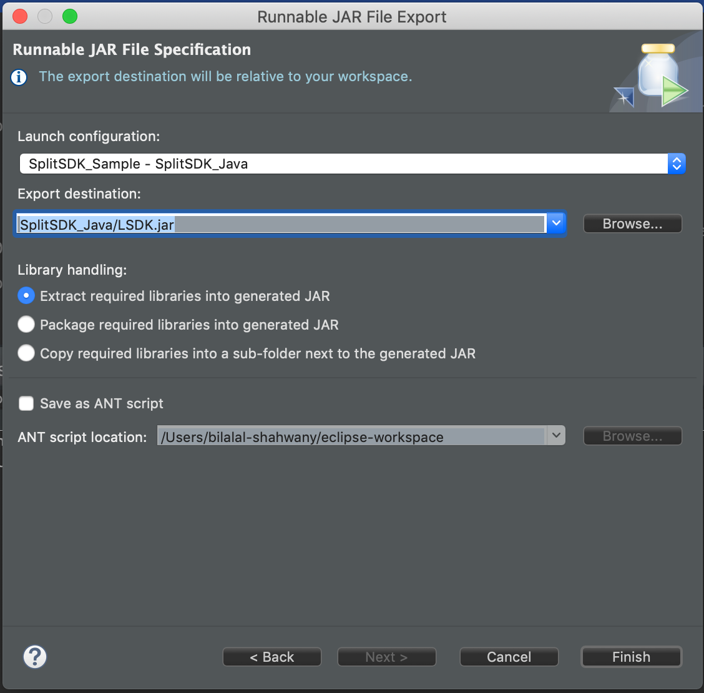
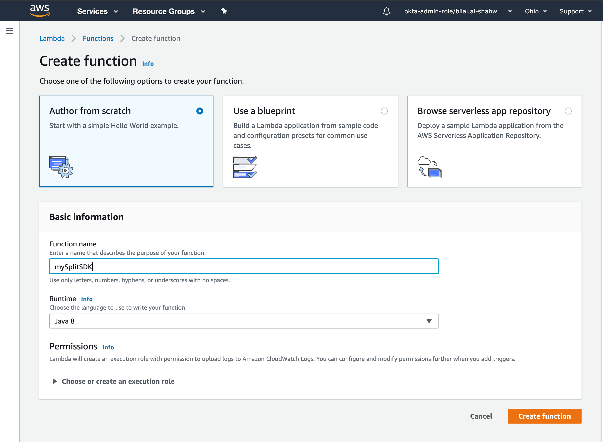
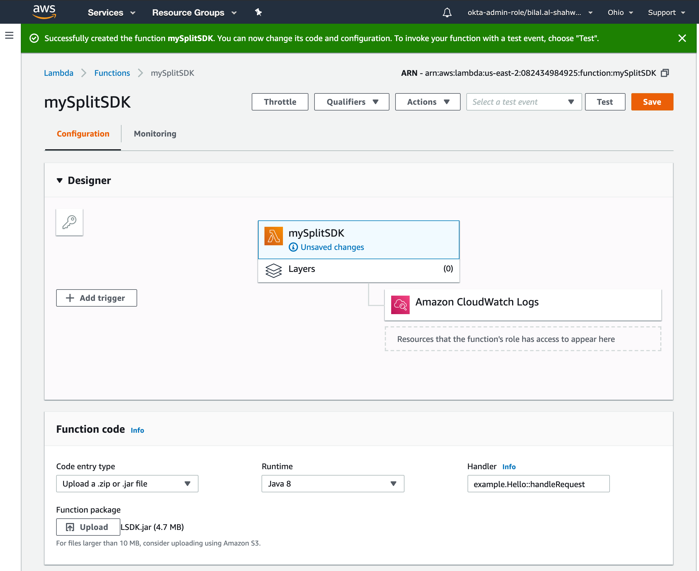
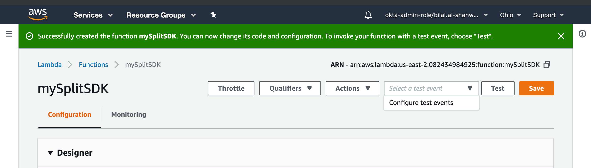
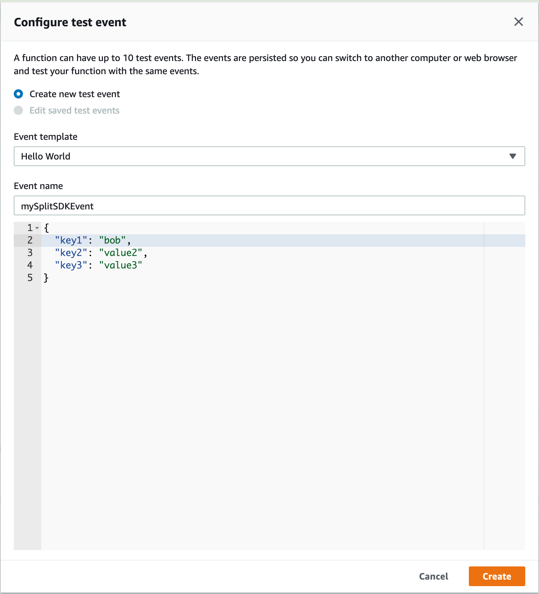
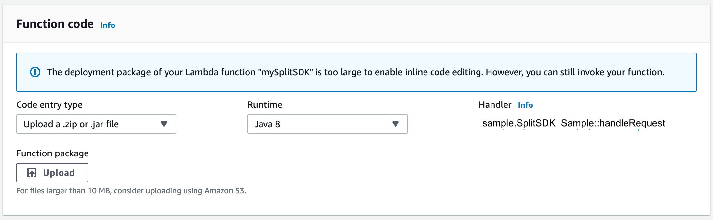
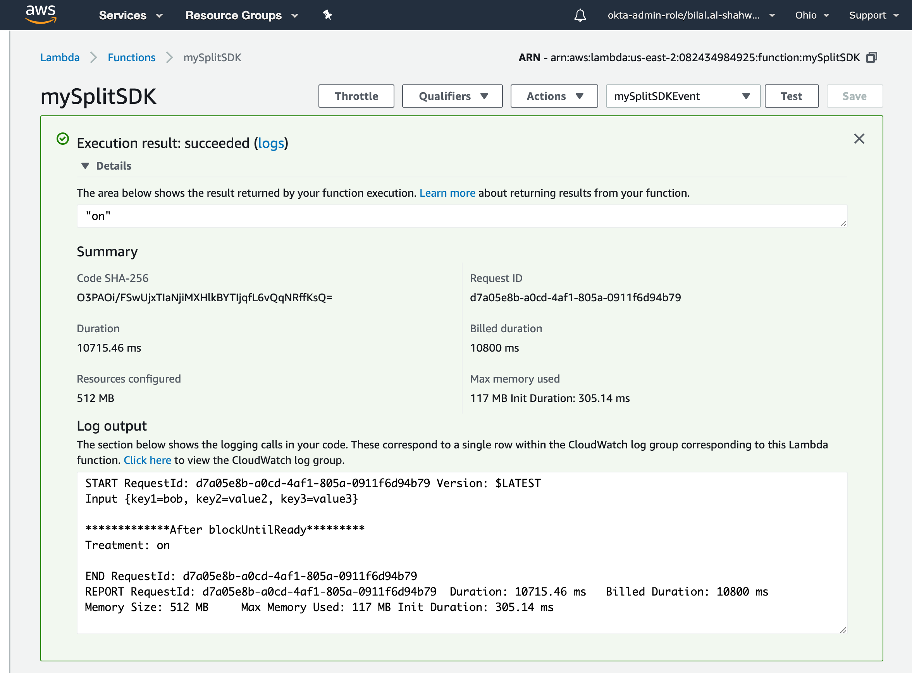

## Overview

This page provides information on how to deploy Java SDK code in AWS Lambda services.

### Prerequisites

- Use similar Java SDK code as in the [Java SDK example](https://github.com/Split-Community/Split-SDKs-Examples/tree/main/Java-SDK).
- AWS Lambda supports Java 8 runtime only, so ensure you use JDK 1.8.

### Step-by-step Guide

1. **Add AWS Lambda dependency**

   In the `pom.xml` file of the downloaded project, add the following inside the `<dependencies>` block:

   ```xml
   <dependency>
   <groupId>com.amazonaws</groupId>
   <artifactId>aws-lambda-java-core</artifactId>
   <version>1.0.0</version>
   </dependency>
   ```

1. **Update your Java class**

   * Open `SplitSDK_Sample.java`
   * Add these imports at the top:

      ```java
      import com.amazonaws.services.lambda.runtime.Context;
      import com.amazonaws.services.lambda.runtime.RequestHandler;
      ```
   
   * Modify the class declaration:

     ```java
     public class SplitSDK_Sample implements RequestHandler<Object, String> {
     ``` 

1. **Move your main method code into handleRequest**

   Replace the `main` method code with the following `handleRequest` method:

   ```java
   @Override
   public String handleRequest(Object input, Context context) {
      String myinput = input.toString();
      System.out.print("Input: " + myinput + "\n\n");
      HashMap<String, String> mapInput = (HashMap<String, String>) input;
      String userId = mapInput.get("key1");
      String treatment = "";
      try {
         MySplit split = new MySplit("API KEY");
         treatment = split.GetSplitTreatment(userId, "Split Name");             
         System.out.print("Treatment: " + treatment + "\n\n");
         split.Destroy();
      } catch (Exception e) {
         System.out.print("Exception: " + e.getMessage());
      }
      return treatment;
   }
   ```

1. **Build your project**

   * In Eclipse, select **Project** → **Build Project**, and ensure no build errors.
   * Right-click your project in Project Explorer → **Export**.

     

   * Choose **Runnable JAR file** → **Next**.

     

   * Specify JAR location and name.
   * Select **Extract required libraries into generated JAR** → **Finish**.

   

1. **Deploy to AWS Lambda**

   

   * Login to AWS Console
   * Go to **Lambda** → **Functions**
   * Click **Create function**
   * Choose **Author from scratch**
   * Select **Java 8** runtime
   * Give your function a name
   * Click **Create function**

   * Under **Function code**, upload your generated JAR file and save.
     
     

1. **Configure test event**

   

   * In the Lambda console, select **Configure test events**
   * Use the **Hello World** template
   * Set a value for key1 that matches the user ID your Lambda function will use.
   * Name and create the event

   

1. **Set Lambda handler**

   * In the **Function code** section, set the handler to:
     
     ```
     sample.SplitSDK_Sample::handleRequest
     ```
   
     

   * Click **Save**.

1. **Test your Lambda function**
   
   

   * Click **Test**.
   * You should see the expected treatment value as output.
   * Logs will show debug information.

Download the [example project](https://drive.google.com/file/d/1iwl7u5ohAAx4PawuIw_gWb6kY_3Gfhs-/view?usp=sharing).