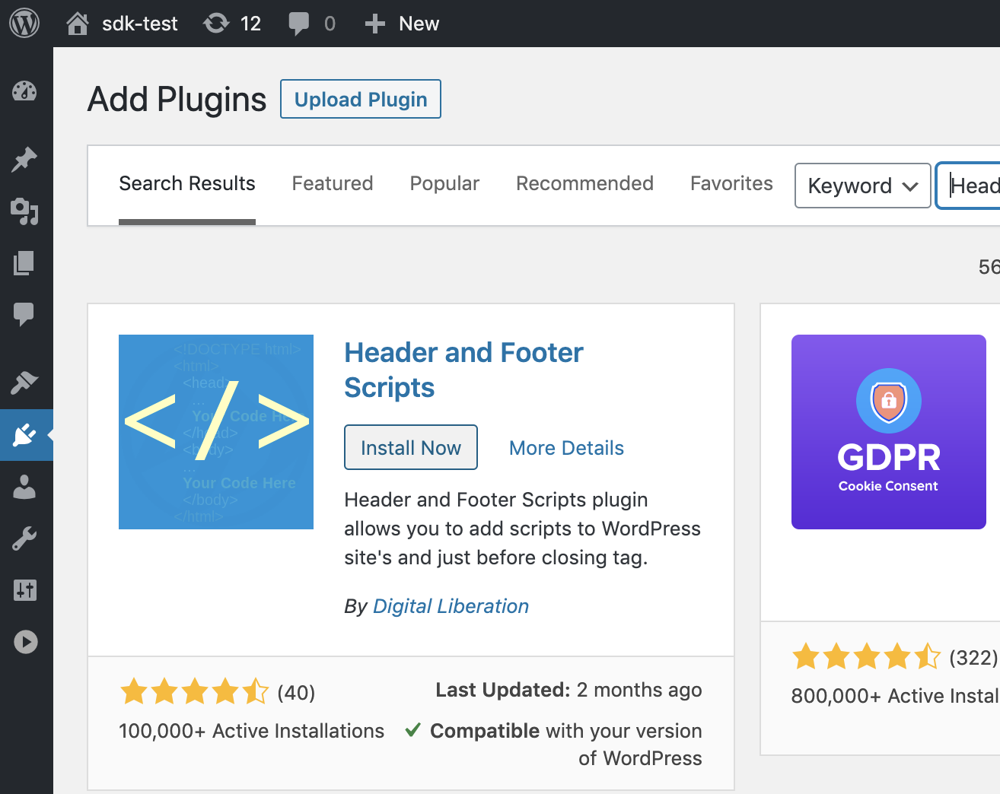
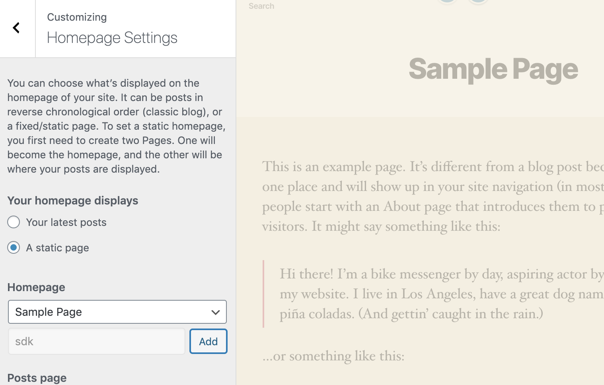
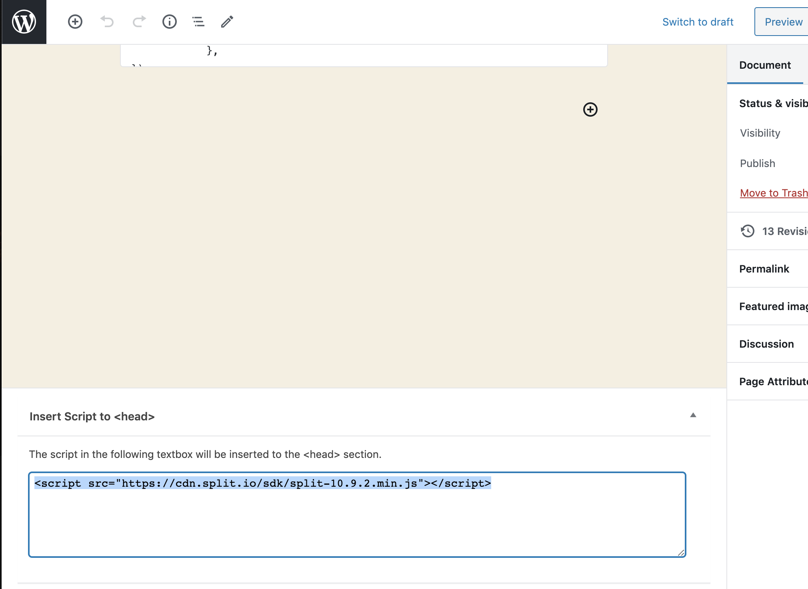
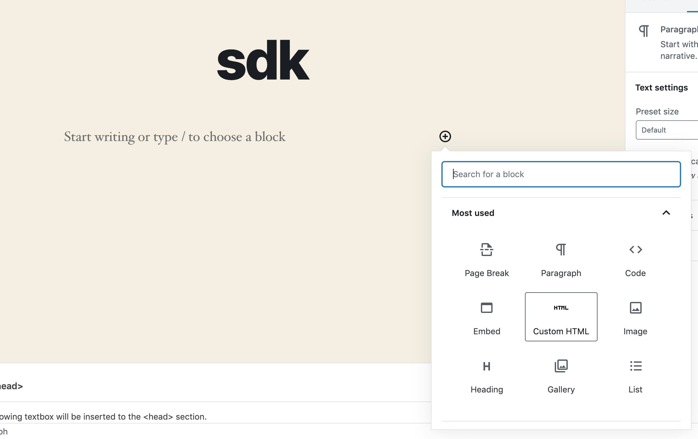
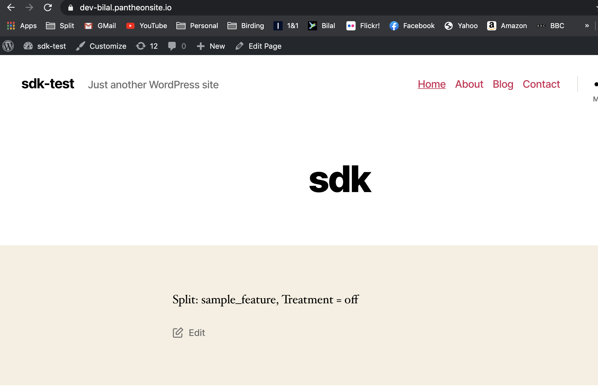

## Overview

This page walks you through using the JavaScript SDK on a blank page within a Wordpress site by embedding the SDK scripts and code directly.

## Step 1: Install the Header and Footer Scripts Plugin (recommended)

While not strictly required, it is a good practice use a plugin such as **Header and Footer Scripts** to manage JavaScript loaded in the page header.



## Step 2: Create a Sample Page

Create or open a page in WordPress where you want to deploy the SDK.



## Step 3: Insert the SDK Script Tag in the Header

In the page editor, scroll to the bottom and locate the **Insert Script to \<Head\>** section provided by the plugin. Paste the following script tag there to load the SDK library:

```html
<script src="https://cdn.split.io/sdk/split-10.21.1.min.js"></script>
```



## Step 4: Add Custom HTML Block with SDK Initialization Code

Click the **+** sign to add a new block and select **Custom HTML**. 



In this block, paste the following JavaScript, replacing the placeholders with your actual API key, user key, and feature flag name:

```html
<p id="sdk"></p>
<script>
factory = splitio({ core: {
 authorizationKey: 'SDK API KEY',
 key: 'USER KEY',
 },
 startup: {
 readyTimeout: 4, requestTimeoutBeforeReady: 4
 },
});
client = this.factory.client();
client.on(client.Event.SDK_READY, () => {
 treatment = client.getTreatment("SPLIT NAME");
 console.log("treatment = "+treatment);
 var pobj = document.getElementById("sdk");
 pobj.innerHTML = "<p>Split: [SPLIT NAME], Treatment = "+treatment+"</p>";
});
</script>
```

## Step 5: Save and Preview
 
Save the page and open it in your browser. Once the SDK signals it is ready (the `SDK_READY` event), it will fetch the feature flag  treatment and display the result inside the `<p>` element with id `"sdk"`.



This approach allows you to run the JavaScript SDK on any WordPress page without modifying the theme or server files.