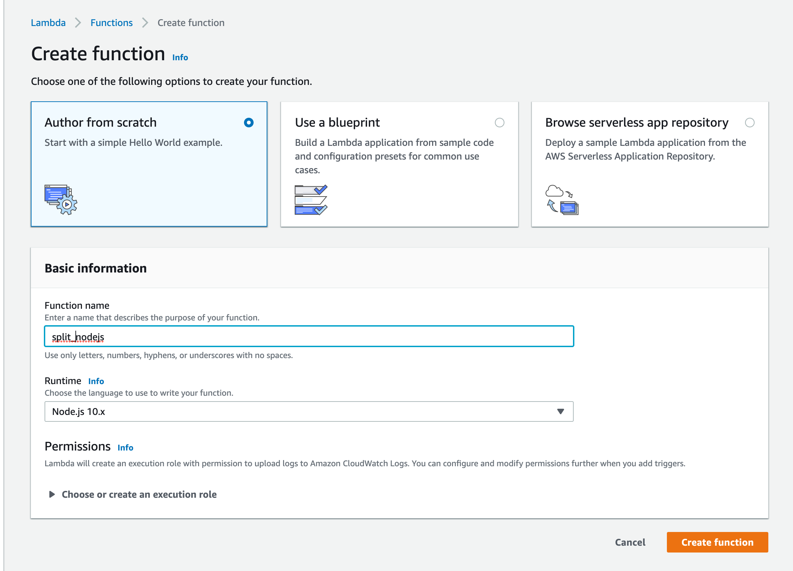
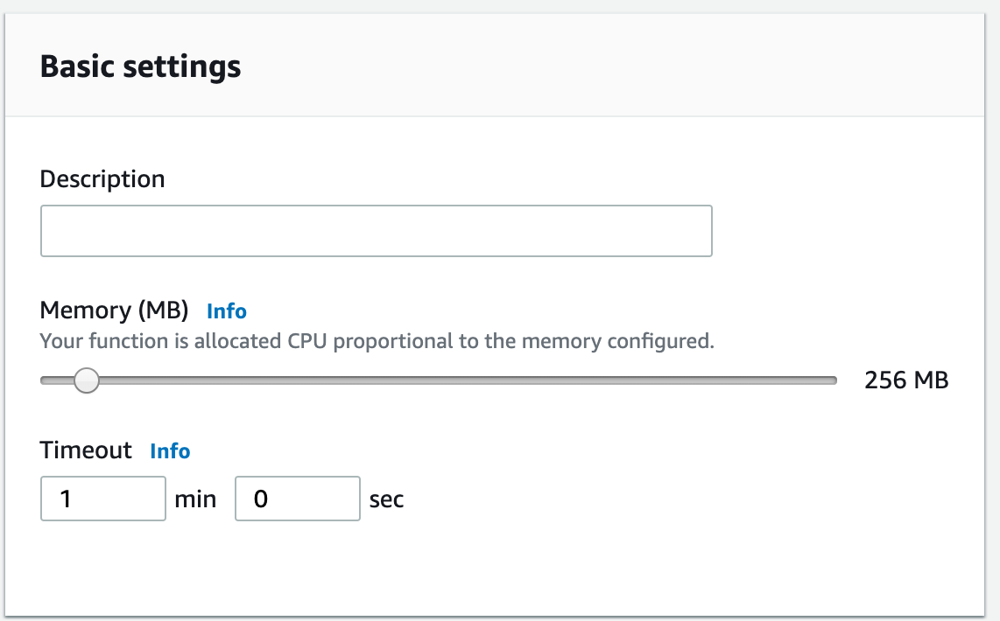
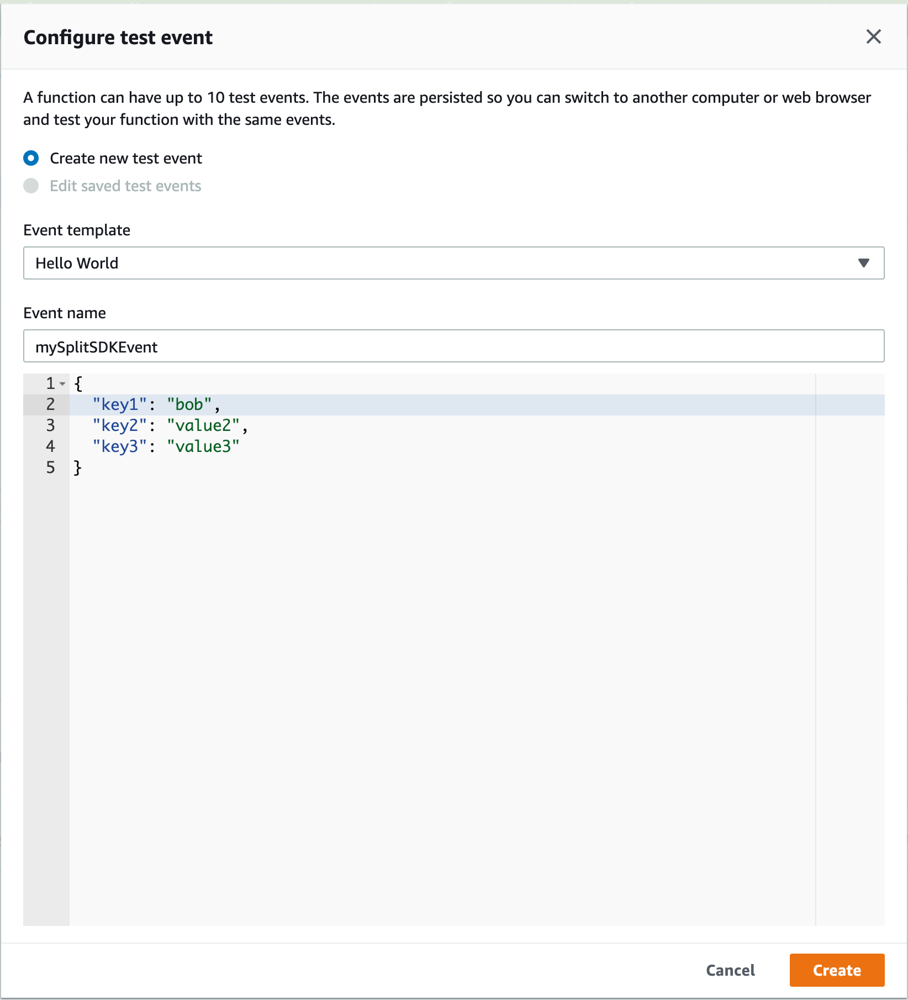
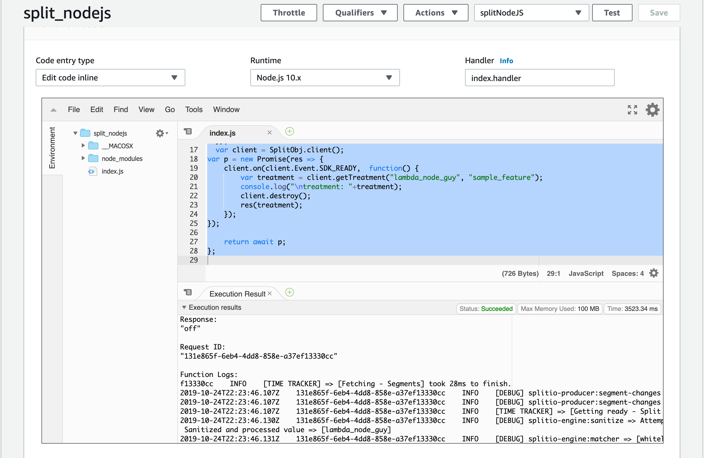

## Overview

This page provides information on how to deploy Node.js SDK code in AWS Lambda services.

### Prerequisites

- Use similar Node.js SDK code as in the [JavaScript SDK example](https://github.com/Split-Community/Split-SDKs-Examples/blob/main/Javascript-SDK/README.md).
- AWS Lambda supports Node 10.x runtime (as of writing).
- Make sure your environment uses Node 10.x or compatible version.

### Step-by-step Guide

1. **Create your Node.js project**

   Add an `index.js` file with the following content. Replace the placeholders `SDK API KEY`, `USER ID`, and `SPLIT NAME` with your actual values:

   ```js
   const SplitFactory = require('@splitsoftware/splitio').SplitFactory;

   const SplitObj = SplitFactory({
     core: {
       authorizationKey: 'SDK API KEY'
     },
     startup: {
       readyTimeout: 10
     },
     scheduler: {
       impressionsRefreshRate: 1,
       eventsPushRate: 2,
     },
     debug: true
   });

   exports.handler = async (event) => {
     const client = SplitObj.client();
     await client.ready();

     return new Promise(res => {
       const treatment = client.getTreatment("USER ID", "SPLIT NAME");
       console.log("\ntreatment: " + treatment);
       res(treatment);
     });
   };
   ```

1. **Install the SDK dependency**

   Run this command at your project root to install the Node.js SDK package:

   ```bash
   npm install --save @splitsoftware/splitio@10.16.0
   ```

1. **Prepare deployment package**

   Zip the `index.js` file and the `node_modules` folder into `function.zip`.

1. **Create your Lambda function**

   

   * Login to AWS Console
   * Go to **Lambda** → **Functions**
   * Click **Create function**
   * Choose **Author from scratch**
   * Select **Node.js 10.x** runtime
   * Give your function a name
   * Click **Create function**

1. **Configure Lambda function settings**

   

   * Under **Basic settings**, set Memory (e.g., 256 MB)
   * Set Timeout (e.g., 1 minute)

1. **Upload your deployment package**

   Using the AWS CLI, upload your zipped package:

   ```bash
   aws lambda update-function-code --function-name YOUR_FUNCTION_NAME --zip-file fileb://function.zip
   ```

1. **Configure test event**

   

   * In the Lambda console, select **Configure test events**
   * Use the **Hello World** template
   * Provide necessary event key-value data (if needed)
   * Save the test event

1. **Test your Lambda function**
   
   

   * Click **Test**
   * The expected output should be the treatment value
   * Logs will show any additional debug information

This example demonstrates how to run the Split Node.js SDK within AWS Lambda and retrieve feature flag treatments programmatically.