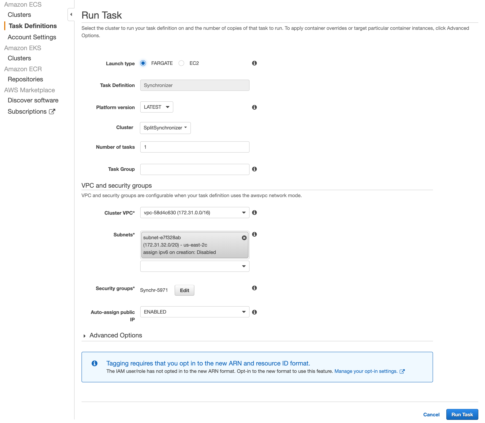

## Overview

This page provides instructions on how to deploy the Split Synchronizer Docker container using Amazon AWS ECS service.

## Prerequisites

* AWS CLI installed and configured
* Docker installed
* An AWS account with permissions to use ECS and ECR
* Split Synchronizer Docker image or access to `splitsoftware/split-synchronizer`

## Step-by-step Guide

1. In the AWS console, go to **ECR** → **Create repository**.
   
   

1. Provide a name for your new repository.

   

1. Once created, note the repository URL — it will be used later.

   

1. Authenticate Docker to AWS ECR by running `$(aws ecr get-login --no-include-email --region us-east-2)`. If this fails, check AWS help pages.
1. Pull the Synchronizer image locally by running `docker pull splitsoftware/split-synchronizer`.
1. Get the image ID by running `docker images`.
   
   For example:

   ```bash
   REPOSITORY                          TAG     IMAGE ID       CREATED      SIZE
   splitsoftware/split-synchronizer    latest  3179320c768e   3 weeks ago  941MB
   ```

1. Tag the image for your AWS ECR repository by running `docker tag 3179320c768e 082XXXXX925.dkr.ecr.us-east-2.amazonaws.com/splitsync`.

1. Push the image to AWS ECR by running `docker push 082XXXXX925.dkr.ecr.us-east-2.amazonaws.com/splitsync`. The image appears in the AWS ECR Repositories list.
   
   

1. Go to **ECS** → **Clusters** → **Create**.
   
   

1. Select AWS Fargate (or your preferred cluster type).
   
   
   

1. Go to **ECS** → **Task Definitions** → **Create new Task Definition**.

   
   

1. Choose the launch type.
1. Under **Task Size**, set the task memory to 2GB and CPU to 1 vCPU.
   
   

1. Add a container to the task:
   
   

   - Container name: Enter a descriptive name.
   - Image: Use your AWS ECR URL (e.g., `082XXXXX925.dkr.ecr.us-east-2.amazonaws.com/splitsync`).
   - Port mappings:

     ```bash
     3000/tcp
     3010/tcp
     ```
   - Environment variables (adjust as needed):
     
     

     ```nginx
     SPLIT_SYNC_APIKEY
     SPLIT_SYNC_REDIS_HOST
     SPLIT_SYNC_REDIS_PORT
     SPLIT_SYNC_REDIS_DB
     SPLIT_SYNC_REDIS_PASS
     SPLIT_SYNC_ADMIN_USER
     SPLIT_SYNC_ADMIN_PASS
     ```
1. Click **Add**, then **Create**.

   

1. Once created, **Run** the task.
   
   
   

1. Click the **Task ID** → **Logs** tab. 
   
   

   You should see Synchronizer’s startup output.