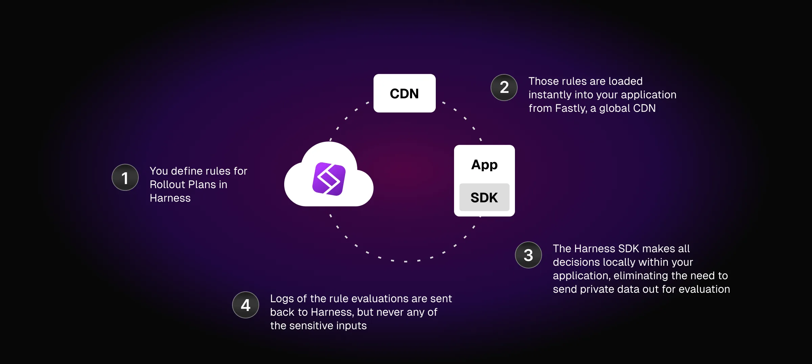

  <button style={{borderRadius:'8px', border:'1px', fontFamily:'Courier New', fontWeight:'800', textAlign:'left'}}> help.split.io link: https://help.split.io/hc/en-us/articles/360033557092-SDK-overview </button>

Data flows from Harness to your running application by using FME SDK clients. Feature flags you define in Harness are consumed in your app. Flag evaluation information and metrics events are sent back to Harness to power feature flag monitoring and experimentation.

The FME team builds and maintains FME SDKs for some of the most popular language libraries and are available under open source licenses. Follow the GitHub links for more information.

| **SDK** | **API Key type** | **Links** |
| --- | --- | --- | 
| Android | client-side | [Docs](https://help.split.io/hc/en-us/articles/360020343291-Android-SDK) & [GitHub](https://github.com/splitio/android-client) | 
| Angular utilities | client-side | [Docs](https://help.split.io/hc/en-us/articles/6495326064397-Angular-utilities) & [GitHub](https://github.com/splitio/angular-sdk-plugin) |
| Browser | client-side | [Docs](https://help.split.io/hc/en-us/articles/360058730852-Browser-SDK) & [GitHub](https://github.com/splitio/javascript-browser-client) |
| Flutter plugin | client-side | [Docs](https://help.split.io/hc/en-us/articles/8096158017165-Flutter-plugin) & [GitHub](https://github.com/splitio/flutter-sdk-plugin) |
| iOS | client-side | [Docs](https://help.split.io/hc/en-us/articles/360020401491-iOS-SDK) & [GitHub](https://github.com/splitio/ios-client) | 
| JavaScript | client-side | [Docs](https://help.split.io/hc/en-us/articles/360020448791-JavaScript-SDK) & [GitHub](https://github.com/splitio/javascript-client) | 
| React | client-side | [Docs](https://help.split.io/hc/en-us/articles/360038825091) & [GitHub](https://github.com/splitio/react-client) | 
| React Native | client-side | [Docs](https://help.split.io/hc/en-us/articles/4406066357901-React-Native-SDK) & [GitHub](https://github.com/splitio/react-native-client) |
| Redux | client-side | [Docs](https://help.split.io/hc/en-us/articles/360038851551) & [GitHub](https://github.com/splitio/redux-client) | 
| Go | server-side | [Docs](https://help.split.io/hc/en-us/articles/360020093652-Go-SDK) & [GitHub](https://github.com/splitio/go-client) | 
| Java | server-side | [Docs](https://help.split.io/hc/en-us/articles/360020405151-Java-SDK) & [GitHub](https://github.com/splitio/java-client) |
| .NET | server-side | [Docs](https://help.split.io/hc/en-us/articles/360020240172--NET-SDK) & [GitHub](https://github.com/splitio/.net-core-client) | 
| Node.js | server-side | [Docs](https://help.split.io/hc/en-us/articles/360020564931-Node-js-SDK) & [GitHub](https://github.com/splitio/javascript-client) | 
| PHP | server-side | [Docs](https://help.split.io/hc/en-us/articles/360020350372-PHP-SDK) & [GitHub](https://github.com/splitio/php-client) | 
| PHP Thin-Client | server-side | [Docs](https://help.split.io/hc/en-us/articles/18305128673933-PHP-Thin-Client-SDK) & [GitHub](https://github.com/splitio/php-thin-client) |
| Python | server-side | [Docs](https://help.split.io/hc/en-us/articles/360020359652-Python-SDK) & [GitHub](https://github.com/splitio/python-client) | 
| Ruby | server-side | [Docs](https://help.split.io/hc/en-us/articles/360020673251-Ruby-SDK) & [GitHub](https://github.com/splitio/ruby-client) | 

### Evaluator service

For languages with no native SDK support, FME offers the Split Evaluator, a small service capable of evaluating all available features for a given customer via a REST endpoint. This service is available as a Docker container for ease of installation and is compatible with popular framework like Kubernetes when it comes to supporting standard health checks to achieve reliable uptimes. Learn more about the [Split Evaluator](https://help.split.io/hc/en-us/articles/360020037072-Split-Evaluator).

### Synchronizer service

By default, FME's SDKs keep segment and feature flag definitions synchronized in an in-memory cache for speed at evaluating feature flags. However, some languages do not have a native capability to keep a shared local cache of this data to properly serve treatments. For these cases, we built Split Synchronizer to maintain an external cache like Redis. To learn more, read about [Split Synchronizer](https://help.split.io/hc/en-us/articles/360019686092-Split-Synchronizer).

### Proxy service

Split Proxy enables you to deploy a service in your own infrastructure that behaves like FME's servers and is used by both server-side and client-side SDKs to synchronize the flags without directly connecting to Harness backend servers.

This tool reduces connection latencies between the SDKs and Harness servers, and can be used when a single connection is required from a private network to the outside for security reasons. To learn more, read about [Split Proxy](https://help.split.io/hc/en-us/articles/4415960499213-Split-Proxy).

### Supported agents

FME's real user monitoring (RUM) agents collect detailed information about your users' experience when they visit your application. This information is used to analyze site impact, measure the degradation of performance metrics in relation to feature flag changes and alert the owner of the feature flag about such degradation.

| **Agent** | **API Key/Type** | **Docs** |
| --- | --- | --- | 
| Android | client-side | [Docs](https://help.split.io/hc/en-us/articles/18530305949837-Android-RUM-Agent) |
| iOS | client-side | [Docs](https://help.split.io/hc/en-us/articles/22545155055373-iOS-RUM-Agent) |
| Browser | client-side | [Docs](https://help.split.io/hc/en-us/articles/360030898431-Browser-RUM-Agent) | 