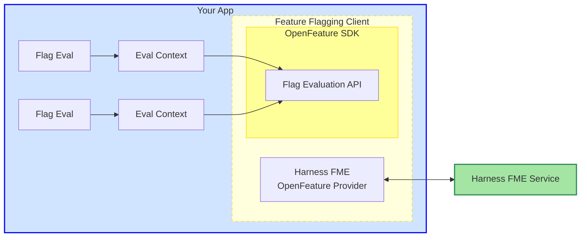

## Overview

[OpenFeature](https://openfeature.dev/docs/reference/intro) offers a standardized, vendor-agnostic SDK for feature flagging that can integrate with a variety of third-party providers. Whether you're using an open-source or commercial solution, self-hosted or cloud-hosted, OpenFeature gives developers a unified API for consistent feature flag evaluation. 

OpenFeature SDKs provide flexible abstractions that make it easy to integrate feature flags into any application. Within your application, the feature flagging client uses the OpenFeature SDK to evaluate <Tooltip id="fme.openfeature.feature-flag">feature flags</Tooltip> through the <Tooltip id="fme.openfeature.evaluation-api">Evaluation API</Tooltip>. 

Each flag evaluation passes an <Tooltip id="fme.openfeature.evaluation-context">evaluation context</Tooltip>, which provides relevant data about the application or user.

 

The <Tooltip id="fme.openfeature.provider">OpenFeature Provider</Tooltip> acts as a connector between the SDK and the Harness Feature Management & Experimentation (FME) service, translating evaluation requests and returning flag values. The provider and the Harness FME service communicate continuously, ensuring that flag configurations and state changes are kept up to date.

## Use OpenFeature SDKs

Harness FME offers official OpenFeature providers for the following SDKs. 

import { Section, openfeatureSDKs } from '@site/src/components/Docs/data/fmeOpenfeature';

<Section items={openfeatureSDKs} />

You can use these providers instead of the Harness FME SDK in your application.