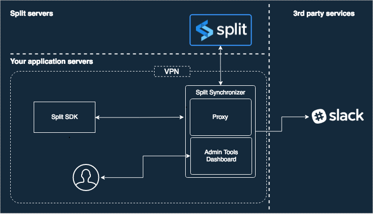
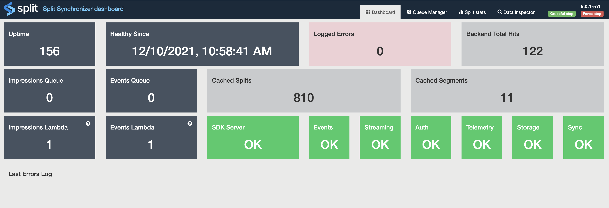
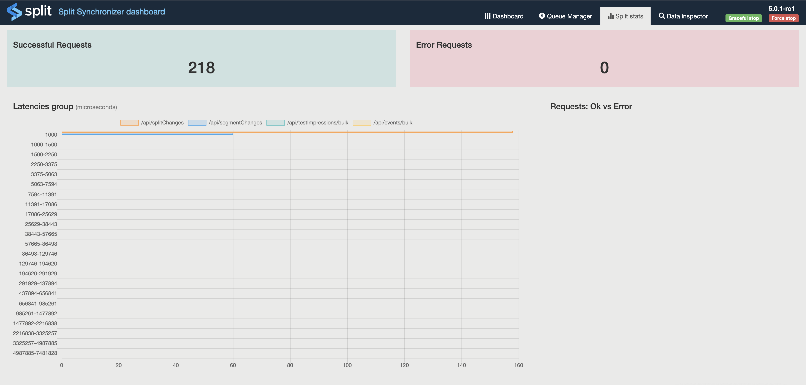
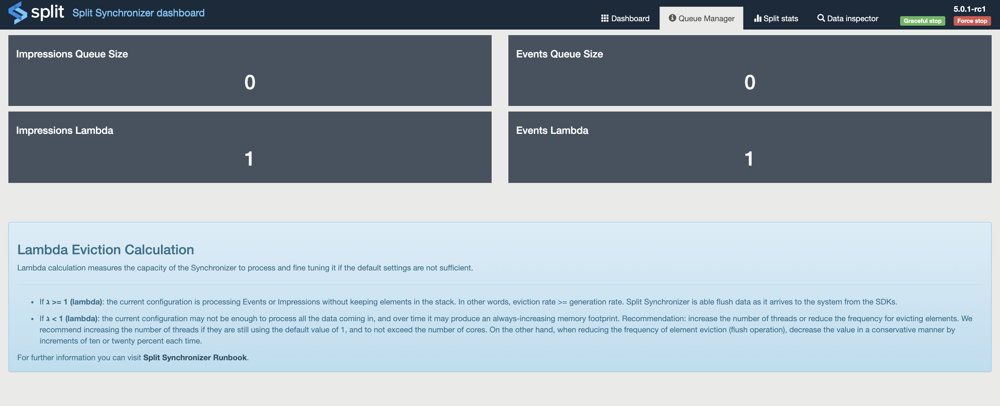
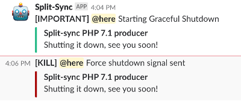
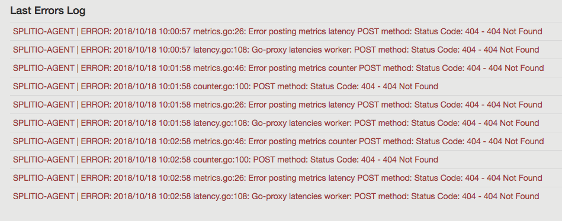
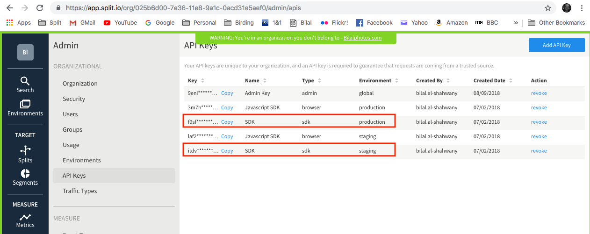
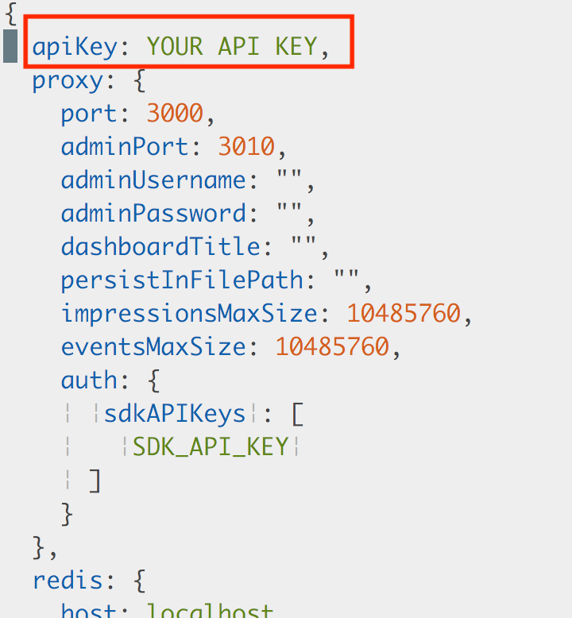
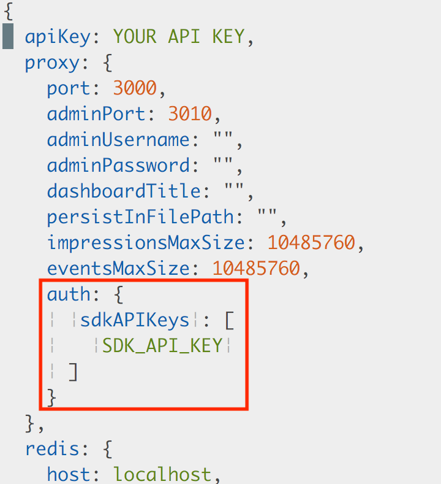

import Tabs from "@theme/Tabs";
import TabItem from "@theme/TabItem";

By default, FME's SDKs keep segment and feature flag data synchronized as users navigate across disparate systems, treatments, and conditions. However, some languages, do not have a native capability to keep a shared local cache of this data to properly serve treatments. For these cases, we built the Split Synchronizer service.

This tool coordinates the sending and receiving of data to a remote datastore that all of your processes can share to pull data for the evaluation of treatments. Out of the box, FME supports Redis as a remote datastore, and so the Split Synchronizer uses Redis as the cache for your SDKs when evaluating treatments. It also posts impression and event data and metrics generated by the SDKs back to Harness servers, for exposure in the user interface or sending to the data integration of your choice. The Synchronizer service runs as a standalone process in dedicated or shared servers and it does not affect the performance of your code, or FME's SDKs.

:::info[Split Synchronizer version 5.0 available!]
Since version 5.0.0 of the split-synchronizer, there's only one operation mode. What was once `proxy mode` is now a separate tool called [**Split proxy**](/docs/feature-management-experimentation/sdks-and-infrastructure/optional-infra/split-proxy). This version includes a more performant way to evict impressions & events from redis that allows customers to handle much greater volumes of data, while protecting your flags from being evicted if the redis instance runs low on memory.

Currently, the SDKs supported by this versions are:
Ruby 6.0.0
PHP 6.0.0
Node.js 10.6.0
Go 3.0.0
Python 7.0.0
.NET 4.0.0
Java 4.4.0
:::

:::warning
If you are upgrading from Split Synchronizer version 4.x or below to 5.x, some of the configuration and environment parameter names have been changed. Refer to the Configuration section and modify the parameters names accordingly.
:::

## Supported SDKs

The Split Synchronizer works with most of the languages that FME supports. 

* [PHP SDK](/docs/feature-management-experimentation/sdks-and-infrastructure/server-side-sdks/php-sdk)
* [Python SDK](/docs/feature-management-experimentation/sdks-and-infrastructure/server-side-sdks/python-sdk)
* [.NET SDK](/docs/feature-management-experimentation/sdks-and-infrastructure/server-side-sdks/net-sdk)
* [Node.js SDK](/docs/feature-management-experimentation/sdks-and-infrastructure/server-side-sdks/nodejs-sdk)
* [Ruby SDK](/docs/feature-management-experimentation/sdks-and-infrastructure/server-side-sdks/ruby-sdk)
* [Go SDK](/docs/feature-management-experimentation/sdks-and-infrastructure/server-side-sdks/go-sdk)
* [Java SDK](/docs/feature-management-experimentation/sdks-and-infrastructure/server-side-sdks/java-sdk)

### Synchronizer Compatibility Matrix

| Language       | Supported Synchronizer Versions | Supported SDK Versions                      |
|----------------|---------------------------------|---------------------------------------------|
| **Java**       | Not implemented                 | —                                           |
| **JavaScript** | 1.x, 2.x                       | JavaScript SDK 9.x, 10.x                     |
| **Ruby**       | 1.6, 1.7, 1.8, 2.x            | Ruby SDK 4.x, 5.x, 6.x (required for 2.x features) |
| **PHP**        | 1.6, 1.7, 1.8, 2.x            | PHP SDK 5.x                                  |
| **Python**     | 1.6, 1.7, 1.8, 2.x            | Python SDK 5.x                               |
| **.NET/.NET Core** | 1.6, 1.7, 1.8, 2.x         | .NET/Core 2.1+, 3.x                          |
| **Go Lang**    | 1.x, 2.x                      | GoLang SDK 1.x                               |
| **iOS**        | N/A                           | —                                           |
| **Android**    | N/A                           | —                                           |

**Notes**: 

> - *“Not implemented”* means no Synchronizer support for that language.  
> - *“N/A”* means not applicable. The Synchronizer is not used for those platforms.  
> - SDK versions noted are minimum or recommended versions tested with each Synchronizer version.

If you are looking for a language that is not listed here, contact the support team at [support@split.io](mailto:support@split.io) to discuss your options.

## Overall Architecture

**The service performs five actions:**

* **Fetch feature flags:** Retrieve the feature flag definitions.
* **Fetch segments:** Retrieve your set segments lists.
* **Post impressions:** Send to Harness servers the generated impressions by the SDK.
* **Post telemetry:** Send to Harness servers different metrics of the SDK, such as latencies.
* **Post events:** Send to Harness servers the generated events by the SDK `.track` method.

:::info[Split-Sync v5.0.0 pipelined data eviction]
Starting with split-sync v5.0.0, we've introduced a new approach to impressions and events eviction. This replaces the previous approach of periodically fetching & posting impressions and events. Our new approch feature flags this task in 3 parts, a thread dedicated to fetching data from redis and placing it in a buffer, N threads (where N is derived from the number of available CPU cores) dedicated to parsing, formatting the data and placing it in a second buffer, and N (configurable) threads that pick the data and post it to Harness servers. The result is a significant increase in throughput, that will better suit customers which operate on big volumes of data.
:::

### Architecture



## Setup

### Docker (recommended)

The service is available via Docker or command line and its source code is available at https://github.com/splitio/split-synchronizer.

 * Pull the image: `docker pull splitsoftware/split-synchronizer`
 * Run as:

<Tabs>
  <TabItem value="Running as Synchronizer">

```bash
docker run --rm --name split-synchronizer \
 -p 3010:3010 \
 -e SPLIT_SYNC_APIKEY="your-sdk-key" \
 -e SPLIT_SYNC_REDIS_HOST=<your-redis-host> \
 -e SPLIT_SYNC_REDIS_PORT=<your_redis_port> \
 splitsoftware/split-synchronizer
```

  </TabItem>
  <TabItem value="Running as Synchronizer with Sentinel">

```bash
docker run --rm --name split-synchronizer \
 -p 3010:3010 \
 -e SPLIT_SYNC_APIKEY="your-sdk-key" \
 -e SPLIT_SYNC_REDIS_SENTINEL_REPLICATION="true" \
 -e SPLIT_SYNC_REDIS_SENTINEL_MASTER="MASTER_SERVICE_NAME" \
 -e SPLIT_SYNC_REDIS_SENTINEL_ADDRESSES="SENTINEL_HOST_1:SENTINEL_PORT_1,SENTINEL_HOST_2:SENTINEL_PORT_2" \
 splitsoftware/split-synchronizer
```

  </TabItem>
  <TabItem value="Running as Synchronizer with Cluster">

```bash
docker run --rm --name split-synchronizer \
 -p 3010:3010 \
 -e SPLIT_SYNC_APIKEY="your-sdk-key" \
 -e SPLIT_SYNC_REDIS_CLUSTER_MODE="true" \
 -e SPLIT_SYNC_REDIS_CLUSTER_NODES="CLUSTER_NODE_1:CLUSTER_PORT_1,CLUSTER_NODE_2:CLUSTER_PORT_2,CLUSTER_NODE_3:CLUSTER_PORT_3" \
 splitsoftware/split-synchronizer
```

  </TabItem>
  <TabItem value="Running as Synchronizer with AWS Redis Cluster">

```bash
docker run --rm --name split-synchronizer \
 -p 3010:3010 \
 -e SPLIT_SYNC_APIKEY="your-sdk-key" \
 -e SPLIT_SYNC_REDIS_CLUSTER_MODE="true" \
 -e SPLIT_SYNC_REDIS_CLUSTER_NODES="Cluster Entry Host" \
 splitsoftware/split-synchronizer
```

  </TabItem>
</Tabs>

:::info[Synchronizer mode with local redis instance]
Sometimes, when building POCs or testing the synchronizer locally, you might want to launch our docker container image, pointing to a local redis server (or another container with redis, whose port has been mapped to a local one). In such case, you should consider adding the option `--network="host"` (appending it to the command shown above) when launching the synchronizer. This will allow you to use `-e SPLIT_SYNC_REDIS_HOST="localhost"`, with the split-synchronizer container properly reaching your local redis server.
:::

:::info[Docker configuration]
The [Advanced configuration section](#advanced-configuration) includes additional Docker information in the column **Docker environment variable**.

See [Deploy Synchronizer Docker Container in AWS ECS](/docs/feature-management-experimentation/sdks-and-infrastructure/examples/synchronizer-docker-ecs) for a full step-by-step AWS deployment guide.
:::

### Command line

To install and run the service from command line, follow the steps below depending of your platform.

#### Linux

On Linux systems, the Synchronizer service install script is invoked with this.

```bash
curl -L -o install_linux.bin 'https://downloads.split.io/synchronizer/install_split_sync_linux.bin' && chmod 755 install_linux.bin && ./install_linux.bin
```

#### OSX

On OSX systems, the Synchronizer service install script is invoked with this.

```bash
curl -L -o install_osx.bin 'https://downloads.split.io/synchronizer/install_split_sync_osx.bin' && chmod 755 install_osx.bin && ./install_osx.bin
```

#### Windows

On Microsoft Windows systems, follow these steps:

1. Download the app from [https://downloads.split.io/synchronizer/split_sync_windows.zip](https://downloads.split.io/synchronizer/split_sync_windows.zip).

2. Unzip the downloaded file.

3. Run it!

:::info[Download previous versions]
The links above point to the latest version. To download a previous version of split-sync, go to [https://downloads.split.io/synchronizer/downloads.sync.html](https://downloads.split.io/synchronizer/downloads.sync.html).
:::

### Run the service

To run the service, paste the snippet below into your command line terminal and add in your **SDK-Key**.

#### Linux/Mac

```bash
split-sync -apikey "your_sdk_key"
```

#### Windows

Open the cmd terminal or the PowerShell terminal, go to (cd) unzipped Split Synchronizer folder, and type:

```bash
split-sync.exe -apikey "your_sdk_key"
```

:::warning[Redis instance]
On the samples above, Redis is running as a local service with **default host: localhost** and **default port: 6379**. For further information, see [Advanced configuration](#advanced-configuration).
:::

:::warning[Redis database]
To maximize performance and isolation, we recommend connecting to a Redis database dedicated to the Split Synchronizer. For further information, see [Advanced configuration](#advanced-configuration).
:::

:::info[Redis Sentinel support]
Split Synchronizer also supports Redis Sentinel (v2) replication. For further information about Redis Sentinel, refer to the [Sentinel Documentation](https://redis.io/topics/sentinel).
:::

:::info[Redis Cluster support]
Split Synchronizer supports Redis Cluster with Redis^3.0.0. For further information about Redis Cluster, refer to the [Cluster Documentation](https://redis.io/topics/cluster-spec).
:::

#### Recommended configuration for production

You can run the service with the simple steps above, but the system is more stable in your production environment when you run the job with a scheduling system. We recommend starting the synchronizer via [supervisord](http://supervisord.org), a daemon that launches other processes and ensures they stay running.

To use supervisord, make sure that it is installed on your machine. You can get help on the installation at the [official Supervisord documentation](http://supervisord.org/installing.html).

When supervisord is installed into your project, copy and paste the program below anywhere into the `supervisord.conf` file that should now be in your project.

```ini title="supervisord configuration file (sample)
[program:splitio_sync]
command=/usr/local/bin/split-sync -config /path/to/your/config.file.json
process_name = SplitIO
numprocs = 1
autostart=true
autorestart=true
user = your_user
stderr_logfile=/var/log/splitio.err.log
stderr_logfile_maxbytes = 1MB
stdout_logfile=/var/log/splitio.out.log
stdout_logfile_maxbytes = 1MB
``` 

## Advanced configuration

The Synchronizer service has a number of knobs for configuring performance. Each knob is tuned to a reasonable default, however, you can override the default values by changing a `splitio.config.json` file or by setting your customer values as parameters of `-config` in the command line option. In this section, we lay out all the different knobs you can configure for performance, Redis, and logging.

The `splitio.config.json` file provided via the `-config` option lets you control how often the synchronizer fetches data from Harness servers. You can create a sample JSON file automatically with default values by running this command.

```bash
./split-sync -write-default-config "/home/someuser/splitio.config.json"
```

:::info[Configuration path file]
Save the JSON config file on your server in your desired folder. For instance, on Linux systems, it could be saved in the `etc` folder.
Remember to set the right path as the `-config` parameter.
:::

<Tabs>
  <TabItem value="splitio.config.json">

```json
{
  "apikey": "YOUR_SDK_KEY",
  "ipAddressEnabled": true,
  "initialization": {
    "timeoutMS": 10000,
    "forceFreshStartup": false
  },
  "storage": {
    "type": "redis",
    "redis": {
      "host": "localhost",
      "port": 6379,
      "db": 0,
      "username": "",
      "password": "",
      "prefix": "",
      "network": "tcp",
      "maxRetries": 0,
      "dialTimeout": 5,
      "readTimeout": 10,
      "writeTimeout": 5,
      "poolSize": 10,
      "sentinelReplication": false,
      "sentinelAddresses": "",
      "sentinelMaster": "",
      "clusterMode": false,
      "clusterNodes": "",
      "keyHashTag": "",
      "enableTLS": false,
      "tlsServerName": "",
      "caCertificates": null,
      "tlsSkipNameValidation": false,
      "tlsClientCertificate": "",
      "tlsClientKey": ""
    }
  },
  "sync": {
    "splitRefreshRateMs": 60000,
    "segmentRefreshRateMs": 60000,
    "impressionsMode": "optimized",
    "advanced": {
      "streamingEnabled": true,
      "httpTimeoutMs": 30000,
      "internalTelemetryRateMs": 3600000,
      "telemetryPushRateMs": 60000,
      "impressionsFetchSize": 0,
      "impressionsProcessConcurrency": 0,
      "impressionsProcessBatchSize": 0,
      "impressionsPostConcurrency": 0,
      "impressionsPostSize": 0,
      "impressionsAccumWaitMs": 0,
      "eventsFetchSize": 0,
      "eventsProcessConcurrency": 0,
      "eventsProcessBatchSize": 0,
      "eventsPostConcurrency": 0,
      "eventsPostSize": 0,
      "eventsAccumWaitMs": 0
    }
  },
  "admin": {
    "host": "0.0.0.0",
    "port": 3010,
    "username": "",
    "password": "",
    "secureChecks": false
  },
  "integrations": {
    "impressionListener": {
      "endpoint": "",
      "queueSize": 100
    },
    "slack": {
      "webhook": "",
      "channel": ""
    }
  },
  "logging": {
    "level": "info",
    "output": "stdout",
    "rotationMaxFiles": 10,
    "rotationMaxSizeKb": 0
  },
  "healthcheck": {
    "app": {
      "storageCheckRateMs": 3600000
    }
  }
}
```

  </TabItem>
  <TabItem value="splitio.sentinel.config.json">

```json
{
  "apikey": "YOUR_SDK_KEY",
  "ipAddressEnabled": true,
  "initialization": {
    "timeoutMS": 10000,
    "forceFreshStartup": false
  },
  "storage": {
    "type": "redis",
    "redis": {
      "host": "localhost",
      "port": 6379,
      "db": 0,
      "username": "",
      "password": "",
      "prefix": "",
      "network": "tcp",
      "maxRetries": 0,
      "dialTimeout": 5,
      "readTimeout": 10,
      "writeTimeout": 5,
      "poolSize": 10,
      "sentinelReplication": true,
      "sentinelAddresses": "SENTINEL_HOST_1:SENTINEL_PORT_1, SENTINEL_HOST_2:SENTINEL_PORT_2,SENTINEL_HOST_3:SENTINEL_PORT_3",
      "sentinelMaster": "MASTER_SERVICE_NAME",
      "clusterMode": false,
      "clusterNodes": "",
      "keyHashTag": "",
      "enableTLS": false,
      "tlsServerName": "",
      "caCertificates": null,
      "tlsSkipNameValidation": false,
      "tlsClientCertificate": "",
      "tlsClientKey": ""
    }
  },
  "sync": {
    "splitRefreshRateMs": 60000,
    "segmentRefreshRateMs": 60000,
    "impressionsMode": "optimized",
    "advanced": {
      "streamingEnabled": true,
      "httpTimeoutMs": 30000,
      "internalTelemetryRateMs": 3600000,
      "telemetryPushRateMs": 60000,
      "impressionsFetchSize": 0,
      "impressionsProcessConcurrency": 0,
      "impressionsProcessBatchSize": 0,
      "impressionsPostConcurrency": 0,
      "impressionsPostSize": 0,
      "impressionsAccumWaitMs": 0,
      "eventsFetchSize": 0,
      "eventsProcessConcurrency": 0,
      "eventsProcessBatchSize": 0,
      "eventsPostConcurrency": 0,
      "eventsPostSize": 0,
      "eventsAccumWaitMs": 0
    }
  },
  "admin": {
    "host": "0.0.0.0",
    "port": 3010,
    "username": "",
    "password": "",
    "secureChecks": false
  },
  "integrations": {
    "impressionListener": {
      "endpoint": "",
      "queueSize": 100
    },
    "slack": {
      "webhook": "",
      "channel": ""
    }
  },
  "logging": {
    "level": "info",
    "output": "stdout",
    "rotationMaxFiles": 10,
    "rotationMaxSizeKb": 0
  },
  "healthcheck": {
    "app": {
      "storageCheckRateMs": 3600000
    }
  }
}
```

  </TabItem>
  <TabItem value="splitio.cluster.config.json">

```json
{
  "apikey": "",
  "ipAddressEnabled": true,
  "initialization": {
    "timeoutMS": 10000,
    "forceFreshStartup": false
  },
  "storage": {
    "type": "redis",
    "redis": {
      "host": "localhost",
      "port": 6379,
      "db": 0,
      "username": "",
      "password": "",
      "prefix": "",
      "network": "tcp",
      "maxRetries": 0,
      "dialTimeout": 5,
      "readTimeout": 10,
      "writeTimeout": 5,
      "poolSize": 10,
      "sentinelReplication": false,
      "sentinelAddresses": "",
      "sentinelMaster": "",
      "clusterMode": true,
      "clusterNodes": "CLUSTER_NODE_1:CLUSTER_PORT_1, CLUSTER_NODE_2:CLUSTER_PORT_2,CLUSTER_NODE_3:CLUSTER_PORT_3",
      "keyHashTag": "",
      "enableTLS": false,
      "tlsServerName": "",
      "caCertificates": null,
      "tlsSkipNameValidation": false,
      "tlsClientCertificate": "",
      "tlsClientKey": ""
    }
  },
  "sync": {
    "splitRefreshRateMs": 60000,
    "segmentRefreshRateMs": 60000,
    "impressionsMode": "optimized",
    "advanced": {
      "streamingEnabled": true,
      "httpTimeoutMs": 30000,
      "internalTelemetryRateMs": 3600000,
      "telemetryPushRateMs": 60000,
      "impressionsFetchSize": 0,
      "impressionsProcessConcurrency": 0,
      "impressionsProcessBatchSize": 0,
      "impressionsPostConcurrency": 0,
      "impressionsPostSize": 0,
      "impressionsAccumWaitMs": 0,
      "eventsFetchSize": 0,
      "eventsProcessConcurrency": 0,
      "eventsProcessBatchSize": 0,
      "eventsPostConcurrency": 0,
      "eventsPostSize": 0,
      "eventsAccumWaitMs": 0
    }
  },
  "admin": {
    "host": "0.0.0.0",
    "port": 3010,
    "username": "",
    "password": "",
    "secureChecks": false
  },
  "integrations": {
    "impressionListener": {
      "endpoint": "",
      "queueSize": 100
    },
    "slack": {
      "webhook": "",
      "channel": ""
    }
  },
  "logging": {
    "level": "info",
    "output": "stdout",
    "rotationMaxFiles": 10,
    "rotationMaxSizeKb": 0
  },
  "healthcheck": {
    "app": {
      "storageCheckRateMs": 3600000
    }
  }
}
```

  </TabItem>
</Tabs>
  

:::info[Command line parameters]
All the options available in the JSON file are also included as command line options. Run the command followed by the `-help` option to see more details, or just keep reading this documentation page.
:::

### Methods to configure the Split Synchronizer

You can configure the Split Synchronizer service using the command line or by directly editing the above mentioned **JSON** configuration file. 

:::info[Config values priority]
All config values are set with a default value that you can see in the example **JSON** file above. You can overwrite the default value from the JSON config file, and you can overwrite the JSON config file from the command line. See a sample below for how to do that via command line.
:::

```bash
split-sync -config "/etc/splitio.config.json" -log-level "debug" -redis-pass "somePass" 
```

#### Handling High Impression Rates with Synchronizer

When using a server-side SDK with the Split Synchronizer and Redis, it is important to properly configure the Synchronizer to handle a high load of incoming impressions efficiently.

##### Key Configuration Parameters

The Split Synchronizer (version 1.6.0 and above) exposes several parameters that control impression processing performance:

- `impressionsMaxSize`: Maximum size for the impressions queue.
- `impressionsRefreshRate`: How often impressions are processed and sent (in seconds).
- `impressionsThreads`: Number of threads handling impressions processing.
- `impressionsPerPost`: Number of impressions sent per post request.

Adjust these parameters according to your expected impression volume. Because the Synchronizer uses multithreading, increasing `impressionsThreads` can reduce latency in posting impressions.

Below is an example JSON configuration designed to handle approximately 100,000 impressions per minute. Update the API Key, Redis host, port, and database number to match your environment before applying.

```json
{
  "apiKey": "YOUR_API_KEY",
  "proxy": {
    "port": 3000,
    "adminPort": 3010,
    "adminUsername": "",
    "adminPassword": "",
    "dashboardTitle": "",
    "persistInFilePath": "",
    "impressionsMaxSize": 10485760,
    "eventsMaxSize": 10485760,
    "auth": {
      "sdkAPIKeys": [
        "SDK_API_KEY"
      ]
    }
  },
  "redis": {
    "host": "localhost",
    "port": 6379,
    "db": 0,
    "password": "",
    "prefix": "",
    "network": "tcp",
    "maxRetries": 0,
    "dialTimeout": 5,
    "readTimeout": 10,
    "writeTimeout": 5,
    "poolSize": 10,
    "sentinelReplication": false,
    "sentinelAddresses": "",
    "sentinelMaster": ""
  },
  "sync": {
    "admin": {
      "adminPort": 3010,
      "adminUsername": "",
      "adminPassword": "",
      "dashboardTitle": ""
    }
  },
  "log": {
    "verbose": false,
    "debug": false,
    "stdout": false,
    "file": "/tmp/split-agent.log",
    "fileMaxSizeBytes": 2000000,
    "fileBackupCount": 3,
    "slackChannel": "",
    "slackWebhookURL": ""
  },
  "impressionListener": {
    "endpoint": ""
  },
  "splitsRefreshRate": 60,
  "segmentsRefreshRate": 60,
  "impressionsRefreshRate": 20,
  "impressionsPerPost": 10000,
  "impressionsThreads": 5,
  "eventsPushRate": 60,
  "eventsConsumerReadSize": 10000,
  "eventsConsumerThreads": 1,
  "metricsRefreshRate": 60,
  "httpTimeout": 60
}
```


### CLI Configuration options and its equivalents in JSON & Environment variables

:::warning[Split Synchronizer version 5.0 boolean options change]
In order to reduce the issues because of typos and confusion due to "multiple words & case meaning the same", since version 5.0.0 of the split-synchronizer, the only accepted values for boolean flags are "true" & "false" in lowercase. Things like "enabled", "on", "yes", "tRue" will result in an error at startup. This applies to JSON, CLI arguments & environment variables.
:::


| **Command line option** | **JSON option** | **Environment variable (container-only)** | **Description** |
| --- | --- | --- | --- |
| log-level | level | SPLIT_SYNC_LOG_LEVEL | Log level (error&#124;warning&#124;info&#124;debug&#124;verbose) |
| log-output | output | SPLIT_SYNC_LOG_OUTPUT | Where to output logs (defaults to stdout) |
| log-rotation-max-files | rotationMaxFiles | SPLIT_SYNC_LOG_ROTATION_MAX_FILES | Max number of files to keep when rotating logs |
| log-rotation-max-size-kb | rotationMaxSizeKb | SPLIT_SYNC_LOG_ROTATION_MAX_SIZE_KB | Max file size before rotating log files. |
| admin-host | host | SPLIT_SYNC_ADMIN_HOST | Host where the admin server will listen |
| admin-port | port | SPLIT_SYNC_ADMIN_PORT | Admin port where incoming connections will be accepted |
| admin-username | username | SPLIT_SYNC_ADMIN_USERNAME | HTTP basic auth username for admin endpoints |
| admin-password | password | SPLIT_SYNC_ADMIN_PASSWORD | HTTP basic auth password for admin endpoints |
| admin-secure-hc | secureChecks | SPLIT_SYNC_ADMIN_SECURE_HC | Secure Healthcheck endpoints as well. |
| admin-tls-enabled | enabled | SPLIT_SYNC_ADMIN_TLS_ENABLED | Enable HTTPS on proxy endpoints. |
| admin-tls-client-validation | clientValidation | SPLIT_SYNC_ADMIN_TLS_CLIENT_VALIDATION | Enable client cert validation. |
| admin-tls-server-name | serverName | SPLIT_SYNC_ADMIN_TLS_SERVER_NAME | Server name as it appears in provided server-cert. |
| admin-tls-cert-chain-fn | certChainFn | SPLIT_SYNC_ADMIN_TLS_CERT_CHAIN_FN | X509 Server certificate chain. |
| admin-tls-private-key-fn | privateKeyFn | SPLIT_SYNC_ADMIN_TLS_PRIVATE_KEY_FN | PEM Private key file name. |
| admin-tls-client-validation-root-cert | clientValidationRootCertFn | SPLIT_SYNC_ADMIN_TLS_CLIENT_VALIDATION_ROOT_CERT | X509 root cert for client validation. |
| admin-tls-min-tls-version | minTlsVersion | SPLIT_SYNC_ADMIN_TLS_MIN_TLS_VERSION | Minimum TLS version to allow X.Y. |
| admin-tls-allowed-cipher-suites | allowedCipherSuites | SPLIT_SYNC_ADMIN_TLS_ALLOWED_CIPHER_SUITES | Comma-separated list of cipher suites to allow. |
| impression-listener-endpoint | endpoint | SPLIT_SYNC_IMPRESSION_LISTENER_ENDPOINT | HTTP endpoint to forward impressions to |
| impression-listener-queue-size | queueSize | SPLIT_SYNC_IMPRESSION_LISTENER_QUEUE_SIZE | max number of impressions bulks to queue |
| slack-webhook | webhook | SPLIT_SYNC_SLACK_WEBHOOK | slack webhook to post log messages |
| slack-channel | channel | SPLIT_SYNC_SLACK_CHANNEL | slack channel to post log messages |
| apikey | apikey | SPLIT_SYNC_APIKEY | Split Server-side SDK  api-key |
| ip-address-enabled | ipAddressEnabled | SPLIT_SYNC_IP_ADDRESS_ENABLED | Bundle host's ip address when sending data to Harness FME |
| timeout-ms | timeoutMS | SPLIT_SYNC_TIMEOUT_MS | How long to wait until the synchronizer is ready |
| snapshot | snapshot | SPLIT_SYNC_SNAPSHOT | Snapshot file to use as a starting point |
| force-fresh-startup | forceFreshStartup | SPLIT_SYNC_FORCE_FRESH_STARTUP | Wipe storage before starting the synchronizer |
| storage-type | type | SPLIT_SYNC_STORAGE_TYPE | Storage driver to use for caching feature flags and segments and user-generated data |
| split-refresh-rate-ms | splitRefreshRateMs | SPLIT_SYNC_SPLIT_REFRESH_RATE_MS | How often to refresh feature flags |
| segment-refresh-rate-ms | segmentRefreshRateMs | SPLIT_SYNC_SEGMENT_REFRESH_RATE_MS | How often to refresh segments |
| impressions-mode | impressionsMode | SPLIT_SYNC_IMPRESSIONS_MODE | whether to send all impressions for debugging |
| streaming-enabled | streamingEnabled | SPLIT_SYNC_STREAMING_ENABLED | Enable/disable streaming functionality |
| http-timeout-ms | httpTimeoutMs | SPLIT_SYNC_HTTP_TIMEOUT_MS | Total http request timeout |
| internal-metrics-rate-ms | internalTelemetryRateMs | SPLIT_SYNC_INTERNAL_METRICS_RATE_MS | How often to send internal metrics |
| telemetry-push-rate-ms | telemetryPushRateMs | SPLIT_SYNC_TELEMETRY_PUSH_RATE_MS | how often to flush sdk telemetry |
| impressions-fetch-size | impressionsFetchSize | SPLIT_SYNC_IMPRESSIONS_FETCH_SIZE | Impression fetch bulk size |
| impressions-process-concurrency | impressionsProcessConcurrency | SPLIT_SYNC_IMPRESSIONS_PROCESS_CONCURRENCY | #Threads for processing imps |
| impressions-process-batch-size | impressionsProcessBatchSize | SPLIT_SYNC_IMPRESSIONS_PROCESS_BATCH_SIZE | Size of imp processing batchs |
| impressions-post-concurrency | impressionsPostConcurrency | SPLIT_SYNC_IMPRESSIONS_POST_CONCURRENCY | #concurrent imp post threads |
| impressions-post-size | impressionsPostSize | SPLIT_SYNC_IMPRESSIONS_POST_SIZE | Max #impressions to send per POST |
| impressions-accum-wait-ms | impressionsAccumWaitMs | SPLIT_SYNC_IMPRESSIONS_ACCUM_WAIT_MS | Max ms to wait to close an impressions bulk |
| events-fetch-size | eventsFetchSize | SPLIT_SYNC_EVENTS_FETCH_SIZE | How many impressions to pop from storage at once |
| events-process-concurrency | eventsProcessConcurrency | SPLIT_SYNC_EVENTS_PROCESS_CONCURRENCY | #Threads for processing imps |
| events-process-batch-size | eventsProcessBatchSize | SPLIT_SYNC_EVENTS_PROCESS_BATCH_SIZE | Size of imp processing batchs |
| events-post-concurrency | eventsPostConcurrency | SPLIT_SYNC_EVENTS_POST_CONCURRENCY | #concurrent imp post threads |
| events-post-size | eventsPostSize | SPLIT_SYNC_EVENTS_POST_SIZE | Max #impressions to send per POST |
| events-accum-wait-ms | eventsAccumWaitMs | SPLIT_SYNC_EVENTS_ACCUM_WAIT_MS | Max ms to wait to close an events bulk |
| redis-host | host | SPLIT_SYNC_REDIS_HOST | Redis server hostname |
| redis-port | port | SPLIT_SYNC_REDIS_PORT | Redis Server port |
| redis-db | db | SPLIT_SYNC_REDIS_DB | Redis DB |
| redis-pass | password | SPLIT_SYNC_REDIS_PASS | Redis password |
| redis-user | username | SPLIT_SYNC_REDIS_USER | Redis username |
| redis-prefix | prefix | SPLIT_SYNC_REDIS_PREFIX | Redis key prefix |
| redis-network | network | SPLIT_SYNC_REDIS_NETWORK | Redis network protocol |
| redis-max-retries | maxRetries | SPLIT_SYNC_REDIS_MAX_RETRIES | Redis connection max retries |
| redis-dial-timeout | dialTimeout | SPLIT_SYNC_REDIS_DIAL_TIMEOUT | Redis connection dial timeout |
| redis-read-timeout | readTimeout | SPLIT_SYNC_REDIS_READ_TIMEOUT | Redis connection read timeout |
| redis-write-timeout | writeTimeout | SPLIT_SYNC_REDIS_WRITE_TIMEOUT | Redis connection write timeout |
| redis-pool | poolSize | SPLIT_SYNC_REDIS_POOL | Redis connection pool size |
| redis-sentinel-replication | sentinelReplication | SPLIT_SYNC_REDIS_SENTINEL_REPLICATION | Redis sentinel replication enabled. |
| redis-sentinel-addresses | sentinelAddresses | SPLIT_SYNC_REDIS_SENTINEL_ADDRESSES | List of redis sentinels |
| redis-sentinel-master | sentinelMaster | SPLIT_SYNC_REDIS_SENTINEL_MASTER | Name of master |
| redis-cluster-mode | clusterMode | SPLIT_SYNC_REDIS_CLUSTER_MODE | Redis cluster enabled. |
| redis-cluster-nodes | clusterNodes | SPLIT_SYNC_REDIS_CLUSTER_NODES | List of redis cluster nodes. |
| redis-cluster-key-hashtag | keyHashTag | SPLIT_SYNC_REDIS_CLUSTER_KEY_HASHTAG | keyHashTag for redis cluster. |
| redis-tls | enableTLS | SPLIT_SYNC_REDIS_TLS | Use SSL/TLS for connecting to redis |
| redis-tls-server-name | tlsServerName | SPLIT_SYNC_REDIS_TLS_SERVER_NAME | Server name to use when validating a server public key |
| redis-tls-ca-certs | caCertificates | SPLIT_SYNC_REDIS_TLS_CA_CERTS | Root CA certificates to connect to a redis server via SSL/TLS |
| redis-tls-skip-name-validation | tlsSkipNameValidation | SPLIT_SYNC_REDIS_TLS_SKIP_NAME_VALIDATION | Blindly accept server's public key. |
| redis-tls-client-certificate | tlsClientCertificate | SPLIT_SYNC_REDIS_TLS_CLIENT_CERTIFICATE | Client certificate signed by a known CA |
| redis-tls-client-key | tlsClientKey | SPLIT_SYNC_REDIS_TLS_CLIENT_KEY | Client private key matching the certificate. |
| storage-check-rate-ms | storageCheckRateMs | SPLIT_SYNC_STORAGE_CHECK_RATE_MS | How often to check storage health |
| flag-sets-filter | flagSetsFilter | SPLIT_SYNC_FLAG_SETS_FILTER | This setting allows the Split Synchronizer to only synchronize the feature flags in the specified flag sets, avoiding unused or unwanted flags from being synced on the Split Synchronizer instance, bringing all the benefits from a reduced payload. |

## Deploying Synchronizer on Heroku

Follow these steps to deploy the Synchronizer container on Heroku:

1. Clone the [GitHub repository](https://github.com/splitio/split-synchronizer) or download the source code and unzip it to a new folder (e.g., `mysync`).  
1. Open a terminal and `cd` to that folder.
1. Run this command to create a Heroku app:

   ```bash
   heroku create
   ```

1. You should see a response like: 

   ```bash
   Creating app... done, ⬢ secret-anchorage-16496
   https://secret-anchorage-16496.herokuapp.com/ | https://git.heroku.com/secret-anchorage-16496.git
   ```

1. Set the stack to container and add the Go language buildpack:

   ```bash
   heroku stack:set container
   heroku buildpacks:set heroku/go
   ```

1. Open the existing `Dockerfile` and replace the last line:

   ```bash
   ENTRYPOINT ["sh", "./entrypoint.sh"]
   ```

   with:

   ```bash
   CMD ["sh", "./entrypoint.sh"]
   ```
   
   Heroku only supports CMD for containers.

1. Add the following content to a `heroku.yml` file:

   ```yaml
   build:
    docker:
      web: Dockerfile
      worker:
        dockerfile: Dockerfile
   ```

1. Add a `Procfile` with the content:

   ```makefile
   worker: sh entrypoint.sh
   ```

1. On the Heroku dashboard, open your app, go to the **Settings** tab, and add the following environment variables:

   * `SPLIT_SYNC_API_KEY`
   * `SPLIT_SYNC_REDIS_HOST`
   * `SPLIT_SYNC_REDIS_PORT`
   * `SPLIT_SYNC_REDIS_DB`
   * `SPLIT_SYNC_REDIS_PASS`

1. Modify `entrypoint.sh` to map the admin dashboard to Heroku's `$PORT` environment variable.
   
   Replace the last line:

   ```bash
   exec split-sync ${PARAMETERS}
   ```

   with:

   ```bash
   exec split-sync ${PARAMETERS} -sync-admin-port $PORT
   ```

1. Run these git commands to deploy to Heroku:

   ```bash
   git init
   git add .
   git commit -m "Deploy Synchronizer to Heroku"
   git push heroku master
   ```

1. Check logs using `heroku logs`.
1. You should see output similar to:

   ```
   2019-09-11T19:53:06.954882+00:00 app[worker.1]: __      ____        _ _ _
   2019-09-11T19:53:06.954887+00:00 app[worker.1]: / /__   / ___| _ __ | (_) |_
   2019-09-11T19:53:06.954890+00:00 app[worker.1]: / / \ \  \___ \| '_ \| | | __|
   2019-09-11T19:53:06.954891+00:00 app[worker.1]: \ \  \ \  ___) | |_) | | | |_
   2019-09-11T19:53:06.954893+00:00 app[worker.1]: \_\ / / |____/| .__/|_|_|\__|
   2019-09-11T19:53:06.954895+00:00 app[worker.1]: /_/        |_|
   2019-09-11T19:53:06.954897+00:00 app[worker.1]: 
   2019-09-11T19:53:06.954899+00:00 app[worker.1]: 
   2019-09-11T19:53:06.954922+00:00 app[worker.1]: 
   2019-09-11T19:53:06.954924+00:00 app[worker.1]: Split Synchronizer - Version: 2.5.1 (2178c61)
   2019-09-11T19:53:06.955154+00:00 app[worker.1]: Log file: /tmp/split-agent.log
   ```

1. Access the Admin Dashboard by visiting `https://[heroku-app-name].herokuapp.com/admin/dashboard`.

## Using the Synchronizer as a proxy service on Heroku

Since Heroku maps only one port, you need to assign the proxy listener port to the `$PORT` environment variable.

1. Update `entrypoint.sh` by replacing `exec split-sync ${PARAMETERS}` with `exec split-sync ${PARAMETERS} -proxy-port $PORT`.
1. Modify `Procfile` by changing its content to `web: sh entrypoint.sh`.
1. Add the following environment variables in the Heroku UI:

   - `SPLIT_SYNC_PROXY` (value: `on`)
   - `SPLIT_SYNC_PROXY_SDK_APIKEYS` (value: your customer API key)

1. Deploy changes:

   ```bash
   git add .
   git commit -m "Enable proxy mode on Heroku"
   git push heroku master
   ```

1. Configure SDKs. An example Java SDK configuration:

   ```java
   SplitClientConfig config = SplitClientConfig.builder()
    .setBlockUntilReadyTimeout(5000)
    .endpoint("http://[heroku-app-name].herokuapp.com", "http://[heroku-app-name].herokuapp.com")
    .build();

   try {
       splitFactory = SplitFactoryBuilder.build("custom api key", config);
       client = splitFactory.client();
       client.blockUntilReady();
   } catch (Exception e) {
       System.out.print("Exception: " + e.getMessage());
   }
   ```

  Since Heroku maps only a single port, the Admin Dashboard will not be accessible when running in proxy mode.

## Listener

The Split Synchronizer provides an impression listener that bulks post impressions to a user-defined HTTP endpoint.

The endpoint should expect a POST request, containing a JSON body with the following format.

```json title="JSON Impression"
{
 "impressions": [
  {
   "testName": "feature1",
   "keyImpressions": [
    {
     "keyName": "user1",
     "treatment": "on",
     "time": 1502754901182,
     "changeNumber": -1,
     "label": ""
    },
    {
     "keyName": "user2",
     "treatment": "off",
     "time": 1502754876144,
     "changeNumber": -1,
     "label": ""
    }
   ]
  }
 ],
 "sdkVersion": "php-5.2.2",
 "machineIP": "208.63.222.7",
 "MachineName": ""
}
```

Currently, the configuration options are available in the `integrations.impressionListener` section of the JSON configuration file detailed in [Advanced configuration](#advanced-configuration).

## Using a network proxy

If you need to use a network proxy, configure proxies by setting the environment variables **HTTP_PROXY** and **HTTPS_PROXY**. The internal HTTP client reads those variables and uses them to perform the server request.

```bash title="Example: Environment variables"
$ export HTTP_PROXY="http://10.10.1.10:3128"
$ export HTTPS_PROXY="http://10.10.1.10:1080"
```

## Inject a certificate into a Synchronizer Docker image

If the Synchronizer Docker container is running in a network that uses an SSL proxy, the Synchronizer may fail to authenticate the root certificate. This causes errors like the following when trying to connect to Harness FME servers to fetch feature flag definitions:

```perl
SPLITIO-AGENT | ERROR: 2020/08/19 14:42:51 fetchdataforproxy.go:209: Error fetching split changes  
Get https://sdk.split.io/api/splitChanges?since=-1: x509: certificate signed by unknown authority
```

To resolve this, you need to inject the root certificate into the Synchronizer Docker image by rebuilding it with the proxy certificates included.

1. Clone the Synchronizer public repository:

   ```bash
   git clone https://github.com/splitio/split-synchronizer
   ```

1. Change to the cloned directory:

   ```bash
   cd split-synchronizer
   ```

1. Copy your proxy certificates (root, intermediate, and proxy certs) into this folder. For example:

   ```bash
   cp /path/to/certs/root.crt .
   cp /path/to/certs/intermediate.crt .
   cp /path/to/certs/proxy.pem .
   ```

1. Open the `Dockerfile` in the `split-synchronizer` folder with a text editor, and just before the line containing `EXPOSE 3000 3010`, add:

   ```docker
   COPY root.crt /etc/ssl/certs/root.crt
   COPY intermediate.crt /etc/ssl/certs/intermediate.crt
   COPY proxy.pem /etc/ssl/certs/proxy.pem
   RUN cat /etc/ssl/certs/root.crt >> /etc/ssl/certs/ca-certificates.crt
   ```

1. Save and close the Dockerfile.
1. Build the new Docker image:
   
   ```bash
   docker build --tag split-sync:latest .
   ```

1. Run the new image to verify it works (replace environment variables as needed). The `http_proxy` and `https_proxy` variables are optional based on your setup:

   ```bash
   docker run --rm --name split-sync -p 3010:3010 --net="host" \
    -e SPLIT_SYNC_API_KEY="SDK API KEY" \
    -e SPLIT_SYNC_LOG_STDOUT="on" \
    -e SPLIT_SYNC_LOG_DEBUG="true" \
    -e SPLIT_SYNC_LOG_VERBOSE="true" \
    -e SPLIT_SYNC_REDIS_HOST="Redis Host" \
    -e SPLIT_SYNC_REDIS_PORT=6379 \
    -e http_proxy="https://[internal proxy host]" \
    -e https_proxy="https://[internal proxy host]" \
    split-sync
   ```

## Admin tools

### Endpoints

The `split-sync` service has a set of endpoints and a dashboard to let DevOps and infra team monitor its status and cached data in real-time. By default the port is `3010` and for security reason supports HTTP Basic Authentication configured by the user.

**/info/ping**

A ping endpoint to monitor the service status. If the service is running, it sends the text response `pong` and the HTTP status code `200`.

**/info/version**

Returns the `split-sync` version in JSON format.

```json
{
  "version" : "1.1.0"
}
```

**/info/uptime**

Returns the uptime string representation in JSON format.

```json
{
  "uptime" : "5d 3h 36m 39s"
}
```

**/info/config**
Returns a JSON object describing the current configuration of the Synchronizer.

```json
{
  "config": {
    "apikey": "*",
    "ipAddressEnabled": true,
    "initialization": {
      "timeoutMS": 10000,
      "forceFreshStartup": false
    },
    "storage": {
      "type": "redis",
      "redis": {
        "host": "localhost",
        "port": 6379,
        "db": 0,
        "username": "",
        "password": "",
        "prefix": "",
        "network": "tcp",
        "maxRetries": 0,
        "dialTimeout": 5,
        "readTimeout": 10,
        "writeTimeout": 5,
        "poolSize": 10,
        "sentinelReplication": false,
        "sentinelAddresses": "",
        "sentinelMaster": "",
        "clusterMode": false,
        "clusterNodes": "",
        "keyHashTag": "",
        "enableTLS": false,
        "tlsServerName": "",
        "caCertificates": null,
        "tlsSkipNameValidation": false,
        "tlsClientCertificate": "",
        "tlsClientKey": ""
      }
    },
    "sync": {
      "splitRefreshRateMs": 60000,
      "segmentRefreshRateMs": 60000,
      "impressionsMode": "optimized",
      "advanced": {
        "streamingEnabled": true,
        "httpTimeoutMs": 30000,
        "internalTelemetryRateMs": 3600000,
        "telemetryPushRateMs": 60000,
        "impressionsFetchSize": 0,
        "impressionsProcessConcurrency": 0,
        "impressionsProcessBatchSize": 0,
        "impressionsPostConcurrency": 0,
        "impressionsPostSize": 0,
        "impressionsAccumWaitMs": 0,
        "eventsFetchSize": 0,
        "eventsProcessConcurrency": 0,
        "eventsProcessBatchSize": 0,
        "eventsPostConcurrency": 0,
        "eventsPostSize": 0,
        "eventsAccumWaitMs": 0
      }
    },
    "admin": {
      "host": "0.0.0.0",
      "port": 3010,
      "username": "",
      "password": "",
      "secureChecks": false
    },
    "integrations": {
      "impressionListener": {
        "endpoint": "",
        "queueSize": 100
      },
      "slack": {
        "webhook": "",
        "channel": ""
      }
    },
    "logging": {
      "level": "info",
      "output": "stdout",
      "rotationMaxFiles": 10,
      "rotationMaxSizeKb": 0
    },
    "healthcheck": {
      "app": {
        "storageCheckRateMs": 3600000
      }
    }
  }
}
```

**/health/application**
Returns a JSON object describing whether the synchronizer is healthy or not.

```json
{
  "healthy": true,
  "healthySince": "2021-11-20T19:04:46.528242-03:00",
  "items": [
    {
      "name": "Splits",
      "healthy": true,
      "lastHit": "2021-11-20T19:04:49.079956-03:00"
    },
    {
      "name": "Segments",
      "healthy": true,
      "lastHit": "2021-11-20T19:04:49.268349-03:00"
    },
    {
      "name": "Storage",
      "healthy": true
    }
  ]
}

```

**/health/dependencies**
Returns a JSON object describing whether the servers the synchronizer depends on are healthy or not.

```json
{
  "serviceStatus": "healthy",
  "dependencies": [
    {
      "service": "https://telemetry.split.io/health",
      "healthy": true,
      "healthySince": "2021-11-20T19:04:46.528262-03:00"
    },
    {
      "service": "https://auth.split.io/health",
      "healthy": true,
      "healthySince": "2021-11-20T19:04:46.528264-03:00"
    },
    {
      "service": "https://sdk.split.io/api/version",
      "healthy": true,
      "healthySince": "2021-11-20T19:04:46.528265-03:00"
    },
    {
      "service": "https://events.split.io/api/version",
      "healthy": true,
      "healthySince": "2021-11-20T19:04:46.528266-03:00"
    },
    {
      "service": "https://streaming.split.io/health",
      "healthy": true,
      "healthySince": "2021-11-20T19:04:46.528266-03:00"
    }
  ]
}
```

### Admin Dashboard

Split-sync has a web admin UI out of the box that exposes all available endpoints. Browse to `/admin/dashboard` to see it.





The dashboard is organized in four sections for ease of visualization:

* **Dashboard:** Tile-sorted summary information, including these metrics:
    - *Uptime:* Uptime metric
    - *Healthy Since:* Time passed without errors
    - *Logged Errors:* Total count of error messages
    - *SDKs Total Hits:* Total SDKs requests
    - *Backend Total Hits:* Total backend requests between split-sync and Harness servers
    - *Cached Feature flags:* Number of feature flags cached in memory
    - *Cached Segments:* Number of segments cached in memory
    - *Impressions Queue Size*: shows the total amount of Impressions stored in Redis (only Producer Mode).
    - *Impressions Lambda*: shows the eviction rate for Impressions (only Producer Mode).
    - *Events Queue Size*: shows the total amount of Events stored in Redis (only Producer Mode).
    - *Events Lambda*: shows the eviction rate for Events (only Producer Mode).
    - *SDK Server*: displays the status of Split server for SDK.
    - *Events Server*: displays the status of Split server for Events.
    - Streaming Server*: displays the status of Split streaming service
    - Auth Server*: displays the status of Split server for initial streaming authentication
    - Telemetry Server*: displays the status of Split server for telemetry capturing.
    - *Storage*: (only Sync mode) displays the status of the storage.
    - *Sync*: displays the status of the Synchronizer.
    - *Last Errors Log:* List of the last 10 error messages
* **SDK stats:** Metrics numbers and a latency graph, measured between SDKs requests integration and proxy.
* **Data inspector:** Cached data showing feature flags and segments; filters to find keys and feature flag definitions.
* **Queue Manager:** expose sizes of Impressions and Events queues.



:::warning[Dashboard refresh rate]
The dashboard numbers are committed every 60 seconds. The `Logged Errors`, `Last Errors Log` tiles, and the `Data inspector` section are populated each time the dashboard is refreshed.
For Impressions and Events Queue size the numbers are refreshed every 10 seconds.
:::

### Service shutdown

The `split-sync` service can catch a `kill sig` command and start a graceful shutdown, flushing all cached data progressively. Additionally, you can perform `graceful stop` and `force stop (kill -9)` with one click from the admin dashboard.


If you have configured a Slack channel and the Slack Webhook URL, an alert is sent to the channel when and initialization or shutdown is performed.



## Troubleshooting

### Synchronizer returns 500 HTTP error when used in proxy mode

When using Synchronizer in proxy mode, initializing an FME SDK factory that connects to the Synchronizer instance never completes. The SDK never becomes ready and receives a 500 HTTP error.

Synchronizer’s debug logs show successful calls to the Harness FME servers, but the JSON response contains an empty list of feature flags:

```go
SPLITIO-AGENT  - DEBUG - 2020/10/12 21:41:51 logger.go:35: GET |500| 285.71µs | 10.10.6.249 | /api/splitChanges
SPLITIO-AGENT  - DEBUG - 2020/10/12 21:41:52 client.go:60: Authorization [ApiKey]:  1c9s...e19o
SPLITIO-AGENT  - DEBUG - 2020/10/12 21:41:52 client.go:56: [GET]  https://sdk.split.io/api/splitChanges?since=-1
SPLITIO-AGENT  - DEBUG - 2020/10/12 21:41:52 client.go:64: Headers: map[Accept-Encoding:[gzip] Content-Type:[application/json]]
SPLITIO-AGENT  - VERBOSE - 2020/10/12 21:41:52 client.go:95: [RESPONSE_BODY] {"splits":[],"since":-1,"till":-1} [END_RESPONSE_BODY]
```

This indicates that no feature flags are present in the environment associated with the SDK API key used by the Synchronizer. Although the upstream HTTP call succeeds, Synchronizer returns a 500 error to the SDK because it cannot compute any treatments without any feature flags

* Ensure that the environment linked to the SDK API key used by Synchronizer has active feature flags configured.
* Alternatively, verify that you are using the correct SDK API key for the intended environment with feature flags.

### SDK getTreatment Always Returning 'control' When Using Synchronizer Docker

After installing and running the Split Synchronizer Docker instance with a Redis instance, and configuring an SDK to use Redis, the `getTreatment` call always returns `'control'`.

By default, the Synchronizer Docker instance uses a **prefix** for Redis keys. If the SDK does not specify the same prefix in its Redis configuration, it cannot read the data stored by Synchronizer.

1. Check if the Synchronizer is using a prefix by running:

   ```bash
   redis-cli
   keys *
   ```

   Look for text before `"SPLITIO"` in the keys.

   Example output showing the prefix `myprefix`:

   ```
   127.0.0.1:6379> keys *
   1) "myprefix.SPLITIO.split.Split1"
   2) "myprefix.SPLITIO.splits.till"
   3) "myprefix.SPLITIO.split.Split2"
   4) "myprefix.SPLITIO.split.nico_test"
   5) "myprefix.SPLITIO.split.coach_matching_v1"
   6) "myprefix.SPLITIO.split.clients_on"
   7) "myprefix.SPLITIO.split.Split3"
   8) "myprefix.SPLITIO.split.sample_feature"
   9) "myprefix.SPLITIO.segments.registered"
   10) "myprefix.SPLITIO.split.Demo_split"
   11) "myprefix.SPLITIO.split.clients"
   ```

1. Update your SDK configuration. Specify the `redisPrefix` parameter in your SDK configuration so it matches the Synchronizer prefix.

   For example, in the Python SDK:

   ```python
   from splitio import get_factory

   config = {
       'redisHost': 'localhost',
       'redisPort': 6379,
       'redisDb': 0,
       'redisPassword': 'somePassword',
       'redisPrefix': 'myprefix'
   }
   ```

### No Impressions Sent from Python SDK 7.x and Synchronizer 1.x

When using Synchronizer 1.x with Python SDK 7.x, the Python SDK processes treatments correctly and Synchronizer does not report any errors. However, no impressions are sent to the Harness FME servers.

Starting in Python SDK 7.0.0, design changes were made to align with the enhancements introduced in Synchronizer 2.0. Therefore, when using Python SDK 7.x, you must upgrade to Synchronizer 2.x.

### Why do I see a "POST method: Status Code: 404 - 404 Not Found" Synchronizer error?

After starting the Split Synchronizer process (version 1.6.0 and above), the Synchronizer debug log and the Synchronizer admin dashboard show the error below on all its network POST calls: `POST method: Status Code: 404 - 404 Not Found`.



This error occurs because an incorrect API key is passed to the Synchronizer, causing the Synchronizer to be unable to find the Account in the Harness FME servers.

1. Verify the API key used by Synchronizer is correct. Synchronizer API key must be of SDK type. API keys can be viewed from Admin settings on the API keys page: `https://app.split.io/org/[Your Account ID]/admin/apis`.

   

1. Ensure the API key is properly passed to Synchronizer. 

   Common ways include:

    * Command line argument: `-api-key <APIKEY>`
    * JSON configuration file: The `apiKey` property is used to issue requests against Harness FME servers.

      

    * Proxy mode usage: When Synchronizer is used in proxy mode (not Redis), the "auth" section and "sdkAPIKeys" allow setting custom API keys for internal use, enabling SDKs to use the internal custom API key.

      

    * Docker environment variable: If running Synchronizer within the packaged Docker image, use:

      ```
      -e SPLIT_SYNC_API_KEY=<APIKEY>
      ```