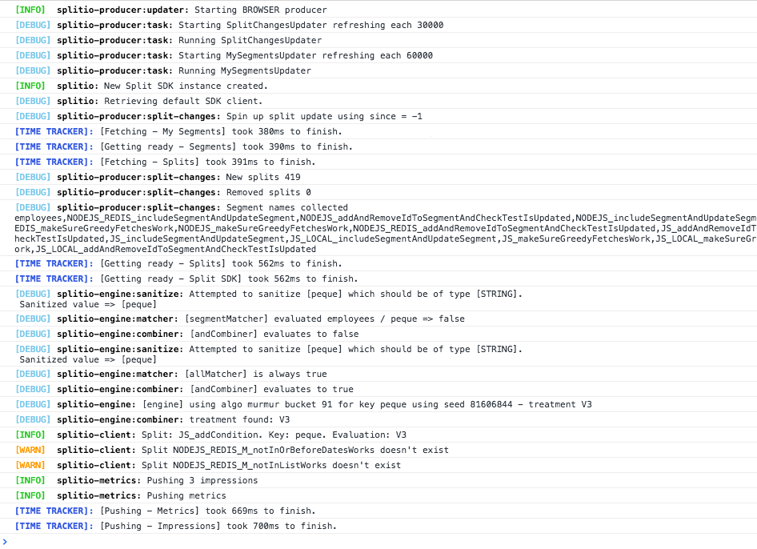

<p>
  <button hidden style={{borderRadius:'8px', border:'1px', fontFamily:'Courier New', fontWeight:'800', textAlign:'left'}}> help.split.io link: https://help.split.io/hc/en-us/articles/360020564931-Node-js-SDK </button>
</p>

import Tabs from '@theme/Tabs';
import TabItem from '@theme/TabItem';

This guide provides detailed information about our Node.js SDK. All of our SDKs are open source. Go to our [Node.js SDK GitHub repository](https://github.com/splitio/javascript-client) to learn more.

## Language support

The JavaScript SDK supports Node.js version 14.x or later.

:::tip[Rule-based segments support]
Rule-based segments are supported in SDK versions 11.4.0 and above. No changes are required to your SDK implementation, but updating to a supported version is required to ensure compatibility.

Older SDK versions will return the control treatment for flags using rule-based segments and log an impression with a special label for unsupported targeting rules.
:::

## Initialization

Set up FME in your code base with two simple steps.

### 1. Import the SDK into your project

The SDK is published using `npm`, so it's fully integrated with your workflow.

```bash title="NPM"
npm install --save @splitsoftware/splitio
```

:::warning[If using Synchronizer with Redis - Synchronizer 2.x required after SDK Version 10.6.0]
Since version 2.0.0 of the split-synchronizer, we use a more efficient scheme to store impressions in Redis. This approach is faster and easier on your Redis instances, since it yields better throughput of impressions to the backend. If you use this SDK with the Synchronizer in Redis or Proxy mode, you will need the newest versions of our Split Synchronizer. It is recommended that once you're using SDK versions compatible with Split-Sync 2.0 on all your applications pointing to the redis instance maintained by the Split-Sync, you disable backwards compatibility (this is as easy as changing a parameter to `true` on the JSON config or an environment variable to `on` if you're using the docker image).
:::

### 2. Instantiate the SDK and create a new SDK factory client

<Tabs groupId="java-type-script">
<TabItem value="JavaScript">

```javascript
var SplitFactory = require('@splitsoftware/splitio').SplitFactory;

var factory = SplitFactory({
  core: {
    authorizationKey: 'YOUR_SDK_KEY'
  }
});

var client = factory.client();
```

</TabItem>
<TabItem value="TypeScript">

```javascript
import { SplitFactory } from '@splitsoftware/splitio';

const factory: SplitIO.ISDK = SplitFactory({
  core: {
    authorizationKey: 'YOUR_SDK_KEY'
  }
});

const client: SplitIO.IClient = factory.client();
```

</TabItem>
</Tabs>

:::warning
**Updating to Node.js SDK version 11**

While FME Node.js SDK previously supported Node.js v6 and above, the SDK now requires Node.js v14 or above.

**Updating to Node.js SDK version 10**

We changed our module system to ES modules and now we are exposing an object with a SplitFactory property. That property points to the same factory function that we were returning in the previous versions. Take a look at the snippet above to see the code.
:::

:::danger[Running in the Browser?]
Refer to our [JavaScript SDK Setup](/docs/feature-management-experimentation/sdks-and-infrastructure/client-side-sdks/javascript-sdk#1-import-the-sdk-into-your-project) as the bundles and API are slightly different.
:::

:::info[Notice for TypeScript]
With the SDK package on NPM, you get the SplitIO namespace, which contains useful types and interfaces for you to use.

Feel free to dive in to the declaration files if IntelliSense is not enough!
:::

We recommend instantiating the SDK factory once as a singleton and reusing it throughout your application.

Configure the SDK with the SDK key for the FME environment that you would like to access. In legacy Split (app.split.io) the SDK key is found on your Admin settings page, in the API keys section. Select a server-side SDK API key. See [API keys](/docs/feature-management-experimentation/management-and-administration/account-settings/api-keys) to learn more.

Use the SDK factory client to evaluate treatments.

## Using the SDK

### Basic use

When the SDK is instantiated, it kicks off background jobs to update an in-memory cache with small amounts of data fetched from Harness servers. This process can take up to a few hundred milliseconds. While the SDK is in this intermediate state, if it is asked to evaluate which treatment to show to the logged in customer for a specific feature flag, it may not have data necessary to run the evaluation. In this case, the SDK does not fail, rather, it returns [the control treatment](/docs/feature-management-experimentation/feature-management/control-treatment).

To make sure the SDK is properly loaded before asking it for a treatment, block until the SDK is ready (as shown below). We set the client to listen for the `SDK_READY` event triggered by the SDK before asking for an evaluation.

When the `SDK_READY` event fires, you can use the `getTreatment` method to return the proper treatment based on the `key` and `FEATURE_FLAG_NAME` attributes you provided.

Then use an if-else-if block as shown below and insert the code for the different treatments that you defined in Harness FME. Remember the final else branch in your code to handle the client returning the [control treatment](/docs/feature-management-experimentation/feature-management/control-treatment).

<Tabs groupId="java-type-script">
<TabItem value="JavaScript">

```javascript
client.on(client.Event.SDK_READY, function() {
  // The key here represents the ID of the user/account/etc you're trying to evaluate a treatment for
  var treatment = client.getTreatment('key', 'FEATURE_FLAG_NAME');

  if (treatment == 'on') {
      // insert code here to show on treatment
  } else if (treatment == 'off') {
      // insert code here to show off treatment
  } else {
      // insert your control treatment code here
  }
});
```

</TabItem>
<TabItem value="TypeScript">

```javascript
client.on(client.Event.SDK_READY, () => {
  // The key here represents the ID of the user/account/etc you're trying to evaluate a treatment for
  const treatment: SplitIO.Treatment =
    client.getTreatment('key', 'FEATURE_FLAG_NAME');

  if (treatment == 'on') {
      // insert code here to show on treatment
  } else if (treatment == 'off') {
      // insert code here to show off treatment
  } else {
      // insert your control treatment code here
  }
});
```

</TabItem>
</Tabs>

### Attribute syntax

To [target based on custom attributes](/docs/feature-management-experimentation/feature-management/target-with-custom-attributes), the SDK's `getTreatment` method needs to be passed an attribute map at runtime.

In the example below, we are rolling out a feature flag to users. The provided attributes `plan_type`, `registered_date`, `permissions`, `paying_customer`, and `deal_size` are passed to the `getTreatment` call. These attributes are compared and evaluated against the attributes used in the rollout plan as defined in Harness FME to decide whether to show the `on` or `off` treatment to this account.

The `getTreatment` method has a number of variations that are described below. Each of these additionally has a variation that takes an attributes argument, which can defines attributes of the following types: strings, numbers, dates, booleans, and sets. The proper data type and syntax for each are:

* **Strings:** Use type String.
* **Numbers:** Use type Number.
* **Dates: ** Express the value for these attributes in `milliseconds since epoch` and as objects of class `DateTime`.
* **Booleans:** Use type Boolean.
* **Sets:** Use type Array.

<Tabs groupId="java-type-script">
<TabItem value="JavaScript">

```javascript
var attributes = {
  // date attributes are handled as `millis since epoch`
  registered_date: new Date('YYYY-MM-DDTHH:mm:ss.sssZ').getTime(),
  // this string will be compared against a list called `plan_type`
  plan_type: 'growth',
  // this number will be compared against a const value called `deal_size`
  deal_size: 10000,
  // this boolean will be compared against a const value called `paying_customer`
  paying_customer: true,
  // this array will be compared against a set called `permissions`
  permissions: [‘read’, ‘write’]
};

var treatment = client.getTreatment('key', 'FEATURE_FLAG_NAME', attributes);

if (treatment === 'on') {
  // insert on code here
} else if (treatment === 'off') {
  // insert off code here
} else {
  // insert control code here
}
```

</TabItem>
<TabItem value="TypeScript">

```javascript
const attributes: SplitIO.Attributes = {
  // date attributes are handled as `millis since epoch`
  registered_date: new Date('YYYY-MM-DDTHH:mm:ss.sssZ').getTime(),
  // this string will be compared against a list called `plan_type`
  plan_type: 'growth',
  // this number will be compared agains a const value called `deal_size`
  deal_size: 10000,
  // this array will be compared against a set called `permissions`
  permissions: [‘read’, ‘write’]
};

const treatment: SplitIO.Treatment =
  client.getTreatment('key', 'FEATURE_FLAG_NAME', attributes);

if (treatment === 'on') {
  // insert on code here
} else if (treatment === 'off') {
  // insert off code here
} else {
  // insert control code here
}
```

</TabItem>
</Tabs>

You can pass your attributes in the same way to the `client.getTreatments` method.

### Multiple evaluations at once

In some instances, you may want to evaluate treatments for multiple feature flags at once. Use the different variations of `getTreatments` from the SDK factory client to do this.
* `getTreatments`: Pass a list of the feature flag names you want treatments for.
* `getTreatmentsByFlagSet`: Evaluate all flags that are part of the provided set name and are cached on the SDK instance.
* `getTreatmentsByFlagSets`: Evaluate all flags that are part of the provided set names and are cached on the SDK instance.

<Tabs groupId="java-type-script">
<TabItem value="JavaScript">

```javascript
// Getting treatments by feature flag names
var featureFlagNames = ['FEATURE_FLAG_NAME_1', 'FEATURE_FLAG_NAME_2'];
var treatments = client.getTreatments('key', featureFlagNames);

// Getting treatments by set
treatments = client.getTreatmentsByFlagSet('key', 'backend');

// Getting treatments for the union of multiple sets
var flagSets = ['backend', 'server_side'];
treatments = client.getTreatmentsByFlagSets('key', flagSets);

// treatments have the following form: 
// {
//   FEATURE_FLAG_NAME_1: 'on',
//   FEATURE_FLAG_NAME_2: 'visa'
// }
```

</TabItem>
<TabItem value="TypeScript">

```javascript
// Getting treatments by feature flag names
const featureFlagNames = ['FEATURE_FLAG_NAME_1', 'FEATURE_FLAG_NAME_1'];
let treatments: SplitIO.Treatments = client.getTreatments('key', featureFlagNames);

// Getting treatments by set
treatments = client.getTreatmentsByFlagSet('key', 'backend');

// Getting treatments for the union of multiple sets
const flagSets = ['backend', 'server_side'];
treatments = client.getTreatmentsByFlagSets('key', flagSets);

// treatments have the following form: 
// {
//   FEATURE_FLAG_NAME_1: 'on',
//   FEATURE_FLAG_NAME_2: 'visa'
// }
```

</TabItem>
</Tabs>

You can also use the [Split Manager](#manager) to get all of your treatments at once.

:::warning[Working with sync and async storage]
If your code runs with both types of storage, read [Working with both sync and async storage](#working-with-both-sync-and-async-storage).
:::

### Get treatments with configurations

To [leverage dynamic configurations with your treatments](/docs/feature-management-experimentation/feature-management/dynamic-configurations), you should use the `getTreatmentWithConfig` method.

This method will return an object containing the treatment and associated configuration.

The config element will be a stringified version of the configuration JSON defined in Harness FME. If there is no configuration defined for a treatment, the SDK will return `null` for the config parameter.

This method takes the exact same set of arguments as the standard `getTreatment` method. See below for examples on proper usage:

<Tabs groupId="java-type-script">
<TabItem value="JavaScript">

```javascript
var flagResult = client.getTreatmentWithConfig('user_id', 'FEATURE_FLAG_NAME', attributes);
var configs = JSON.parse(flagResult.config);
var treatment = flagResult.treatment;
```

</TabItem>
<TabItem value="TypeScript">

```javascript
const flagResult: SplitIO.TreatmentWithConfig = client.getTreatmentWithConfig('user_id', 'FEATURE_FLAG_NAME', attributes);
const configs: any = JSON.parse(flagResult.config);
const treatment: SplitIO.Treatment = flagResult.treatment;
```

</TabItem>
</Tabs>

If you need to get multiple evaluations at once, you can also use the `getTreatmentsWithConfig` methods. These methods take the exact same arguments as the [getTreatments](#multiple-evaluations-at-once) methods but return a mapping of feature flag names to TreatmentResults instead of strings. Example usage below:

<Tabs groupId="java-type-script">
<TabItem value="JavaScript">

```javascript
// Getting treatments by feature flag names
var flagNames = ['FEATURE_FLAG_NAME_1', 'FEATURE_FLAG_NAME_2'];
var treatmentResults = client.getTreatmentsWithConfig('user_id', flagNames);

// Getting treatments by set
treatmentResults = client.getTreatmentsWithConfigByFlagSet('user_id', 'backend');

// Getting treatments for the union of multiple sets
var flagSets = ['backend', 'server_side'];
treatmentResults = client.getTreatmentsWithConfigByFlagSets('user_id', flagSets);

// treatmentResults will have the following form: 
// {
//   FEATURE_FLAG_NAME_1: {treatment: 'on',
//                         config: "{ 'color' : 'red'}}",
//   FEATURE_FLAG_NAME_2: {treatment: 'v2',
//                         config: "{ 'copy' : 'better copy'}}",
// }
```

</TabItem>
<TabItem value="TypeScript">

```javascript
// Getting treatments by feature flag names
const flagNames = ['FEATURE_FLAG_NAME_1', 'FEATURE_FLAG_NAME_2']; 
let treatmentResults: SplitIO.TreatmentsWithConfig = client.getTreatmentsWithConfig('user_id', flagNames);

// Getting treatments by set
treatmentResults = client.getTreatmentsWithConfigByFlagSet('user_id', 'backend');

// Getting treatments for the union of multiple sets
const flagSets = ['backend', 'server_side'];
treatmentResults = client.getTreatmentsWithConfigByFlagSets('user_id', flagSets);

// treatmentResults will have the following form: 
// {
//   FEATURE_FLAG_NAME_1: {treatment: 'on',
//                         config: "{ 'color' : 'red'}}",
//   FEATURE_FLAG_NAME_2: {treatment: 'v2',
//                         config: "{ 'copy' : 'better copy'}}",
// }
```

</TabItem>
</Tabs>

### Append properties to impressions

[Impressions](/docs/feature-management-experimentation/feature-management/impressions) are generated by the SDK each time a `getTreatment` method is called. These impressions are periodically sent back to Harness servers for feature monitoring and experimentation.

You can append properties to an impression by passing an object of key-value pairs to the `getTreatment` method. These properties are then included in the impression sent by the SDK and can provide useful context to the impression data.

Three types of properties are supported: strings, numbers, and booleans.

<Tabs groupId="java-type-script">
<TabItem value="JavaScript">

```javascript
const evaluationOptions = {
  properties: { 
    package: "premium", 
    admin: true, 
    discount: 50 
  }
};

const treatment = client.getTreatment('key', 'FEATURE_FLAG_NAME', undefined, evaluationOptions);
```

</TabItem>
<TabItem value="TypeScript">

```typescript
const evaluationOptions: SplitIO.EvaluationOptions = {
  properties: { 
    package: "premium", 
    admin: true, 
    discount: 50 
  }
};

const treatment: string = client.getTreatment('key', 'FEATURE_FLAG_NAME', undefined, evaluationOptions);
```

</TabItem>
</Tabs>

### Shutdown

Call the `client.destroy()` method before letting a process using the SDK exit, as this method gracefully shuts down the SDK by stopping all background threads, clearing caches, closing connections, and flushing the remaining unpublished impressions. 

<Tabs groupId="java-type-script">
<TabItem value="JavaScript">

```javascript
user_client.destroy();
user_client = null;
```

</TabItem>
</Tabs>

After `destroy()` is called and finishes, any subsequent invocations to `getTreatment`/`getTreatments` or manager methods result in `control` or empty list, respectively.

:::warning[Important!]
A call to the `destroy()` method also destroys the factory object. When creating new client instance, first create a new factory instance.
:::

## Track

Use the `track` method to record any actions your customers perform. Each action is known as an `event` and corresponds to an `event type`. Calling `track` through one of our SDKs or via the API is the first step to  and allows you to measure the impact of your feature flags on your users’ actions and metrics.

[Learn more](/docs/feature-management-experimentation/release-monitoring/events/) about using track events in features.

In the examples below, you can see that the `.track()` method can take up to five arguments. The proper data type and syntax for each are:

* **key:** The `key` variable used in the `getTreatment` call and firing this track event. The expected data type is **String**.
* **TRAFFIC_TYPE:** The traffic type of the key in the track call. The expected data type is **String**. You can only pass values that match the names of [traffic types](/docs/feature-management-experimentation/management-and-administration/fme-settings/traffic-types/) that you have defined in your instance of feature flag.
* **EVENT_TYPE:** The event type that this event should correspond to. The expected data type is **String**. Full requirements on this argument are:
     * Contains 63 characters or fewer.
     * Starts with a letter or number.
     * Contains only letters, numbers, hyphen, underscore, or period.
     * This is the regular expression we use to validate the value: `[a-zA-Z0-9][-_\.a-zA-Z0-9]{0,62}`
* **VALUE:** (Optional) The value to be used in creating the metric. This field can be sent in as null or 0 if you intend to purely use the count function when creating a metric. The expected data type is **Integer** or **Float**.
* **PROPERTIES:** (Optional) An object of key value pairs that can be used to filter your metrics. Learn more about event property capture in the [Events](/docs/feature-management-experimentation/release-monitoring/events/#event-properties) guide. FME currently supports three types of properties: strings, numbers, and booleans.

The `track` method returns a boolean value of `true` or `false` to indicate whether or not the SDK was able to successfully queue the event to be sent back to Harness servers on the next event post. The SDK will return `false` if the current queue size is equal to the config set by `eventsQueueSize` or if an incorrect input to the `track` method has been provided.

In the case that a bad input has been provided, you can read more about our SDK's expected behavior [here](/docs/feature-management-experimentation/release-monitoring/events/)

<Tabs groupId="java-type-script">
<TabItem value="JavaScript">

```javascript
// If you would like to send an event without a value
var queuedPromise = client.track('key', 'TRAFFIC_TYPE', 'EVENT_TYPE');
// Example
var queuedPromise = client.track('john@doe.com', 'user', 'page_load_time');

// If you would like to associate a value with an event
var queuedPromise = client.track('key', 'TRAFFIC_TYPE', 'EVENT_TYPE', eventValue);
// Example
var queuedPromise = client.track('john@doe.com', 'user', 'page_load_time', 83.334);

// If you would like to associate a value and properties with an event
var properties = { package : 'premium', admin : true, discount : 50 };
var queued = client.track('john@doe.com', 'user', 'page_load_time', 83.334, properties);

// If you would like to associate only properties with an event
var properties = { package : 'premium', admin : true, discount : 50 };
var queued = client.track('john@doe.com', 'user', 'page_load_time', null, properties);

// IF AND ONLY IF you're using Redis storage, the track function returns a promise which will resolve to a boolean
// instead of the boolean itself, indicating if the event was correctly queued or not.
queuedPromise.then(function(queued) {
  console.log(queued ? 'Successfully queued event' : 'Failed to queue event');
});
```

</TabItem>
<TabItem value="TypeScript">

```javascript
// If you would like to send an event without a value
const queuedPromise: Promise<boolean> = client.track('key', 'TRAFFIC_TYPE', 'EVENT_TYPE');
// Example
const queuedPromise: Promise<boolean> = client.track('john@doe.com', 'user', 'page_load_time');

// If you would like to associate a value with an event
const queuedPromise: Promise<boolean> = client.track('key', 'TRAFFIC_TYPE', 'EVENT_TYPE', eventValue);
// Example
const queuedPromise: Promise<boolean> = client.track('john@doe.com', 'user', 'page_load_time', 83.334);

// If you would like to associate a value and properties with an event
const properties = { package : 'premium', admin : true, discount : 50 };
const queued = client.track('nico@split', 'user', 'page_load_time', 83.334, properties);

// If you would like to associate only properties with an event
const properties = { package : 'premium', admin : true, discount : 50 };
const queued = client.track('nico@split', 'user', 'page_load_time', null, properties);

// IF AND ONLY IF you're using Redis storage, the track function returns a promise which will resolve to a boolean
// instead of the boolean itself, indicating if the event was correctly queued or not.
queuedPromise.then(queued => {
  console.log(queued ? 'Successfully queued event' : 'Failed to queue event');
});
```

</TabItem>
</Tabs>

## Configuration

The SDK has a number of knobs for configuring performance. Each knob is tuned to a reasonable default. However, you can override the value while instantiating the SDK. The parameters available for configuration are shown below.

| **Configuration** | **Description** | **Default value** |
| --- | --- | --- |
| core.labelsEnabled  | Disable labels from being sent to the Harness servers. Labels may contain sensitive information. | true  |
| core.IPAddressesEnabled | Disable machine IP and Hostname from being sent to Harness servers. IP and Hostname may contain sensitive information. | true |
| startup.readyTimeout  | Maximum amount of time in seconds to wait before notifying a timeout. Zero means no timeout, so no `SDK_READY_TIMED_OUT` event is fired. | 15  |
| startup.requestTimeoutBeforeReady  | Time to wait for a request before the SDK is ready. If this time expires, Node.js SDK tries again `retriesOnFailureBeforeReady` times before notifying its failure to be `ready`. Zero means no timeout.  | 15  |
| startup.retriesOnFailureBeforeReady  | Number of quick retries we do while starting up the SDK.  | 1  |
| scheduler.featuresRefreshRate | The SDK polls Harness servers for changes to feature rollout plans. This parameter controls this polling period in seconds. | 60 |
| scheduler.segmentsRefreshRate  | The SDK polls Harness servers for changes to segment definitions. This parameter controls this polling period in seconds. | 60  |
| scheduler.impressionsRefreshRate  | The SDK sends information on who got what treatment at what time back to Harness servers to power analytics. This parameter controls how often this data is sent to Harness servers. The parameter should be in seconds. | 300 |
| scheduler.impressionsQueueSize | The max amount of impressions we queue. If the queue is full, the SDK flushes the impressions and resets the timer. | 30000 |
| scheduler.eventsPushRate  | The SDK sends tracked events to Harness servers. This setting controls that flushing rate in seconds. | 60  |
| scheduler.eventsQueueSize  | The max amount of events we queue. If the queue is full, the SDK flushes the events and resets the timer. | 500  |
| scheduler.telemetryRefreshRate | The SDK caches diagnostic data that it periodically sends to Harness servers. This configuration controls how frequently this data is sent back to Harness servers (in seconds). | 3600 seconds (1 hour) |
| sync.splitFilters | Filter specific feature flags to be synced and evaluated by the SDK. This is formed by a type string property and a list of string values for the given criteria. Using the types 'bySet' (recommended, flag sets are available in all tiers) or 'byName', pass an array of strings defining the query. If empty or unset, all feature flags are downloaded by the SDK. | [] |
| sync.impressionsMode | This configuration defines how impressions (decisioning events) are queued on the SDK. Supported modes are OPTIMIZED, NONE, and DEBUG. In OPTIMIZED mode, only unique impressions are queued and posted to Harness; this is the recommended mode for experimentation use cases. In NONE mode, no impression is tracked in Harness FME and only minimum viable data to support usage stats is tracked, so never use this mode if you are experimenting with instance impressions. Use NONE when you want to optimize for feature flagging only use cases and reduce impressions' network and storage load. In DEBUG mode, ALL impressions are queued and sent to Harness; this is useful for validations. This mode doesn't impact the impression listener which receives all generated impressions locally. Keep in mind that both the OPTIMIZED and DEBUG modes utilize an internal cache which uses heap memory incrementally up to a maximum limit ___without a memory leak___. | OPTIMIZED |
| sync.enabled | Controls the SDK continuous synchronization flags. When `true`, a running SDK processes rollout plan updates performed in Harness FME (default). When `false`, it fetches all data upon init, which ensures a consistent experience during a user session and optimizes resources when these updates are not consumed by the app. | true |
| sync.requestOptions.agent | A custom Node.js HTTP(S) Agent used to perform the requests to the Harness servers. See [Proxy](#proxy) for details. | undefined |
| sync.requestOptions.getHeaderOverrides | A callback function that can be used to override the Authentication header or append new headers to the SDK's HTTP(S) requests. | undefined |
| storage.type  | Storage type to be used by the SDK. Possible values are `MEMORY`, and `REDIS`. | `MEMORY` |
| storage.options | Options to be passed to the storage instance. Only usable with `REDIS` type storage for now. See [Redis configuration](#redis-configuration) for details. | {}<br />No default options |
| storage.prefix | An optional prefix for your data, to avoid collisions. | `SPLITIO` |
| mode  | The SDK mode. Possible values are standalone and consumer. | standalone |
| debug  | Boolean flag or log level string ('ERROR', 'WARN', 'INFO', or 'DEBUG') for activating SDK logs. | false |
| streamingEnabled | Boolean flag to enable the streaming service as default synchronization mechanism. In the event of an issue with streaming, the SDK will fallback to the polling mechanism. If false, the SDK will poll for changes as usual without attempting to use streaming. | true |

To set each of the parameters defined above, use the following syntax.

<Tabs groupId="java-type-script">
<TabItem value="JavaScript">

```javascript
var factory = SplitFactory({
  core: {
    authorizationKey: 'YOUR_API_KEY',
    labelsEnabled: true
  },
  scheduler: {
    featuresRefreshRate:      5, // 5 sec
    segmentsRefreshRate:     60, // 60 sec
    impressionsRefreshRate: 300, // 300 sec
    impressionsQueueSize: 30000, // 30000 items
    eventsPushRate:          60, // 60 sec
    eventsQueueSize:        500, // 500 items
    telemetryRefreshRate:  3600  // 1 hour
  },
  startup: {
    requestTimeoutBeforeReady: 1.5, // 1500 ms
    retriesOnFailureBeforeReady: 3, // 3 times
    readyTimeout: 5                 // 5 sec
  },
  sync: {
    splitFilters: [{
      type: 'bySet',
      values: ['backend']
    }],
    impressionsMode: 'DEBUG',
    requestOptions: {
      getHeaderOverrides() {
        return {
          'custom-header': 'custom-value'
        };
      }
    }
  },
  storage: {
    type: 'REDIS',
    options: {},
    prefix: 'MYPREFIX'
  },
  mode: 'standalone',
  debug: false
});
```

</TabItem>
<TabItem value="TypeScript">

```javascript
const factory: SplitIO.ISDK = SplitFactory({
  core: {
    authorizationKey: 'YOUR_API_KEY',
    labelsEnabled: true
  },
  scheduler: {
    featuresRefreshRate:      5, // 5 sec
    segmentsRefreshRate:     60, // 60 sec
    impressionsRefreshRate: 300, // 300 sec
    impressionsQueueSize: 30000, // 30000 items
    eventsPushRate:          60, // 60 sec
    eventsQueueSize:        500, // 500 items
    telemetryRefreshRate:  3600  // 1 hour
  },
  startup: {
    requestTimeoutBeforeReady: 1.5, // 1500 ms
    retriesOnFailureBeforeReady: 3, // 3 times
    readyTimeout: 5                 // 5 sec
  },
  sync: {
    splitFilters: [{
      type: 'bySet',
      values: ['backend']
    }],
    impressionsMode: 'DEBUG',
    requestOptions: {
      getHeaderOverrides() {
        return {
          'custom-header': 'custom-value'
        };
      }
    }
  },
  storage: {
    type: 'REDIS',
    options: {},
    prefix: 'MYPREFIX'
  },
  mode: 'standalone',
  debug: false
});
```

</TabItem>
</Tabs>

## State sharing with Redis

**Configuring this Redis integration section is optional for most setups. Read below to determine if it might be useful for your project.**

By default, the SDK factory client stores the state it needs to compute treatments (rollout plans, segments, and so on) in memory. As a result, it is easy to get set up with FME: simply instantiate a client and start using it.

This simplicity hides one important detail that is worth exploring. Because each SDK factory client downloads and stores state separately, a change in a feature flag is picked up by every client on its own schedule. Thus, if a customer issues back-to-back requests that are served by two different machines behind a load balancer, the customer can see different treatments for the same feature flag because one SDK factory client may not have picked up the latest change. This drift in clients is natural and usually ignorable as long as each client sets an aggressive value for `FeaturesRefreshRate` and `SegmentsRefreshRate`. You can learn more about setting these rates in the [Configuration section](#configuration) below.

However, if your application requires a total guarantee that SDK clients across your entire infrastructure pick up a change in a feature flag at the exact same time or you need an async data store, then the only way to ensure that is to externalize the state of the SDK factory client in a data store hosted on your infrastructure.

We currently support Redis for this external data store.

To use the Node.js SDK with Redis, set up the Split Synchronizer and instantiate the SDK in consumer mode.

#### Split Synchronizer

Follow the steps in our [Split Synchronizer](/docs/feature-management-experimentation/sdks-and-infrastructure/optional-infra/split-synchronizer) documents to get everything set to sync data to your Redis cache. After you do that, come back to set up the SDK in consumer mode!

#### Consumer mode

In consumer mode, a client can be embedded in your application code and respond to calls to `getTreatment` by retrieving state from the data store (Redis in this case).

Here is how to configure and get treatments for a SDK factory client in consumer mode.

<Tabs groupId="java-type-script">
<TabItem value="JavaScript">

```javascript
var SplitFactory = require('@splitsoftware/splitio').SplitFactory;

var config = {
  mode: 'consumer', // changing the mode to consumer here
  core: {
    authorizationKey: '<your-sdk-key>'
  },
  // defining the location of the Redis cache that the SDK should talk to
  storage: {
    type: 'REDIS',
    options: {
      url: 'redis://<your-redis-server>:<your-redis-server-port>/0'
    },
    prefix: 'nodejs' // Optional prefix to prevent any kind of
                     // data collision between SDK versions.
  }
};

var factory = SplitFactory(config);
var client = factory.client();

// Redis in Node.js is async, so the operation is executed asynchronously.
// You have as 2 different syntaxes to getTreatments:

// one is the async/await syntax
var treatment = await client.getTreatment('user_id', 'my-feature-flag-coming-from-redis');

// or just using the returned promise
client.getTreatment('user_id', 'my-feature-flag-coming-from-redis')
  .then(treatment => {
    // do something with the treatment
  });

// You can optionally listen at the following events in consumer mode:

client.once(client.Event.SDK_READY, function () {
  // This callback will be called once the connection with Redis is stablished.
  // There is no need to wait for this event before using the SDK, since the promise will resolve once it could get
  // the data (including Redis connection) and perform the operation or reject in case of error, including timeouts.
});

client.once(client.Event.SDK_READY_TIMED_OUT, function () {
  // This callback will be called after the seconds set at the `startup.readyTimeout` config parameter,
  // if and only if the SDK_READY event was not emitted for that time.
});
```

</TabItem>
<TabItem value="TypeScript">

```javascript
import { SplitFactory } from '@splitsoftware/splitio';

const config: SplitIO.INodeAsyncSettings = {
  mode: 'consumer', // changing the mode to consumer here
  core: {
    authorizationKey: '<your-sdk-key>'
  },
  // defining the location of the Redis cache that the SDK should talk to
  storage: {
    type: 'REDIS',
    options: {
      url: 'redis://<your-redis-server>:<your-redis-server-port>/0'
    },
    prefix: 'nodejs' // Optional prefix to prevent any kind of
                     // data collision between SDK versions.
  }
};

const factory: SplitIO.IAsyncSDK = SplitFactory(config);
const client: SplitIO.IAsyncClient = factory.client();

// Redis in Node.js is async. This means we run the evaluation in a async way.
// You have 2 different syntaxes to interact with getTreatment results:

// One, by just using the returned promise
client.getTreatment('user_id', 'my-feature-flag-coming-from-redis')
  .then(treatment => {
    // do something with the treatment
  });

// Or you can use the async/await syntax
const treatment = await client.getTreatment('user_id', 'my-feature-flag-coming-from-redis');
// do something with the treatment

// NOTE: async/await is supported for all targets since TypeScript 2.1.
// See https://www.typescriptlang.org/docs/handbook/release-notes/typescript-2-1.html#downlevel-async-functions for details.
```

</TabItem>
</Tabs>

#### Redis configuration

The SDK in consumer mode connects to Redis to function, using URL `redis://localhost:6379/0` by default. You can override this URL and other Redis connection parameters with the SDK `storage.options` configuration object. The available parameters are shown below.

| **Configuration** | **Description** | **Default value** |
| --- | --- | --- |
| host | Hostname where the Redis instance is. | `localhost` |
| port | HTTP port to be used in the connection. | 6379  |
| db | Numeric database to be used. | 0 |
| pass | Redis DB password. Don't define if no password is used. | undefined |
| url | Redis URL. If set, `host`, `port`, `db` and `pass` params will be ignored. Example: `redis://:authpassword@127.0.0.1:6379/0` | undefined |
| tls | TLS configuration object. See [ioredis TLS Options](https://www.npmjs.com/package/ioredis#tls-options) for details. | undefined |
| connectionTimeout | The milliseconds before a timeout occurs during the initial connection to the Redis server. | 10000 |
| operationTimeout | The milliseconds before Redis commands are timeout by the SDK. Method calls that involve Redis commands, like `client.getTreatment` or `client.track` calls, are resolved when the commands success or timeout. | 5000 |

## Localhost mode

For testing, a developer can put code behind feature flags on their development machine without the SDK requiring network connectivity. To achieve this, the SDK can be started in **localhost** mode (aka off-the-grid mode). In this mode, the SDK neither polls nor updates Harness servers. Instead, it uses an in-memory data structure to determine what treatments to show to the logged in customer for each of the feature flags.

To use the SDK in localhost mode, set the `authorizationKey` config property to "localhost", as shown in the example below:

<Tabs groupId="java-type-script">
<TabItem value="JavaScript">

```javascript
var factory = SplitFactory({
  core: {
    authorizationKey: 'localhost'
  },
  features: path.join(__dirname, '.split'),
  scheduler: {
    offlineRefreshRate: 15 // 15 sec
  }
});

var client = factory.client();

client.on(client.Event.SDK_READY, function() {
  // The following code will be evaluated once the engine finalizes
  // the initialization
  var t1 = client.getTreatment('user_id', 'reporting_v2');
  var t2 = client.getTreatment('user_id', 'billing_updates');
  var t3 = client.getTreatment('user_id', 'navigation_bar_changes');
});
```

</TabItem>
<TabItem value="TypeScript">

```javascript
const factory: SplitIO.ISDK = SplitFactory({
  core: {
    authorizationKey: 'localhost'
  },
  features: path.join(__dirname, '.split'),
  scheduler: {
    offlineRefreshRate: 15 // 15 sec
  }
});

const client: SplitIO.IClient = factory.client();

client.on(client.Event.SDK_READY, function() {
  // The following code will be evaluated once the engine finalizes
  // the initialization
  const t1: SplitIO.Treatment = client.getTreatment('user_id', 'reporting_v2');
  const t2: SplitIO.Treatment = client.getTreatment('user_id', 'billing_updates');
  const t3: SplitIO.Treatment = client.getTreatment('user_id', 'navigation_bar_changes');
});
```

</TabItem>
</Tabs>

In this mode, the SDK loads a mapping of feature flag name to treatment from a file at `$HOME/.split`. For a given feature flag, the treatment specified in the file is returned for every customer. Should you want to use another file, you just need to set the `features` key in the configuration object passed at instantiation time, to the full path of the desired file.

`getTreatment` calls for a feature flag only return the one treatment that you defined in the file. You can then change the treatment as necessary for your testing in the file. Any feature flag that is not provided in the `features` map returns [the control treatment](/docs/feature-management-experimentation/feature-management/control-treatment) if the SDK is asked to evaluate them.

Here is a sample `.split` file. The format of this file is two columns separated by a whitespace. The left column is the feature flag name, and the right column is the treatment name.

<Tabs>
<TabItem value="Text">

```bash
## this is a comment

reporting_v2 on ## sdk.getTreatment(*, reporting_v2) will return 'on'

double_writes_to_cassandra off

new-navigation v3
```

</TabItem>
</Tabs>

**Since version 10.7.0**, our SDK supports a new type of localhost feature flag definition file, using the YAML format. This new format allows the user to map different keys to different treatments within a single feature flag, and also add configurations to them for a given treatment. The new format is a list of single-key maps (one per mapping split-keys-config), defined as follows:

<Tabs>
<TabItem value="YAML">

```yaml
## - feature_name:
##     treatment: "treatment_applied_to_this_entry"
##     keys: ["single_key_or_list", "other_key_same_treatment"]
##     config: "{\"desc\" : \"this applies only to ON treatment\"}"
#
## Note that the "treatment" key is mandatory, but both "keys" and "config" are optional.

- my_feature:
    treatment: "on"
    keys: "mock_user_id"
    config: "{\"desc\" : \"this applies only to ON treatment\"}"
- some_other_feature:
    treatment: "off"
- my_feature:
    treatment: "off"
```

</TabItem>
</Tabs>

In the example above, we have 3 entries:
 * The first one defines that for feature flag `my_feature`, the key `mock_user_id` will return the treatment `on` and the `on` treatment will be tied to the configuration `{"desc" : "this applies only to ON treatment"}`.
 * The second entry defines that the feature flag `some_other_feature` will always return the `off` treatment and no configuration.
 * The third entry defines that `my_feature` will always return `off` for all keys that don't match another entry (in this case, any key other than `mock_user_id`).

In addition, there are some extra configuration parameters that can be used when instantiating the SDK in localhost mode.

| **Configuration** | **Description** | **Default value** |
| --- | --- | --- |
| scheduler.offlineRefreshRate | The refresh interval for the mocked feature flags treatments. | 15 |
| features | The path to the file with the mocked feature flag data. | `$HOME/.split`  |

## Manager

Use the Split Manager to get a list of feature flags available to the SDK factory client.

To instantiate a Manager in your code base, use the same factory that you used for your client.

<Tabs groupId="java-type-script">
<TabItem value="JavaScript">

```javascript
var factory = SplitFactory({
  core: {
    authorizationKey: 'YOUR_SDK_KEY'
  }
});

var manager = factory.manager();

manager.once(manager.Event.SDK_READY, function() {
  // Once it's ready, use the manager
});
```

</TabItem>
<TabItem value="TypeScript">

```javascript
const factory: SplitIO.ISDK = SplitFactory({
  core: {
    authorizationKey: 'YOUR_SDK_KEY'
  }
});

const manager: SplitIO.IManager = factory.manager();

manager.once(manager.Event.SDK_READY, function() {
  // Once it's ready, use the manager
});
```

</TabItem>
</Tabs>

The Manager instance has the following methods available.

<Tabs groupId="java-type-script">
<TabItem value="JavaScript">

```javascript
/**
 * Returns the feature flag registered with the SDK of this name.
 *
 * @return SplitView or null.
 */
var splitView = manager.split('FEATURE_FLAG_NAME');

/**
 * Retrieves the feature flags that are currently registered with the
 * SDK.
 *
 * returns a List of SplitViews.
 */
var splitViewsList = manager.splits();

/**
 * Returns the names of feature flags registered with the SDK.
 *
 * @return a List of Strings of the feature flag names.
 */
var splitNamesList = manager.names();
```

</TabItem>
<TabItem value="TypeScript">

```javascript
/**
 * Returns the feature flag registered with the SDK of this name.
 *
 * @return SplitView or null.
 */
var splitView: SplitIO.SplitView = manager.split('FEATURE_FLAG_NAME');

/**
 * Retrieves the feature flags that are currently registered with the
 * SDK.
 *
 * returns a List of SplitViews.
 */
var splitViewsList: SplitIO.SplitViews = manager.splits();

/**
 * Returns the names of feature flags registered with the SDK.
 *
 * @return a List of Strings of the features' names.
 */
var splitNamesList: SplitIO.SplitNames = manager.names();
```

</TabItem>
</Tabs>

The `SplitView` object referenced above has the following structure:

```typescript title="TypeScript"
type SplitView = {
  name: string,
  trafficType: string,
  killed: boolean,
  treatments: Array<string>,
  changeNumber: number,
  configs: {
    [treatmentName: string]: string
  },
  defaultTreatment: string,
  sets: Array<string>,
  impressionsDisabled: boolean,
  prerequisites: Array<{ flagName: string, treatments: string[] }>
}
```

## Listener

FME SDKs send impression data back to Harness servers periodically when evaluating feature flags. To send this information to a location of your choice, define and attach an *impression listener*. Use the SDK's `impressionListener` parameter, where you can add an implementation of `ImpressionListener`. This implementation **must** define the `logImpression` method. It receives data in the following schema.

| **Name** | **Type** | **Description** |
| --- | --- | --- |
| impression | Object / SplitIO.Impression | Impression object that has the feature flag, key, treatment, label, etc. |
| attributes | Object / SplitIO.Attributes | A map of attributes passed to `getTreatment`/`getTreatments` (if any). |
| ip | String  | The IP address of the machine where the SDK is running. |
| hostname | String  | The hostname of the OS where the SDK is running. |
| sdkLanguageVersion | String  | The version of the SDK. In this case the language is `nodejs` plus the version currently running. |

## Implement a custom impression listener

Here is an example of how to implement a custom impression listener.

<Tabs groupId="java-type-script">
<TabItem value="JavaScript">

```javascript
function logImpression(impressionData) {
  // do something with the impression data.
}

var factory = SplitFactory({
  core: {
    authorizationKey: 'YOUR_SDK_KEY'
  },
  impressionListener: {
    logImpression: logImpression
  }
});
```

</TabItem>
<TabItem value="TypeScript">

```javascript
class MyImprListener implements SplitIO.IImpressionListener {
  logImpression(impressionData: SplitIO.ImpressionData) {
    // do something with impressionData
  }
}

const factory: SplitIO.ISDK = SplitFactory({
  core: {
    authorizationKey: 'YOUR_SDK_KEY'
  },
  impressionListener: {
    logImpression: new MyImprListener()
  }
});
```

</TabItem>
</Tabs>

An impression listener is called asynchronously from the corresponding evaluation, but is almost immediate.

The SDK does not fail if there is an exception in the listener, but be careful to avoid blocking the call stack.

## Logging

To enable SDK logging in your Node.js app, set the `SPLITIO_DEBUG` environment variable as follows.

<Tabs>
<TabItem value="Enable logging from console">

```bash
## Acceptable values are 'DEBUG', 'INFO', 'WARN', 'ERROR' and 'NONE'
## Other acceptable values are 'on', 'enable' and 'enabled', which are equivalent to 'DEBUG' log level
SPLITIO_DEBUG='on' node app.js
```

</TabItem>
</Tabs>

Since v9.2.0 of the SDK, you can enable logging via SDK settings and programmatically by calling the Logger API.

<Tabs groupId="java-type-script">
<TabItem value="JavaScript" label="Logger API (JavaScript)">

```javascript
var SplitFactory = require('@splitsoftware/splitio').SplitFactory;

var factory = SplitFactory({
  core: {
    authorizationKey: 'YOUR_SDK_KEY'
  },
  debug: true // Debug boolean option can be passed on settings.
});

// Or you can use the Logger API which two methods, enable and disable.
// Calling this methods will have an immediate effect.
factory.Logger.enable();
factory.Logger.disable();

// You can also set the log level programatically after v10.4.0
// Acceptable values are: 'DEBUG', 'INFO', 'WARN', 'ERROR', 'NONE'.
// 'DEBUG' is equivalent to `enable` method.
// 'NONE' is equivalent to `disable` method.
factory.Logger.setLogLevel('WARN');
```

</TabItem>
<TabItem value="TypeScript" label="Logger API (TypeScript)">

```javascript
import { SplitFactory } from '@splitsoftware/splitio';

const factory: SplitIO.ISDK = SplitFactory({
  core: {
    authorizationKey: 'YOUR_SDK_KEY'
  },
  debug: true  // Debug boolean option can be passed on settings
});

// Or you can use the Logger API which two methods, enable and disable.
// Calling this methods will have an immediate effect.
factory.Logger.enable();
factory.Logger.disable();

// You can also set the log level programatically after v10.4.0
// Acceptable values are: 'DEBUG', 'INFO', 'WARN', 'ERROR', 'NONE'.
// 'DEBUG' is equivalent to `enable` method.
// 'NONE' is equivalent to `disable` method.
factory.Logger.setLogLevel('WARN');
```

</TabItem>
</Tabs>

Example output is shown below.



:::info[Note]
For more information on using the logging framework in SDK versions prior to 9.2, visit [https://github.com/visionmedia/debug](https://github.com/visionmedia/debug).
:::

## Proxy

If you need to use a network proxy, you can provide a custom [Node.js HTTPS Agent](https://nodejs.org/api/https.html#class-httpsagent) by setting the `sync.requestOptions.agent` configuration variable. The SDK will use this agent to perform requests to Harness servers.

<Tabs>
<TabItem value="Example using the HTTPS Proxy Agent NPM library">

```javascript
// Install with `npm install https-proxy-agent`
const { HttpsProxyAgent } = require('https-proxy-agent');
const { SplitFactory } = require('@splitsoftware/splitio');

const proxyAgent = new HttpsProxyAgent(process.env.HTTPS_PROXY || 'http://10.10.1.10:1080');

const factory = SplitFactory({
  core: {
    authorizationKey: 'YOUR_SDK_KEY'
  },
  sync: { 
    requestOptions: { 
      agent: proxyAgent
    } 
  }
})
```

</TabItem>
</Tabs>

## Advanced use cases

This section describes advanced use cases and features provided by the SDK.

### Working with both sync and async storage

You can write code that works with all type of SDK storage. For example, you might have an application that you want to run on both `REDIS` and `MEMORY` storage types. To accommodate this, check if the treatments are [thenable objects](https://promisesaplus.com/#terminology) to decide when to execute the code that depends on the feature flag.

See example below.

<Tabs groupId="java-type-script">
<TabItem value="JavaScript">

```javascript
var treatment = client.getTreatment('key', 'FEATURE_FLAG_NAME');

if (thenable(treatment)) {
  // We have a promise so we will use the treatment in the callback, which will receive the treatment string.
  treatment.then(useTreatment);
} else {
  // We have the actual string.
  useTreatment(treatment);
}

function useTreatment(splitTreatment) {
  if (splitTreatment == 'on') {
    // insert code here to show on treatment
  } else if (splitTreatment == 'off') {
    // insert code here to show off treatment
  } else {
    // insert your control treatment code here
  }
}

function thenable(val) {
  // By definition, “thenable” is an object or function that defines a then method.
  return val !== undefined && typeof val.then === 'function';
}
```

</TabItem>
<TabItem value="TypeScript">

```javascript
const treatment: (SplitIO.Treatment | SplitIO.AsyncTreatment) =
  client.getTreatment('key', 'FEATURE_FLAG_NAME');

if (thenable(treatment)) {
  // We have a promise so we will use the treatment in the cb,
  // which will receive the treatment string.
  treatment.then(useTreatment);
} else {
  // We have the actual string.
  useTreatment(treatment);
}

function useTreatment(splitTreatment) {
  if (splitTreatment == 'on') {
    // insert code here to show on treatment
  } else if (splitTreatment == 'off') {
    // insert code here to show off treatment
  } else {
    // insert your control treatment code here
  }
}

function thenable(val) {
  // By definition, “thenable” is an object or function that defines a then method.
  return val !== undefined && typeof val.then === 'function';
}
```

</TabItem>
</Tabs>
