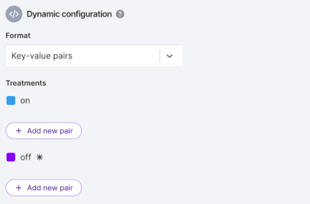
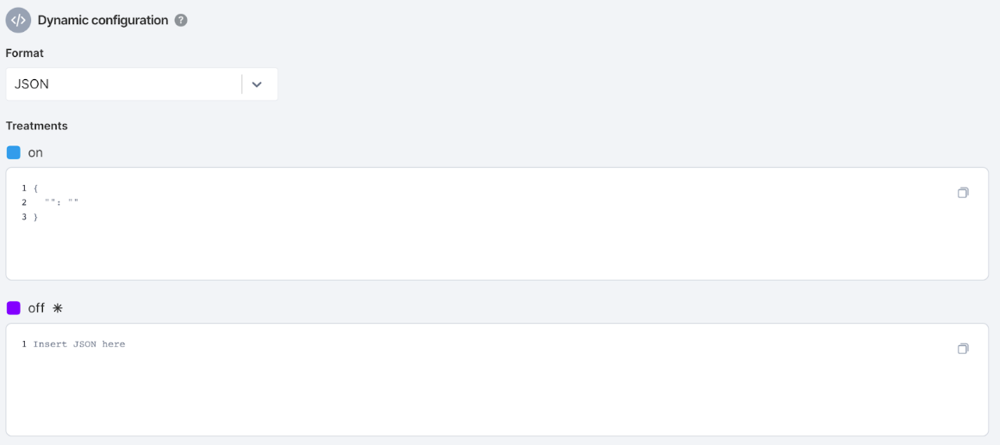
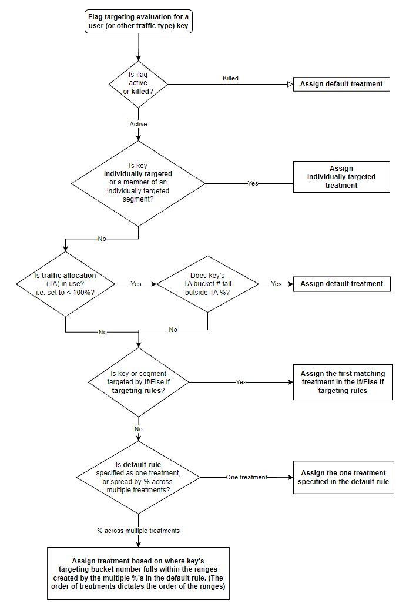

## Overview

When you create a rollout plan, you are defining an audience for the code your feature flag gates access to. Targeting rules can be simple or sophisticated. The default definition consists of on and off treatments and serves the off treatment to 100% of users; it can be created in about five seconds with three mouse clicks. 

More sophisticated rollout plans can include lists of individually targeted users, if/else-if statements that use demographic data as attributes to assign treatments to users, dependencies to other features you manage in Split, and more.

With a rollout plan, you can:

* Specify multiple treatments on and off 
* Attach dynamic configuration payloads to each treatment
* Target customers individually into certain treatments
* Create if/else targeting rules
* Assign treatments based on percentages
* Set a default treatment to be served when the feature flag is killed

## Define treatment names and descriptions

Define the [treatments](/docs/feature-management-experimentation/feature-management/edit-treatments) you want to serve your customer. ​​Every feature you release using Split has at least two treatments. By default these are **on** and **off**. You can edit the treatment's name and description as well as add additional treatments.

To define a treatment name, do the following:

1. From the left navigation, select **Feature flags** and then your desired feature flag.
1. In the **Treatment** area of the **Definition** tab, optionally rename your treatments.
1. To add additional treatments, click the **Add new treatment** button.
1. In the **Name** field, enter the desired name.

:::tip
You can create up to 20 treatments per feature flag and per environment.
:::

### About reserved words when naming a treatment

The following is a list of reserved words that you can't use when you name a treatment:

- `all`  
- `and`  
- `between`  
- `contain`  
- `contains`  
- `control`  
- `datetime`  
- `does`  
- `end`  
- `ends`  
- `false`  
- `has`  
- `have`  
- `if`  
- `in`  
- `is`  
- `match`  
- `matches`  
- `not`  
- `number`  
- `set`  
- `split`  
- `start`  
- `starts`  
- `string`  
- `then`  
- `treatment`  
- `true`  
- `with`

## Attaching dynamic configurations to treatments

In addition to giving each treatment a name, you can optionally attach configurations to your treatments to dynamically control components of your code. These configurations give you the ability to remotely change inputs or parameters in your code so you can experiment with different variations of a feature without the need for a code change and deployment. 

Examples of parameters you might want to vary through dynamic configuration include:

* Color, size and other visual components of your application
* The copy or text in different areas of your application
* Backend configurations such as weights set for search algorithms
* Number of retries and time until timeouts to handle failed connections
* Pagination limits for an API return
* Throughput and number of threads for performance thresholds

You can edit configurations for your treatments in either a form-based or code-based interface:

* Form-based. Define any number of key-value pairs. Ideal for simpler configurations and cases where dynamic configurations will be maintained by team members who don’t normally write code.
* Code-based. Write or paste valid JSON code. Use the JSON interface for more advanced use cases, such as a need for nested objects, or because you prefer to work in code rather than in a form.

### Coding for dynamic configuration

To use dynamic configuration, you need to enhance your code to expect the configuration parameters to be sent to it by Split. This includes calling the `getTreatmentWithConfig()` method instead of `getTreatment` and then parsing the configuration payload to populate local variables in your code. Refer to the Get treatments with configurations section of the SDK you use for dynamic configuration code samples for more information.

### Editing configuration as key-value pairs

To edit your configuration as key-value pairs, do the following:

1. From the left navigation, select **Feature flags** and then your desired feature flag.
1. In the **Format** field of the **Dynamic configuration** area, select **Key-value pairs** as your format. You can then attach one or more configurations to each of your treatments.
1. Click the **Add new pair** button and enter a key that you want your code to check for (e.g., color, font size, message copy, image path).
1. Enter values for each of your keys (e.g., green, size 16, Buy now!, /promo_images/svg/kermit.svg).
1. Click the **Add new pair** button to add another pair or click the **Minus** icon to remove a pair for each treatment. You can attach as many key-value pairs as necessary for each of your treatments.

   

:::tip
All keys and values are interpreted as strings when configurations are saved in this format (e.g., 5 is stringified and sent as 5) so you need to convert your code from that format at runtime.
:::

### Editing configurations with JSON

To edit your configuration using the JSON form, do the following:

1. From the left navigation, click **Feature flags** and then your desired feature flag.
1. In the **Format** field of the **Dynamic configuration** area, select **JSON** as your format. You get a JSON editor for each of your treatments.

   

1. Insert valid JSON into the editor. Basic JSON linting is done. Nested JSON objects are permitted.
1. Click **expand or collapse** if you have a large JSON object inserted as a configuration and you may need to expand or collapse it when editing.

The Split platform stringifies the JSON you enter and provides it as a string to each of our SDKs. Be sure to change data type as needed when you parse the dynamic configuration payload into local variables in your code.

### Validating data and switching formats

Split validates that the inputted configs are valid JSON and won’t let you save until you have inputted a valid JSON.

You can also switch between key-value and JSON editing when configuring your plan. However, if moving from JSON to key-value pairs, make sure all keys and values in the JSON object are strings. Nested objects, arrays, numbers, or booleans are not accepted as key-value pairs, so the user interface prevents you from switching.

### Configuration size limit

Configurations are limited to 1 KB in size per treatment. If you need a larger set of configurations, contact support@split.io.

## Targeting treatments

After you have defined your treatments, the rest of the Definition tab controls who gets which treatment (i.e. which user or other traffic key). 

### About evaluation order

Evaluation order mirrors the order that the options appear on the Definition tab. Once a user matches one of the below sections, no further evaluation is performed for that user. When a flag is killed, the default treatment is served in all cases until the flag is made active again through a restore or update.

Targeting is evaluated as follows:

* Individual target section. Users and segments you explicitly assign to a specific treatment. 
* Limit exposure. Users you want to include or exclude from your rules. If the percentage is set to 100%, then no limit is applied to the allocation. If limit exposure is under 100%, we allot the excluded percentage of your traffic to the default treatment you selected with the remaining users participating in the targeting rules you created.
* Targeting rules. Specific subsets of users targeted by attributes, dependencies, or segments. The conditions are structured as layered if/else statements and are meant to be readable in nature. They are evaluated in order and when a condition is met, then evaluation stops.
* Serve and distribute treatments. If there are no targeting rules, or the user doesn't fall into any of the conditions, then two options can be evaluated:
  
  * Serve: If there are no targeting rules set, or the user does not apply to any condition of the rules, then this treatment is served.
  * Distribute treatments: If there are no targeting rules set, or the user does not apply to any condition of the rules, the traffic will be distributed across the treatments according to the percentages chosen.

* Default treatment. Users who are excluded from rules by limiting their exposure  or all users if the feature flag is killed.

### Selecting individually targeted users

If you want to ensure that a specific user always gets a particular treatment, you can specify that selecting users. Users are specified either by their unique traffic key, or by specifying a segment that the user belongs to. You can create multiple individually targeted lists (one for each treatment), but be aware that individually targeted evaluations are done in the order of the treatments and the first match prevails. 

If you’re targeting a segment, select from those segments currently configured in the environment and for that traffic type. If you want to target using a new segment, create that segment first.

### Limiting exposure to your traffic

Use limit exposure when you are running an experiment but want to initially limit the amount of users exposed to new treatments. The benefit of using this over simply changing percentages in the default rule is that limit exposure allows you to make later increases in the percentages exposed to new variants without causing users to switch from one new variant to another.

:::tip
Experiments benefit from maximum power, which is dependent on the size of the population passing through it. For that reason, avoid limiting the exposure unless you have a good reason (like this canary test) to reduce the exposure of your treatments.
:::

Consider the situation where you want to canary test the new treatments on a small portion of your population before fully rolling out an experiment. In this example, you have a backend search engine and want to test out two new ranking algorithms and compare them to the status quo.

1. Set the initial limit exposure to 10%.
1. Set the default rule to split the traffic 34% to status_quo, 33% to `rank_by_price_with_shipping`, and 33% to `rank_by_profitability`.
1. Set the default treatment to `status_quo`.

With these settings, only 10% of the population is exposed to the targeting rules, while the rest get the default treatment. As a result, 3.3% of users are initially exposed to `rank_by_price_with_shipping`, 3.3% are exposed to `rank_by_profitability` and 90% + 3.4% are exposed to `status_quo`.

Later, after you’ve proved that the two new variants are functioning as desired in the canary test phase, you can come back and change traffic allocation to 100%. From that point onward, you have 34% / 33% / 33% and none of the initial `rank_by_price_with_shipping` or `rank_by_profitabilty` population have experienced a switch from one treatment to another.

### Setting targeting rules

The following describes the targeting rules that you can set. 

#### Setting custom attributes

Serve a treatment or percentage based on custom attributes. Custom attributes allow you to create dynamic and targeted feature rollout plans using any criteria or dimension of your customers. Attributes are recommended when you need to target customers in real time, such as:

* Temporal or fast moving data (for example, time since last login, customer creation date, browser type, or machine)
* Sensitive information (for example, customer deal size or customer status)

When deciding whether to use segments or attributes, segments are best when customers in a segment do not change often or the grouping of customers needs to be standardized across your organization (for example, key accounts, internal or outsourced QA teams, company employees).

The instructions in this section explain the proper use of attributes when you create rollout plans in the Split user interface. To understand the proper syntax for using attributes with the SDK in your code base, refer to the relevant language-specific article in our SDK documentation.

1. In the **Targeting** section, click the **attribute** field. A list of attributes displays.
1. Select or add an attribute. Split requires you to customize the attributes you use in your treatment evaluation. When you define your targeting rules, you can base your rules on any [custom attribute](/docs/feature-management-experimentation/feature-management/target-with-custom-attributes/) you provide. To do this, add an attribute in the field provided. 
1. Select the matcher. When you have input a custom attribute, you are prompted to select a matcher. For more information about matchers, refer to the Types and matchers for custom attributes section below.
1. Select the attribute values for the attribute that you want Split to match after you select a matcher. Below are some examples of usage for different types of attributes:
   
   * Show the **on** treatment for users with custom attribute plan_type equal to premium.
   * Show the **on** treatment for users with custom attribute registered_date on or after a specified date.
   * Show the **on** treatment for users with custom attribute age greater than or equal to 20.
   * Show the **on** treatment for users with custom attribute deal_size between 500,000 and 10,000,000.

#### Serving treatments using dependencies

Use Split's dependency matcher when you want one feature flag to depend on the evaluation of another feature flag.

For example, you have two feature flags with the second depending on the evaluation of the first. In this example, we would like 20% of customers who receive the **on** treatment for the `Split_API` feature flag to evaluate to **on** for the `advanced_news_feed` feature flag while the other 80% should evaluate to **off**. 

Dependencies are managed as a matcher type, which means they can be in any of the **IF** or **Else IF** blocks in targeting rules, supporting your most granular targeting needs. 

To add a dependency, do the following:

1. From the left navigation, click **Feature flag**, and select the desired flag.
1. From the Definition tab, in the Targeting area, click the **Add attribute based targeting rules** button.
1. Click the matcher type list, which is the second from the left.
1. Select **is in feature flag** as the matcher type. Select the feature flag that  appears in the next list.
1. Click the **Select feature flag** list and scroll or search to select the feature flag name.
1. Click the **Select treatments** list. A list of valid treatments appears.
1. Select the desired treatment or treatments.

As you begin to utilize the dependency matcher, you see the following:

* Environments and traffic types. The dependency matcher does not allow you to depend on another environment's condition or target across traffic types.
* Circular dependencies. Split prevents you from creating a direct circular dependency by not displaying those feature flags that create a circular dependency.
* Attributes. If feature flag B has feature flag A as a dependency then the getTreatment call for flag B must pass all the customer attributes needed to evaluate flag A. Feature flag B's syntax modal displays all the attributes needed to make the evaluation successful.
* Deleting. You cannot remove a feature flag from an environment or delete a feature flag  if additional feature flags depend on that feature flag for their evaluation.

:::info
The dependency matcher doesn’t count as 2+ evaluations. The evaluation is counted as one single evaluation for each child flag and does not fire off multiple calls or register multiple impressions.

There is a warning in the user interface when I use a dependency matcher. The warning you see is to warn you that the dependent feature flag may require some additional attributes. You need to update the `getTreatment()` call to include those attribute values. The syntax modal displays all the attributes needed to make the evaluation successful.

Parent feature flags know which child feature flags are using it in their evaluation. If a feature flag is being used as a dependent, Split's user interface informs you in the editor. You can't delete the flag, or delete or rename treatments.
:::

#### Serving treatments to a percentage using a segment

Using [segments](/docs/feature-management-experimentation/feature-management/segments) in targeting rules, rather than individually targeting, serves a treatment to a percentage of that segment. Use segments for targeting relatively fixed or specific groups of users that you can identify, like a list of accounts. For example, you can gradually roll out a treatment to a segment of your beta users. 

### Selecting treatment to serve 

You can select a treatment to serve to all the users. In the Targeting rules section, select the Serve option, and then the treatment you want to set. You can also specify a percentage of the population that gets each treatment. 

If any of the users weren't assigned a treatment, you can place them into a treatment or randomly distribute these users between your treatments and variations based on percentages you decide.

To select percentages, in the **Distribute treatment as follows** section, click the down arrow and select **percentages**. The percentage selections appear. Select the desired percentages.

### Setting the default treatment

Set the [default treatment](/docs/feature-management-experimentation/feature-management/set-the-default-treatment) if the feature flag is killed or the customer has been limited from exposure to the flag. The default treatment is always one of the treatments defined for any feature flag in the targeting rules. The default treatment is returned by the SDK in following scenarios:

* Does not meet any defined conditions. The default treatment is shown to customers who are excluded from the targeting rules via the limit exposure functionality.
* The feature flag is killed. If a particular feature flag is killed, the default treatment overrides the existing targeting rules and is returned for all customers.

Your default treatment should always be one that exposes fully tested and safe code. In an **on**/**off** feature flag, the default treatment is typically the **off** state. In a multivariate feature, the default might be **off**, or it might be defined as the treatment that is currently used by 100% of traffic.

:::tip
You can set any of the treatments in your targeting rules as a default. We recommend selecting the safest treatment for your customers as the default treatment (that is, off, old version) when beginning the rollout. However, when you complete the rollout, you may want to make the new experience the default in the case that feature is accidentally killed before being removed.
:::

## Setting the alert baseline treatment

When you use a percentage based rollout or run an experiment using percentage-based targeting, Split can automatically monitor metric thresholds and alert you if they are exceeded. The alert baseline treatment is the status-quo or safe treatment that you want to compare other treatments to when deciding whether to alert. 

For more information about selecting a valid baseline treatment, see [Select the alert baseline treatment](/docs/feature-management-experimentation/feature-management/set-the-alert-baseline-treatment).

## Saving changes to a feature flag

:::tip
If you make changes to your feature flag, it’s good practice to get them reviewed by submitting them for approval. To learn more, see [Approval flows](/docs/feature-management-experimentation/management-and-administration/fme-settings/approval-flows).
:::

To save changes you make to your feature flag, do the following:

1. After making changes in your selected feature flag, click the **Review changes** button. The Change summary page appears. This displays a diff view that indicates what changed in the feature flag. 
1. You can optionally:
   
   * In the **Title** field, add a title to your change.
   * In the **Comments** field, add a description of the changes you made.
   * In the **Approvers** field, add approvers to review your changes.
   * In the **Status** field, change the status of the feature flag.

1. Click the **Save** button to save your changes.

For any changes that you make, get them reviewed by submitting them for approval. 

## Types and matchers for custom attributes

As you design your rollout plans using custom attributes, be aware of the different types of attributes that we support and the matchers that can be used for each type.

### String literal attributes

String literal attributes capture the concept of a character string. Use this attribute to do standard string to string comparisons, but also to target your customers with any list or picklist dimension that you track. Use this matcher type to target using a regular expression. Use string attributes with the following matchers:

* `is in list`
* `is not in list`
* `starts with`
* `does not start with`
* `ends with`
* `does not end with`
* `contains`
* `does not contain`
* `matches` (regular expression)
* `does not match` (regular expression)

### Set attributes

Set attributes capture the concept of a list of strings. Use set attributes with the following matchers:

* `is equal to`
* `is not equal to`
* `has any of`
* `does not have any of`
* `has all of`
* `does not have all of`
* `is part of`
* `is not part of`

### Numeric attributes

Numeric attributes capture the concept of signed integers. Negative numbers are allowed. Floating point numbers are not supported. Use numeric attributes with the following matchers:

* `is =`
* `is >=`
* `is <=`
* `is between` (inclusive)
* `is not between` (inclusive)

### DateTime attributes

DateTime attributes capture the concept of a date, with optional time. Express the value of these attributes in milliseconds or seconds since epoch, depending on the SDK you use. Use DateTime attributes with the following matchers:

* `is on`
* `is not on`
* `is on or after`
* `is on or before`
* `is between` (inclusive)
* `is not between` (inclusive)

### Boolean attributes

Boolean attributes capture the concept of true or false. Use boolean attributes with the following matcher: `is`.