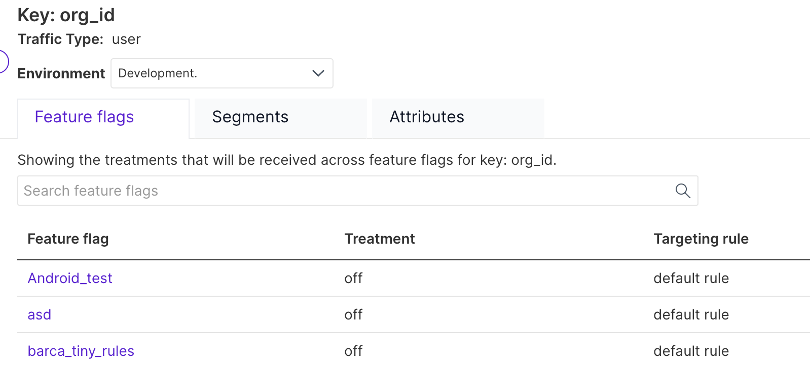

The customer dashboard provides feature flag, segment, and attribute information on a particular user key. This dashboard can be navigated to by clicking on a unique key when viewing impression data or using the search bar on the left navigation panel.

## Feature flags

The first tab shows the treatments that are served to that customer for each feature flag in your project. Note that attributes of a customer key remain private to our SDKs, feature flags which use attributes for targeting do not show an expected treatment. 

## Segments 

The second tab shows the segments that a particular user belongs to or if that user is not part of any segments. Learn more about [creating segments](/docs/feature-management-experimentation/feature-management/segments). 

## Attributes

The third tab shows the users's attribute data which is populated from the attribute data you send using Split API. Learn more about [identifying customers](https://help.split.io/hc/en-us/articles/360020529772-Identifying-customers). 
