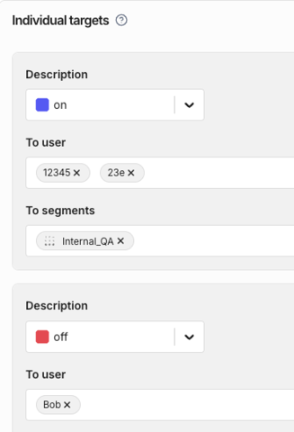

  <button hidden style={{borderRadius:'8px', border:'1px', fontFamily:'Courier New', fontWeight:'800', textAlign:'left'}}> help.split.io link: https://help.split.io/hc/en-us/articles/360020791591-Define-feature-flag-treatments-and-targeting#rules-evaluation-order </button>

Feature flag rules are evaluated in the following order:

* The first evaluation is against the **individual targets** section. User IDs and segments listed in this section receive the specified treatment. The individual targets are evaluated in order and when a condition is met, the evaluation stops (see example below).
* The second evaluation is against the **traffic allocation**. If the limit exposure is set to 100%, we continue to the targeting rules section. If the limit exposure less than 100%, we allocate a percentage of your traffic to the default treatment selected in the user interface or into the targeting rules and default rule.
* The third evaluation is against the **targeting rules**. The conditions are structured as layered if/else statements and are meant to be human readable. They are evaluated in order and when a condition is met, the evaluation stops.
* The fourth evaluation is against the **default rule**. The remaining traffic is allocated based on the distribution set in the default rule.

### Individual targets evaluation order

Individual targets are evaluated in order. For example, if **Bob** is a user ID in the **Internal_QA** [segment](/docs/feature-management-experimentation/10-getting-started/docs/key-concepts/segments.md), then **Bob** will get **on** even though you’ve specifically assigned that key **off**.

