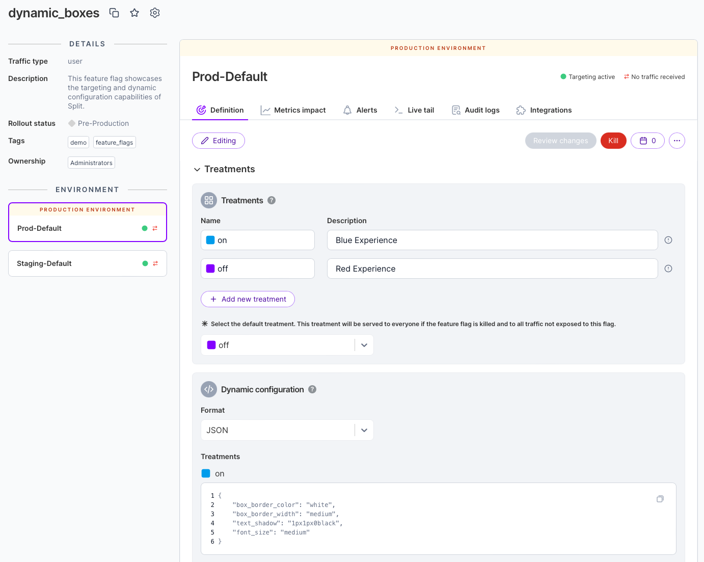

  <button style={{borderRadius:'8px', border:'1px', fontFamily:'Courier New', fontWeight:'800', textAlign:'left'}}> help.split.io link: https://help.split.io/hc/en-us/articles/360058278392-Dynamic-configuration-section-does-not-show-up   ✘ images still hosted on help.split.io </button>

### Issue:

When clicking on any feature flag, the Dynamic configuration section does not show up, even though other users see the section from their browser.

### Answer:
This issue is typically caused by the Split user interface using an old page content when Split did not have the dynamic configuration feature, clearing the cache usually fix the issue. 

To confirm the root cause, open an Incognito browser window and access app.split.io. If the dynamic config section show up, then make sure to clear the browser cache. for example in Chrome, goto Chrome Settings->Clear Browsing Data, then check **Cookies and other site data** box, then click clear.

