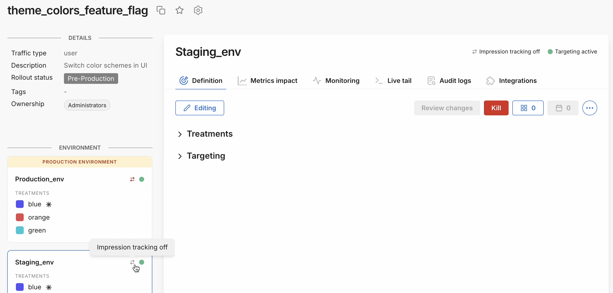

  <button style={{borderRadius:'8px', border:'1px', fontFamily:'Courier New', fontWeight:'800', textAlign:'left'}}> help.split.io link: https://help.split.io/hc/en-us/articles/35323687042573-Is-the-feature-flag-impression-toggle-supported-by-my-SDK-version   ✘ images still hosted on help.split.io </button>

### Question

The feature flag [**Impression tracking** toggle](/docs/feature-management-experimentation/feature-management/impressions#toggle-impression-tracking-on-or-off) allows me to control my generated impressions (feature flag evaluation data) for a given feature flag definition. The toggle setting is detected by new Harness FME SDK versions, but older SDK versions will not detect the setting (impressions will be sent to Harness servers).

How can I confirm that the FME SDK version that I am using in my codebase will not send impressions for a feature flag definition that has impression tracking turned off (as shown below)?

###  Answer

Please refer to the following table to check that your Harness FME SDK version or optional infrastructure version supports the **Impression tracking** toggle.

| **SDK or Infra** | **Version that supports SemVer** |
| --- | --- |
| **Client-side SDKs** | |
| Android SDK | 5.1.0 and later |
| Browser SDK | 1.1.0 and later |
| iOS SDK | 3.1.0 and later |
| JavaScript SDK | 11.1.0 and later |
| React Native SDK | 1.1.0 and later |
| **Server-side SDKs** | |
| Elixir Thin Client SDK | See SplitD version |
| Go SDK | 6.7.0 and later |
| Java SDK | 4.12.0 and later |
| Node.js SDK | 11.1.0 and later |
| PHP Thin Client SDK | See SplitD version |
| Python SDK | 10.2.0 and later |
| Ruby SDK | 8.5.0 and later |
| **Optional infrastructure** | |
| Split Daemon | 1.5.0 and later |
| Split Synchronizer | 5.10.0 and later |