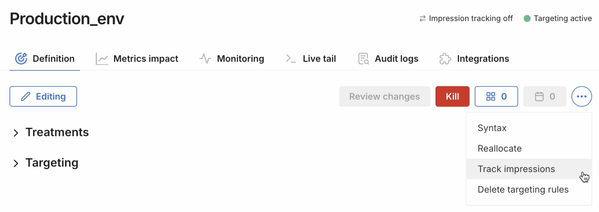
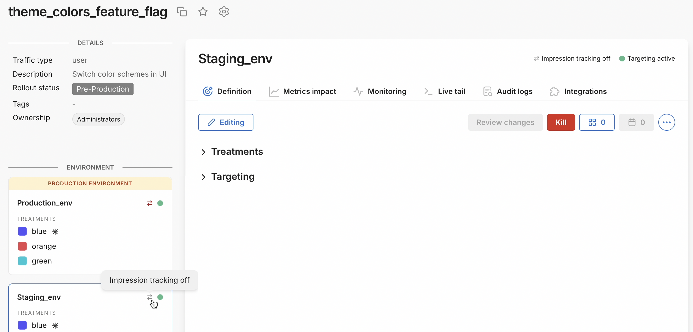

<p>
  <button style={{borderRadius:'8px', border:'1px', fontFamily:'Courier New', fontWeight:'800', textAlign:'left'}}> help.split.io link: https://help.split.io/hc/en-us/articles/360020585192-Impressions </button>
</p>

## Overview

Impressions occur whenever a visitor is assigned a feature flag treatment (i.e., variation). Impressions are valuable for debugging the FME SDK and for feature monitoring and experimentation. Impressions are generated by SDKs each time `getTreatment` is called. They are periodically sent back to Harness servers where they are stored and can be accessed for later use.

## Impression fields
Each impression contains these fields.

| Field | Description |
| --- | --- |
| Environment ID and name | Environment where the feature flag was evaluated. |
| Key | Key which was evaluated. |
| Label | Targeting rule in the definition that matched resulting in the treatment being returned. |
| Machine IP and name <br /> (only for Server-side SDKs) | Machine making the feature flag evaluation. |
| Reception timestamp | Time the impression was received by Harness FME. |
| SDK and version | Language and version of the SDK that was used in the evaluation. |
| Split name | Feature flag which was evaluated. |
| Split version number | Date and time of the last change to the targeting rule that the SDK used when it served the treatment. Valuable in understanding when a change made to a feature flag got picked up by the SDKs and whether one of the SDK instances is not picking up changes. |
| Timestamp | Time the customer was served the treatment. |
| Traffic type ID and name | Traffic type associated to the feature flag evaluated. |
| Treatment | Treatment that was returned. |

# Tracking impressions

Impressions are tracked by each Harnes FME SDK and periodically sent to Harness backend servers.

## Toggle impression tracking on or off

Impression tracking is on by default, but can be turned off for a feature flag definition. By selectively toggling off impression tracking, you can control the volume of impressions sent to [third-party integrations](#integrations-for-impression-data).

:::info[The Track impressions toggle is environment-specific]
Feature flag definitions (including the **Track impressions** on/off setting) are environment-specific. This means you can turn impressions off for a flag in one environment, but continue tracking impressions for the flag in another environment.
:::

When impression tracking is toggled off, feature flag evaluations return treatments normally; however, metrics impact calculations and traffic per treatment is no longer shown in Harness FME. Specifically, toggling impression tracking off affects the following features:

* **Monitoring** for the feature flag definition does not populate the Traffic over time chart. The unique keys evaluated per treatment are not shown.

* **Metric impact** does not show metric results, because events are not attributed to treatments and metrics are not calculated.

* **Alerting** is disabled because metrics are not calculated.

* **Live tail** for the feature flag definition does not show incoming impressions.

* **Data export** does not include feature flag evaluation data for flag definitions when impression tracking was toggled off. Only impressions created while impression tracking was toggled on are retrieved and exported.

Toggling impressions on or off does not impact your [MTKs](https://help.split.io/hc/en-us/articles/26978089134349-MTK-Usage-and-Comparing-Counts#what-is-an-mtk) (the number of unique keys for which you evaluate feature flags in a month) or [Account usage data](https://help.split.io/hc/en-us/articles/360034159232-Account-usage-data#usage-data).

To turn impression tracking on or off:

1. Click the ellipses menu on a feature flag Definition tab, and select the **Track impressions** menu item.

   

2. Click the **Impression tracking** toggle and click **Save**.

   

3. On the feature flag Definition tab, click **Review changes** and click **Save**.

When impression tracking is off, you will see "Impression tracking off" at the top right of the feature flag definition page. The arrows will also be grayed out (shown with tooltip) on the the feature flag definition card.



:::info[Impression tracking toggle and SDK compatibility]
See [this page](/docs/feature-management-experimentation/feature-management/faqs/is-the-feature-flag-impression-toggle-supported) to verify compatibility of FME SDK or optional infrastructure. Older SDK versions that do not support the **Impression tracking** toggle will not detect the toggle on/off setting and will send impressions to Harness servers.
:::

## Viewing impressions in Harness

You can view incoming impressions in [Live tail](/docs/feature-management-experimentation/feature-management/live-tail) within a feature flag's page or the Data hub, and export them based on query criteria in the Data hub's [Data export tab](/docs/feature-management-experimentation/feature-management/export-data). If you do not see impressions arriving in Harness, ensure that your SDK is installed and functioning as expected. Tips for this are included in the [Live tail](/docs/feature-management-experimentation/feature-management/live-tail) article. Contact us at [support@split.io](mailto:support@split.io) if you have any issues. 

:::important
Harness retains impression data for 90 days. Contact the [team at Harness FME](mailto:support@split.io) to learn more.
:::

## Targeting rule label
 
Targeting rules can be robust within Harness FME. For example, the following is a feature flag with two rules:

```
if user is in segment employees then split 100%:on,0%:off else
if user.location is in list ["california"] then split 100%:on,0%:off else
```

If a user is served the **on** treatment for this feature flag, the targeting rule label explains which of these rules the user matched. The targeting rule label is the summary of the rule that provides that explanation. The label is auto-generated and is valuable in understanding if your feature flag is working as expected. Here are the targeting rule labels for the feature flag shown above.

| **Rule** | **Targeting rule label** | 
| --- | --- | 
| `if user is in segment employees then split 100%:on, 0%:off` | `in segment employees` |
| `if user.location is in list ["california"] then split 100%:on,0%:off else` | `user.location in list ["california"]` |
 
Usually, a treatment is served because the customer matched a particular rule. In this case, the targeting rule label simply indicates the rule that matched. However, in other cases, the SDK serves a treatment even though no rule was matched. This table shows the *tarlabel* generated in those cases.
 
| **Special case** | **Treatment served** | **Targeting rule label** |
| --- | --- | --- |
| Feature flag was killed | [Default](/docs/feature-management-experimentation/feature-management/default-treatment) | `killed` |
| No rule matched | [Default](/docs/feature-management-experimentation/feature-management/default-treatment) | `no rule matched` |
| Feature flag was not found, for example, it may not have been downloaded by the SDK yet | [Control](/docs/feature-management-experimentation/feature-management/control-treatment) | `definition not found` |
| There was an exception while evaluating treatment | [Control](/docs/feature-management-experimentation/feature-management/control-treatment) | `exception`  |

If your impression tables are showing *not available*, consider upgrading your SDK and ensure that labels are enabled in the SDK configurations.

## Data security
 
*Labels* do not capture identifiable information about your customers. However, if you do not want the FME SDK to capture or send the label back to Harness servers, set `labelsEnabled` to `false` in the SDK advanced configuration.

Additionally, if you don’t want to send a customer UUID to Harness as the key, you can hash that ID prior to calling getTreatment. If you decide to hash the ID, be sure to use a deterministic algorithm that results in the same hash value each time. In addition, if it’s important to identify the treatment received by specific users, you must have your own method to be able to associate the hashed value with the actual user ID.

## Integrations for impression data

Use our integrations to push FME feature flag impression data to your existing platforms or your data warehouse for a comprehensive view of user engagement and other key use metrics. Integration documentation is available for the following:
- [Amazon S3](/docs/feature-management-experimentation/integrations/amazon-s3)
- [Amplitude](/docs/feature-management-experimentation/integrations/amplitude)
- [Full Story](/docs/feature-management-experimentation/integrations/fullstory)
- [Google Analytics](/docs/feature-management-experimentation/integrations/google-analytics)
- [Heap](/docs/feature-management-experimentation/integrations/heap)
- [NewRelic](/docs/feature-management-experimentation/integrations/new-relic)
- [Mixpanel](/docs/feature-management-experimentation/integrations/mixpanel)
- [mParticle](/docs/feature-management-experimentation/integrations/mparticle)
- [Quantum-Metric](/docs/feature-management-experimentation/integrations/quantummetric)
- [SmartBear Bugsnag](/docs/feature-management-experimentation/integrations/bugsnag)
- [Segment](/docs/feature-management-experimentation/integrations/segment)
- [Webhook (outgoing)](https://help.split.io/hc/en-us/articles/360020700232)