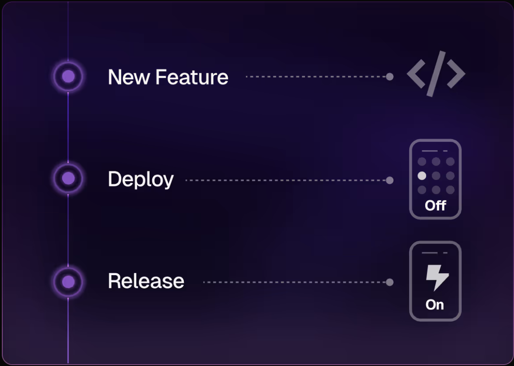
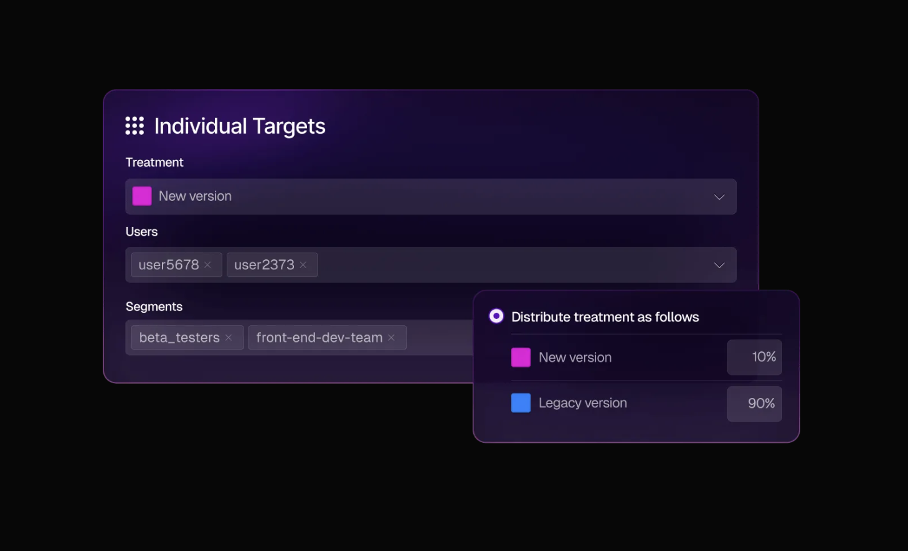

[Define feature flags](docs/feature-management-experimentation/40-feature-management/docs/quickstart-create-a-feature-flag.md) in Harness, then evaluate feature flags in real time from your codebase.

Feature flags speed up software delivery by deploying code in production without releasing it to customers. Then safely test, target, and turn on your features from Harness.

Flexible targeting rules allow you to roll out beta features to a defined segment of users, canary-release to a sample percentage, or make adjustments to live code in the wild using [dynamic configurations](docs/feature-management-experimentation/40-feature-management/docs/feature-flags/treatments/dynamic-configurations.md).

