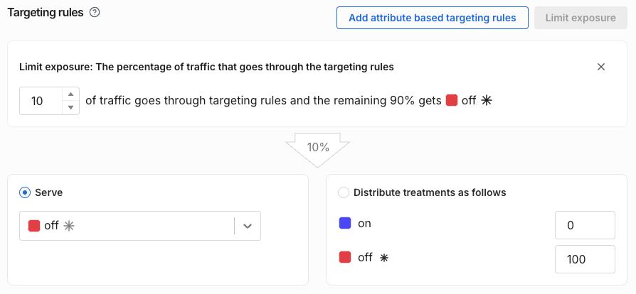

  <button hidden style={{borderRadius:'8px', border:'1px', fontFamily:'Courier New', fontWeight:'800', textAlign:'left'}}> help.split.io link: https://help.split.io/hc/en-us/articles/360020525572-Limiting-exposure </button>

When you [create a feature flag](/docs/feature-management-experimentation/feature-management/create-a-feature-flag), you can limit the feature flag's exposure. Limiting exposure means limiting the percentage of traffic that is channeled through a feature flag, allowing the rest of the traffic _to be unaffected by_, or _to remain outside of_, the targeting rules. The users outside of the flag's targeting rules will be given the default treatment.

To use this feature, do the following:

1. In your selected feature flag, go to the Targeting rules area.
2. Click the **Limit exposure** button.

    

3. In the Limit exposure field, enter the percentage of traffic that you want to go through the targeting rules. 

By gradually increasing the percentage in the Limit exposure box, you increase the percentage of users that are channeled through the feature flag, moving the "outside" users into an assigned treatment (according to the flag's rules). Decreasing the precentage in the Limit exposure box similarly removes users from the flag's targeting rules.

The Limit exposure feature is particularly useful for experimentation, where you can allocate a limited percentage of your traffic to be in an experiment.

Note that the treatment assigned a user ID according to the feature flag's targeting rules will be "sticky", meaning that increasing the Limit exposure percentage will not reallocate an already assigned user to a different treatment.

A user that is outside the exposed traffic is assigned the default treatment and the feature flag's [impression](/docs/feature-management-experimentation/feature-management/impressions) for that evaluation will include the _**targeting label**_ `not in split`.