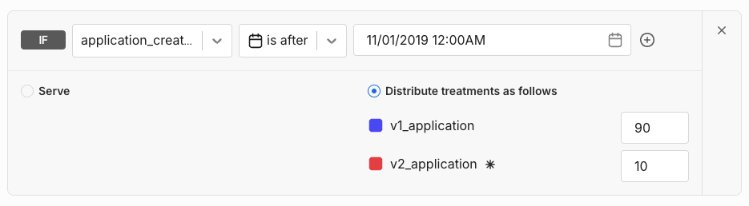
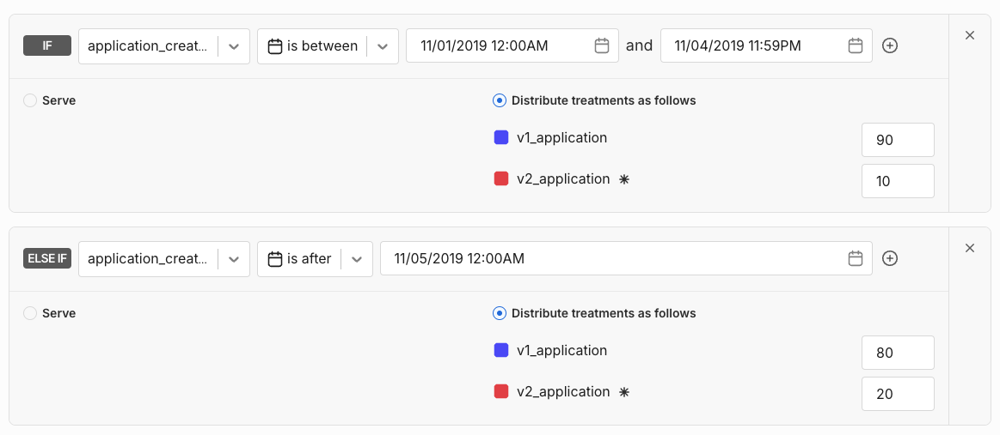
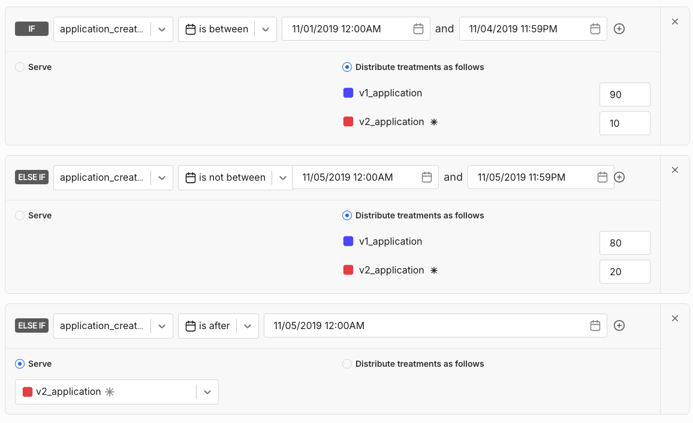
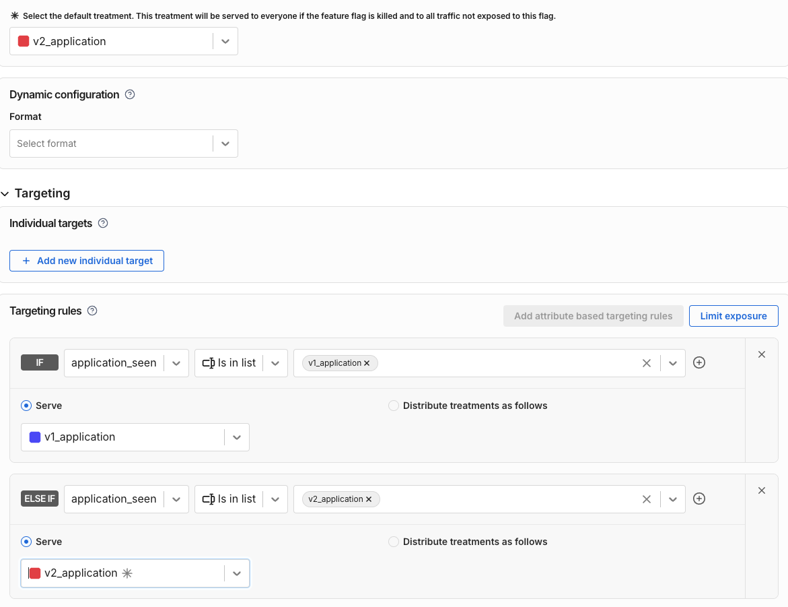
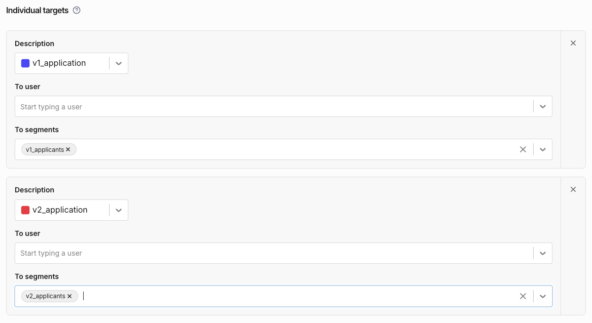

## Overview

How do I ensure that once a user (or any traffic key) is given a treatment, they always receive the same treatment, irrespective of any changes to the rollout plan?

The goal is to maintain state so that a user is always exposed to the same treatment they saw the first time, even if the rollout plan changes. This is important for use cases like loan applications or promotional discounts that need to remain consistent.


## Split's Targeting Engine

Split is designed for imperceptibly fast treatment computation. For example, in Java, treatments are computed in just a few hundred microseconds. To achieve this speed, Split does **not** retain state. After serving a treatment, it does not “remember” what was served.

Instead, Split uses a deterministic hashing algorithm to assign treatments. This ensures a [“sticky” experience](/docs/feature-management-experimentation/feature-management/faqs/ensure-a-consistent-user-experience/) where, as long as the feature flag targeting definition remains unchanged, users receive the **same** treatment every time.

However, if the targeting rules or percentages change, some users may receive different treatments. This behavior is intentional and appropriate for most use cases, but not all.

## The Solution

There are two primary ways to maintain treatment state, both leveraging attributes:

- **Solution 1:** Use a creation date attribute — no need to store state externally.
- **Solution 2:** Store the assigned treatment externally and pass it as an attribute.

> **Note:** Using the “kill” switch will void both of these options.

For the sake of examples, we use a loan application scenario.

### Solution 1: Use the Creation Date

Create targeting rules that use a date attribute representing when the application was first rendered. Pass this date at runtime to Split to segment your traffic.

- When updating rollout plans, use date matchers to ensure only new applications (after a certain date) receive the new treatment.
- This avoids storing treatment state and relies only on storing the application’s origin date.

Example workflow:

- **Day 1 (Nov 1):**  
  90% get `v1_application`, 10% get `v2_application`.  
  *(Targeting rule with date matcher for Nov 1)*  
  

- **Day 5:**  
  Traffic split adjusted to 80% `v1_application` and 20% `v2_application`.  
  

- **Day 14:**  
  `v1_application` set to 0%, `v2_application` set to 100%.  
  

Existing applications continue to match their original date-based rule and maintain treatment. New applications fall into updated rules.

**Limitations:**  
This method works well if targeting changes are infrequent. Manual updates to date matchers can be tedious and error-prone.

### Solution 2: Store Assigned Treatment Externally

Developers maintain treatment state externally — e.g., in a cookie or database — storing the application ID, flag, and treatment.

You then pass this stored treatment as an attribute when calling `getTreatment`.

```java
Map<String, Object> attributes = new HashMap<String, Object>();
attributes.put("application_seen", "v1_application"); // fetched from DB
String treatment = client.getTreatment("USER_ID", "SPLIT_NAME", attributes);
```

This approach ensures users retain the same treatment despite changes to rollout plans or default rules.

If you have fewer than ~10k users, you can also:

- Create a Split segment per flag/treatment combination (using Admin API).
- Assign user IDs to the appropriate segment based on stored treatment.
- Use individual targeting rules with these segments.



Or use segments as part of targeting rules for more flexibility:



This method requires additional management and is less integrated with Split’s experimentation features. It’s better suited for simple rollouts rather than experiments.

## Summary

* Solution 1 (creation date): Lightweight, no external storage, works well if targeting changes are infrequent. Supports experimentation insights.
* Solution 2 (external state storage): Requires manual state management, suited for simple rollouts, less suitable for experiments.

Both methods help maintain a consistent user experience by keeping users “sticky” to their original treatment.