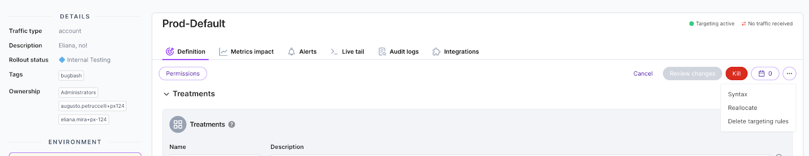

When targeting rules are defined for a feature flag, the rules are used to assign every customer to a treatment. This assignment is permanent until the targeting rules change. This permanence is useful because a customer should not see a different treatment in two back to back calls. 

In some circumstances, it is useful to reassign customers to treatments without changing the targeting rules. This process is called *reallocate* in FME. Here is an example.

* Your team enables a particular treatment for 10% of customers.
* During the release, a critical issue is found and the feature flag is immediately [killed](/docs/feature-management-experimentation/feature-management/use-the-kill-switch), sending all customers to the default treatment. 
* Your team fixes the bug and wants to release again to 10% of customers.
* Your team does not want the same 10% to see the same treatment again, because they were exposed to the original issue. In other words, those customers were *poisoned* with regards to this treatment. 

In this scenario, by reallocating traffic, each customer is reassigned to treatments, thus spreading out the *poisoned* customers across the treatments rather than having them clustered in the **on** treatment of the feature flag.

Reallocation allows you to get an unbiased set of customers to give feedback on a feature being released, rather than relying on the feedback of those customers that were exposed to a critical bug.

To reallocate traffic, do the following:

1. Click the **...menu** icon on the selected feature flag.

   

2. Click **Reallocate**.
3. Enter 'REALLOCATE' in the warning alert.