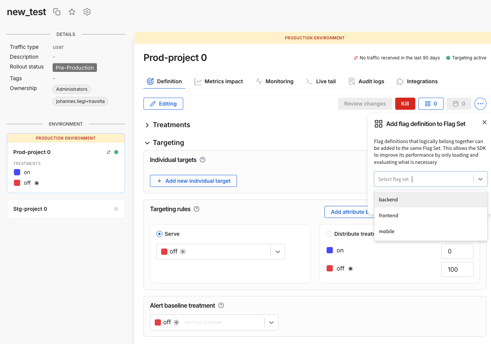

Flag sets allow you to group FME feature flag definitions that logically belong together. You can configure FME SDK to download a flag set (the subset of your feature flag definitions that you need to evaluate on your client) rather than all of your flags defined in a Harness FME Environment. Flag sets allow you to minimize bandwidth and memory usage, boost app responsiveness, and effectively reduce latency and CPU demands.

To use flag sets you need to:

1. Manage flag sets

   Before you can see flag sets in Harness FME and associate flag definitions with them, you first need to create them via [Split API](https://docs.split.io/reference/create-flag-set).

2. Associate flag definitions with flag sets in Harness

   On the Definition tab of a feature flag, you will see the **Flag Sets** button. This button will bring up the Flag Sets modal. The dropdown list shows the flag sets that can be associated with the feature flag definition. Select one or more flag sets, click **Apply** in the Flag Sets modal, and click **Review changes** to save the flag set association for the feature flag definition in the selected Environment.

   For example, given three flags named `experiment_1`, `experiment_2` and `experiment_3`, the flag definition scoped to the Production environment for `experiment_1` can be associated with the flag set `backend`, while the definitions scoped to the Production environment for `experiment_2` and `experiment_3` can be associated with the flag set `frontend`.

    

3. Configure your SDK to filter by flag set

 Minimize the size of the payload downloaded from Harness servers by configuring the FME SDK to download only feature flag definitions that belong to specific flag set(s). The SDK will only fetch the segment data needed by the list of feature flags it fetches. When flag sets reduce the number of flags fetched, the appropriate subset of segment data is automatically reduced as well.

   All SDKs and the Split Evaluator support flag sets. To find out how to use flag sets in your code, look through the documentation for the language of your project:

    * Android [docs](/docs/feature-management-experimentation/sdks-and-infrastructure/client-side-sdks/android-sdk) 
    * Go [docs](/docs/feature-management-experimentation/sdks-and-infrastructure/server-side-sdks/go-sdk) 
    * iOS [docs](/docs/feature-management-experimentation/sdks-and-infrastructure/client-side-sdks/ios-sdk)
    * Java [docs](/docs/feature-management-experimentation/sdks-and-infrastructure/server-side-sdks/java-sdk)
    * JavaScript [docs](/docs/feature-management-experimentation/sdks-and-infrastructure/client-side-sdks/javascript-sdk)
    * .NET [docs](/docs/feature-management-experimentation/sdks-and-infrastructure/server-side-sdks/net-sdk)
    * Node.js [docs](/docs/feature-management-experimentation/sdks-and-infrastructure/server-side-sdks/nodejs-sdk)
    * PHP [docs](/docs/feature-management-experimentation/sdks-and-infrastructure/server-side-sdks/php-sdk)
    * Python [docs](/docs/feature-management-experimentation/sdks-and-infrastructure/server-side-sdks/python-sdk)
    * Ruby [docs](/docs/feature-management-experimentation/sdks-and-infrastructure/server-side-sdks/ruby-sdk) 
    * Split Evaluator [docs](/docs/feature-management-experimentation/sdks-and-infrastructure/optional-infra/split-evaluator)

4. Stay within the limits of your tier

   | Max number of flag sets ... | Limit type | Developer | Team | Business | Enterprise | Trial |
   | --- | --- | --- | --- | --- | --- | --- |
   | per Account | Billing | 15 | 15 | 50 | unlimited | unlimited |
   | per Project | Service | 3 | 3 | 15 | 100 | 100 |
   | per feature flag definition * | Service | 3 | 3 | 5 | 5 | 5 |
   | filtered by a single SDK instance | Service | 10 | 10 | 10 | 10 | 10 |

* An FME feature flag can have a definition for each Environment in your Project. For more information see [Create a feature flag](/docs/feature-management-experimentation/feature-management/create-a-feature-flag).

