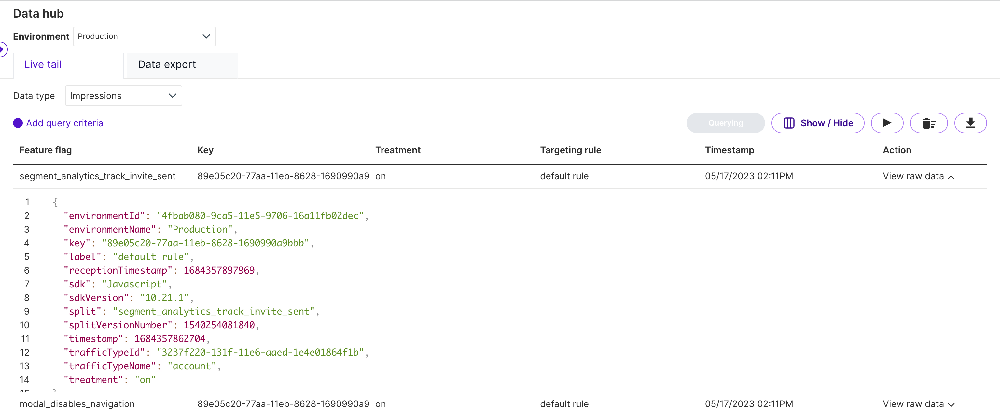

The Live tail functionality within Data hub gives development teams a single place to view and query all impression and event data. With Live tail, development teams can:

* Add query criteria to refine the stream of impressions and events
* View impressions and events in real-time
* View raw JSON payload for debugging in Harness and 3rd party integrations

This feature allows teams, for example, to check if a feature flag is being evaluated properly or events are being received from data integrations.

## Query impressions 

After installing Split’s SDKs and setting up a feature flag, impressions generate via the `getTreatment` call. To view these impressions in Live tail, do the following:

1. From the navigation bar, click **Data hub**. 
2. Select which data type to view. Impressions are selected by default.
3. Click the **Query** button. Impressions begin flowing.
4. Pause or resume paying data at any time.
5. Apply column headers as filters by clicking **Add query criteria**.
6. Once selected, click the **Query** button again.

:::warning[Important!]
- It is a live query, which means it will only show impressions/events that are hitting Split’s servers at that moment. If you leave and return to the live tail page, you will need to restart the query, so consider opening it in a separate tab if needed.
- When an impression or event is generated at the SDK level it is not posted right away. It is queued and then posted back to Harness in batches. The periodicity for this task is dictated by the value of impressionsRefreshRate in the SDK factory configuration. The default value for impressionsRefreshRate varies significantly across SDKs (i.e. 60 seconds for browser, 30 minutes for mobile, etc...), so be sure to check the documentation for the SDK you are using.
- SDKs run by default in an optimized impression mode. This means that no duplicate impressions (determined by key/feature flag/treatment/rule) are sent within a one-hour time window. If the same key is evaluated for the same feature flag over and over again using a single running SDK instance, those impressions are likely to be deduplicated and not be sent after the first one.
- For short-lived tests you’ll need to either grant the SDK time to post events/impressions according to its schedule, or properly destroy the factory (which will flush pending events and impressions) before exiting your code.
:::

Live tail can also be accessed on the feature flag page under the Live tail tab, where impressions automatically filter down to that specific feature flag.

Learn more about [impressions](/docs/feature-management-experimentation/feature-management/monitoring-analysis/impressions) in FME.

## Query events 

After installing FME SDKs and calling `track()` or configuring a data integration, events are passed to Harness. To view these events in Live tail, do the following:

1. From the navigation bar, click **Data hub**.
2. Click the data type selector and click **Events**.
3. Click the **Query** button. Events begin flowing.
4. Pause or resume paying data at any time.
5. Apply column headers as filters by clicking **Add query criteria*.
6. Once selected, click the **Query** button again.

Learn more about [events](/docs/feature-management-experimentation/release-monitoring/events/) in Harness.

## Troubleshooting

### No impressions are shown in the Live Tail tab during testing

When testing impression generation using a Split SDK, you may notice that no impressions appear on the Live Tail tab, even though treatments are being calculated successfully from the SDK side.

This behavior is expected ue to the impression de-duplication feature supported by all SDKs. To conserve the amount of impressions posted to Split cloud, the impressions that contain the same user id, feature flag name, and treatment value will not be posted if it they are generated within few minutes.

This behavior is controlled by SDK config parameter `impressionsMode`. By default, the value is set to `OPTIMIZED`, which enables the impression de-duplication described above.

To see all impressions generated, regardless of whether they are duplicates, set the `impressionsMode` parameter to `DEBUG`. This setting is useful when testing locally or validating feature flag behavior during development.