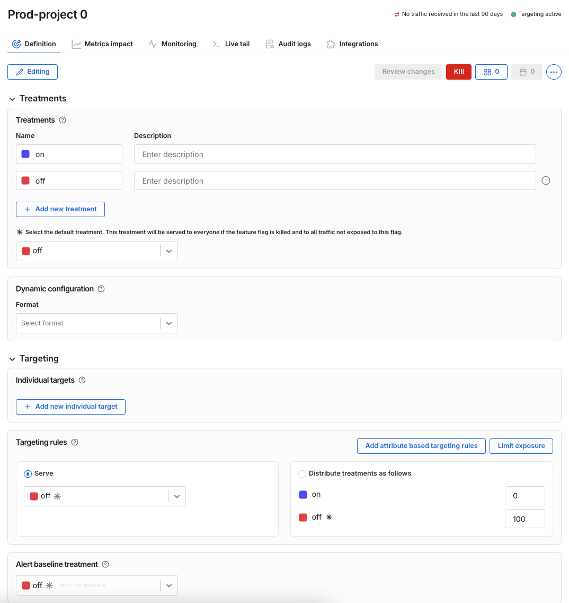
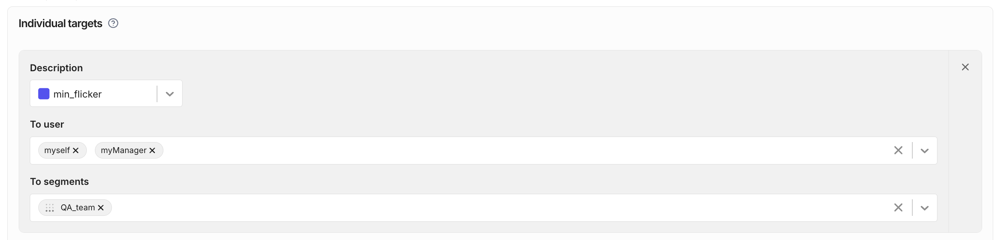
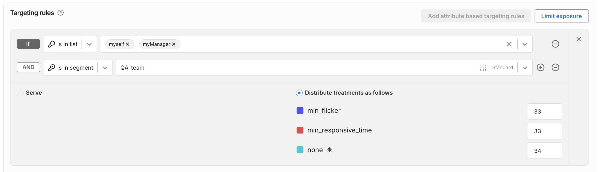
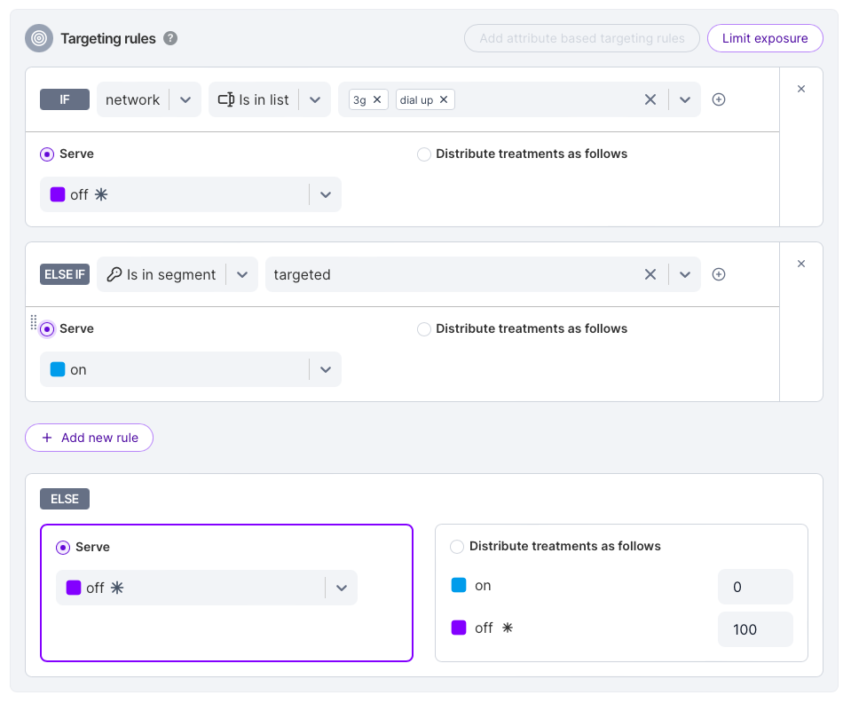
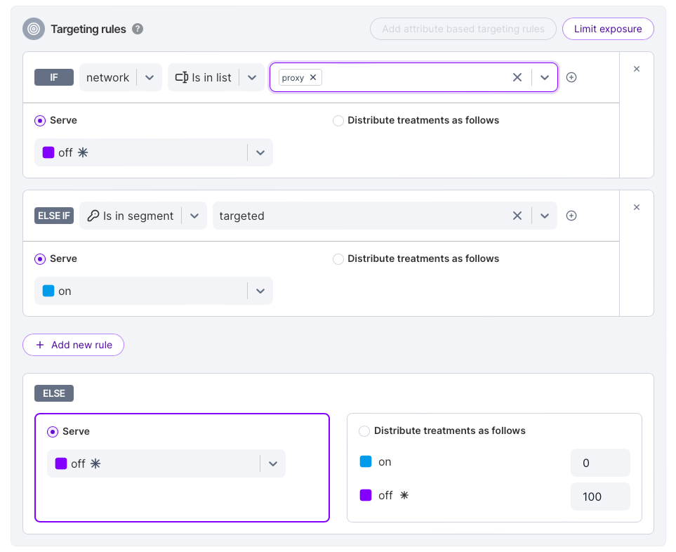
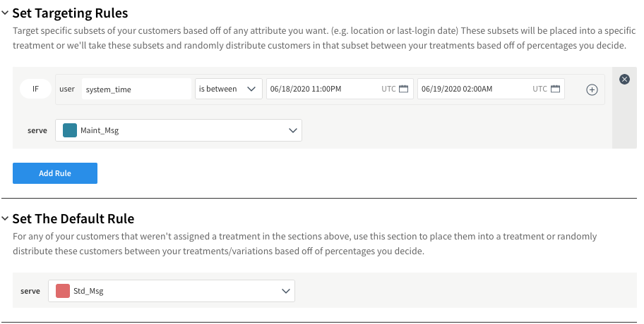
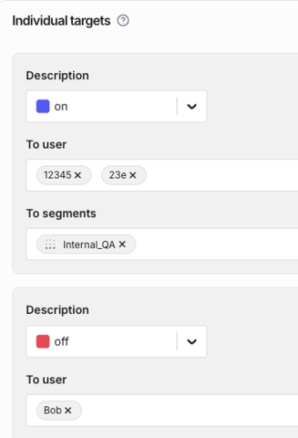

## Define feature flag treatments and targeting

After you [create a feature flag](/docs/feature-management-experimentation/feature-management/setup/create-a-feature-flag), you can define treatments, dynamic configurations, and targeting rules. 

This allows you to deploy features for internal testing and beta releases. You can also progressively roll out features to your production environment.

Feature flag ___treatments___ represent feature variations, with a given variation returned from the feature flag for a given user ID, as defined by the flag's targeting rules.

This article provides an overview of creating a feature flag definition for a given environment, and links to articles with more specific configuration details.

## Create a feature flag

On the [Create a feature flag](/docs/feature-management-experimentation/feature-management/setup/create-a-feature-flag) pane, create a feature flag by filling in metadata useful to your team.

## Initiate your feature flag definition for a given environment

Initiating your feature flag definition for a given environment will create an initial set of treatments and a targeting rule that you can modify. 

If a feature flag definition is not initiated for an environment, the following page appears:


To initiate your feature flag definition for an environment, do one of the following:

* Start defining treatments and targeting rules by clicking the **Initiate environment** button.
* Fast track by copying this flag's definitions from another environment. In the Copy from field, select the environment from which you would like to copy this flag's definitions and click the **Copy** button.

Once the feature flag definition exists for a given environment, the feature flag definition tab will show treatments and targeting rules similar to the following:



You will be able to modify the feature flag treatments, dynamic configurations, and targeting rules before saving. This allows you to configure your feature flag for a given environment.

The next sections guide you through configuring your feature flag definition.

## Setting up treatments

Treatment names are strings that are returned when you evaluate the feature flag in your code.

In the [Treatments](/docs/feature-management-experimentation/feature-management/edit-treatments) area, do the following:

1. Enter the name of each treatment and optionally enter a description.
2. Optionally, click **Add treatment** to add additional treatments.
3. Select the [default treatment](/docs/feature-management-experimentation/feature-management/default-treatment). This treatment will be served to everyone if the feature flag is [killed](/docs/feature-management-experimentation/feature-management/use-the-kill-switch). This treatment is also served to all traffic not exposed to the feature flag (if you _Limit exposure_ when [setting up targeting](#setting-up-targeting)).

## Setting up dynamic configuration

In the [Dynamic configuration](/docs/feature-management-experimentation/feature-management/setup/dynamic-configurations) area, optionally define custom JSON or Key-value pairs that you can retrieve in your code. This allows you to add dynamic configurations to your feature variations.

## Setting up targeting

Targeting defines how your feature flag will be evaluated for a given user ID (user key). You can add individual user IDs to your targeting rules.

:::important[Tip: Think outside the box for User IDs]
You can target customers or users based on their user ID (user key). When evaluating a feature flag, you can use any string as a user ID.

Here are a few examples:

* anonymous user ID
* logged in user ID
* account number

Be mindful of using random user IDs, as [overuse of random IDs](/docs/feature-management-experimentation/management-and-administration/admin-best-practices/mtk-efficiency#use-of-unstable-ids) can increase your MTK count (and [costs](/docs/feature-management-experimentation/management-and-administration/account-usage)) unnecessarily.
:::

Targeting rules have a limit of 500 user IDs, so we suggest [creating a segment](/docs/feature-management-experimentation/feature-management/targeting/segments) if you need to target a large number of user IDs.

To set up targeting, you can use the Individual targets area and/or the Targeting rules area. Both are described below.

### Individual targets

In the Individual targets area, you can:

Click the **Add new individual target** button to assign a selected treatment to individual users or segments (e.g., a QA team, internal team, or a limited beta), as shown below.



### Targeting rules

In the Targeting rules area, you can:

* Optionally click the **Limit exposure** button to limit [the traffic exposed](/docs/feature-management-experimentation/feature-management/limiting-exposure) to your attribute based targeting rules. For example, you can limit the customers exposed to your experiment to the percentage you choose. Users who are not exposed get the default treatment.

* Click **Add attribute based targeting rules** to assign individual users or segments to a selected treatment or percentage distribution.

  Within attribute based targeting rules, you can:

    * [Target with custom attributes](/docs/feature-management-experimentation/feature-management/targeting/target-with-custom-attributes) to target specific subsets of your users based on a specific attribute (e.g., location or last-login date).

    * [Target with dependencies](/docs/feature-management-experimentation/feature-management/target-with-dependencies) to target users based on the treatment they received from another flag. You can use flag dependencies to create mutually exclusive experiments. 

    * Optionally select **Distribute treatments as follows** and define a ___percentage distribution___ to [randomly distribute](/docs/feature-management-experimentation/feature-management/faqs/ensure-a-consistent-user-experience) users and segments between your feature flag treatments (variations) based on the percentages you decide. This is also called a _percentage rollout_, as shown below.

   

:::tip[Tip: Distribute treatments by percentage to enable experimentation]
If you have at least one targeting rule with ___percentage distribution___, then you can ___compare metric results between feature flag treatments___ (on the [Metrics impact tab](/docs/feature-management-experimentation/experimentation/experiment-results/viewing-experiment-results/).
:::

### Overriding individual targets with rules

Targeting rules are evaluated from top to bottom, meaning that the higher a rule appears, the higher its priority. You can override individually targeted users by placing a more specific rule above the one that includes them.



For example, if you have a rule that individually targets users by ID or segment, but you need to give certain users a different treatment based on an attribute (such as slow network speed), create a higher-priority rule for that attribute.

In the **Set targeting rules** section:

1. Add a rule that matches the overriding attribute (for example, _network speed ≤ 3G_).
1. Specify the desired treatment (e.g., _Off_).
1. In the **Else if** part of the rule, include your original segment or user IDs.



This setup ensures that the overriding condition is applied before the individual targeting rule.

## Timed releases for feature flags

You can implement a feature toggle that switches between `on` and `off` automatically at a certain time using one of the following methods:

1. Using the Admin REST API to [change feature flag definitions and rules](https://docs.split.io/reference#partial-update-split-definition-in-environment):

   * For example, you can create the banner feature flag, set the default rule to on, then use the Admin API to change the default to off.
   * You can run the Admin API using cURL and schedule the command with any host OS scheduler to run at a specific date-time.

      ```bash
      curl -v -X PATCH  \
      -d '[{"op": "replace", "path": "/defaultRule", "value":[ { "treatment": "on", "size": 100 } ]}]' \
      -H 'Content-Type:application/json'  \
      -H 'Authorization: Bearer [ADMIN API KEY]'  \
      https://api.split.io/internal/api/v2/splits/ws/[WORKSPACE ID]/[SPLIT NAME]/environments/Production
      ```

1. Using a targeting rule and passing the system time:

   * You can turn the flag `on` or `off` at a specific time, for a subset of users or for all users.
   * You can also configure it for a time window. For example, if you want to turn a message on alerting users during a maintenance window, you can set up the rule as shown in the following screenshot:

   


## Setting the alert baseline treatment

In the [Set alert baseline treatment](http://localhost:3000/docs/feature-management-experimentation/feature-management/set-the-alert-baseline-treatment) area, select a baseline treatment that will be used for your alert policies.

:::tip[Tip: Set the alert baseline treatment to enable alerting]
If you set the ___alert baseline treatment___ AND you have at least one targeting rule with ___percentage distribution___, then you can receive ___[feature flag alerts](/docs/feature-management-experimentation/release-monitoring/alerts/automated-alerts-and-notifications/#setting-up-feature-flag-alerting)___ and ___[metric alerts](/docs/feature-management-experimentation/experimentation/metrics/alert-policies/#create-a-metric-alert-policy)___.
:::

## Rules evaluation order

Feature flag rules are evaluated in the following order:

* The first evaluation is against the **individual targets** section. User IDs and segments listed in this section receive the specified treatment. The individual targets are evaluated in order and when a condition is met, the evaluation stops (see example below).
* The second evaluation is against the **traffic allocation**. If the limit exposure is set to 100%, we continue to the targeting rules section. If the limit exposure less than 100%, we allocate a percentage of your traffic to the default treatment selected in the user interface or into the targeting rules and default rule.
* The third evaluation is against the **targeting rules**. The conditions are structured as layered if/else statements and are meant to be human readable. They are evaluated in order and when a condition is met, the evaluation stops.
* The fourth evaluation is against the **default rule**. The remaining traffic is allocated based on the distribution set in the default rule.

### Individual targets evaluation order

Individual targets are evaluated in order. For example, if **Bob** is a user ID in the **Internal_QA** segment, then **Bob** will get **on** even though you’ve specifically assigned that key **off**.



### Treatment ordering and traffic distribution

With Split, the order of treatments within the rules matters.

Rules are evaluated top-down as described above, but within each rule, treatment order determines how traffic is distributed among treatments. For example, if you have three treatments — `status_quo`, `treatment1`, and `treatment2` — evenly split at roughly 33% each, and you want to move everyone out of `status_quo` and assign 67% to `treatment2`, the order of treatments affects user experience.

If the order is `status_quo`, `treatment1`, `treatment2`, setting `status_quo` to 0% and `treatment2` to 67% will cause users to shift from `status_quo` to `treatment1`, and from `treatment1` to `treatment2`. This may not be the intended experience.

If the order is `treatment1`, `status_quo`, `treatment2`, then adjusting percentages will move users from `status_quo` to `treatment2` only, keeping `treatment1` users unaffected.

This is especially important when you have more than three treatments. For instance, if `status_quo` is your safe fallback and you want to move users from a problematic `treatment2` to `status_quo`, simply changing percentages can cause users in treatment1 to unexpectedly shift to `status_quo`.

| Even Distribution | Buckets | After Moving T2 to status\_quo |
| ----------------- | ------- | ------------------------------ |
| status\_quo       | 0-19    | status\_quo                    |
| treatment1        | 20-39   | status\_quo                    |
| treatment2        | 40-59   | treatment1                     |
| treatment3        | 60-79   | treatment3                     |
| treatment4        | 80-99   | treatment4                     |

One way to avoid bucket shifts while moving users between treatments is to use [Dynamic Configuration](/docs/feature-management-experimentation/feature-management/setup/dynamic-configurations/). You keep bucket assignments the same, but change the configuration values of treatments.

| Even Distribution | Buckets | Dynamic Configuration |
| ----------------- | ------- | --------------------- |
| status\_quo       | 0-19    | status\_quo           |
| treatment1        | 20-39   | treatment1            |
| treatment2        | 40-59   | status\_quo           |
| treatment3        | 60-79   | treatment3            |
| treatment4        | 80-99   | treatment4            |

### Limiting traffic exposure

Limit exposure allows you to exclude a percentage of users from your targeting rules. For example, setting exposure to 20% and distributing treatments as 0/50/50 for `status_quo`, `treatment1`, and `treatment2` means each treatment gets 10% of total traffic. Increasing exposure moves new users from the default `status_quo` to treatments without reshuffling users between treatments.

This helps when you want to ramp participation across multiple complex rules simultaneously.

### Including excluded traffic for experimentation

If you want to see all impressions in the Metrics impact tab, including those from users in the excluded default (`status_quo`) treatment, order treatments so excluded users fall between treatments. This way, adding traffic won’t cause users to switch treatments unexpectedly.

### Individual targets override all

Individually targeted users always receive their assigned treatment first. For example, if user `12345` is individually targeted for `status_quo`, they will get that treatment even if they belong to a segment targeted for `treatment1`.