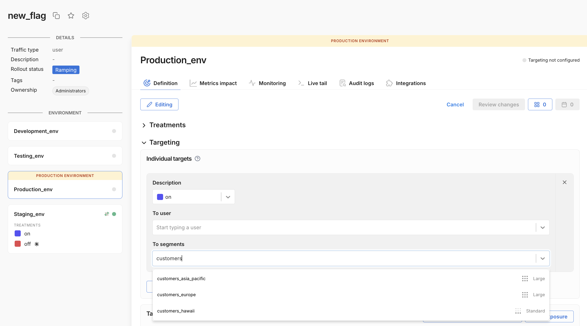
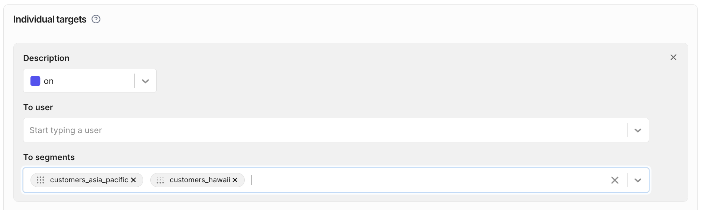
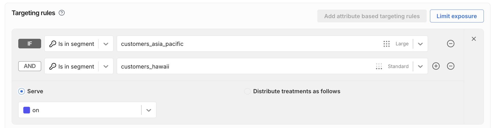
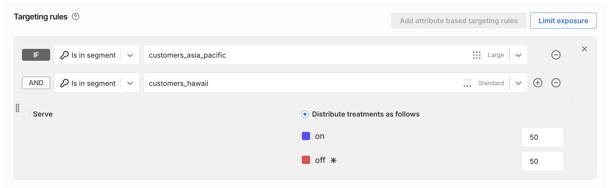

  <button hidden style={{borderRadius:'8px', border:'1px', fontFamily:'Courier New', fontWeight:'800', textAlign:'left'}}> help.split.io link: https://help.split.io/hc/en-us/articles/360020525252-Target-customers-and-segments </button>

Once you create a feature flag, you can [create feature flag targeting rules](/docs/feature-management-experimentation/40-feature-management/define-feature-flag-treatments-and-targeting.md#setting-up-targeting) that target individual user IDs (user keys), but you can also use segments.

[Segments](/docs/feature-management-experimentation/feature-management/segments) are lists of user IDs. On your feature flag Definition tab, you can create targeting rules that assign treatments to segments.

This article shows how to target Standard, Large, and Rule-based segments in your individual targeting rules and in attribute based targeting rules.

___Tip:___ If you don't see a segment appear when you type its name in the segment input field, it may be that the segment is not [defined](/docs/feature-management-experimentation/feature-management/segments#adding-user-ids-to-a-segment) for the given FME environment.

:::warning[Server-side SDK support for Large segments]
Server-side SDKs do not yet support Large segments, but soon will. Until they are supported, evaluations of feature flags that target Large segments will return `control` on server-side SDKs. 
:::

## Individual targeting rules

You can target segments in individual targeting rules. These rules assign a treatment to the segment. In the following example, the feature flag will serve **on** to all user IDs in the given segments.

After you select a segment, you can see the segment type indicated by the input pill icon in the To segments field.

## Attribute based targeting rules

You can also target Standard, Large, and Rule-based segments in attribute based targeting rules. The following example is equivalent to the individual targeting rule shown above.

You can also use ___percentage distribution___ to randomly distribute treatments among the user IDs in a segment, as shown below.

See [Targeting rules](/docs/feature-management-experimentation/feature-management/define-feature-flag-treatments-and-targeting#targeting-rules) for more information on feature flag targeting, percentage distribution, and rules' evaluation order.