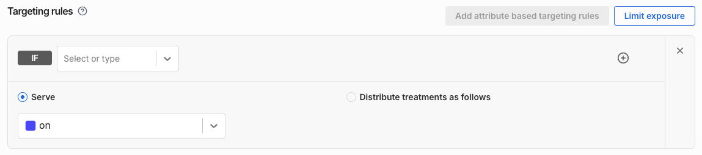

import Tabs from '@theme/Tabs';
import TabItem from '@theme/TabItem';

With custom attributes, you can create dynamic targeted feature rollout plans using any end-user criteria or dimension that is known at runtime. Custom attributes can be used to represent:

* Temporal or fast moving data (e.g., time since last login, customer creation date, browser type, or machine)
* Sensitive information (e.g., customer purchase size or customer status)

:::tip
Consider using [segments](/docs/feature-management-experimentation/feature-management/segments) (instead of attributes) if the users in a segment would not change multiple times in a day or the grouping of users needs to be standardized across your Harness account (e.g., key accounts, internal or outsourced QA teams, or company employees).
:::

## Creating custom attributes

This section explains how to create attributes and how to use them to define feature flag targeting rules in Harness FME. You can choose to define custom attributes [within feature flag targeting rules](#creating-custom-attributes-within-feature-flag-targeting-rules), [in Admin Settings](#creating-custom-attributes-in-admin-settings), or [using the Split API](#creating-custom-attributes-or-writing-custom-attribute-values-using-api-endpoints).

:::tip
 _The attributes you create [in Admin Settings](#creating-custom-attributes-in-admin-settings) or [using the Split API](#creating-custom-attributes-or-writing-custom-attribute-values-using-api-endpoints)_ will be shown in Harness FME as **User Attributes** in your attribute-based targeting rules (on a feature flag's Definition tab, in the **IF** dropdown menu). This _standardization_ of attributes can help reduce the number of mismatches between attribute keys in code and attribute keys in targeting rules. _Attributes created [within attribute-based feature flag targeting rules](#creating-custom-attributes-within-feature-flag-targeting-rules)_ will not be shown as User Attributes in Harness.
:::

:::note
This article refers to the **IF** dropdown menu in a feature flag’s attribute based targeting rules as having the labels **User** and **User Attributes**, but these labels vary based on the traffic type chosen for the feature flag. For example, if a traffic type is exists in your project named ‘account’ and you select this traffic type when creating a new feature flag, then the **IF** dropdown menu in Harness would show **Account** and **Account Attributes** section labels.
:::

:::tip[Tip for developers]
 No matter how attributes are created ([within attribute-based feature flag targeting rules](#creating-custom-attributes-within-feature-flag-targeting-rules), [in Admin Settings](#creating-custom-attributes-in-admin-settings), or [using the Split API](#creating-custom-attributes-or-writing-custom-attribute-values-using-api-endpoints)), for feature flags with targeting rules that use custom attributes, _the way attribute values are populated in your code and passed to the ‘getTreatment’ function call (to evaluate a feature flag) is the same_.
:::

To see how to pass attributes with feature flag evaluation requests in your code, refer to the relevant language-specific article in our [SDK Documentation](/docs/feature-management-experimentation/sdks-and-infrastructure/sdk-overview/).

### Creating custom attributes within feature flag targeting rules

You can freely create attributes within attribute-based targeting rules on the feature flag’s Definition tab. (The attributes that you define in directly within a feature flag’s targeting rules become part of the feature flag definition, but are _not associated with a project and traffic type_.)

The steps to create a custom attribute in Harness FME within a feature flag attribute-based targeting rule, are described in the [Using custom attributes in feature flag targeting](#using-custom-attributes-in-feature-flag-targeting) section below.

:::info[SemVer attributes]
To work with SemVer attributes, first create a new custom attribute within a feature flag's attribute-based targeting rule, and select a SemVer matcher. See the _[Using custom attributes in feature flag targeting](#using-custom-attributes-in-feature-flag-targeting)_ section, step 2.
:::

### Creating custom attributes in Admin settings

You can create a standard set of attributes for use in your feature flag definitions. The attributes that you define in Admin settings will be _associated with a project and traffic type_.

You can create attributes individually or create multiple attributes using a CSV file.

#### Creating individual custom attributes in Admin settings

To create a custom attribute that will appear as a User Attribute in your feature flag targeting rules:

1. In Harness FME, click the **profile button** at the bottom of the left navigation panel and click **Admin settings**. The Projects page appears.
2. Click to **View** the desired project and click the Traffic types tab.
3. Click to **View/Edit attributes** for a traffic type. (Your feature flags defined with this same traffic type will show the custom attributes in their attribute-based targeting rules in Harness FME.) The Attributes page appears.
4. Click the **Actions** button and select **Create an attribute**. The Create Attribute panel appears.
5. In the ID field, enter a key identifier for the attribute (e.g., purchase_amt). This will be used in your feature flag targeting rules and in your source code as the attribute key.

   :::important[Notes]
   (1) An attribute’s ID cannot be changed later. <br />
   (2) If you use an already existing attribute ID, the existing attribute will be overwritten.
   :::

   :::important[Syntax]
   The attribute ID must start with a letter followed by a combination of dashes(-), underscores(_), letters(a-z A-Z), or numbers(0-9).
   :::
6. In the Name field, enter a descriptive name (e.g., Amount in customer’s cart at checkout).
7. In the Description field, optionally enter a description of the attribute.
8. In the Type dropdown, select an attribute value type (e.g., String to represent text values, Boolean to represent true or false values, etc.).

   

   :::tip
   When you select the Semver or String attribute type, you can create a list of suggested values to match against. These suggested values will appear in Split UI when you are creating your feature flag attribute based targeting rules.
   :::

   

9. Click the **Create** button. A new custom attribute is created and displayed on the Attributes page.

#### Creating multiple custom attributes in Admin Settings

You can create multiple custom attributes by performing a bulk upload of custom attributes from a CSV file (a text file having the ".csv" file extension).

:::warning
 If you have any existing custom attributes (already associated with the given project and traffic type) with the same IDs that you have in your CSV file, then the existing attributes will be overwritten.
:::

To create multiple custom attributes that will appear as User Attributes in your feature flag targeting rules:

1. In Harness FME, click the **profile button** at the bottom of the left navigation panel and click **Admin settings**. The Projects page appears.
2. Click to **View** the desired project and click the Traffic types tab.
3. Click to **View/Edit attributes** for a traffic type. (Your feature flags defined with this same traffic type will show the custom attributes in their attribute-based targeting rules in Harness FME.) The Attributes page appears.
4. Click the **Actions** button and select **Create multiple attributes**. The Create multiple attributes page appears.
5. Import your CSV file by dragging and dropping into the Import CSV drop target field or by clicking the file upload link. The CSV file must consist of lines of comma-separated values. The first line should be the heading values `ID, Name, Description, Type, SuggestedValues`. Each following line provides values for a custom attribute, as follows:
   * ID - A unique identifier for the attribute that will be displayed in targeting rules and used in code. The attribute ID cannot be changed after an attribute is created.
   * Attribute name - A descriptive name for the attribute.
   * Description - A description for the attribute.
   * Type - Possible types are `String`, `Number`, `Boolean`, `DateTime`, or `Set`. SemVer is not currently supported.
   * SuggestedValues (only used with String attributes) - Suggested values must be a double-quoted value or list of values. You can define up to 100 suggested values, each up to 50 characters long. (In Harness FME, attribute suggested values will appear in feature flag attribute-based targeting rules in the attribute value field.)

   For example, a file named "attributes sample.csv" with the following content could be used for creating multiple custom attributes:
   ```
   ID, Name, Description, Type, SuggestedValues
   plan_id,Plan type,"The subscription, plan the user is on",String,"enterprise,midmarket,smb"
   zipcode_us,US zipcode,The zipcode (US format) to use for targeting,Number,
   homeowner,Homeowner,Does the targeted user own a home?,String,"hello"
   office_locations,Office locations,list of cities user has an office to go to,Set,
   contract_date,Date contract was signed,This is the date the user signed the contract,DateTime,
   attribute_without_optional_values,,,String,
   ```
6. When the file upload is complete, click **Save**. The new attributes are created and displayed on the Attributes page.

### Difference Between Admin API Attributes and Targeting Rule Custom Attributes

When using the [Admin API](https://docs.split.io/reference#identities-overview) to create attributes that assign values (identities) to client IDs, is this the same attribute used in the feature flag targeting rules from the user interface?
  
No, these are two distinct concepts:

- **Admin API Attributes:** These attributes are used to assign identities or additional information to user IDs in the Split Admin API. They appear in the Split UI (e.g., when hovering over a user ID in the Results tab) but do **not** influence feature flag targeting or treatment assignment.

- **Targeting Rule Custom Attributes:** These are attributes defined and used specifically within feature flag targeting rules to determine treatment assignment. When the SDK calls `getTreatment`, you must pass the relevant custom attributes with their corresponding values for proper evaluation against the targeting rules.

Understanding this distinction is important to avoid confusion when managing user data versus defining targeting logic.

### Creating custom attributes or writing custom attribute values using API endpoints

You can create custom attributes for use in feature flag targeting rules by using the following Split API endpoints:

* __[Save attribute](https://docs.split.io/reference/save-attribute):__ Create or overwrite a custom attribute associated with a project and traffic type.
* __[Save identity](https://docs.split.io/reference/save-identity):__ Create or overwrite a single user ID object (and its custom attribute values).

As with attributes [created in Admin settings](#creating-custom-attributes-in-admin-settings), the attributes created using the Split API will will be associated with a project and traffic type and will appear as **User Attributes** in Harness FME.

## Using custom attributes in feature flag targeting

After you [create a feature flag](/docs/feature-management-experimentation/feature-management/create-a-feature-flag) you can **use** (and also **create**) custom attributes in your [targeting rules](/docs/feature-management-experimentation/feature-management/define-feature-flag-treatments-and-targeting). To add an attribute-based targeting rule to a feature flag:

1. In Harness FME, on the Definition tab of a feature flag, in the Targeting rules area, click the **Add attribute based targeting rules** button. The **IF** field/dropdown menu appears.

   

2. Choose a **User Attribute** (custom attribute):
  Choose a custom attribute from the **IF** dropdown menu’s **User Attributes** section.

   
    
    Or **create a new custom attribute**:
  You can also directly click within the **IF** field, type a new custom attribute ID, and click **New attribute “your new ID”** to create a new custom attribute.

   

3. Select a matcher to evaluate the attribute values passed in from your source code. For more information about matchers and how they evaluate values, see the [Custom attribute types and matchers](#custom-attribute-types-and-matchers) section below.

   

You can also directly click within the IF field, type a new custom attribute ID, and click New attribute “your new ID” to create a new custom attribute.

4. Complete the targeting rule by filling in the values to match against and choosing the treatment(s) to serve.

    

   Additional examples:

    Serve the `on` treatment for users with custom attribute `app_version` greater than or equal to 16.0.0:

    

    Serve the `on` treatment for users with custom attribute `age` greater than or equal to 20:

    
 
    Serve the `on` treatment for users with custom attribute `deal_size` between 500,000 and 10,000,000:

    
  
    Serve the `on` treatment for users with custom attribute `registered_date` on or after a specified date:

    

## Using regex with custom attributes

Split targeting rules support matching values using regular expressions (regex), which provides a powerful way to filter a wide range of users with a single targeting rule.

:::tip
We recommend testing your regex patterns on external tools like [regex101.com](https://regex101.com/) to ensure they work as expected before applying them in Split.
:::

Below are some useful regex examples for targeting specific user attributes:

### Target specific app major version

To target users with app version greater than or equal to 4.5 to get the on treatment, this regex could be used for matching the `appVersion` attribute:

```
(\[5-9\]\\.\[0-9\]|\[4\]\\.\[5-9\]).*
```


You can use the `matches` operator in the targeting rule editor within the Split user interface to match the value of a passed attribute (such as an app version) to a regular expression and specify treatment assignments for any versions that match the expression.

This approach also works when versions are formatted in `Major.Minor` and you want a specific treatment for versions below a certain threshold (for example, versions below `2.1.0`).

Example of passing the `appVersion` attribute for the JavaScript SDK:

```javascript
var attributes = {appVersion: "4.567.33"};
```

### Target all population of specific domain of user emails

For this example, to serve the `on` treatment for all employees of split.io, we can use the Regex below for `email` attribute:

```
@split.io$
```


Example of passing the email attribute for the JavaScript SDK:

```
var attributes = {email: "bilal@split.io"};
```

### Target users on Chrome version 20 and later

This example we are serving the on treatment to Chrome users only. However, we want to only use Chrome versions 20 and later for compatibility reasons. The attribute passed is userAgent:

```
Chrome\/[2-9][0-9]\.
```


Example for the JavaScript SDK:

```
var attributes = {userAgent: "Mozilla/5.0 (Windows NT 6.2; WOW64) AppleWebKit/537.36 (KHTML, like Gecko) Chrome/27.0.1453.93 Safari/537.36"};
```

### Target English speaking users world wide

An experiment is designed for English speaking users in any country by detecting the default language setting in the browser, the attribute passed is `navigatorLanguage en-`.


Example for the JavaScript SDK:

```javascript
var attributes = {navigatorLanguage: navigator.language};
```

### Target specific URL

To target an experiment that applies only to users that land on a specific URL, the extracted URL can be passed as an attribute to the targeting rule:

```
http:\/\/mysite\.com\/my_url
```


Example for the JavaScript SDK:

```javascript
var attributes = {url: window.location.href};
```

## How feature flag targeting rules with custom attributes are evaluated

This section explains how a feature flag targeting rule with a custom attribute is evaluated in your source code, in the following cases:

### The custom attribute value is not provided

The feature flag targeting rule containing the custom attribute does not result in a match.

For example, given the feature flag targeting rule:

```
if age <= 20 then 100% : on
else 100% : off
```

If the value for the age attribute is not provided in code in the attributes map passed to the getTreatment call, the matcher in the first condition `age <= 20` evaluates to **false**. The `else` condition then evaluates to **true**, resulting in the `off` treatment.

### The custom attribute value is not the correct type

The feature flag targeting rule containing the custom attribute does not result in a match.

For example, given the feature flag targeting rule:

```
if user.plan_type is "basic" then 100% : on
else 100% : off
```

If the value provided for plan_type is an int instead of a string, then the matcher in the first condition `user.plan_type is "basic"` evaluates to **false**. The `else` condition then evaluates to **true**, resulting in the `off` treatment.

## Custom attribute types and matchers

This section describes attribute matchers (comparison operators) that are available in Harness FME when you are creating attribute-based feature flag targeting rules. You can use this information to help you plan your dynamic targeted feature rollout plans using custom attributes.

:::tip
 In Harness FME, on a feature flag's Definition tab, the **IF** dropdown menu is also an input field. In the **IF** dropdown field you can:
* ___Enter a new attribute ID.___ When you enter a new custom attribute ID, the **Select matcher** dropdown menu will show **_all of the attribute matchers_**. 

* ___Select a User Attribute.___ When you select an existing User Attribute, the **Select matcher** dropdown menu will show **_a subset of matchers based on the selected attribute type_**. _Note that the '**User Attributes**' label contains the traffic type name (selected when the feature flag was created), so another traffic type name may be shown instead of '**User**'._
:::

### String literal attributes

**String** literal attributes store text. These attributes are used with the **String matchers** to set feature flag targeting rules based on standard string comparisons, regular expression matching, or comparisons against a list of strings.

The following matchers can be used with String attributes:

* is in list
* is not in list
* starts with
* does not start with
* ends with
* does not end with
* contains
* does not contain
* matches (regular expression)
* does not match (regular expression)

For example, use an attribute 'subscription_plan' of type String to show accounts that are on the 'Business' or 'Enterprise' plan a given feature.

:::tip
 You can target your customers with any list or pick list dimension that you track.
:::

### SemVer attributes

SemVer attributes store version strings that follow the [Semantic Version](https://semver.org/) specification. These attributes are used with the **SemVer matchers** to set feature flag targeting rules based on version numbers.

You can use the following comparisons:

* is =
* is not =
* is >=
* is &lt;=
* is in list
* is between (inclusive)
* is not between (inclusive)

For example, use an attribute 'os_version' of type SemVer to give users that have a compatible OS version, e.g. `>= 2.2.0`, access to a new feature, while keeping the feature off for earlier OS versions.

:::note
 The version numbers you provide must include the patch number (e.g. `2.2` is invalid, but `2.2.0` is valid) and can include pre-release identifiers and build metadata, as defined in the [Semantic Version](https://semver.org) specification. Comparisons also follow the Semantic Version specification.
:::

#### Supported SDKs and customer-deployed components for SemVer matcher

The Semantic Version (SemVer) matcher is only supported in specific FME SDK and customer-deployed componenet versions. If you are using an older SDK version that does not support the SemVer matcher, feature flag evaluations will return the `control` treatment and a special impression will be created.

:::info
If you are using an older SDK or customer-deployed component version that does not support the SemVer matcher, Harness recommends upgrading to a supported version to ensure your target rules function as expected.
:::

Use the following tables to verify that your SDK or customer-deployed component version supports the SemVer matcher.

<Tabs queryString="semver-support">
  <TabItem value="sdk-suites" label="Client-side SDK Suites">
  
  | **Client-side SDK Suite** | **Version that supports SemVer** |
  |-----------------------|----------------------------------|
  | Android SDK Suite     | 1.2.0 and later                  |
  | Browser SDK Suite     | 1.4.0 and later                  |
  | iOS SDK Suite         | 1.2.0 and later                  |
  
  </TabItem>

  <TabItem value="client-sdks" label="Client-side SDKs">
  
  | **Client-side SDK**   | **Version that supports SemVer** |
  |-----------------------|----------------------------------|
  | Android SDK           | 4.1.0 and later                  |
  | Angular utilities     | 3.0.0 and later                  |
  | Browser SDK           | 0.14.0 and later                 |
  | Flutter plugin        | 0.1.9 and later                  |
  | iOS SDK               | 2.25.0 and later                 |
  | JavaScript SDK        | 10.26.0 and later                |
  | React SDK             | 1.12.0 and later                 |
  | React Native SDK      | 0.9.0 and later                  |
  | Redux SDK             | 1.12.0 and later                 |
  
  </TabItem>

  <TabItem value="server-sdks" label="Server-side SDKs">
  
  | **Server-side SDK**   | **Version that supports SemVer** |
  |-----------------------|----------------------------------|
  | Go SDK                | 6.6.0 and later                  |
  | Java SDK              | 4.12.0 and later                 |
  | .NET SDK              | 7.9.0 and later                  |
  | Node.js SDK           | 10.26.0 and later                |
  | PHP SDK               | 7.3.0 and later                  |
  | PHP Thin Client SDK   | See SplitD version               |
  | Python SDK            | 9.7.0 and later                  |
  | Ruby SDK              | 8.4.0 and later                  |
  
  </TabItem>

  <TabItem value="infra" label="Customer-deployed Components">
  
  | **Component**                 | **Version that supports SemVer** |
  |------------------------------|----------------------------------|
  | Split Daemon                 | 1.4.0 and later                  |
  | Split Evaluator              | 2.6.0 and later                  |
  | Split Synchronizer           | 5.8.0 and later                  |
  | Split Proxy                  | 5.8.0 and later                  |
  | JavaScript synchronizer tools| 0.6.0 and later                  |
  
  </TabItem>
</Tabs>

### Set attributes

Set attributes store lists of strings. The following **Set matchers** can be used with Set attributes:

* is equal to
* is not equal to
* has any of
* does not have any of
* has all of
* does not have all of
* is part of
* is not part of

For example, use an attribute 'us_states_visited' of type Set to show a survey to users who have visited at least one state of the US West Coast. 

### Numeric attributes

Numeric attributes store positive or negative whole numbers. (Decimal values are not supported.) The following **Numeric matchers** can be used with Numeric attributes:

* is =
* is >=
* is &lt;=
* is between (inclusive)
* is not between (inclusive)

For example, use an attribute 'orders_last_quarter' of type Number to provide a new premium shopping feature to customers who had at least 20 orders in the last quarter.

### DateTime attributes

DateTime attributes store a date and optional time. In your source code, set the values of DateTime attributes in **_milliseconds since epoch_** or **_seconds since epoch_**, depending on the FME SDK you are using.

The following comparisons can be used with DateTime attributes:

* is on
* is not on
* is after
* is before
* is between (inclusive)
* is not between (inclusive)

For example, use an attribute 'contract_signed' of type DateTime to keep a legacy feature available for customers who signed up before 1/1/2015.

### Boolean attributes

Boolean attributes store a value of `true` or `false`. Boolean attributes are used with the **Boolean matcher**:

* is

For example, use an attribute 'homeowner' of type Boolean to test the demand of a potential new feature among customers that don't own a home.
