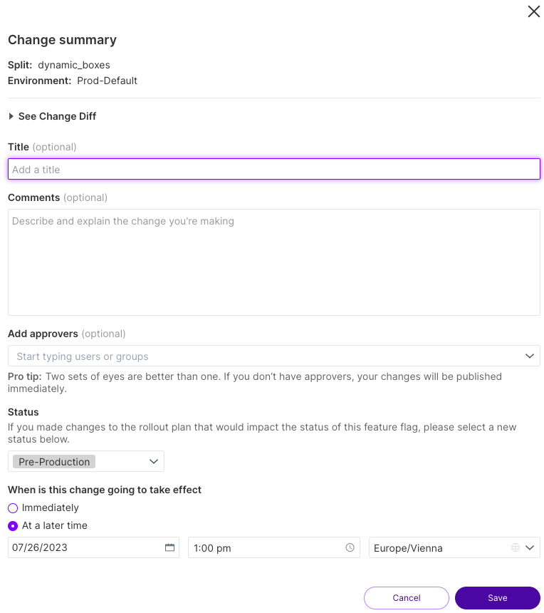

Scheduling provides the capability to launch a feature on a certain date and time. This allows you to make changes to a feature flag and get approvals ahead of the release date which makes release planning and collaboration easier and more flexible while also increasing the likelihood to release on a target date.

:::info[Note]
The total number of scheduled changes per month depends if you are in a certain pricing tier. Contact [support@split.io](emailto:support@split.io) for more information.
:::

To use feature flag scheduling, do the following:

1. After you make changes to a feature flag, the **When is this change going into effect** option in the Change summary page appears:

    

2. Select when changes made to the feature flag go into effect as follows:
  * **Immediately.** The feature flag goes into effect immediately. Note: This depends on the environment. If the environment doesn’t require approvals, the change goes live immediately. If approvals are required, the change goes live immediately after it’s approved.
   * **At a later time.** The feature flag goes into effect at a scheduled date, time, and timezone. 
3. If you select At a later time, fill out the following:
  * In the Select date field, select the desired date you want the feature flag to deploy.
  * In the Select time field, select the desired time you want the feature flag to deploy.
  * In the Timezone field, select the desired timezone.

    :::info[Notes]
    * The date must not be more than 90 days in the future.
    * You can schedule changes for up to 10 flags in the same minute (e.g., from 1:00 to 1:01 pm, on a particular date and timezone, you can only schedule up to 10 changes).
    :::

4. After the feature flag is saved and approved, the feature flag displays in a read-only mode until it’s published at the scheduled time or the scheduling is discarded. Be aware that if a scheduled change request is pending approval and so much time has passed that the scheduled date is now in the past, the change request immediately gets published once it is approved. For example, if you schedule a change request to go out on February 1st  and the approval occurs on February 3rd, the change is immediately published on February 3rd.

## Discarding a scheduled change

To discard a scheduled change, click the scheduling counter and click the **Discard changes** button.
