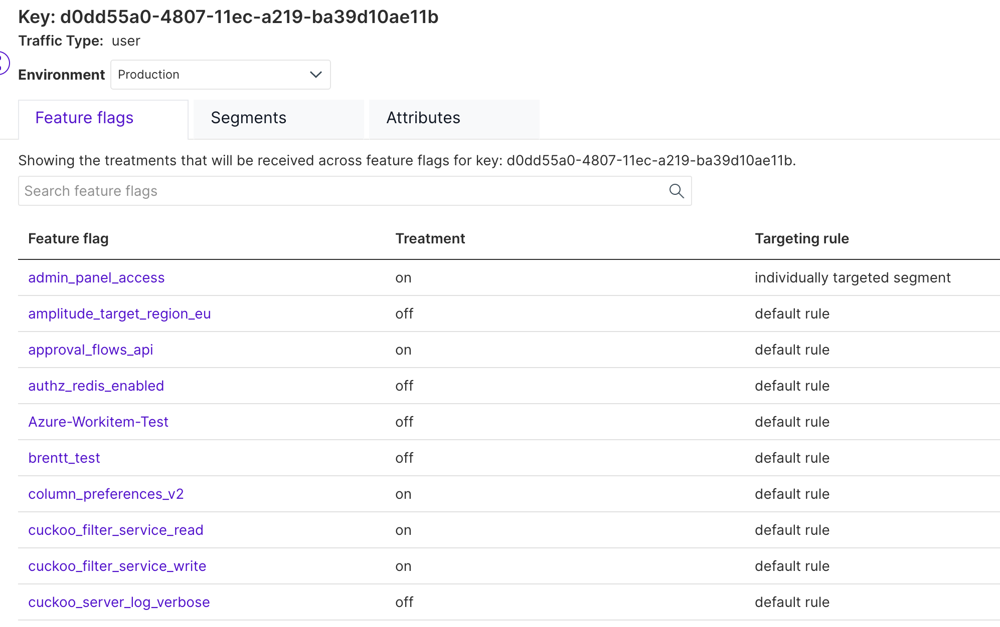
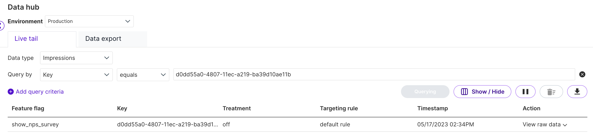

## Overview

There are three primary use cases for determining which treatment a user sees:

## Use Case 1 – What a user sees whenever they log back in

This question is often asked to validate the rollout plan when a feature flag is changed. You can answer this by going to the **Key page**. Here's an example:

In this image, you can see that the user will see the **'on'** treatment for the `admin_panel_access` flag every time they log in, based on the current rollout plan.

### Caveats

- This view only shows treatments for feature flags **not using [attributes](/docs/feature-management-experimentation/feature-management/target-with-custom-attributes/)** for targeting.  
- For data privacy reasons, Split does **not copy attribute values** to the cloud, so it cannot know attribute values for a given user key (user ID).  
- The key shown is typically a database ID or a cookie ID.

To navigate to the Key page:

1. Search for the user key in the search box near the top left corner of the app (above **My work**).  
1. Or click on the key ID in **Live Tail** (when paused), or in the **Data hub** to navigate to the Key page.

## Use Case 2 – What treatments is a user seeing right now for one or more feature flags?

This question is common when debugging live customer experiences or when making changes to a feature flag.

You can answer this by going to **Data hub**. Example:

Here, you search for a specific key (e.g., user ID). Split fetches the live treatments currently assigned.

### Caveats

- This live tail shows only results starting from when you issued the query; it does **not** include past events.  
- For historical data, use the **Data export** tab in Data Hub.  
- There is typically an initial lag of about 10 seconds in query response.

To navigate to the Data Hub:

1. Click on **Data hub** in the navigation.  
1. From a feature flag page, you can also click the **Live tail** tab for a filtered view of impressions for that flag.  
1. From Data Hub or Live Tail, you can get to the Key page by pausing the query and clicking on the key.

### Why might the same user ID get different treatments right now?

Sometimes, impressions for the same user ID show different treatments even within the same version of an experiment. This usually happens because the feature flag's targeting rules consider attributes passed at evaluation time.

For example, if a targeting rule assigns the `off` treatment when the `state` attribute equals `CO`, but assigns `on` otherwise, then depending on the attribute value passed to `getTreatment`, the user may receive different treatments.

To confirm this, use the **Live tail** tab and enable the **Targeting rule** field in impressions. This will help clarify which rule assigned the treatment.

Additionally, if the attribute values vary between calls or the flag definition version changes, users might see different treatments.

## Use Case 3 – What treatments was a user shown in the past?

This is a common support question. You can answer this by going to the **Data export** tab of Data Hub.

