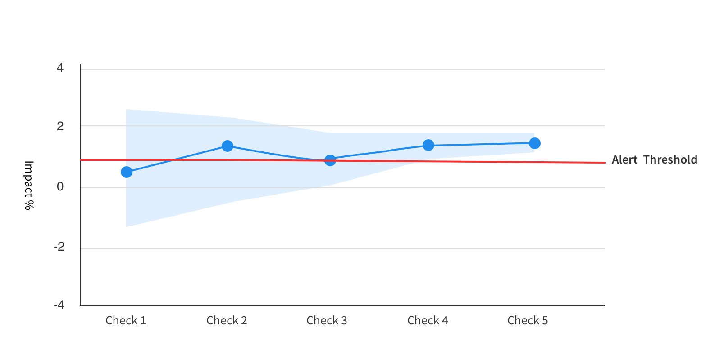
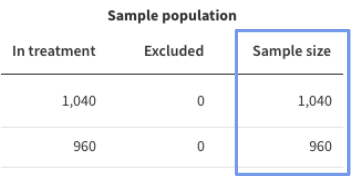
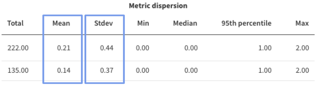

## Overview

Harness FME allows you to configure how long you want your metrics to be monitored for and alert you if a severe degradation occurs. By default, the monitoring window is set to 24 hours and the degradation threshold is set at 0 from a feature flag version change. You can select from a range of different monitoring windows, from 30 minutes to 28 days.

With these monitoring windows, you can customize your alerting period based on your team's release strategy. Adjust your monitoring window to 24 hours if you are turning on a feature at night with low traffic volumes and you want to monitor through the morning when traffic begins to increase, or to 30 minutes if you are expecting high traffic volumes within the first 30 minutes of a new feature flag version. 

## How monitoring windows work

The monitoring window determines how long alert policies evaluate metric performance after a version change. Once the window ends (for example, after 24 hours), Harness FME no longer checks for new degradations under that alert policy, even if more data flows in afterward.

:::info
The monitoring window only applies to alert policies. It defines the evaluation period for automatically triggered alerts.
:::

Although alert policies stop checking for new degradations after the monitoring window ends, significance-based alerts can still occur later if a user triggers a manual recalculation of metrics or Harness FME performs a scheduled or delayed automated recalculation (for example, due to data that arrived late). 

In cases like these, if the recalculation shows statistically significant degradation, even outside the monitoring window, Harness FME may still issue an alert. For example, if your monitoring window is 24 hours but a user recalculates results on Day 12, a new alert may trigger based on the updated analysis.

## Choosing the monitoring window

The monitoring window is the period of time during which we monitor your feature flag for any severe degradations. A longer window means your flag will have more time to accrue data, giving you additional power to detect degradations that might have been missed with a smaller sample. 

However, a longer window also means that we will use stricter significance criteria for alerts due to the increased number of checks expected during a longer window.

### Significance thresholds used for monitoring

In order to control the false positive rate during the monitoring window we adjust the significance threshold that the p-value must meet before an alert is fired.

Unavoidably, every statistical comparison has a chance of returning a false positive result. Hence, if this effect was unaccounted for, the more statistical comparisons we made the higher your chances of getting a false alert would be. Applying an adjustment to the significance threshold allows us to control the false positive rate and ensure that the likelihood of getting a false alert, across the whole of the monitoring window, is no higher than your chosen level (5% by default).

The level of adjustment is directly dependent on how many times we intend to calculate your results during your chosen monitoring window. We divide the default significance threshold set for your account by the number of times we will check for degradations during the selected monitoring window.

For example, if your monitoring window is 30 minutes, we expect to run 6 calculations during that time. In this case, if your significance threshold is set to 0.05 in your statistical settings, the p-value would need to be below 0.008 (0.05 / 6) for an alert to fire in this time window. If your window was instead set to 24 hours, we expect 52 calculations and hence a p-value would need to be below 0.001 (0.05 / 52) for an alert to fire. This adjustment means that a longer monitoring window will have slightly less ability to detect small degradations at the beginning of your release or rollout.

If you expect high traffic volumes, a shorter window will enable you to detect smaller degradations faster. On the other hand, if you have lower traffic volumes then a longer window will allow more time for your feature flags to accrue data. Note that we require at least 355 samples in both treatments before we can confidently test for significance. Hence, in order to benefit from the monitoring functionality your window should be long enough to ensure you have reached that [minimum sample size](/docs/feature-management-experimentation/getting-started/statistical-approach#minimum-sample-size). 

## Choosing your degradation threshold for alerting

For alert policies, rather than testing for statistically significant evidence of *any* impact as we do for our standard metric analyses, we test for significant evidence of an impact *larger* than your chosen degradation threshold, in the opposite direction to the metric’s desired direction.

By default, this threshold is set to 0. This is equivalent to our standard metric analyses, except for two differences: we use stricter significance thresholds, and the test is one-sided (we only test for degradations, not improvements).

This means that, by design, if your observed impact is equal to the set threshold it will not fire an alert.  Instead, an alert only fires when the entire confidence interval (which represents the *range* of likely values) is above or below your set threshold. 

Hence, it is not unexpected for you to see a degradation in the metrics larger than your set threshold without an alert firing. This would just mean that the statistics suggest this result could just be due to noise in the data rather than a real degradation.

For example, if the results were as shown in the image below, an alert would not have fired for the first 3 checks, even though the observed impact is already above your set alert threshold after Check 2. 

The reason no alert fires in these earlier checks is because the error margin, or confidence interval, on the impact is too wide to be confident that the impact really is greater than your threshold. However for the fourth and fifth checks, an alert would fire.

For an alert to fire, the observed degradation will need to be a certain amount more extreme than the threshold you’ve chosen. Exactly how much more extreme it would need to be (sometimes called the Minimum Detectable Effect) depends on the sensitivity of the metric, which is influenced primarily by sample size and the variance in the metric values. 

The calculators below can be used to help you calculate what range of degradations you can expect to detect for a given sample size and set of metric characteristics. If your metric is a count, sum, average or ratio metric, use the [first calculator](#calculator-for-means) for means metrics. Otherwise, if your metric is a percent of unique users metric, use the [second calculator](#calculator-for-proportions) for proportions. 

These calculators assume your statistical settings are set at a significance threshold of 0.05 and a power threshold of 80%. We also assume that you are using the default monitoring window length of 24 hours, since we adjust the significance threshold according to your chosen monitoring window length, if you are using something other than 24 hours the minimum degradation to fire an alert will be slightly different to what is shown by this calculator.

For example, imagine you have a *Percentage of unique users* metric which has a value of 60% in the baseline treatment, and you use a relative degradation threshold of 10%. If the desired direction of the metric is a decrease, then we would be testing for evidence that the Percentage of Unique Users in the comparison group is more than 66% (more than 10% higher than the baseline value). 

Assuming a 50/50 percentage rollout of users between baseline and comparison treatments, and an Org wide significance level of 0.05, with 10,000 unique users you would only see an alert if the observed percentage for the comparison group increased by more than 16.2% and hence had a value higher than 69.7%. If instead you had 1000 or 100,000 unique users, the comparison group value would need to be higher than 77% and 67%, respectively, for an alert to be raised. 

We recommend setting an alert threshold that is less extreme than any degradation which you would definitely want to be alerted for. Chose a threshold which is close to the boundary between a safe or acceptable degradation and a degradation which you would want to know about.

The following calculators allow you to see what range of degradations your policy is likely to detect based on your metric characteristics and alert policy settings.

## Alert policy sensitivity

There are two configurable parameters for feature monitoring: the length of the monitoring window and the degradation threshold. These can be changed in the [Monitor and Experiment Settings](/docs/feature-management-experimentation/experimentation/setup/experiment-settings) section of your admin panel. By adjusting these parameters, you can tailor the coverage and sensitivity of feature monitoring alerts in the way that best suits your organization and metrics. 

## Sensitivity calculators

As with any statistical test in experimentation, we can't detect everything - each metric will only have the power to detect degradations larger than a given size. Smaller degradations will not be distinguishable from natural noise and variations in your data. 

The calculators below can be used to help you calculate what range of degradations you can expect to be able to detect for a given sample size and set of metric characteristics. If your metric is a count, sum, average or ratio metric, use the [first calculator](#calculator-for-means) for means metrics. Otherwise, if your metric is a percent of unique users metric, use the [second calculator](#calculator-for-proportions) for proportions. Note that these calculators assume your statistical settings are set at a significance threshold of 0.05 and a power threshold of 80%. 

For example, imagine you have a Percentage of Unique Users metric which has a value of 60% in the baseline treatment, and you use a relative degradation threshold of 10%. If the desired direction of the metric is a decrease, then we would be testing for evidence that the Percentage of Unique Users in the comparison group is more than 66% (more than 10% higher than the baseline value). 

Assuming a 50/50 percentage rollout of users between baseline and comparison treatments, an Org wide significance level of 0.05, and a monitoring window of 24 hours, with 10,000 unique users you would only see an alert if the observed percentage for the comparison group increased by more than 16.2% and hence had a value higher than 69.7%. If instead you had 1000 or 100,000 unique users, the comparison group value would need to be higher than 77% and 67%, respectively, for an alert to be raised. 

## Using the calculators

Use these calculators to estimate the sensitivity of your alert policy based on your expected sample size and metric characteristics. 

If you are unsure of any of the data required for the calculator, we recommended looking at the metric results for a similar feature flag you have already run, or running a "100% off" feature flag with your intended targeting rules.

You can then find the sample size, metric value and standard deviation from the [Metric Details and Trends view](/docs/feature-management-experimentation/experimentation/experiment-results/viewing-experiment-results/metric-details-and-trends) reached by clicking into the metric card.

### Expected sample size during the monitoring window

This is the total sample size expected to enter your experimental rule during the monitoring window, it will be the total across both treatments rather than per treatment.

The Sample size column is shown under the Sample population section of the data table. You may need to adjust this value if the feature flag you are referencing ran for a different length of time than your chosen monitoring window length. 

For example, imagine you see the below table for a feature flag which ran for 48 hours, and you intend to run a similar feature flag with a monitoring window length of 24 hours. To get the estimated sample size during the 24 hour monitoring window, first sum the sample sizes across the two treatments, to get 2000, then divide by 2 to go from 48 hours to 24 hours - this will give you an estimated sample size during the monitoring window of 1000. 

### Baseline metric value

This is the expected value of the metric in your control group, or the value you expect to see for the treatment set as the alerting baseline. If you are using a reference feature flag, you can also find an estimate for this value in the Metric details and trends view, you will need the number under the Mean column in the Metric dispersion section of the data table.

### Baseline standard deviation 

The standard deviation characterizes how much variation there is in your metric. It is needed for the Means calculators but not for the percent-unique calculator. 

You can find this value under the Stdev column in the Metric dispersion section of the data table.

## Calculator for means

<iframe
  src="https://exp-calculators-means-9ecaf91e3a35.herokuapp.com/"
  width="100%"
  height="900"
  style={{
    border: '1px solid #ccc',
    borderRadius: '8px',
  }}
  loading="lazy"
/>

## Calculator for proportions

<iframe
  src="https://exp-calculators-proportions-00c422485fac.herokuapp.com/"
  width="100%"
  height="900"
  style={{
    border: '1px solid #ccc',
    borderRadius: '8px',
  }}
  loading="lazy"
/>
