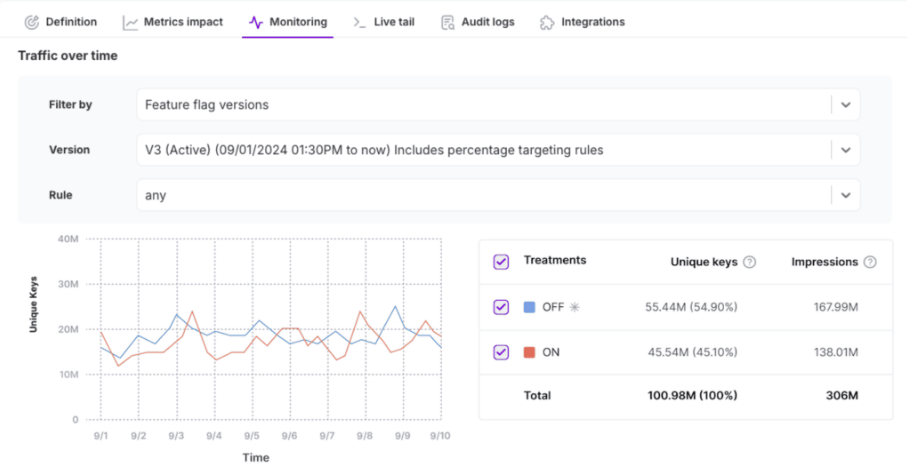

This section visualizes the number of unique keys (users, accounts, or your defined traffic type) served each treatment over the selected time period. The data is shown in a line graph, with each line corresponding to a selected treatment. 

If a time range is selected that spans across versions, vertical lines indicate when a new feature flag version was created. Additionally, a table displays a summary of unique keys and total impressions per treatment.
