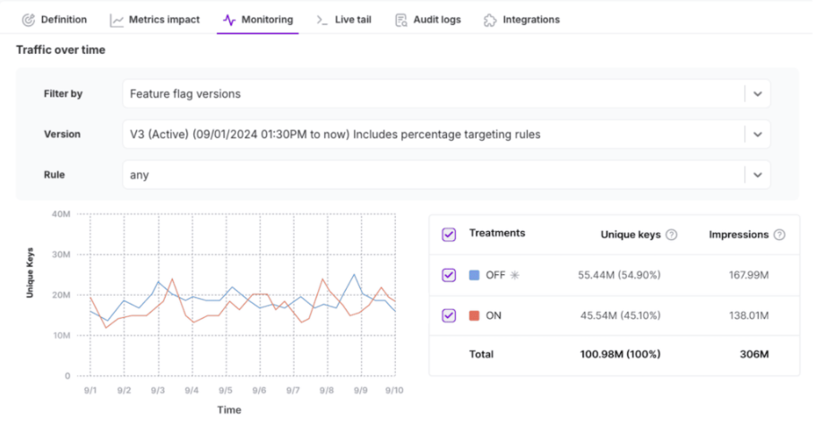

## Overview

The **Monitoring** tab provides real-time insights into your feature flag's traffic and a summary of alerts that have fired. This data can be used to identify unexpected trends or issues that require troubleshooting.

The **Monitoring** tab includes the following sections:

## Traffic insights

This section visualizes the number of unique keys (users, accounts, or your defined traffic type) served each treatment over the selected time period. The data is shown in a line graph, with each line corresponding to a selected treatment. If a time range is selected that spans across versions, vertical lines indicate when a new feature flag version was created. 

Additionally, a table displays a summary of unique keys and total impressions per treatment.

## Alerts fired

This section lists all alerts that have triggered for this feature flag, either from metric alert policies or automated feature flag alerts on key and guardrail metrics.

If an alert was fired for this flag, the following information is displayed in a table.

| **Field** | **Description** |
| --- | --- | 
| Version | The version number of the feature flag that triggered the alert. |
| Alert fired | Timestamp when the alert was triggered. |
| Source | The name of the alert policy, key metric, or guardrail metric. Click the name to go directly to the policy or metric definition. |
| Direction | Indicates whether the impact was desired or undesired, based on what was configured in the policy or metric definition. |
| Relative impact | The degradation percentage that is detected and the error margin of this percentage. |

Clicking on the **Details** pop-over icon shows additional information about the alert.

| **Field** | **Description** |
| --- | --- | 
| Type | Indicates whether the source of this alert was an alert policy, key metric, or guardrail metric. |
| Baseline treatment | The alert baseline treatment name. |
| Baseline value | The metric value for the baseline treatment. |
| Comparison treatment | The name of the treatment being compared to the baseline that is responsible for the alert. |
| Comparison value | The metric value for the comparison treatment. |
| Absolute impact | Displays the difference between the comparison value and baseline value and the associated error margin. |

For more information on configuring alerts, refer to the [Metric alerting guide](/docs/feature-management-experimentation/release-monitoring/alerts/alert-policies) and [Feature flag significance alerting guide](/docs/feature-management-experimentation/release-monitoring/alerts/automated-alerts-and-notifications/#setting-up-feature-flag-alerting).
