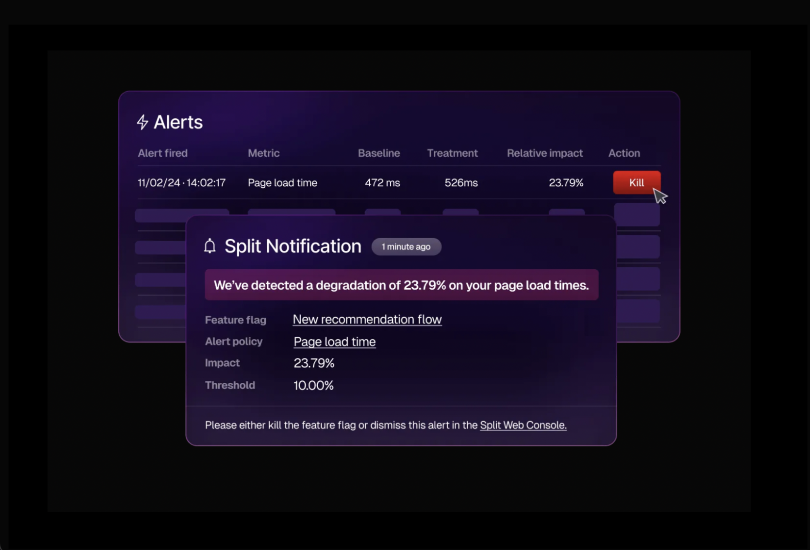

Set up release monitoring to quickly detect the impact of each individual feature, even when multiple features are rolled out to small fractions of users at the same time.

[Alert policies](docs/feature-management-experimentation/50-release-monitoring/docs/alerts/alert-policies/alert-policies.md) will alert you to significant negative impact on any [guardrail or key metric](/docs/feature-management-experimentation/50-release-monitoring/docs/metrics/metric-categories.md) that you set, pinpoint the malfunctioning feature variation, and guide you to [instant rollback](docs/feature-management-experimentation/50-release-monitoring/docs/monitoring/kill-switch.md).

