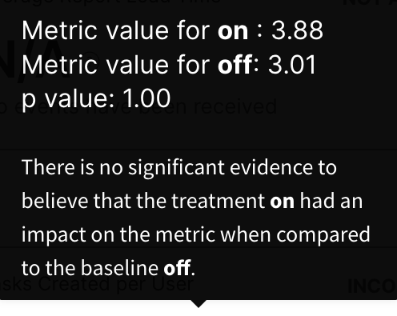

Statistical significance represents the likelihood that the difference in your metric between a selected treatment and the baseline treatment is not due to chance. Your significance threshold is a representation of risk tolerance. Formally, the significance threshold is the probability of detecting a false positive as outlined above.

A commonly used value for the significance threshold is 0.05 (5%), which means that every time you do an experiment, there is a 5% chance of detecting a statistically significant impact, even if there is no difference between the treatments. In statistical terms, the significance threshold is equivalent to alpha (α).

In experimentation, you observe a sample of the population and use the samples that you observed to make inferences about the total sample population. At a conceptual level, the role of the statistics engine is to determine the likelihood that these sample distributions were drawn from the same underlying population (the *null hypothesis*). More informally, the null hypothesis poses that the treatment had no impact on the metric, and the goal of the statistics engine is to check if the distribution of metric for users receiving treatment and those receiving the baseline treatment is sufficiently different. Harness FME uses statistical significance to infer whether your treatment caused the movement in the metric.

The impact you see could be the result of a typical fluctuation in the metric instead of an actual change caused by the underlying treatment. To remove this potential concern, specify a lower significance threshold. For example, if you set your significance threshold to .2 and you see a statistically positive impact, there is a 20% chance that what you see is not actually a statistically positive impact. At a .10 threshold, the chance of error decreases to 10%. However, the lower your significance threshold, the more samples your experiment requires. 

Choosing the right significance threshold should balance the confidence you want to have in the impact not being by chance and the number of samples (traffic) that you receive.

Learn more below about testing for a significant impact, the methodologies, and default configurations used in Harness FME. If your account's risk tolerance is lower, or your traffic volumes are of scale, learn more about [changing statistical settings](/docs/feature-management-experimentation/experimentation/setup/experiment-settings/) in Harness FME.

## Two-tailed test
 
The role of a statistics engine is to determine the likelihood that the sample distributions were drawn from the same underlying population (the *null hypothesis*). More informally, the null hypothesis poses that the treatment had no impact on the metric, and the goal of the statistics engine is to check if the distribution of the metric for users receiving the treatment and those receiving the baseline treatment is sufficiently different.

Diving a bit deeper into statistics, this can be formalized through hypothesis testing. In a hypothesis test, a test statistic is computed from the treatment and baseline treatment distributions. The test statistic can be calculated using a technique known as the *t-test*. 

Harness FME uses a two-sided test to detect differences between your baseline and your treatment in both directions.

Next, the p-value is computed, which is the probability of observing a t at least as extreme as we observed.

The computed p-value is displayed for each metric and compared against the significance threshold setting, or α, for your account. See below for more background on alpha and type 1 errors. 

## Type 1 error
 
The *type 1 error* is when the null hypothesis, that the treatment has no impact, is true, but it is incorrectly rejected, commonly known as a *false positive*. The probability of this error is called significance threshold or alpha (α).

If the p-value you computed above is less than α, it would be challenging to hold on to our hypothesis that there was no impact on the metric. 

In this scenario, we reject the null hypothesis and accept that the treatment had an impact on the metric when compared to the baseline.

## Type 2 error
 
The *type 2 error* is when the null hypothesis is false, but it is incorrectly accepted, commonly known as a *false negative*. The power threshold of a hypothesis test is 1 - β, where β is the probability of a type 2 error.

With modern telemetry systems, it is easy to check the change in a metric at any time. However, to determine that the observed change represents a meaningful difference in the underlying populations you first need to collect a sufficient amount of data, or achieve enough power.

The target sample size at which you should evaluate the experimental results is based on what size of effect is meaningful (the minimum detectable effect), the variance of the underlying data, and the rate at which it is acceptable to miss this effect when it is actually present (the power threshold). 

In Harness FME, you can customize the significance threshold and power thresholds.

Learn more about interpreting your metrics impact and configuring your statistical settings in Harness FME.

## Normal distribution
 
Robust experiments rely on the means of treatment and control groups, which are assumed to be normally distributed. The *central limit theorem (CLT)* shows that the mean of a variable has an approximately normal distribution if the sample size is large enough. We apply the [rule of thumb](http://bit.ly/expRulesOfThumb) that the minimum number of independent and identically distributed observations needed to safely assume that the means have a normal distribution is 355 for each treatment. Hence, by default we require a sample size of at least 355 in each treatment before we calculate significance for your metrics. You can change this minimum sample size requirement in the [Monitor and Experiment settings](/docs/feature-management-experimentation/experimentation/setup/experiment-settings/) section in Harness FME.

## Alert Policy Statistics 

To enable the ability to detect degradations of a metric within the first 30 minutes of a new version of a Harness FME, some statistical adjustments have been applied during this monitoring window.

* A one sided t-test will be used during this monitoring window, based on the desired impact in the metric definition to derive the undesired impact.  
* During the monitoring window we will consider the null hypothesis to be, the difference between the two treatments is equal to or less than the degradation threshold configured by the user. This threshold is a relative percentage of the metric and will be measured against the alert baseline treatment of a particular Harness FME. 
* Comparisons of the the p-value will be against a hard-coded list of p-value thresholds generated from your account-wide alpha-level. 
* To avoid an increased false positive rate due to multiple testing, we will adjust your account's set alpha-level by alpha divided by the number of calculations ran within the first 30 minutes. 
* Calculations of error margins on the impact will assume symmetrical uncertainty.

## Interpreting inconclusive results

Inconclusive metrics for a feature flag that do not reach statistical significance, can be confusing and disappointing. It means the data does not support your original hypothesis for that metric (unless you were running a ‘do-no-harm’ test) and there is not enough evidence to conclude that the treatment had any an actual impact.

However, you should not be disheartened by inconclusive metrics. For one thing, they are very common; [successful tech giants such as Google and Bing report that only about 10% to 20% of their experiments generate positive results](https://hbr.org/2017/09/the-surprising-power-of-online-experiments). They are also very valuable; while not having your hypothesis validated might feel disappointing, this actually is one of the main ways experimentation can bring value. Getting an inconclusive result can keep you from spending time and resources developing features that are not bringing the value you thought they would. 

A metric is inconclusive when, based on a statistical analysis, the system cannot confidently indicate whether it had a desired or undesired impact. Alongside the measured difference between the treatments, we show the confidence interval around this measured value via the ‘impact lies between’ text on the metric cards. When a metric is inconclusive, the confidence interval will include 0% impact since we have not been able to rule out the possibility that the treatment has no or negative impact on your metric.

### Analyzing inconclusive results

One of the first things to look out for when interpreting statistically inconclusive metrics is the ‘power’ of the metric. Not reaching statistical significance does not mean that your treatment had no impact -- it means that there wasn’t enough evidence to say that there was an impact. This is a subtle but important difference. 

Each metric for a given test will only have enough power to detect impacts greater than a given size -- this is the metric’s minimum likely detectable effect (MLDE). Getting an inconclusive result means it is unlikely that your test had an impact greater than this MLDE, in either direction, but there could be an impact smaller than this value that the test was not able to detect given the current number of experimental units. The current MLDE can be displayed by hovering over the question mark on your inconclusive metric card.

For example, in the image above, the hover text indicates that your treatment didn’t impact the number of bookings per user by more than a relative change of 3.76%, but that there may be an impact smaller than that value. 

To reduce the MLDE so that it is possible to discover potential impacts smaller than this, you need a larger sample size. This may mean running the experiment for a longer period of time or with a different percentage rollout. You can use the [sample size and sensitivity calculators](/docs/feature-management-experimentation/experimentation/key-concepts/sample-size-calculator/) to help understand how long you would need to run an experiment to get the required sensitivity. 

### Learning from inconclusive results

Inconclusive tests can still provide valuable learning opportunities. It is worth looking in to the results to see if certain segments responded differently to your treatment. While this may not provide enough evidence by itself to draw strong conclusions, it can provide insights and ideas for additional iterations or further testing. 

For example, you may see that although there was no significant impact across all users, there was a notable impact in the desired direction for a subset of your users, such as premium users or users from a particular geographic location. This might suggest it's worthwhile to repeat the test specifically targeting that set of users.

Inconclusive results may also indicate that some of your assumptions about your users are invalid, for example what they want or what they find useful. It may also suggest that problems, or pain points, are not what you thought they were. These are all valuable lessons that inform future hypotheses and tests. 

### Next steps

When the metrics do not clearly indicate which treatment performed better, it is often best to keep the current, default state, the control treatment. If there is no reason to believe making a change will bring any benefit, then sticking with the current state will avoid unnecessary changes to the user experience.

However if you have your own reasons to favor one treatment over the other, perhaps it is cheaper or easier to maintain, then an inconclusive result can give you confidence that making that change will not disadvantage your users and you can safely go with your preference. 

Finally, if you are seeing inconclusive results too often, it may be a sign that you should test bigger, bolder changes. Subtle changes often have subtle impacts, which require higher levels of traffic to be detectable. Sometimes you need to go big; making more dramatic and visible changes to your product will be more likely to produce significant results and controlled experimentation provides a way to safely test your big ideas.  

## Troubleshooting

### My metric showed statistical significance yesterday and now it doesn't. How can that be?

When you use fixed horizon to calculate your metrics, it is possible that your metrics change from conclusive to inconclusive. You were so excited on Tuesday to see that your metric had a statistically significant uplift of almost 75% only to have your hopes dashed on Wednesday when the latest recalculation of that metric showed a statistically inconclusive and smaller increase over the baseline.

A metric in Harness FME is classified as statistically significant if the calculated p-value is less than or equal to the statistical significance setting for your organization (defaults to 0.05). 

#### New data is new information

That said, a metric shifts from being statistically significant to being inconclusive because data that came in during the intervening period added to the total picture such that the calculations comparing the treatment to the baseline shifted to being inconclusive (p-value > 0.05). It may be because of seasonality (users behave differently on Wednesdays than they do on Tuesdays) or it may simply be because the effect of the new treatment was not influential enough to change the behavior of a batch of new users in the same way as the previous users. Finally, it's possible that the first calculation was a false positive and that additional data representative of the true effect of the treatment corrected that mistake.

One thing to note about the above example is that the confidence interval for the metric when statistically significant is rather wide (+4.20% to +144.42%) which suggests, that although a significant p-value was calculated, the data is still somewhat noisy and uncertain.

#### No peeking

The possibility of early noisy data and false positives is a key reason it is important to decide how long your experiment runs prior to starting it and to not pick a winner sooner than that based on a metric reaching significance. In addition to multiple decision points increasing the chance of seeing a false positive, more data gives you more confidence in the durability of the effect you are seeing. Before starting your experiment, use the [Sample size and sensitivity calculators](/docs/feature-management-experimentation/experimentation/key-concepts/sample-size-calculator/) to see how many users have to encounter your experiment in order to see a meaningful swing in metrics. These calculators also take into account your seasonality cycle (typically seven days = one week), so that your experiment's duration sees an equal number of phases from the cycle.

#### Use sequential testing

If you are using the sequential testing method, you can peek at your results. Also, with these types of tests, your results are always valid, and they won't change once they reach significance (unless there is strong seasonality). Once you set this feature to on, you can check your results as many times as you want as soon as you start your measurements.