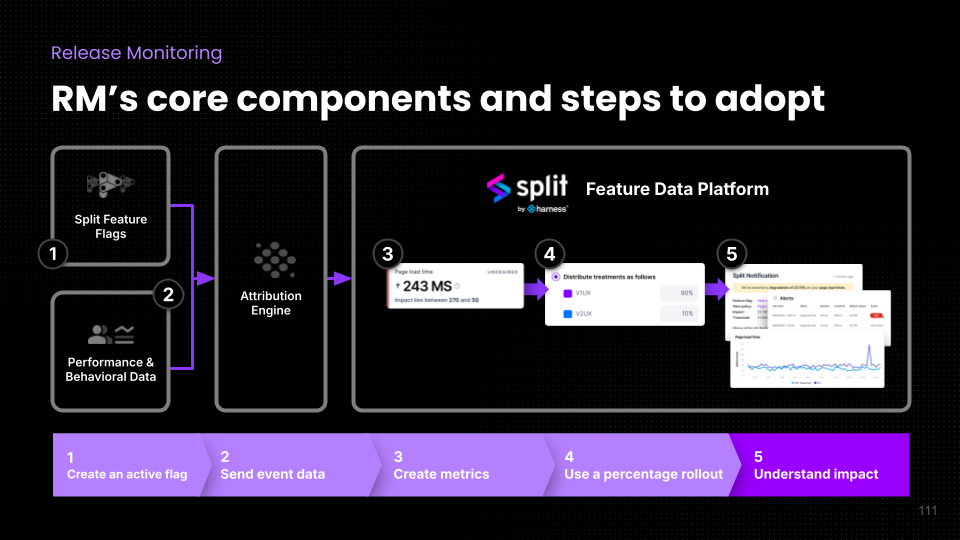

This document provides an overview of Release Monitoring and how it can be used to improve the performance and behavioral health of your application.

## What is Release Monitoring

Release Monitoring is a capability that Harness FME provides with our powerful statistics, monitoring, and alerting engine. 



There are five key components of Release Monitoring:

1. **Create an active feature flag**
   
   To measure impact, Harness FME requires a feature flag to be created in the Harness FME Web console and placed into code. 

1. **Harness FME ingests the performance and behavioral data**

   This includes the impression data, which is already sent by the FME SDKs. This also includes performance and error event data. This [event](/docs/feature-management-experimentation/release-monitoring/events/) data can be sent from any source, though it is likely easiest to come from the [FME SDK Suite](/docs/feature-management-experimentation/sdks-and-infrastructure/client-side-suites/android-suites) or [FME RUM agents](/docs/feature-management-experimentation/sdks-and-infrastructure/client-side-agents/android-rum-agent). The FME SDK Suite allows you to import both the SDK and the RUM agent together.  The RUM agents automatically send events that can be used for measuring performance, errors and can be extended with custom events and listeners that can be used to build any metric that matters to you.

1. **Harness FME monitors your metrics**

   Metrics are used to compute the impact of a feature. If you are using the FME SDK Suite or RUM agent, Harness FME will auto-create out-of-the-box metrics for events received by our platform. Review the help page for each individual agent to see the specific metrics its events will create. Metrics can also be manually created based upon what guardrails and other detected effects would be harmful (or helpful) to your business.  For more information on how to build metrics within Harness FME, please see this article from our help center: [Metrics](/docs/feature-management-experimentation/release-monitoring/metrics/). 

1. **The flag uses a percentage based rollout**

   In order for Harness FME to evaluate the Metrics properly, there needs to be a percentage based rollout - in other words, there has to be randomization for the treatments. This means that you can’t just have the feature on for a segment of users or users with certain attributes and off for everyone else and have Harness FME calculate the impact. Doing that means that the audience for each treatment won’t strictly be a random set. Of course, similar to something like a pharmaceutical trial, you can randomize the treatments received within a single segment. That is, within a segment of users (or within a group of users selected by certain attribute values) it can be randomly selected that some will get one treatment and some will get a different one. This allows you to have statistically valid experiment groupings while still ensuring that you don’t expose the new treatment outside of a selected population.

1. **Feature Flag and Metric alerting are present**

   All you need to do is check your metrics impact dashboard to see how your features are doing, but to get the most value from Release Monitoring it is highly recommended that you set up metric [alert policies](/docs/feature-management-experimentation/release-monitoring/alerts/alert-policies/) and [feature flag alerting](/docs/feature-management-experimentation/release-monitoring/alerts/automated-alerts-and-notifications/#setting-up-feature-flag-alerting). Feature flag alerting immediately notifies you when a feature flag key metric achieves significance, allowing you to have confidence in the impact of your new feature.  Alert policies will alert you immediately to a guardrail metric being hit, ensuring that service degradations can be acted upon swiftly. 

### Release Monitoring components

The following table shows the amount of effort needed to implement the components of Release Monitoring — from lowest to highest lift:

| Lift  | Performance Event Data | Metrics | Percentage Based Rollouts | Understand Impact |
|------ |------------------------|---------|---------------------------|-------------------|
| Low   | Automatic events sent by FME RUM Agents or FME SDK Suite | Out of the Box Metrics | Percentage based rollout against all traffic | Choose key metrics for a flag |
| Medium| Use custom events tracked by either the FME SDK or RUM agents OR configure 3rd party integration to send performance and business events | Build your own metrics | Percentage based rollout to a sub-group either by attributes or segment | Choose key metrics and set Metric alerting |
| More  | Pull performance events out of APM platforms and send to Harness FME and also send business events |  |  |  |

## Why use Release Monitoring

Software engineering teams are constantly building and delivering features. State of the art in the industry is the progressive rollout — ensuring that released features are slowly ramped up and released to minimize the potential for service disruption and ensure the feature is positively impacting metrics before being released to everyone. 

Teams want to release software safely and know who is getting impacted if there is a service degradation. Commonly for this use case, teams will employ an application performance monitoring (APM) solution. APM tools can tell you if there has been a degradation, but if you are doing progressive rollouts of features, it may be difficult to separate the signal from the noise. 

For example, if there is a catastrophic 10% increase in crash percentage when a new feature is rolled out to 5% of customers, that 0.5% crash increase rate across your entire population might just be chalked up to noise and not even noticed — until 20, 30 or even 50% of customers are having the app crash more frequently, reducing the quality of their experience and harming their affinity towards your product and services. 

This becomes exceptionally more complex when you have multiple different features in various stages of rollout. Harness FME handles the data analysis on a feature by feature impact analysis, offering you the knowledge of which feature specifically is affecting your metrics. If you have two features at 50% rollout and your APM tells you that application crashes have increased, you may not know which feature is causing the majority of this negative impact. Harness FME’s Release Monitoring capability gives you the tools to do this. 

## What Release Monitoring enables

Release Monitoring enables you to see beyond the sea of data from your APM tools and business analytics tools — letting you focus on the value and performance effects from each individual feature. 

FME Suite or RUM agents, when installed, will automatically send events to Harness FME that can be used to monitor and keep abreast of the impact of individual features on performance metrics, ensuring that you are aware and able to monitor features as they roll out. The agents can also be used to send important business events and used to build business metrics. Allowing business and performance metrics to be monitored together. This 360 degree view of the business is extremely valuable.

When Harness FME receives an event for the first time from any FME SDK Suite (or FME RUM agent), metrics are automatically generated that build upon the data. 

Of course, using the events automatically generated by the agents you can also create your own metrics and send additional events of interest. 

A metric using the default error event produced by the FME SDK Suite (or RUM agent) could be as straightforward as the below example:


We would want to see fewer errors, so this metric will let us know the effect of a feature flag on the errors that we track with the `trackError` method. 

This method allows errors to easily be tracked in try-catch blocks, such as the below:   
  
```
try {  
  
    throws();  
  
} catch (MyException exception) {  
  
    SplitRumAgent.trackError(exception);  
  
}
```

While agents do not exist yet for the server-side SDKs, it is entirely possible, and even expected, that server-side feature flags can affect the user experience on client devices. So even if you are only using Server-side FME SDKs, you can still get value from the current FME RUM agents. And of course you can always send these events to Harness FME using [other methods](/docs/feature-management-experimentation/release-monitoring/events/setup). 

### Key metrics

Getting an alert when a metric reaches significance can be as easy as setting the metric as a key metric for a feature flag. This is done on the Metrics impact tab for the feature flag by clicking on the **More Actions** button and selecting **Add as key metric**.


<p></p>

Additionally, created metrics can be attached to an [Alert policy](/docs/feature-management-experimentation/release-monitoring/alerts/alert-policies/) — allowing you to be notified instantly via email under the situation of a metric degradation — allowing you to rollback or consider further analysis of the situation. This full end to end solution, from the feature toggle, to the statistical significance calculation, through to the alerting, gives enormous value for teams looking to move fast without breaking things. 

Here is an example alert policy that could be combined with the metric shown above:


<p></p>

This alert will fire if there is a 5% or more difference between the baseline treatment and any of the other treatments in the undesired direction. This allows you to take fast action and rollback or kill the feature before rolling it out further. 

:::note
You do not explicitly need to use the FME SDK Suite (or RUM Agents) if you have your own way of sending performance metric data to Harness FME. However, it has been our experience that performance metric data on a user-by-user basis is difficult to extract from common APM monitoring tools.
:::