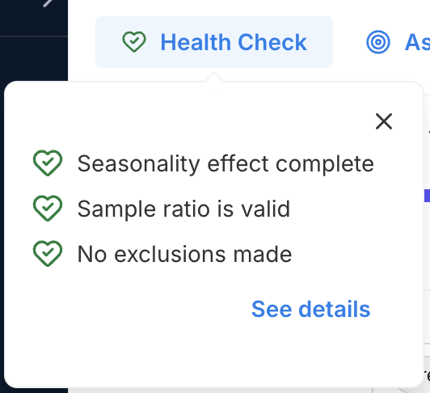

## Experiment health check

The experiment health check provides an at-a-glance view of the integrity of your experiment's exposure data before you interpret the results. When all checks are passed (showing a green heart icon with a checkmark), you can be assured that your experiment has collected enough clean, reliable, and correctly attributed data and that the metric results are ready to review.

The Health Check is found at the top left of an Experiment page, and shows how experiment data conforms to the following criteria:
* **Seasonality effect completeness (for sequential testing):** Your experiment has run long enough to capture a full seasonality cycle, as defined by your organization, reducing the risk that results are influenced by short-term seasonal effects.
* **Experimental review period completeness (for fixed horizon testing):** Fixed horizon testing is designed to identify subtle effects that are detectable only over a longer period of time, so peeking is strongly discouraged until the experimental period is complete (at which time the value will be healthy, showing the green heart symbol).
* **Sample ratio:** The observed sample split in your experiment treatments closely aligns with the expected targeting percentages, indicating that samples are being randomly and evenly assigned across variations as intended.
* **Sample exclusions:** A healthy experiment has no to low exclusions, ideally with fewer than 2% of samples  excluded from any variant. Exclusions can occur when targeting rules change, leading to reallocation and the removal of samples that might otherwise switch between treatments. A high exclusion rate may compromise result reliability and should be reviewed before interpreting metrics.

# Health check details

You can drill into your experiment's health check to view detailed breakdowns of each check. These details clarify what each check evaluates, help you assess the severity of any issues, and guide your next steps for troubleshooting. 

Clicking the **See details** link in the Health check pop-up opens a slide-out panel with information on your experiment's duration (seasonality period for Sequential Testing and experimental review period for Fixed Horizon), sample ratio alignment, and exclusion rates. The possible values for these criteria and additional userful references are described in the sections below.

When you click the **See details** link on the Health Check popup, you will see a slide out modal with your seasonality effect / experimental review period, sample ratio, and sample exclusion details. The possible values for these criteria and additional useful references are described in the sections below.

## Seasonality effect completeness (for sequential testing)

### Possible values

* Seasonality effect complete 
* Seasonality effect incomplete  
* Seasonality effect not started
 
### Importance of seasonality effect completeness

While sequential testing is designed to accrue results incrementally, seasonality patterns (such as weekend or holiday spikes or dips in user activity, daily network bandwidth changes, etc.) can affect data. 

### Troubleshooting steps

The seasonality effect is considered complete when the experiment has run for at least the seasonality period defined in your organization's experiment settings. As a best practice, ensure that your experiment spans one or more full seasonality cycles to reduce the risk of time-based bias in your results.

#### Useful references:
* [Reviewing metrics during an experiment](https://help.split.io/hc/en-us/articles/360021867572-Reviewing-metrics-during-an-experiment)
* [Experimental review period](/docs/feature-management-experimentation/experimentation/setup/experiment-settings#experimental-review-period)
* [Where did my statistical significance go?](/docs/feature-management-experimentation/release-monitoring/metrics/statistical-significance/#troubleshooting)
* [When are metrics automatically recalculated?](/docs/feature-management-experimentation/experimentation/experiment-results/viewing-experiment-results/metric-calculation-schedule/#when-are-metric-cards-updated)
* [Sample size and sensitivity calculators](/docs/feature-management-experimentation/experimentation/key-concepts/sample-size-calculator/)

## Experimental review period completeness (for fixed horizon testing)

### Possible values

* Experimental review period complete
* Experimental review period incomplete
* Experimental review period not started

### Importance of experimental review completeness

Fixed horizon testing is designed to detect subtle but consistent effects of experiment variations. Allowing the experiment to run longer, powers the experiment with more data. This reduces noise and contributes to the accuracy of metric results. For this reason, peeking early at the results of a fixed horizon test is strongly discouraged. The seasonality effect completeness result tells you if your experiment time duration is complete.

### Troubleshooting steps

The experimental review period will be complete when the experiment has run to the experiment end date. As a best practice, you can carefully evaluate that your experiment duration allows enough traffic (data entering your experiment) to raise the sensitivity (ability to find a minimal percentage impact) of your experiment to your desired level.

#### Useful references:
* [Using fixed horizons in experimental review periods](/docs/feature-management-experimentation/experimentation/setup/experiment-settings#using-fixed-horizons-in-experimental-review-periods)
* [Review periods](/docs/feature-management-experimentation/experimentation/experiment-results/viewing-experiment-results/metric-calculation-schedule/)
* [Sample size and sensitivity calculators](/docs/feature-management-experimentation/experimentation/key-concepts/sample-size-calculator/)

## Sample ratio

### Possible values

* Sample ratio is valid
* Sample ratio mismatch detected
* Sample ratio not applicable

### Importance of sample ratio

Accurate experiment results rely on the unbiased distribution of users across all variations. If the sample assignment is not truly random, differences in outcomes may be caused by the way users were allocated rather than by the change being tested. This can compromise the validity of your results.

### Troubleshooting steps

Look for a design flaw in the experiment that might be preventing random sampling and causing a sample ratio mismatch.

#### Useful references
* [Sample ratio check](/docs/feature-management-experimentation/experimentation/experiment-results/analyzing-experiment-results/sample-ratio-check/)
* [How can I troubleshoot a Sample Ratio Mismatch in my feature flag?](https://help.split.io/hc/en-us/articles/360019981952-Sample-ratio-mismatch-check)
* [Sample ratio mismatch calculator](https://help.split.io/hc/en-us/articles/360044715132-Sample-ratio-mismatch-calculator)

## Number of sample exclusions

### Possible values
* No exclusions made
* Less than 2% of sample excluded
* n% of sample excluded
* Exclusions not applicable

### Importance of the sample exclusions percentage

High sample exclusions in an experiment potentially introduce bias and reduce generalizability, especially if the excluded participants differ significantly from those included. For an experiment with a feature flag as the assignment source, keys are excluded that have been reassigned treatments more than once (if a key has been assigned three treatments, then it is excluded).

### Troubleshooting steps

Examine the sample data that has come into the experiment, and consider why keys may have been reassigned treatments. To reduce the percentage of exclusions, you can introduce new data into the experiment (for example, by increasing feature flag traffic exposure) or redesign and restart the experiment with a new assignment source.

#### Useful references
* [Attribution and exclusion](/docs/feature-management-experimentation/experimentation/experiment-results/analyzing-experiment-results/attribution-and-exclusion/#potential-complications) (see Exclusions)
* [Reallocate](/docs/feature-management-experimentation/feature-management/manage-flags/reallocate-traffic-traffic)
* [Export data](/docs/feature-management-experimentation/feature-management/monitoring-analysis/export-data/)
