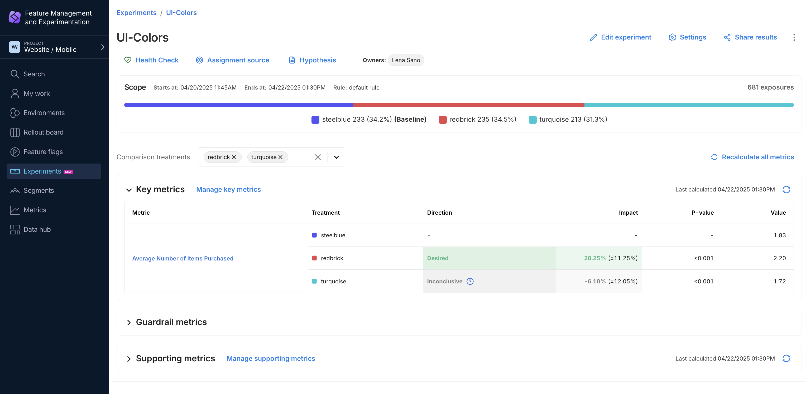
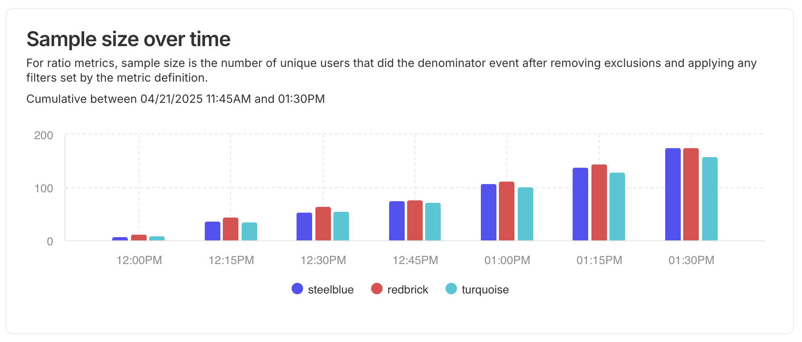
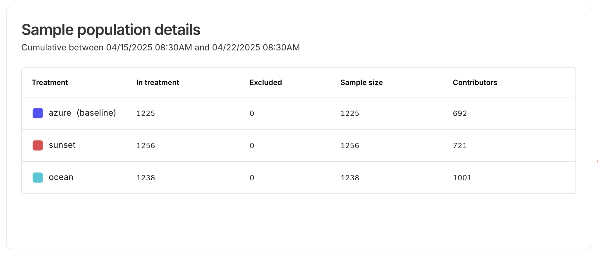
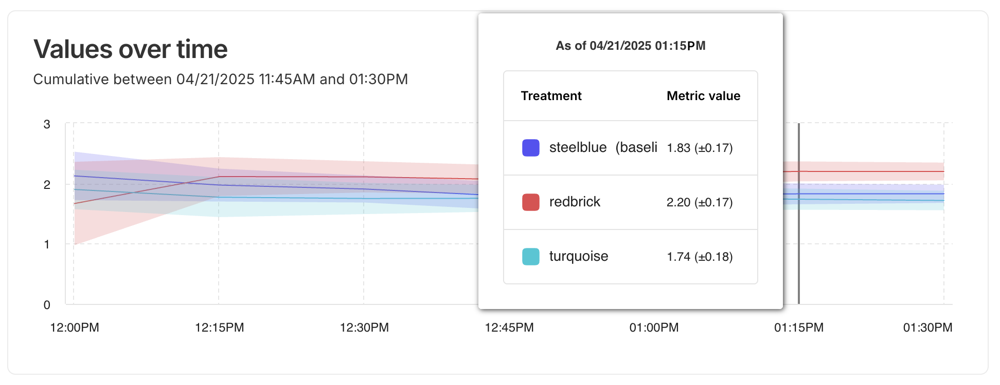
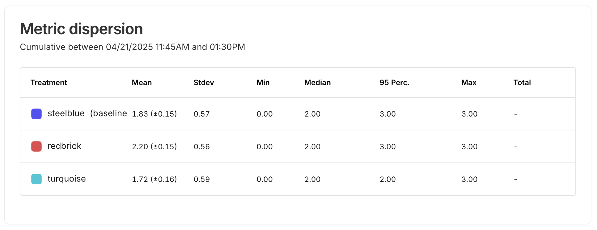
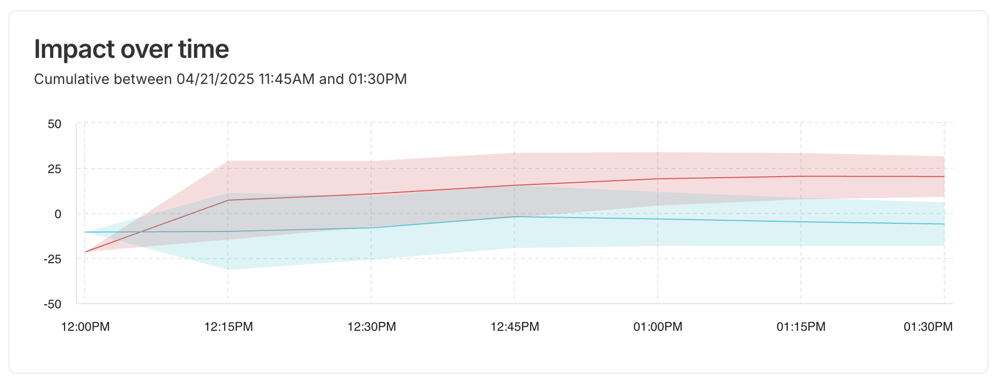
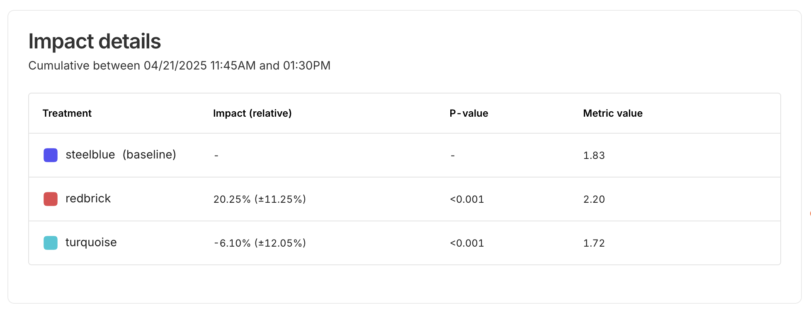
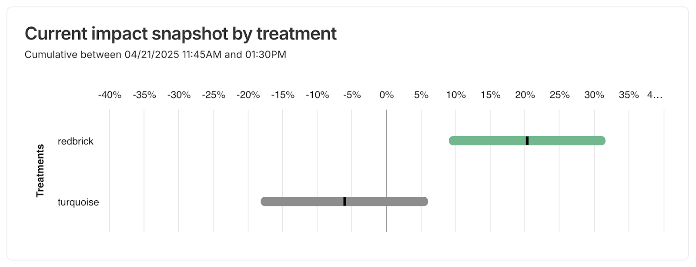

## Analyzing your metric results

After launching an experiment, you can view the results directly in the Experiments Dashboard. The metric results table summarizes key information for each treatment, providing a clear understanding of how the experiment impacts your key, guardrail, and supporting metrics.

Above the metric table, the **Exposures** bar visualizes the number of users exposed to each treatment group. This helps confirm that traffic was evenly distributed across variants, which is important for maintaining the validity of your experiment results. Monitoring exposures ensures that your experiment collected enough data and that assignment was properly balanced across variants.

Each row displays the metric name, treatment group, observed direction of impact (such as `Desired`, `Undesired`, or `Inconclusive`), relative impact percentage with confidence intervals, p-value, and raw metric value.

The **Direction** field provides a quick interpretation of whether the results for a treatment align with your defined goals. The **Impact** column shows the relative difference between the treatment and the baseline, along with its confidence interval. The **P-value** helps you understand the statistical significance of the observed impact; a low p-value (commonly < 0.05) suggests that the observed difference is unlikely due to random chance. The **Value** column displays the actual observed metric value for the treatment group, offering context for the size of the effect.

## Experiment metric details

From any experiment page, you can click on a metric name to see metric details laid out in a dashboard format, showing charts with sample size information and metric impact calculations.

This section explains the information you see on the charts and guides you to read, interpret, and gain benefits from the information shown.

:::info
You can click on a point or bar on one of the *over time* charts (bar graph or line charts). The other charts on the dashboard will update to show the metric data up to that point in time (except the *Impact snapshot by treatment* chart, which always shows the last calculated values). Click again to cancel the time selection.
:::

## Sample size charts

### Cumulative sample size over time

The Cumulative sample size over time chart makes it easy to compare treatment sample growth. You can quickly tell if both treatments are growing at a similar rate or diverging.

If one line consistently lags, you may have a traffic allocation issue, even if it’s subtle.

Any flat sections in a cumulative chart stand out immediately, indicating a pause in treatment assignment, traffic dip, or potential bug.

A smooth, steadily rising cumulative trend is a great visual cue that data collection is working correctly.

### Sample population details

The Sample population details chart allows you to determine how close you are to reaching the required sample size for statistical significance.

## Metric values charts

### Values over time

The Values over time chart helps you see if a variant is consistently outperforming the others, or if there are fluctuations in performance that might need deeper investigation.

The shaded area around each line is the confidence interval (CI). Seeing the CI bands over time tells you how confident you can be in the metric at any point during the test. If the confidence intervals for two treatments don’t overlap, that’s a strong visual cue that the difference might be statistically significant.

If one variant is truly better, you’d expect to see a steady and widening gap between cumulative lines.

If the lines cross over or stay very close together, this suggests that the effect of the variant treatments may not be consistent or significant.

The cumulative values over time lines makes a clear visual case for which treatment performed better overall—perfect for post-test recaps and presentations.

### Metric dispersion

The Metric dispersion chart provides full details of statistical results for data analysis. This chart summarizes the metric data for all treatments over the course of the experiment.

## Metric impact charts

### Impact over time

Seeing the impact over time visualization gives a clear sense of how fast the gains (or losses) are accumulating, and whether the treatment effect is growing, shrinking, or plateauing.

You can visualize the relative % impact of the treatments compared with the experiment's base treatment.

The shaded area is the confidence interval (CI) and gives you a range of values that you can be fairly confident contains the true value of your metric. Early in the experiment when sample size is small, the bands will be wide—reflecting uncertainty. As more data accumulates, the bands narrow, showing increased confidence.

### Impact details

The Impact details chart provides metric impact results for data analysis. This chart summarizes the metric results for all treatments (compared with the baseline treatment chosen in the experiment settings) over the course of the experiment.

### Current impact snapshot by treatment

The Current impact snapshot chart visually represents how your metric is performing relative to the experiment’s baseline treatment. This chart summarizes the metric results, showing a bar for each treatment (compared with the baseline treatment) using a green, gray, or red bar for a desired, inconclusive, and undesired impact respectively.

