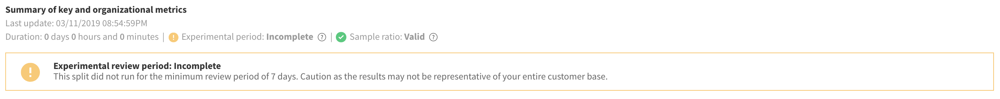
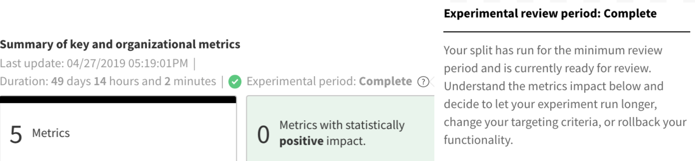

## Overview

Making conclusions about your metrics impact during set review periods reduces the chance of errors and allows you to account for seasonality in your data. Split always shows your current metrics impact and if your review period has been reached. 

The images below show the two different states of **incomplete** and **complete**.

:::info
As a best practice, avoid making conclusive product decisions in between review periods or at minimum ensure that you have run for at least one review period.
:::

## Incomplete

The review period was incomplete because your feature flag didn't run for the minimum review period selected for this feature flag.

## Complete

The review period is complete when a feature flag either:

* Runs for the minimum review period which is selected for this experiment in either a current or previous version of your feature flag. A 14-day review period (configured by default) is ready for review on day 14, 28, 42, etc.

   

* Is currently running but is between review periods.

## Change settings

If you believe that the default review period for your account is too long or too short, contact your administrator to adjust your [statistical settings](/docs/feature-management-experimentation/experimentation/setup/experiment-settings).