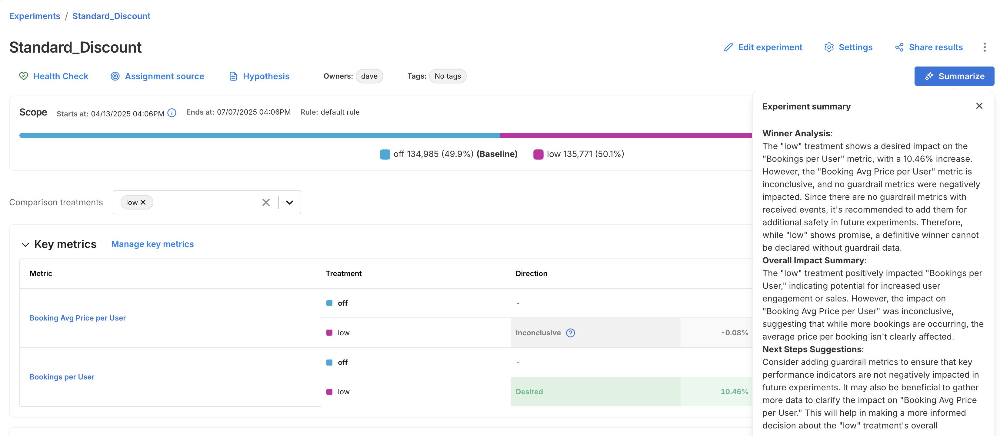
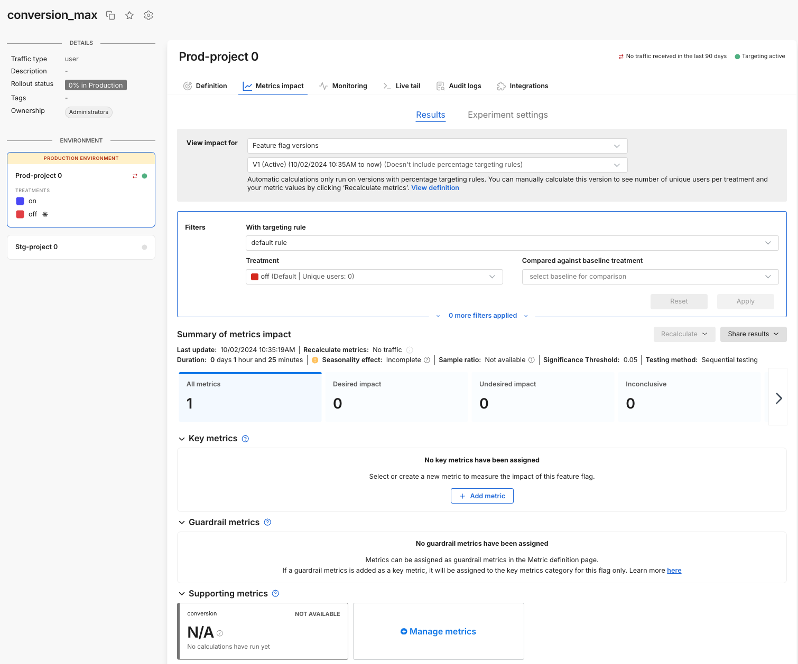
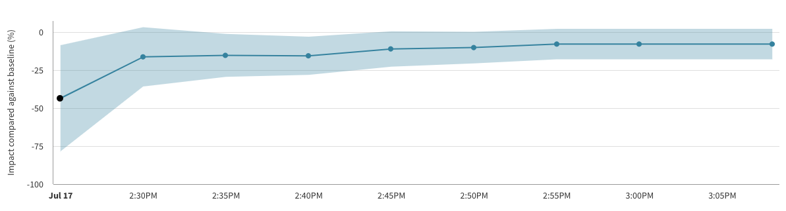

## Overview

You can view your experiment results from the **Experiments** page. This page provides a centralized view of all experiments and allows you to quickly access performance metrics, significance levels, and summary details for each treatment group.

Click into any experiment to view detailed results, including the following:

* Experiment metadata, such as:
  
  - Experiment name, owners, and tags
  - Start and end dates
  - Active targeting rule
  - Total number of exposures
  - Treatment group assignment counts and percentages

* Treatment comparison, including:

  - The baseline treatment (e.g. `off`)
  - One or more comparison treatments (e.g. `low`)

## Use AI Summarize 

For faster interpretation of experiment outcomes, the Experiments page includes an **AI Summarize** button. This analyzes key and guardrail metric results to generate a summary of your experiment, making it easier to share results and next steps with your team.

The summary is broken into three sections:

* **Winner Analysis**: Highlights whether a clear winner emerged across key metrics and guardrails.
* **Overall Impact Summary**: Summarizes how the treatment impacted user behavior or business outcomes.
* **Next Steps Suggestion**: Recommends what to do next, whether to iterate, roll out, or revisit your setup.

## Viewing metrics 

To view the impact of your feature rollout on your account's metrics, from your selected feature flag, click the **Metrics impact** tab. The metric cards show how your account's metrics change when comparing treatments against your flag's baseline treatment.

Before getting started, review the following:

* Understand how your most important metrics (overall evaluation criteria) were both positively and negatively impacted to learn more about what your customers expect and how you should change your feature functionality.
* Compare the actual impact with your team's preliminary hypothesis.
* Ensure that you understand the impact and tradeoffs on your account's guardrail and performance metrics.
* Share the impact with your team.

## Viewing metrics 

To view the impact of your feature rollout on your account's metrics:

1. From the left navigation, click **Feature flags** and select the desired feature flag.

1. From your feature flag, click the **Metrics impact** tab. The Results page appears. 

   

   The page shows how your account's metrics change when looking at customers in a particular treatment as well as when comparing treatments.

   :::info
   Automatic calculations run for flag versions which include a percentage targeting rule. On-demand calculations can be run at any time by clicking the **Recalculate metrics** button. Be aware that the recalculate button may be disabled in certain conditions.
   :::

1. In the **View impact for criteria** area, select a version of the experiment to see your metrics results.

1. In the **With targeting rule** field, select a targeting rule used in your evaluation. Split ensures fair distribution across a filtered set and statistical rigor.

1. To view statistically valid results when you compare two treatments, select a label for which you want to see your metrics results. If you select the targeting rule `any`, your metrics results display, but statistical significance is not computed.

1. Select the treatment for which you would like to view metrics impact and optionally add a baseline comparison to see statistical comparisons. You can view metrics cards for users exposed to a particular treatment. To compare users exposed to different treatments, select the desired version, targeting rule, and treatments that you want to compare. When you select the treatment, you see the number of users in that treatment.

1. In the **Summary of metrics impact** section, view how long your experiment has been running, and the last update time for the metrics displayed below. You can also force a recalculation of your metrics using the Recalculate button. This recalculation usually takes around 5 minutes but is dependent on the length of your experiment and the size of your data.

1. In the **Key metrics** section, selected key metrics for this feature flag. If you are releasing a new feature behind this feature flag, display the key success metrics for this feature release here.

   :::tip
   A good practice is to have no more than 5 metrics. We recommend this because too many key metrics slow down the processing time to reach statistical significance.
   :::

1. In the **Guardrail metrics** section, the account-wide guardrail metrics display. Any metrics that changed in a statistically positive and negative way display first.

1. In the **Supporting metrics** section, the supporting metrics that were added for the feature flag display. Any metrics that changed in a statistically positive and negative way display first.

The Metrics impact tab is described as follows:

* **View impact for.** Select the version or a custom date, targeting rule, and treatments that you want to compare. When you select the treatment, you can see the number of unique keys in that treatment. For more information, refer to the [Apply filters guide](/docs/feature-management-experimentation/experimentation/metrics/setup/filtering/).
* **Summary of metrics impact.** View how long your measurements have been running, and the last update time for the metrics displayed below. You can also force a recalculation of your metrics by clicking the Recalculate metrics button. This recalculation usually takes around 5 minutes but is dependent on the length of your experiment and the size of your data.
* **Filter metrics.** Filter down to metrics with a positive or negative impact by clicking the tile. You can deselect and view all by clicking the tile again.
* **Key metrics.** Select the key metrics that you want to monitor to help you evaluate the success of this feature. Learn about [Configuring feature flag alerting](/docs/feature-management-experimentation/release-monitoring/alerts/automated-alerts-and-notifications/#setting-up-feature-flag-alerting) for your key metrics. Key metrics are recalculated on a schedule, or when you click the *Recalculate* button.
* **Guardrail metrics.** Globally protected guardrail metrics adhere to an account-wide alerting policy. See the [Metric definition](/docs/feature-management-experimentation/experimentation/metrics/categories/) page for more information. Guardrail metrics are recalculated on a schedule, or when you click the *Recalculate* button.
* **Supporting metrics.** Select the supporting metrics that you want to monitor for this experiment or feature rollout. These metrics should be important to you, but may not be your primary success metrics for this feature. Supporting metrics are recalculated on a schedule, or when you click the *Recalculate* button.

For detailed information about specific metric cards, refer to [Understanding metric impact](/docs/feature-management-experimentation/experimentation/experiment-results/viewing-experiment-results/metrics-impact-cards/).

### Filtering results view

To view a filtered version of your results, do the following:

1. On the **Metric impacts** tab, in the carousel section, filter down to metrics with a positive or negative impact by clicking the tile. You can deselect and view all by clicking the tile again. Filters allow you to filter down to metrics that have either a positive or negative impact.
1. Select tags and owners. You can filter the metrics displayed down to those with a particular tag and/or a particular owner. 
1. Share applied filters. Use the **Share** button to send your metrics impact page to key stakeholders. Click Share and a shareable URL is added to your clipboard.The shareable URL provides a view of the metrics impact page for that specific feature flag. The version, targeting rules, treatment comparisons, applied tags, and applied owners are all shared. Users can then filter the metrics positively and negatively impacted.

To learn more about analyzing and filtering data on the Metrics Impact tab, see [Applying filters](/docs/feature-management-experimentation/experimentation/metrics/setup/filtering/).

## Reviewing metrics impact during review periods

Making conclusions about your metrics impact during set review periods reduces the chance of errors and allows you to account for seasonality in your data. Split always shows your current metrics impact and if you are between review periods. The following describes the incomplete and complete states.

:::tip
Avoid making conclusive product decisions in between review periods or at a minimum ensure that you have run for at least one review period.
:::

### Incomplete

The review period can be incomplete for two reasons:

* Your feature flag did not run for the minimum review period configured for your account.
* Your feature flag is currently running and is between review periods.

### Complete

The review period is complete when the feature flag has run for the minimum review period, set by your account in either a current or previous version of your feature flag. A 14-day review period (configured by default) is ready for review on day 14, 28, 42, and so forth.

### Change settings

If you believe that the default review period for your account is too long or too short, you can reach out to your administrator to adjust your [statistical settings](/docs/feature-management-experimentation/experimentation/setup/experiment-settings).

## Automated calculation frequency

Automatic calculations are run for feature flag versions that include a percentage targeting rule. The duration between automatic calculations scales with the length of the version since the longer the experiment has run, the less likely that the data collected in the last few hours can move the metric. You can see the last calculation time on the Metrics impact tab.

The automated calculation schedule is:

1. **First 24 hours**  
   - Every 5 minutes for the first 30 minutes  
   - Every 15 minutes for the next 5.5 hours  
   - Every 30 minutes for the next 6 hours  
   - Every hour for the remaining 12 hours  

2. **Days 2–12**  
   - Every 2 hours for 24 hours  
   - Every 4 hours for the next 2 days  
   - Every 6 hours for the following 2 days  
   - Every 8 hours for the following 2 days  
   - Every 12 hours for the following 4 days  

3. **Days 13–72**  
   - Every day for the next 12 days  
   - Every 2 days for the next 24 days  
   - Every 3 days for the next 24 days  

4. **Days 73–90**  
   - Every 5 days for 15 days  
   - One final automatic run on day 90  

After day 90, recalculations are manual only. You can also manually recalculate metrics at any time (e.g., if you add or update metrics). The last calculation time is shown in the **Metrics Impact** tab, and metrics update one final time after a version ends.  

## Manually recalculating metrics

You can manually run calculations on-demand by clicking the Recalculate button. Recalculations can be run for key metrics only, or for all metrics (key, guardrail, and supporting). **Most recalculations take up to five minutes, but can take longer, depending on the size of your data and the length of your experiment.**

Reasons you may choose to recalculate metrics:
* If you create or modify a metric after the last updated metric impact calculation, recalculate to get the latest results.
* If you assign a metric to the Key metrics or Supporting metrics groups, recalculate to populate results for those metrics.
* If the current version of this feature flag was created more than 28 days ago, recalculate to update results with the most recent data. Note that FME’s data retention period is 90 days. The influence of data points prior to 90 days are lost, even if the feature flag version is older than 90 days.

The Recalculate button will be disabled when:

* **No impressions for this version are received within the current retention period (i.e., the last 90 days).** To enable the recalculation, check that the SDK is correctly initialized in your code and verify that the metric event was sent.
* **A forced recalculation is already scheduled.** A calculation is in progress.  You can click the Recalculate button again, as soon as the currently running calculation finishes.

## Concluding on interim data

Although we show the statistical results for multiple interim points, we caution against drawing conclusions from interim data. Each interim point at which the data is analyzed has its own chance of bringing a false positive result, so looking at more points brings more chance of a false positive. For more information about statistical significance and false positives, see [Statistical significance](/docs/feature-management-experimentation/release-monitoring/metrics/statistical-significance/). 

If you were to look at all the p-values from the interim analysis points and claim a significant result if any of those were below your significance threshold, then you would have a substantially higher false positive rate than expected based on the threshold alone. For example, you would have far more than a 5% chance of seeing a falsely significant result when using a significance threshold of 0.05, if you concluded on any significant p-value shown in the metric details and trends view. This is because there are multiple chances for you to happen upon a time when the natural noise in the data happened to look like a real impact. 

For this reason, it is good practice to only draw conclusions from your experiment at the predetermined conclusion point(s), such as at the end of the review period. 

### Interpreting the line chart and trends

The line chart provides a visualization of how the measured impact has changed since the beginning of the feature flag. This may be useful for gaining insights on any seasonality or for identifying any unexpected sudden changes in the performance of the treatments. 

However it is important to remember that there will naturally be noise and variation in the data, especially when the sample size is low at the beginning of a feature flag, so some differences in the measured impact over time are to be expected. 

Additionally, since the data is cumulative, it may be expected that the impact changes as the run time of your feature flag increases. For example, the fraction of users who have done an event may be expected to increase over time simply because the users have had more time to do the action.

### Example Interpretation

The image below shows the impact over time line chart for an example A/A test, a feature flag where there is no true difference between the performance of the treatments. Despite there being no difference between the treatments, and hence a constant true impact of zero, the line chart shows a large measured difference at the beginning, and an apparent trend upwards over time. 

This is due only to noise in the data at the early stages of the feature flag when the sample size is low, and the measured impact moving towards the true value as more data arrives.

Note also that in the chart above there are 3 calculation buckets for which the error margin is entirely below zero, and hence the p-values at those points in time would imply a statistically significant impact. This is again due to noise and the unavoidable chance of false positive results.

If you weren't aware of the risk of peeking at the data, or of considering multiple evaluations of your feature flag at different points in time, then you may have concluded that a meaningful impact had been detected. However, by following the recommended practice of concluding only at the predetermined end time of your feature flag you would eventually have seen a statistically inconclusive result as expected for an A/A test. 

If you have questions or need help troubleshooting, contact [support@split.io](mailto:support@split.io).
