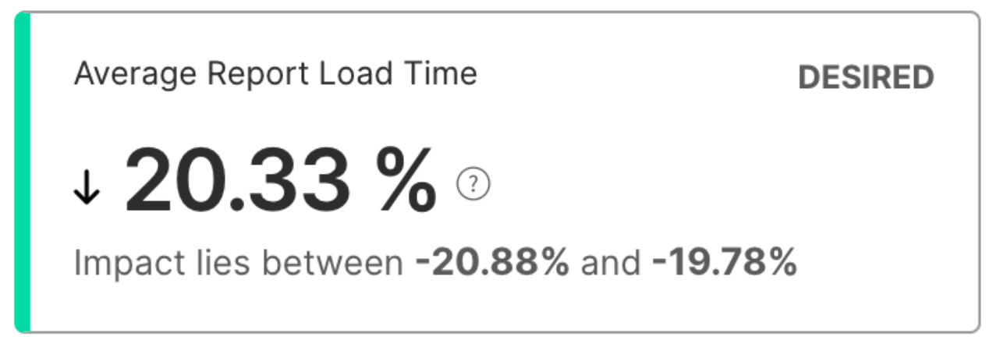
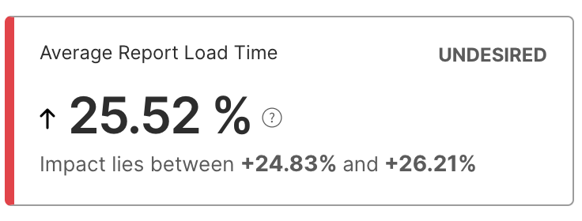
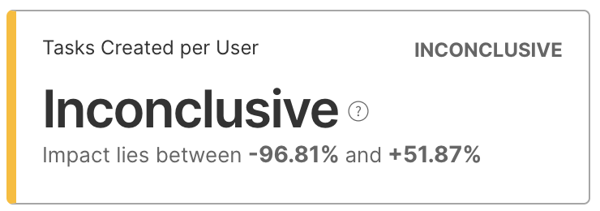
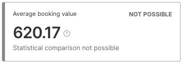
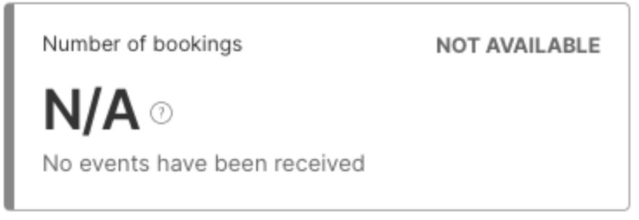
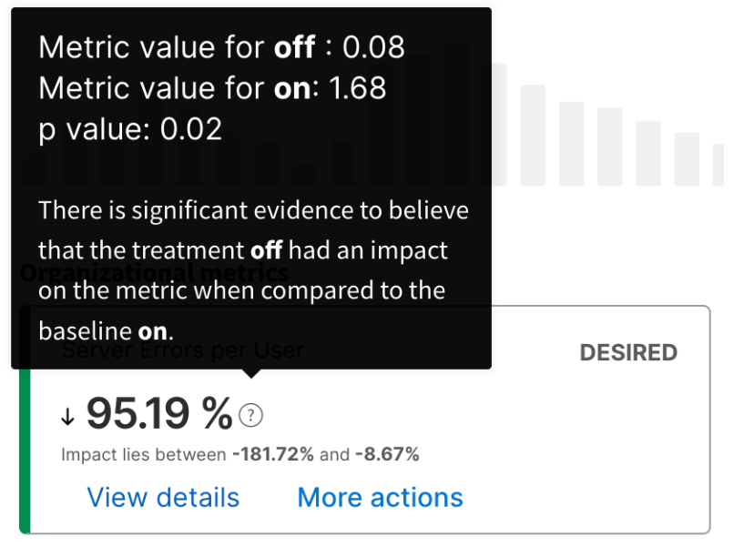
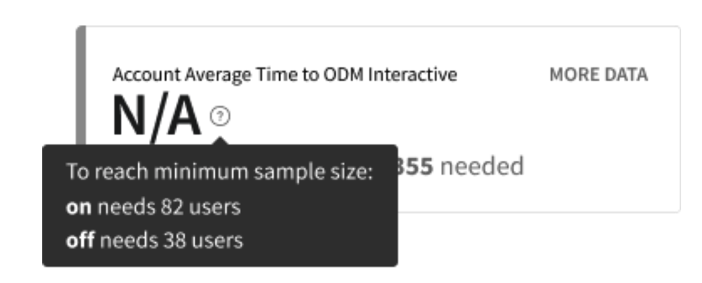
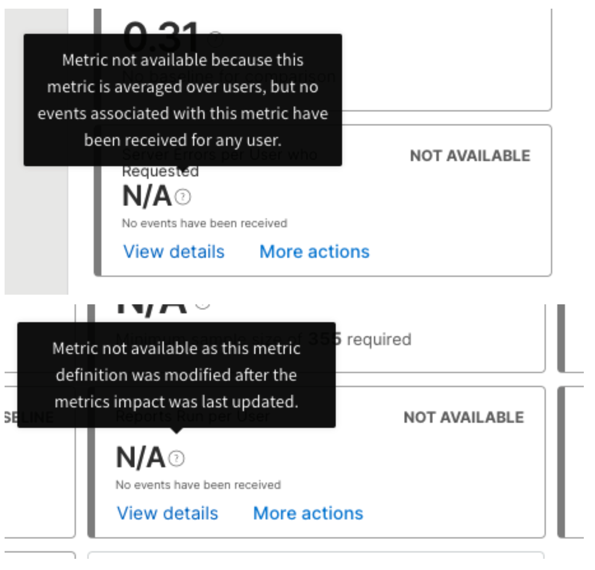

## Overview

Your metrics cards show different states depending on your user selections on the feature flag's Metric impact tab, the traffic distribution, the data available, and whether a baseline is selected in the feature flag definition. This page provides a summary of the states of the metric impact card. 

For each metric, you can register whether you want the number to go up (e.g., revenue) or down (e.g., churn). For more information about the Metric impact tab, refer to the [Viewing experiment results](/docs/feature-management-experimentation/experimentation/experiment-results/viewing-experiment-results/) documentation.

:::tip
On a **Desired**, **Undesired**, or **Inconclusive** impact metric card, you can see the range that the _**impact lies between**_. The two values are the statistically calculated extreme values for your impact. The smaller the range between the extreme values, the higher the confidence in the predictability of the feature impact on the metric.
:::

## Metric card states

### Desired

When a metric card displays **Desired** and is green, it is because of the following:

* The change matches the desired direction. For example, you wanted this metric to increase, and it did when comparing the treatment to the baseline.
* The p-value is less than the defined significance threshold of 0.05 or your account-wide significance setting. In this case, there is evidence that the treatment selected had a different impact on the metric than the baseline treatment selected.
* The metric had sufficient power. Data was collected from enough users to satisfy the desired minimum detectable effect and default power threshold.

### Undesired

When a metric card displays **Undesired** and is red, it is because of the following:

* The change doesn't match the desired direction, for example, you wanted this metric to increase, but instead it decreased when comparing the treatment to the baseline.
* The p-value is less than the defined significance threshold of 0.05 or your account-wide significance setting. In this case, there is evidence that the treatment selected had a different impact on the metric than the baseline treatment selected.
* The metric had sufficient power. Data was collected from enough users to satisfy the desired minimum detectable effect and default power threshold.

### Inconclusive

A metric card displays **Inconclusive** if the metric impact is undecided. The card displays a yellow state if:

* There is insufficient evidence to believe that there was an impact. Because the p-value is greater than the defined significance threshold of 0.05 or your account-wide significance setting, there is little evidence that the treatment selected had a different impact on the metric than the baseline treatment selected.
* The observed effect is less than the defined effect threshold. In this case, the observed effect doesn't meet the desired minimum detectable effect. Refer to the [Sample size and sensitivity calculators](/docs/feature-management-experimentation/experimentation/key-concepts/sample-size-calculator/) guide for more information about detectable effect sizes using our calculators.
* The range goes from a negative to a positive range. It’s inconclusive because the impact could be positive or negative.

### Baseline value equals zero

When the baseline treatment has a metric value of 0, the relative impact can’t be calculated and displays **Inconclusive** with a value of **N/A** on the card. Instead, the confidence interval is provided based on the absolute impact between the two treatments. The same information is provided as the statistically significant and statistically inconclusive cards but in absolute rather than relative terms.

## Resolving metric issues

This section details the results shown on gray metric cards. It also explains the actions needed for these cards to display actionable metric impact.

### Needs more data

A metric card displays **Needs more data** when the treatments being compared have not reached the minimum sample size. (The minimum sample size is set in Experiment settings). We require data from a specific number of unique users in each treatment before we calculate significance for your metrics. For more information, refer to the [Statistical significance](/docs/feature-management-experimentation/experimentation/key-concepts/statistical-significance/).

### Statistically not possible

A metric card displays **Not possible** for one of the following reasons:

* The metric is grouped across users. Metrics that are calculated across your customers and not normalized per customer (or the experimental unit) don't show a statistical comparison. These metrics are good for understanding overall trends, but if you want to see the statistical impact per customer, update the metric definition.

  _**Note:**_ The creation of new ‘across’ metrics is no longer supported, but existing ‘across’ metrics continue to return this state.

* The 'any' targeting rule is selected. Select a different targeting rule from the **With targeting rule** menu list to calculate statistical impact where available.

### No baseline

A metric card displays **No baseline** when you are viewing metrics for a single treatment. Select a baseline treatment to see a statistical comparison where available.

### Variance is equal to zero

A metric card displays **The variance is equal to zero** when, for each treatment that you are comparing, all events have the same value. It is possible that there is a misconfiguration of your events, since all event values for a treatment are identical.

### Metric calculation is not available

A metric card displays **Not available** for the reasons given in the following table. If the troubleshooting tips don’t resolve your issue, and you continue to have problems with your metrics, contact [support@split.io](mailto:support@split.io).
  
| Reason for unavailable metric result | Troubleshooting tips |
| ---- | ---- |
| The calculation has not yet run for this flag. | The calculation runs within the first 15 minutes of a change in the feature flag's version. If it has been 15 minutes and you still see this issue, contact [support@split.io](mailto:support@split.io). Automatic calculations are run for feature flag versions which include a percentage targeting rule. Click the **Recalculate metrics** button to run on-demand calculations at any time. |
| The metric either created or modified after the metrics impact was last updated. | The duration between updates scales with the length of the version. At the beginning of a version, calculations are run every 15 minutes for definitions updated in the past hour. The time between these calculations increases incrementally through the duration of a version. Feature flags update every hour for the first 12 hours and then alternate hours until it has been running for 24 hours. The calculation schedule then moves to daily until day 14 of a feature flag version. Final calculations run on days 21 and 28 of a feature flag version. The older the experiment, the less likely that the data collected in the last few hours can move the metric. Click the **Recalculate metrics** button to rerun your calculations. | 
| No users have an impression for at least one of the treatments. | This message appears if you are comparing two treatments and one of the treatments has no samples. Ensure that the version and targeting rule you selected is serving traffic to both treatments. |
| No users have met the metric's *filter by* condition for at least one of the treatments. | This message appears if the metric has a filter criteria in its definition, for example, measure this metric for users who clicked this button. Ensure that the customers who are in the treatment and firing the `track` event used in the metrics calculation have also fired the filter event. |
| This metric is an average, but no events associated with this metric have been received for any user for at least one of the treatments. | This message appears when you are looking at the average value and Harness FME hasn't received any events to take an average on. Ensure that you are sending the event that you want the average value for. |
| This metric is a ratio, but no events associated with the denominator have been received for any user for at least one of the treatments. | This message appears when you are calculating the ratio of two events and Harness FME hasn't received any events for the denominator. Ensure that you are sending your events properly. |
| No users have an impression for the treatment. | This message appears if you are looking at a single treatment with no baseline and there are no samples. Ensure that the version and targeting rule you selected are serving traffic to the treatment you selected. |
| The calculation did not return. Our support engineering team has been notified. | The support team was notified and our alerts have been triggered. |

## About individual metric card messages

The following section describes the tooltip messages and link buttons you see on different types of metric cards.

### Desired, Undesired, and Inconclusive

When you hover over the question mark icon of a Desired, Undesired, or Inconclusive metrics card, you will see a tooltip with the following info:

* The metric values for both treatments
* The p-value

You will also see the following link buttons:

* **View details**: Navigate to the Impact snapshot chart.
* **More actions**: Edit your metric definition, add this metric as a key metric or remove from key metrics.

### Needs more data

When you hover over the question mark icon of a metric card showing 'Needs more data', you will see a tooltip with the following info:

* The input needed for each treatment to reach the minimum sample size

  

### Not available

When you hover over the question mark icon of a metric card showing 'Not available', the message that appears provides the reason why the metric value is not available.

  
## Actions you can perform

The **More actions** link button appears when you hover over a metric card. This menu list allows you to take the following actions:

  * **Edit metric definition**: Navigate to the metric definition page in order to edit the selected metric.
  * **Add to key metrics**: Add the metric to the feature flag's key metrics section.
  * **Remove from key metrics**: Remove the metric from the feature flag's Key metrics section.
  * **Manage alert policies**: Navigate to the metric's Alert policy page.

## Troubleshooting

### What happens with metric results when one treatment has no events?

The system will test the difference between any mean values, even if one of them happens to be 0.  As a result, you can still get statistically significant results, a card that turns red or green.

In this scenario we use the absolute change instead of the relative change. If one treatment is 0 and the other treatment isn't 0, as long as there is a relevant sample size and the appropriate variance in the data, the stats calculations are not impacted.

In this case, the table on the Details and Trends page will show the appropriate data for the treatments.

In addition to seeing no events in the table for one of the treatments, the chart for Impact over time will be blank, reinforcing that we are using the absolute change.

But if you select Values over time, then you will see the means metric value for all of the treatments. A treatment that has no events will have the metric value zero.