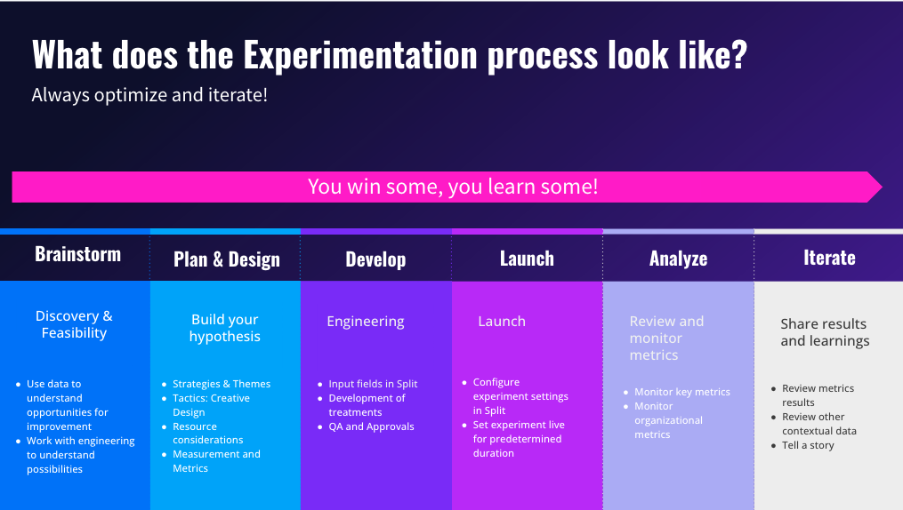
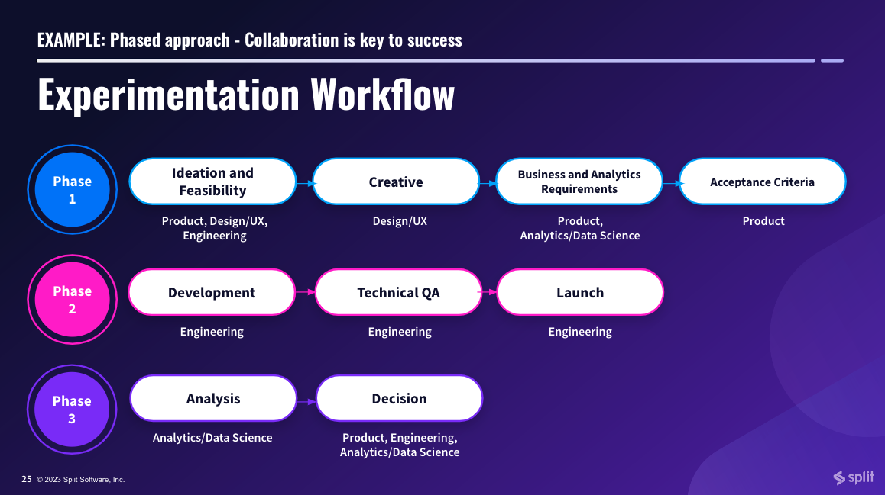

## Overview

When getting started with running experiments, the design phase serves as the foundation upon which data-driven decisions are built.  This pivotal phase will enable your organization to rigorously evaluate the impact of changes made, ensuring that decisions are grounded in empirical evidence rather than assumptions. 

This playbook will be an invaluable resource, as it guides your organization through each critical step of the experiment design process.  It assists in formulating well-defined hypotheses, prioritizing them based on strategic objectives, selecting appropriate metrics that align with business goals, and meticulously crafting the experimental setup.  

Supporting each of these areas, you will find ‘Split resources’ throughout this playbook, which are downloadable frameworks or guides to help you as a starting point. By providing comprehensive guidance in these key areas, this playbook empowers you to conduct effective experiments that yield actionable insights, ultimately driving informed decision-making and optimizing outcomes.

## Experiment Process & Lifecycle  

### What is it? 

An experiment lifecycle identifies the stages and processes involved in planning and executing an experiment.  The end to end experiment lifecycle has six key steps: **Brainstorm**, **Plan & Design**, **Develop**, **Launch**, **Analyze**, and **Iterate**.

### Why is it important? 

For any experimentation program to be successful, teams should be able to remain agile and create repeatable steps.  These steps give teams an outline for the who, what, when and where of experimentation.  From conception to iteration, it is important that teams optimize the process itself as they go along, in order to move faster. 

Program leads and individual team owners should consider the following:

- Who is involved with the experiment?
- What are the objectives of the experiment?
- What learnings will you gather from this experiment?
- Is your experiment aligned with the wider company goals? 

Check out the Split Arcade for our [Experimentation Level 1 certification](https://arcade.split.io/certifications/4d7eacee-5031-11ed-93f5-067360dfb065).

## Experiment Workflow 

[📄 Check out Experiment Workflow](./static/experimentation-workflow.pdf)

### What is it? 

An experimentation workflow provides a structured and systematic approach to designing, conducting, and analyzing experiments. There are a variety of productivity and workflow tools out there, but our customers typically use Jira, Airtable, Trello, ProductBoard or Excel. 

### Why is it important? 

It helps teams follow a clear sequence of steps, reducing the likelihood of errors and ensuring that experiments are carried out in a consistent manner. 

The purpose of an experimentation workflow is to facilitate data-driven decision-making, reduce bias, and improve efficiency by guiding teams through the experiment lifecycle. 

Having a workflow encourages organizations to define clear objectives and promotes a culture of continuous learning and risk mitigation by allowing teams to iterate on experiments, document details for reproducibility, and allocate resources effectively.  Ultimately, it enhances collaboration among cross-functional teams and ensures that changes and innovations are rigorously tested before implementation, leading to more informed and efficient processes and outcomes.

## Experiment Execution 

[📄 Check out Experiment Build Steps](./static/build-steps.xlsx)

### What is it? 

Once you have your experiment hypothesis or features to measure, there are a few steps to complete in order to configure your experiment in the Split platform whilst building the code itself.  This is your development and rollout plan.  This could be a document or a series of Jira tickets which details the who, what, when and why for the experiment. 

### Why is it important? 

In order to get your experiments live as quickly and accurately as possible, it’s important to have a clear process detailing the feature build and QA. 

See the following documentation:

- [Create a Feature Flag](/docs/feature-management-experimentation/feature-management/setup/create-a-feature-flag#create-a-feature-flag)
- [Create a Metric](/docs/feature-management-experimentation/release-monitoring/metrics/setup/#create-a-metric)
- [Edit Treatments](/docs/feature-management-experimentation/feature-management/setup/edit-treatments)
- [Add Targeting Rules](/docs/feature-management-experimentation/feature-management/setup/define-feature-flag-treatments-and-targeting#targeting-rules)
- [Adjust Experiment Settings](/docs/feature-management-experimentation/experimentation/setup/experiment-settings)

## Experiment Ideation 

[📄 Check out Customer Journey Map](./static/journey-map.pdf)

### What is it? 

Behind every digital experience is a creative ideation process.  Ideation is the stage in the ‘design thinking’ process where you concentrate on idea generation through sessions such as brainstorming and creative workshops.  This process brings together the diverse perspectives from each of the teams responsible for optimizing the customer journey.  These teams include, but are not limited to: marketing, data science, analytics, product, engineering, UX, and research.  

### Why is it important? 

The source of all your experiment ideas should always be from data.  Leverage a mix of qualitative and quantitative data to locate and understand user pain points in the customer journey. 

> *Qualitative data* is a type of data that deals with descriptions, characteristics, and properties that can be observed but not measured with numbers.  Typical examples in the realm of experimentation include user studies, interviews, focus groups, remote user labs, customer research, previous experiment data, competitor analysis etc.    *Quantitative data* is a type of data that is expressed in numerical terms and can be measured and quantified. Typical examples in experimentation include analytics data, heatmaps, session recordings, data warehouse, customer journey data etc. 

A customer journey map lays out all the touchpoints that your customers may have with your brand.  This should include how customers first heard of your brand through social media or advertising, to their direct interactions with your product, website or support team.  It should include all actions your customers take to complete an objective. 

Customer journey maps help teams to visualize what the customer is experiencing in real time and may unveil common pain points or customer challenges that need to be addressed. 

## Experiment Goal Tree

[📄 Check out Goal Tree](./static/goal-tree.pdf)

### What is it?

A goal tree is a visual representation of the hierarchical structure of goals and objectives within an organization, project, or any complex system.  A goal tree consists of four buckets:

* **Company Goal**: Measures a high-level metric, “big hairy audacious goal”, or challenge.
* **Business Unit**: Focuses on the lever they can control to reach that goal.
* **Optimization Goal**: Breaks down the business unit goal into strategic themes.
* **Experiment Goals**: Directly correlate with the tactical changes being made.

### Why are they important? 

Goal trees facilitate alignment across different functions and roles in your organization.  They empower teams to make small, directional changes that visually roll up to the larger company goal.

## Choosing Experiment Metrics 

[📄 Check out Creating Metrics](./static/metric-building.pdf)

### What is it?

Experiment metrics are the quantitative measure of success for your experiment hypothesis.  They are the specific measurements or data points used to assess the performance of an experiment.  These metrics help you determine whether the changes you've made in one variation (often referred to as the "treatment" or "B" version) have had a significant impact compared to the original version (the "control" or "A" version). 

### Why is it important? 

The choice of experiment metrics is critical because they define what success looks like for your test.  Your metrics are important because they will inform how your experiment has performed, and whether you have a winning, losing or inconclusive outcome. Typically you will have primary, secondary, and guardrail metrics for each experiment. 

See the following documentation:

- [Setting up and using metrics](/docs/feature-management-experimentation/experimentation/metrics/setup/)
- [Creating a metric](/docs/feature-management-experimentation/experimentation/metrics/setup/#create-a-metric)

## Hypothesis Building 

[📄 Check out Hypothesis Building](./static/hypothesis.pdf)

### What is it?

An experimental hypothesis is an educated guess or a prediction about the outcome of an experiment.  This is usually formulated from data, information, and insights gathered and includes statements around opportunities and outcomes.

### Why is it important? 

Hypotheses are important in controlled experiments because they help frame the design and expected outcome.  A well-crafted hypothesis is crucial because it provides a clear direction for the experiment and helps you determine whether the results support or refute the hypothesis.

See the following documentation:

- [Constructing a hypothesis](/docs/feature-management-experimentation/experimentation/setup/experiment-hypothesis)

## Experiment Prioritization 

[📄 Check out Experiment Prioritization](./static/prioritization.xlsx)

### What is it?

A prioritization framework is a set of criteria to help teams prioritize a large backlog of experiment ideas and hypotheses.  It is a structured approach used by organizations to determine the order in which they should conduct experiments.

### Why is it important? 

The prioritization framework helps teams decide which experiments to prioritize based on various factors, such as potential impact, resource requirements and effort, and strategic alignment.

## Experiment Design 

[📄 Check out Experimentation Design Seed](./static/experiment-design.pdf)
[📄 Check out Feature Decision Tree](./static/decision-tree.pdf)

### What is it?

Experiment design centers around turning your user problems and solutions into a data-driven hypothesis, and building creative solutions with clear metrics to measure success.

### Why is it important? 

Having an experiment design process is important to ensure you will always have insightful experiment outcomes and factor in all considerations to help you plan. 

These might include:

* How long to run your experiment for
* Which stakeholders need to be responsible, accountable, supporting, consulted & informed when it comes to experiment results and other stages 
* Action plan for all outcomes (what to do if it wins, loses or remains inconclusive) 
* All detail for engineers who build the experiment(s)
* Targeting, segments and metric details (knowing which events and properties need to be sent to Split)

## Split Arcade

[📄 Check out Level 1: Experiment Foundations](https://arcade.split.io/certifications/4d7eacee-5031-11ed-93f5-067360dfb065) | 1.5 hours to complete

### What is it? 

The Split Arcade is a self-serve, interactive learning platform to help onboard and level up your team at scale.  Our arcade provides persona-based, step-leveled learning certifications in key categories like Feature flagging, Experimentation, and Administration.

### Why is it important? 

Our Experimentation learning path ensures a holistic understanding of experimentation fundamentals from planning, design, and best practices, and covers Split specifics as well. 

### What is involved? 

#### Roadmap to Experimentation

* Understand experimentation: what it is, and which experiments to run based on your needs
* Understand the value of experimenting in Split
* Understand the lifecycle of an experiment 

#### Experiment Design & Planning

* Know how to connect organizational goals with metrics to create impactful experiments
* Understand how to work cross-functionally to brainstorm experiments rooted in data
* Know how to form a hypothesis and approach experiment design
* Understand how to prioritize problems for high-impact experiments

#### Creating Metrics

* Know how to select, add, and your organize metrics across experiments
* Understand Split specific features that help level up your metrics
* Know how to create metrics and alerts within Split using best practices

#### Engineering: Build & QA

* Understand what an A/A test is, and how to run it
* Understand how to navigate the results of an A/A test
* Understand Split experiment settings and when you would change them
* Know how to set up, QA, and launch an A/B test

### Who should complete it? 

The certification has been designed for product and business-focused learners, though it is beneficial for anyone going through experiment ideation and execution while trying to align with business goals.

Harness recommends completing this as a starting point to experimentation and using the Split platform. 