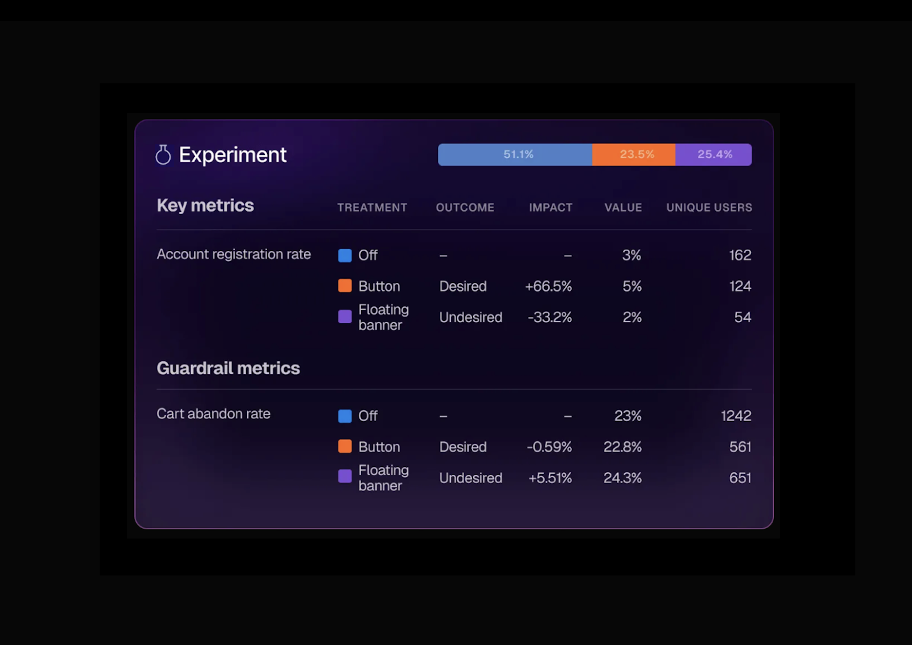

Experiment on your feature variations, allowing you to back bold bets with data-driven decisions. Execute rapid iterations with [sequential testing](/docs/feature-management-experimentation/60-experimentation/docs/key-concepts-for-experimentation/sequential-vs-fixed-horizon.md#sequential-testing), or confidently detect even minimal significant impacts with [fixed horizon testing](/docs/feature-management-experimentation/60-experimentation/docs/key-concepts-for-experimentation/sequential-vs-fixed-horizon.md#fixed-horizon-testing).

Visualize your experimental results.

For example, [dimensional analysis](/docs/feature-management-experimentation/60-experimentation/docs/experiment-results/analyze-experiment-results/dimensional-analysis.md) can capture important business insights for your team.

<figure style={{margin:'0'}}>

<figcaption>Dimensional Analysis</figcaption>
</figure>

