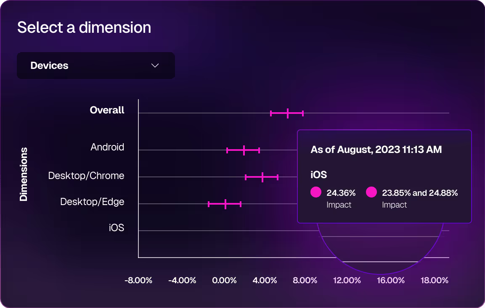

Coming soon.

Here's a little text.

For example, you can view dimensional analysis for your feature's metrics results on the on the Metric details page.

<figure style={{margin:'0'}}>

<figcaption>Dimensional Analysis</figcaption>
</figure>

