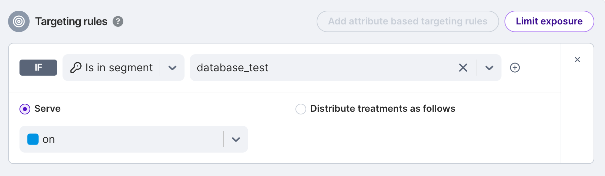
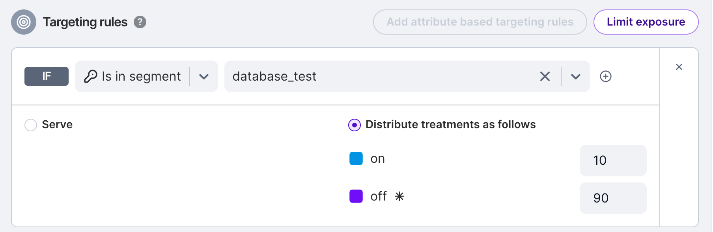

## Create an experiment

### Interactive guide

This interactive guide will walk you through setting up an experiment for the first time.

<DocVideo src="https://app.tango.us/app/embed/1e1ad9f0-85b8-427a-8331-f35f7685c1eb" title="Create an Experiment" />

### Step-by-step guide

Setting up an experiment follows these steps:

1. Navigate to the Experiments section on your navigation panel and click **+Create experiment**.

2. Give your experiment a name and designate an assignment source by selecting a feature flag and environment:
   * Choose a feature flag that has targeting active (not killed).
   * Choose an environment for which the feature flag definition is initiated (valid environments are enabled in the dropdown).

3. Define the scope of your experiment by setting a start and end time, a baseline treatment, comparison treatments, and a targeting rule.

   * Choose a start date on or after the date the feature flag was created.
   * The targeting rule can be any rule with percentage distribution (other rules are disabled in the dropdown). The `default rule` listed in the Targeting rule dropdown is the last rule in the Targeting rules section of a feature flag definition.

      :::note
      Based on your feature flag definition, the following fields are pre-populated by default: the start time is the timestamp of the flag’s current version, the end time is determined by your default review period, the baseline treatment is the flag’s default treatment, and the comparison treatments are all other treatments defined by the flag.
      :::

4. Write an optional hypothesis, add any additional owners, and apply tags to help categorize your experiment (for example, by team, status, or feature area). Then click **Create**.

5. Add key and supporting metrics to your experiment. Guardrail metrics will be measured automatically for every experiment.

## Adding users to an experiment without resetting metrics

Any change you make to a feature flag will cause metrics to reset, for a very good reason: you don't want to bias your experiment or pollute your metrics by making a change that's inconsistent with the experiment to date. If you are experimenting on users in the US and add users from South America after a couple of weeks the results may not be representative of a truly random population.  

That said, there are cases where you may want to add users to an experiment without resetting metrics.

### Adding users to a treatment

In some cases, you may want to add specific users, such as QA team members or beta customers, to a treatment without impacting the experiment. This is generally accomplished by directly assigning the keys/IDs using a rule separate from those dividing the population on which you are experimenting. What happens if you want to give a new beta user access to a new feature during the test without resetting the metrics?  

The easiest way to do this is to create a rule separate from the rules randomly dividing traffic by percentage. Instead of adding individual user IDs to the rule, you can use a segment and add users to the segment. This does not directly change the feature flag, so metrics are not reset, and the metrics are calculated on a per rule basis. So, even if it's only a single user to start, you may want to use a segment so that you have the flexibility to add users in the future without resetting metrics.

### Adding users to a test

Perhaps you want to only allow a portion of your users into an experiment, maybe to reduce the risk of a new feature by exposing it to only a smaller set of your overall population.  A simple way to do that is to use limit exposure. You can set the treatments to 50/50 but only send a percentage of the visitors to the rules, with everyone else going to the default treatment, as shown below.  By increasing the exposure limit you add more users to the test.

The Default treatment could be the same as **off**, or it could be a third treatment, and as you increase the exposure limit, you increase the number of people participating in an experiment.

### Using dependencies

However, with this approach each time you increase exposure limit you are changing the feature flag. That means the metrics will reset.  

In order to add traffic without resetting the metrics, you can use Dependencies. Dependent feature flags assign users based on rules in a parent. For example, you might have a feature flag called `traffic_control` as the parent, which has a simple rule that sets 10% of users to on and 90% to off

Then, in your test feature flag, you could have a rule that feature flags the traffic using percentages, but only for the 10% of the users that qualify. This has the same effect as limit exposure, but the percentage of users participating in the test is controlled by the parent feature flag.  

In the above example, 10% of the users meet the criteria of being in the **on** treatment in the parent feature flag, and of those, 50% will get the new feature and 50% will not.  As you increase the percentage in the on treatment in the parent feature flag, `traffic_control`, you will increase the number of users in your test without resetting the metrics.

Remember, there are very good reasons why you want to reset metrics if you change the profile of your test, so you should consider if doing the above will bias your results in any way.  But if the introduction of new traffic is purely random and from the same base population this may well be a technique worth investigating.